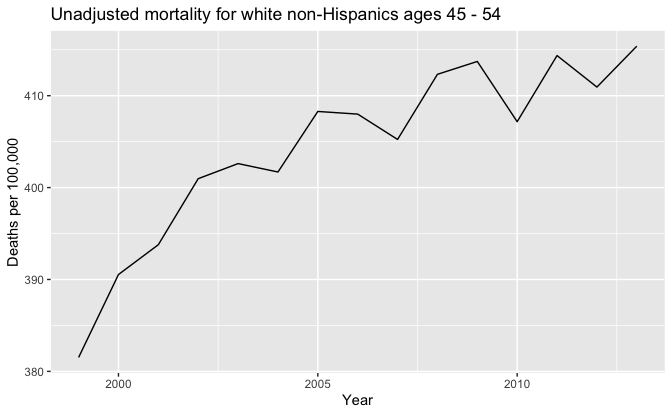
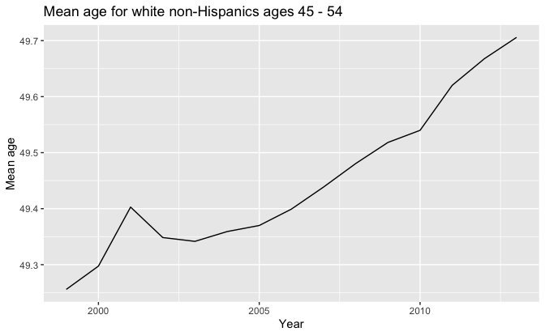
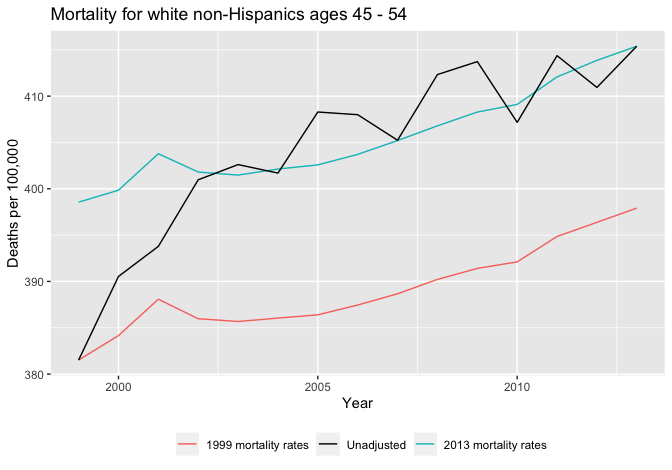
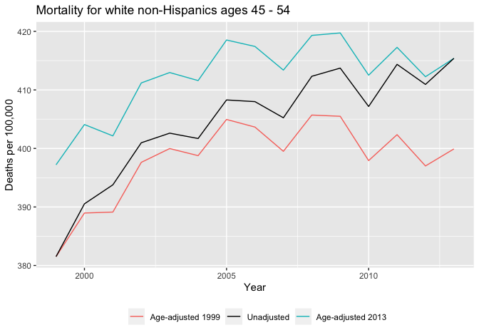
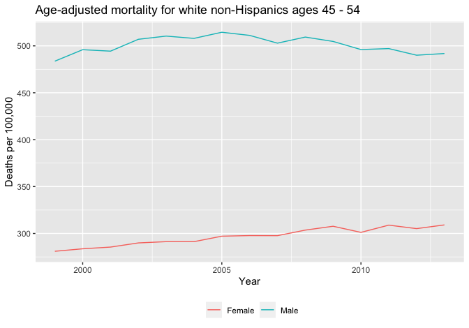
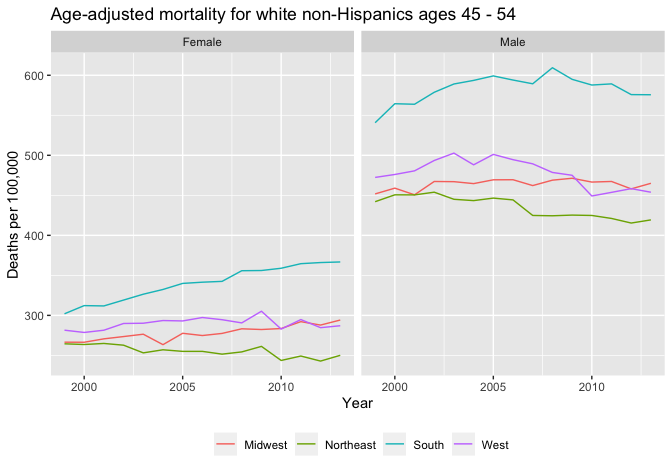

Regression and Other Stories: AgePeriodCohort
================
Andrew Gelman, Jennifer Hill, Aki Vehtari
2021-04-20

-   [2 Data and measurement](#2-data-and-measurement)
    -   [2.4 Data and adjustment: trends in mortality
        rates](#24-data-and-adjustment-trends-in-mortality-rates)

Tidyverse version by Bill Behrman.

Age-Period-Cohort - Demonstration of age adjustment to estimate trends
in mortality rates. See Chapter 2 in Regression and Other Stories.

------------------------------------------------------------------------

``` r
# Packages
library(tidyverse)

# Parameters
  # Mortality for white non-Hispanics ages 45 - 54 from 1999 - 2018
file_mortality <- 
  here::here("AgePeriodCohort/data/white_mortality_45-54_1999-2018.txt")
  # Common code
file_common <- here::here("_common.R")
  
#===============================================================================

# Run common code
source(file_common)
```

# 2 Data and measurement

## 2.4 Data and adjustment: trends in mortality rates

Data

The dataset was downloaded from the CDC WONDER [Underlying Cause of
Death](https://wonder.cdc.gov/ucd-icd10.html) database. It contains
mortality data for white non-Hispanics ages 45 - 54, and breaks down
mortality by year, age, gender, and census region. We will restrict
attention to the years 1999 - 2013. The bottom of the dataset contains
notes on the query and settings used to generate it.

``` r
mortality <- 
  file_mortality %>% 
  read_tsv(
    col_types = 
      cols(
        Notes = col_character(),
        Year = col_double(),
        `Year Code` = col_double(),
        `Single-Year Ages` = col_character(),
        `Single-Year Ages Code` = col_double(),
        Gender = col_character(),
        `Gender Code` = col_character(),
        `Census Region` = col_character(),
        `Census Region Code` = col_character(),
        Deaths = col_double(),
        Population = col_double(),
        `Crude Rate` = col_double()
      )
  ) %>% 
  filter(is.na(Notes), Year >= 1999, Year <= 2013) %>%
  transmute(
    year = Year,
    age = `Single-Year Ages Code`,
    gender = Gender,
    region = str_extract(`Census Region`, "\\w+$"),
    deaths = Deaths,
    population = Population
  )

mortality
```

    #> # A tibble: 1,200 x 6
    #>     year   age gender region    deaths population
    #>    <dbl> <dbl> <chr>  <chr>      <dbl>      <dbl>
    #>  1  1999    45 Female Northeast    552     322705
    #>  2  1999    45 Female Midwest      758     421345
    #>  3  1999    45 Female South       1058     525692
    #>  4  1999    45 Female West         632     316418
    #>  5  1999    45 Male   Northeast    968     318574
    #>  6  1999    45 Male   Midwest     1215     421959
    #>  7  1999    45 Male   South       2012     519520
    #>  8  1999    45 Male   West        1109     320180
    #>  9  1999    46 Female Northeast    572     309366
    #> 10  1999    46 Female Midwest      817     401367
    #> # … with 1,190 more rows

Unadjusted mortality for white non-Hispanics ages 45 - 54.

``` r
mortality_unadjusted <- 
  mortality %>% 
  group_by(year) %>% 
  summarize(rate = sum(deaths) / sum(population) * 1e5)

mortality_unadjusted %>% 
  ggplot(aes(year, rate)) +
  geom_line() +
  labs(
    title = "Unadjusted mortality for white non-Hispanics ages 45 - 54",
    x = "Year",
    y = "Deaths per 100,000"
  )
```



Mean age for white non-Hispanics ages 45 - 54.

``` r
v <- 
  mortality %>% 
  group_by(year) %>% 
  summarize(mean_age = weighted.mean(age, population))

v %>% 
  ggplot(aes(year, mean_age)) +
  geom_line() +
  labs(
    title = "Mean age for white non-Hispanics ages 45 - 54",
    x = "Year",
    y = "Mean age"
  )
```



A helper function to set the mortality rates for all years to that of a
given year.

``` r
set_rates <- function(.data, rate_year) {
  .data %>% 
    left_join(
      .data %>% 
        filter(year == rate_year) %>% 
        mutate(rate = deaths / population * 1e5) %>% 
        select(!c(year, deaths, population)),
      by = names(.data) %>% setdiff(c("year", "deaths", "population"))
    )
}
```

Mortality for white non-Hispanics ages 45 - 54.

``` r
v <- 
  c(1999, 2013) %>% 
  set_names() %>% 
  map_dfr(~ set_rates(mortality, .), .id = "rate_year") %>% 
  group_by(rate_year, year) %>% 
  summarize(rate = weighted.mean(rate, population)) %>% 
  ungroup() %>% 
  bind_rows(
    mortality_unadjusted %>% 
      mutate(rate_year = "Unadjusted")
  )

v %>% 
  ggplot(aes(year, rate, color = rate_year)) +
  geom_line() +
  scale_color_manual(
    breaks = c("1999", "Unadjusted", "2013"),
    values = c("#F8766D", "black", "#00BFC4"),
    labels = c("1999 mortality rates", "Unadjusted", "2013 mortality rates")
  ) +
  theme(legend.position = "bottom") +
  labs(
    title = "Mortality for white non-Hispanics ages 45 - 54",
    x = "Year",
    y = "Deaths per 100,000",
    color = NULL
  )
```



From 1999 to 2013, the unadjusted mortality rate increased from 382 to
415 deaths per 100,000, an increase of 33 deaths per 100,000. If the
mortality rates for each age remained unchanged from the 1999 rates, the
changing population distribution for the cohort would have increased its
overall mortality rate from 382 to 398 deaths per 100,000, an increase
of 17 deaths per 100,000. Thus the aging of the cohort played a
substantial role in the increase of the unadjusted mortality.

A helper function to add the weights for age adjustment.

``` r
add_weight <- function(.data, weight_year) {
  .data %>% 
    left_join(
      .data %>%
        filter(year == weight_year) %>% 
        select(!c(year, deaths), weight = population),
      by = names(.data) %>% setdiff(c("year", "deaths", "population"))
    )
}
```

Mortality for white non-Hispanics ages 45 - 54: Age-adjusted.

``` r
v <- 
  c(1999, 2013) %>% 
  set_names() %>% 
  map_dfr(~ add_weight(mortality, .), .id = "weight_year") %>% 
  group_by(weight_year, year, age) %>% 
  summarize(
    across(c(deaths, population, weight), sum),
    rate = deaths / population * 1e5
  ) %>% 
  summarize(rate = weighted.mean(rate, weight)) %>% 
  ungroup() %>% 
  bind_rows(
    mortality_unadjusted %>% 
      mutate(weight_year = "Unadjusted")
  )

v %>% 
  ggplot(aes(year, rate, color = weight_year)) +
  geom_line() +
  scale_color_manual(
    breaks = c("1999", "Unadjusted", "2013"),
    values = c("#F8766D", "black", "#00BFC4"),
    labels = c("Age-adjusted 1999", "Unadjusted", "Age-adjusted 2013")
  ) +
  theme(legend.position = "bottom") +
  labs(
    title = "Mortality for white non-Hispanics ages 45 - 54",
    x = "Year",
    y = "Deaths per 100,000",
    color = NULL
  )
```



As mentioned above, from 1999 to 2013 the unadjusted mortality rate
increased from 382 to 415 deaths per 100,000, an increase of 33 deaths
per 100,000. If the cohort had maintained the same age distribution in
2013 as in 1999, then the changing mortality rates each year would have
increased the cohort’s overall mortality rate from 382 to 400 deaths per
100,000, an increase of 18 deaths per 100,000.

To focus only on the changes in mortality and ignore the influence of
the aging of the cohort, in the following we’ll age adjust using the
1999 age distribution.

``` r
mortality_1999 <- 
  mortality %>% 
  add_weight(weight_year = 1999)
```

Age-adjusted mortality for white non-Hispanics ages 45 - 54: By gender.

``` r
v <- 
  mortality_1999 %>% 
  group_by(year, gender, age) %>% 
  summarize(
    across(c(deaths, population, weight), sum),
    rate = deaths / population * 1e5
  ) %>% 
  summarize(rate = weighted.mean(rate, weight)) %>% 
  ungroup()

v %>% 
  ggplot(aes(year, rate, color = gender)) +
  geom_line() +
  theme(legend.position = "bottom") +
  labs(
    title = "Age-adjusted mortality for white non-Hispanics ages 45 - 54",
    x = "Year",
    y = "Deaths per 100,000",
    color = NULL
  )
```



The mortality rate for men is substantially higher than that for women,
but the genders have different trends. The rate for men in deaths per
100,000 was 484 in 1999, increased to a maximum of 515 in 2005, and then
declined to 492 in 2013. The rate for women in deaths per 100,000
increased throughout the period, from 281 in 1999 to 309 in 2013. The
combination of these two trends explains why the overall trend increased
from 1999 to 2005 and then was stable afterwards. The decrease in the
men’s rate was roughly canceled by the increase in the women’s rate.

Age-adjusted mortality for white non-Hispanics ages 45 - 54: By gender
and region.

``` r
v <- 
  mortality_1999 %>% 
  group_by(year, gender, region, age) %>% 
  summarize(
    across(c(deaths, population, weight), sum),
    rate = deaths / population * 1e5
  ) %>% 
  summarize(rate = weighted.mean(rate, weight)) %>% 
  ungroup()

v %>% 
  ggplot(aes(year, rate, color = region)) +
  geom_line() +
  facet_grid(cols = vars(gender)) +
  theme(legend.position = "bottom") +
  labs(
    title = "Age-adjusted mortality for white non-Hispanics ages 45 - 54",
    x = "Year",
    y = "Deaths per 100,000",
    color = NULL
  )
```



We see a dramatic increase in mortality for women in the South, from 302
deaths per 100,000 in 1999 to 367 deaths per 100,000 in 2013.
