Regression and Other Stories: Arsenic
================
Andrew Gelman, Jennifer Hill, Aki Vehtari
2021-04-20

-   [13 Logistic regression](#13-logistic-regression)
    -   [13.7 Building a logistic regression model: wells in
        Bangladesh](#137-building-a-logistic-regression-model-wells-in-bangladesh)
        -   [Background](#background)
        -   [Logistic regression with just one
            predictor](#logistic-regression-with-just-one-predictor)
        -   [Graphing the fitted model](#graphing-the-fitted-model)
        -   [Interpreting the logistic regression
            coefficients](#interpreting-the-logistic-regression-coefficients)
        -   [Adding a second input
            variable](#adding-a-second-input-variable)
        -   [Graphing the fitted model with two
            predictors](#graphing-the-fitted-model-with-two-predictors)
-   [14 Working with logistic
    regression](#14-working-with-logistic-regression)
    -   [14.2 Logistic regression with
        interactions](#142-logistic-regression-with-interactions)
        -   [Centering the input
            variables](#centering-the-input-variables)
        -   [Re-fitting the interaction model using the centered
            inputs](#re-fitting-the-interaction-model-using-the-centered-inputs)
        -   [Statistical significance of the
            interaction](#statistical-significance-of-the-interaction)
        -   [Graphing the model with
            interactions](#graphing-the-model-with-interactions)
        -   [Adding social predictors](#adding-social-predictors)
        -   [Adding further interactions](#adding-further-interactions)
    -   [14.3 Predictive simulation](#143-predictive-simulation)
        -   [Simulating the uncertainty in the estimated
            coefficients](#simulating-the-uncertainty-in-the-estimated-coefficients)

Tidyverse version by Bill Behrman.

Building a logistic regression model: wells in Bangladesh. See Chapters
13 and 14 in Regression and Other Stories.

------------------------------------------------------------------------

``` r
# Packages
library(tidyverse)
library(haven)
library(rstanarm)

# Parameters
  # Data on arsenic in wells in Bangladesh
file_wells_all <- here::here("Arsenic/data/all.dta")
  # Data on arsenic in unsafe wells in Bangladesh
file_wells <- here::here("Arsenic/data/wells.csv")
  # Common code
file_common <- here::here("_common.R")

#===============================================================================

# Run common code
source(file_common)
```

# 13 Logistic regression

## 13.7 Building a logistic regression model: wells in Bangladesh

### Background

#### Data on all wells

Data on arsenic level in all wells and their location.

``` r
wells_all <- 
  file_wells_all %>% 
  read_dta() %>% 
  transmute(arsenic = as / 100, x, y)

summary(wells_all)
```

    #>     arsenic           x                y          
    #>  Min.   :0.01   Min.   :    91   Min.   :     24  
    #>  1st Qu.:0.09   1st Qu.:256322   1st Qu.:2631156  
    #>  Median :0.56   Median :257492   Median :2632326  
    #>  Mean   :0.95   Mean   :255657   Mean   :2611558  
    #>  3rd Qu.:1.36   3rd Qu.:258975   3rd Qu.:2633139  
    #>  Max.   :9.65   Max.   :261907   Max.   :2635263  
    #>  NA's   :2

The position data appear to have some problems.

``` r
sort(wells_all$x) %>% 
  head(100)
```

    #>   [1]     90.6     90.6     90.6     90.6     90.6     90.6     90.6     90.6
    #>   [9]     90.6     90.6     90.6     90.6     90.6     90.6     90.6     90.6
    #>  [17]     90.6     90.6     90.6     90.6     90.6     90.6     90.6     90.6
    #>  [25]     90.6     90.6     90.6     90.6     90.6     90.6     90.6     90.6
    #>  [33]     90.6     90.6     90.6     90.7     90.7     90.7     90.7     90.7
    #>  [41]     90.7     90.7     90.7     90.7     90.7     90.7     90.7     90.7
    #>  [49]     90.7     90.7     90.7 253670.0 253691.0 253704.9 253705.4 253717.2
    #>  [57] 253725.1 253726.4 253731.3 253737.2 253748.7 253749.8 253755.5 253756.9
    #>  [65] 253764.9 253766.2 253767.4 253769.7 253770.5 253772.3 253776.0 253789.3
    #>  [73] 253789.7 253790.6 253790.8 253793.2 253793.6 253794.1 253794.2 253794.3
    #>  [81] 253797.9 253800.7 253801.8 253803.8 253805.0 253810.3 253814.5 253815.6
    #>  [89] 253817.8 253818.4 253828.6 253841.4 253849.1 253851.0 253869.0 253869.5
    #>  [97] 253870.9 253873.7 253877.7 253878.0

``` r
sort(wells_all$y) %>% 
  head(100)
```

    #>   [1] 2.38e+01 2.38e+01 2.38e+01 2.38e+01 2.38e+01 2.38e+01 2.38e+01 2.38e+01
    #>   [9] 2.38e+01 2.38e+01 2.38e+01 2.38e+01 2.38e+01 2.38e+01 2.38e+01 2.38e+01
    #>  [17] 2.38e+01 2.38e+01 2.38e+01 2.38e+01 2.38e+01 2.38e+01 2.38e+01 2.38e+01
    #>  [25] 2.38e+01 2.38e+01 2.38e+01 2.38e+01 2.38e+01 2.38e+01 2.38e+01 2.38e+01
    #>  [33] 2.38e+01 2.38e+01 2.38e+01 2.38e+01 2.38e+01 2.38e+01 2.38e+01 2.38e+01
    #>  [41] 2.38e+01 2.38e+01 2.38e+01 2.38e+01 2.38e+01 2.38e+01 2.38e+01 2.38e+01
    #>  [49] 2.38e+01 2.38e+01 2.38e+01 2.63e+06 2.63e+06 2.63e+06 2.63e+06 2.63e+06
    #>  [57] 2.63e+06 2.63e+06 2.63e+06 2.63e+06 2.63e+06 2.63e+06 2.63e+06 2.63e+06
    #>  [65] 2.63e+06 2.63e+06 2.63e+06 2.63e+06 2.63e+06 2.63e+06 2.63e+06 2.63e+06
    #>  [73] 2.63e+06 2.63e+06 2.63e+06 2.63e+06 2.63e+06 2.63e+06 2.63e+06 2.63e+06
    #>  [81] 2.63e+06 2.63e+06 2.63e+06 2.63e+06 2.63e+06 2.63e+06 2.63e+06 2.63e+06
    #>  [89] 2.63e+06 2.63e+06 2.63e+06 2.63e+06 2.63e+06 2.63e+06 2.63e+06 2.63e+06
    #>  [97] 2.63e+06 2.63e+06 2.63e+06 2.63e+06

Well remove the problematic rows and center and scale the positions.

``` r
wells_all <- 
  wells_all %>% 
  drop_na(arsenic) %>% 
  filter(x > 91, y > 24) %>% 
  mutate(
    x = (x - mean(x)) / 1000,
    y = (y - mean(y)) / 1000
  )
```

Distribution of arsenic level in all wells.

``` r
wells_all %>% 
  ggplot(aes(arsenic)) +
  geom_histogram(binwidth = 0.1, boundary = 0) +
  geom_vline(xintercept = 0.5, color = "red") +
  scale_x_continuous(breaks = scales::breaks_width(1)) +
  labs(
    title = "Distribution of arsenic level in all wells",
    subtitle = "Levels lower than the vertical line are considered safe",
    x = "Arsenic level",
    y = "Count"
  )
```

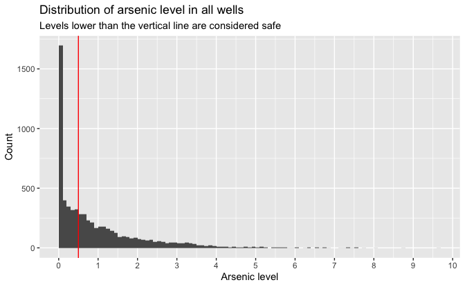

``` r
quantile(wells_all$arsenic, probs = c(0, 0.25, 0.5, 0.75, 0.9, 0.95, 0.99, 1))
```

    #>   0%  25%  50%  75%  90%  95%  99% 100% 
    #> 0.01 0.09 0.56 1.36 2.54 3.26 4.83 9.65

There are some outliers with levels up to 9.65, but the majority of the
wells have levels under 3.

``` r
v <- mean(wells_all$arsenic > 0.5)
v
```

    #> [1] 0.524

About 52.4% of wells are unsafe; that is, have arsenic levels over 0.5.

Map of wells in an area of Araihazar, Bangladesh.

``` r
wells_all %>% 
  mutate(
    type = if_else(arsenic > 0.5, "Unsafe wells", "Safe wells"),
    arsenic = if_else(arsenic > 3, 3, arsenic)
  ) %>% 
  ggplot(aes(x, y, color = arsenic)) +
  geom_point(alpha = 0.75, size = 0.1) +
  coord_fixed() +
  facet_grid(rows = vars(type)) +
  scale_x_continuous(breaks = scales::breaks_width(1)) +
  scale_y_continuous(breaks = scales::breaks_width(1)) +
  scale_color_viridis_c(breaks = c(0.5, 1:3), labels = c(c(0.5, 1:2), "3+")) +
  labs(
    title = "Map of wells in an area of Araihazar, Bangladesh",
    x = NULL,
    y = NULL,
    color = "Arsenic\nlevel"
  )
```

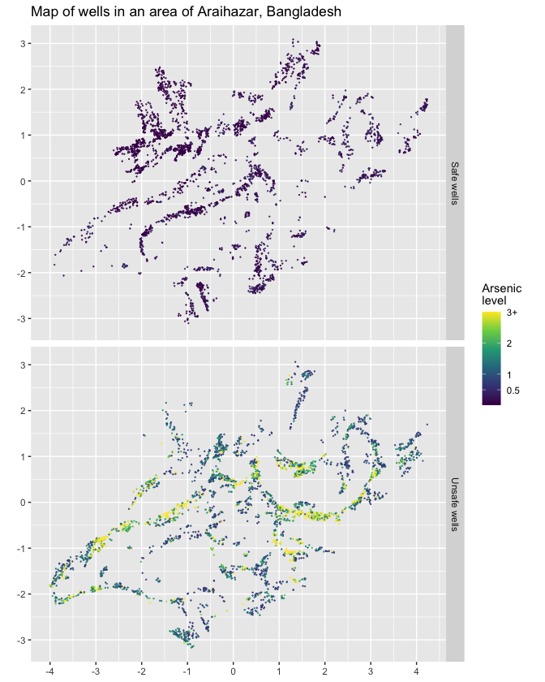

It looks as though the wells may be near dwellings along streets. In
many areas unsafe wells are close to safe wells.

#### Data on unsafe wells

Data

``` r
wells <- read_csv(file_wells)

summary(wells)
```

    #>      switch         arsenic          dist        dist100         assoc      
    #>  Min.   :0.000   Min.   :0.51   Min.   :  0   Min.   :0.00   Min.   :0.000  
    #>  1st Qu.:0.000   1st Qu.:0.82   1st Qu.: 21   1st Qu.:0.21   1st Qu.:0.000  
    #>  Median :1.000   Median :1.30   Median : 37   Median :0.37   Median :0.000  
    #>  Mean   :0.575   Mean   :1.66   Mean   : 48   Mean   :0.48   Mean   :0.423  
    #>  3rd Qu.:1.000   3rd Qu.:2.20   3rd Qu.: 64   3rd Qu.:0.64   3rd Qu.:1.000  
    #>  Max.   :1.000   Max.   :9.65   Max.   :340   Max.   :3.40   Max.   :1.000  
    #>       educ           educ4     
    #>  Min.   : 0.00   Min.   :0.00  
    #>  1st Qu.: 0.00   1st Qu.:0.00  
    #>  Median : 5.00   Median :1.25  
    #>  Mean   : 4.83   Mean   :1.21  
    #>  3rd Qu.: 8.00   3rd Qu.:2.00  
    #>  Max.   :17.00   Max.   :4.25

The variables are:

-   `switch`: Outcome variable:
    -   1 if household switched to a new well
    -   0 if household continued using its own well
-   `arsenic`: Arsenic level of respondent’s well
-   `dist`: Distance (in meters) to the closest known safe well
-   `dist100` = `dist / 100`
-   `assoc`: Whether any members of the household are active in
    community organizations
-   `educ`: Education level of the head of household
-   `educ4` = `educ / 4`

##### 1D EDA

Whether household switched.

``` r
wells %>% 
  count(switch) %>% 
  mutate(prop = n / sum(n))
```

    #> # A tibble: 2 x 3
    #>   switch     n  prop
    #> *  <dbl> <int> <dbl>
    #> 1      0  1283 0.425
    #> 2      1  1737 0.575

About 57.5% of households switched.

Distribution of arsenic level in unsafe wells.

``` r
wells %>% 
  ggplot(aes(arsenic)) +
  geom_histogram(binwidth = 0.1, boundary = 0) +
  scale_x_continuous(breaks = scales::breaks_width(1)) +
  labs(
    title = "Distribution of arsenic level in unsafe wells",
    x = "Arsenic level",
    y = "Count"
  )
```

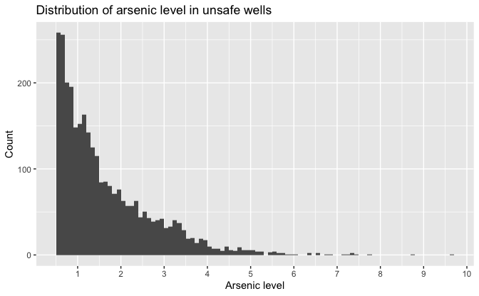

Distance to the closest known safe well.

``` r
wells %>% 
  ggplot(aes(dist)) +
  geom_histogram(binwidth = 10, boundary = 0) +
  scale_x_continuous(breaks = scales::breaks_width(50)) +
  labs(
    title = "Distance to the closest known safe well",
    x = "Distance (meters)",
    y = "Count"
  )
```

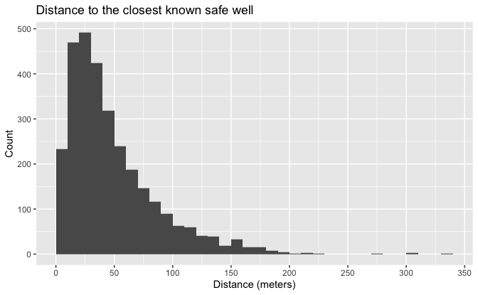

``` r
quantile(wells$dist, probs = c(0, 0.25, 0.5, 0.75, 0.9, 0.95, 0.99, 1))
```

    #>      0%     25%     50%     75%     90%     95%     99%    100% 
    #>   0.387  21.117  36.761  64.041 100.743 128.096 175.495 339.531

The median distance to a safe well is about 37 meters. About 90% of the
households have a safe well within 100 meters.

##### 2D EDA

Percentage of households who switched to new well by arsenic level.

``` r
wells %>% 
  ggplot(aes(arsenic, switch)) +
  stat_ydensity(
    aes(group = switch),
    width = 0.25,
    draw_quantiles = c(0.25, 0.5, 0.75),
    scale = "count"
  ) +
  geom_smooth() +
  coord_cartesian(ylim = c(-0.125, 1.125)) +
  scale_y_continuous(
    breaks = seq(0, 1, 0.1),
    minor_breaks = NULL,
    labels = scales::label_percent(accuracy = 1)
  ) +
  scale_x_continuous(breaks = scales::breaks_width(1)) +
  labs(
    title = 
      "Percentage of households who switched to new well by arsenic level",
    subtitle =
      "Voilin plots represent density of those do did and did not switch",
    x = "Arsenic level",
    y = "Percentage of households who switched"
  )
```

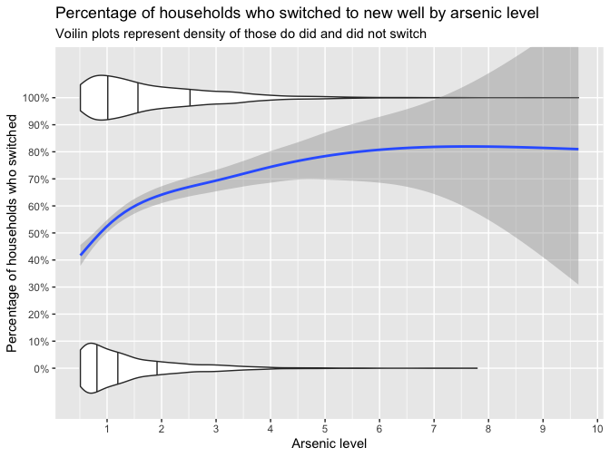

As expected, the percentage of households increases with the arsenic
level in their well, from about 40% for wells that are just over the
safety threshold to perhaps 80% for very high levels. The sparse data
for high arsenic levels results in a large uncertainty.

Percentage of households who switched to new well by distance.

``` r
wells %>% 
  ggplot(aes(dist, switch)) +
  stat_ydensity(
    aes(group = switch),
    width = 0.25,
    draw_quantiles = c(0.25, 0.5, 0.75),
    scale = "count"
  ) +
  geom_smooth() +
  coord_cartesian(ylim = c(-0.125, 1.125)) +
  scale_y_continuous(
    breaks = seq(0, 1, 0.1),
    minor_breaks = NULL,
    labels = scales::label_percent(accuracy = 1)
  ) +
  scale_x_continuous(breaks = scales::breaks_width(50)) +
  labs(
    title = "Percentage of households who switched to new well by distance",
    subtitle =
      "Voilin plots represent density of those do did and did not switch",
    x = "Distance to the closest known safe well (meters)",
    y = "Percentage of households who switched"
  )
```

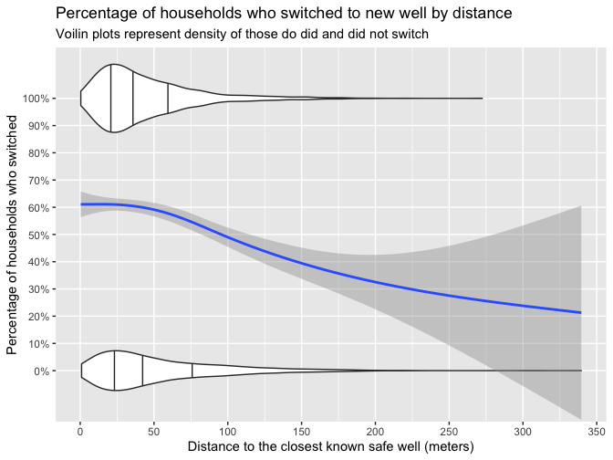

As expected, the percentage of households decreases with the distance to
the closest known safe well, from about 60% when a safe well is very
close to perhaps 20% when a safe well is far away. The sparse data for
large distances results in a large uncertainty.

### Logistic regression with just one predictor

Fit a model using distance to the nearest safe well.

``` r
set.seed(733)

fit_1 <- 
  stan_glm(
    switch ~ dist,
    family = binomial(link = "logit"),
    data = wells,
    refresh = 0
  )

print(fit_1, digits = 3)
```

    #> stan_glm
    #>  family:       binomial [logit]
    #>  formula:      switch ~ dist
    #>  observations: 3020
    #>  predictors:   2
    #> ------
    #>             Median MAD_SD
    #> (Intercept)  0.608  0.060
    #> dist        -0.006  0.001
    #> 
    #> ------
    #> * For help interpreting the printed output see ?print.stanreg
    #> * For info on the priors used see ?prior_summary.stanreg

LOO log score

``` r
loo_1 <- loo(fit_1)

loo_1
```

    #> 
    #> Computed from 4000 by 3020 log-likelihood matrix
    #> 
    #>          Estimate   SE
    #> elpd_loo  -2040.1 10.5
    #> p_loo         2.0  0.0
    #> looic      4080.2 20.9
    #> ------
    #> Monte Carlo SE of elpd_loo is 0.0.
    #> 
    #> All Pareto k estimates are good (k < 0.5).
    #> See help('pareto-k-diagnostic') for details.

Fit a model using scaled distance to the nearest safe well.

``` r
set.seed(733)

fit_2 <- 
  stan_glm(
    switch ~ dist100,
    family = binomial(link = "logit"),
    data = wells,
    refresh = 0
  )

fit_2
```

    #> stan_glm
    #>  family:       binomial [logit]
    #>  formula:      switch ~ dist100
    #>  observations: 3020
    #>  predictors:   2
    #> ------
    #>             Median MAD_SD
    #> (Intercept)  0.6    0.1  
    #> dist100     -0.6    0.1  
    #> 
    #> ------
    #> * For help interpreting the printed output see ?print.stanreg
    #> * For info on the priors used see ?prior_summary.stanreg

LOO log score

``` r
loo_2 <- loo(fit_2)

loo_2
```

    #> 
    #> Computed from 4000 by 3020 log-likelihood matrix
    #> 
    #>          Estimate   SE
    #> elpd_loo  -2040.1 10.5
    #> p_loo         2.0  0.0
    #> looic      4080.2 20.9
    #> ------
    #> Monte Carlo SE of elpd_loo is 0.0.
    #> 
    #> All Pareto k estimates are good (k < 0.5).
    #> See help('pareto-k-diagnostic') for details.

### Graphing the fitted model

Probability of household switching to new well by distance.

``` r
v <- 
  tibble(
    dist = seq_range(wells$dist),
    .pred = predict(fit_1, type = "response", newdata = tibble(dist))
  )

wells %>% 
  ggplot(aes(dist)) +
  stat_ydensity(
    aes(y = switch, group = switch),
    width = 0.25,
    draw_quantiles = c(0.25, 0.5, 0.75),
    scale = "count"
  ) +
  geom_line(aes(y = .pred), data = v) +
  coord_cartesian(ylim = c(-0.125, 1.125)) +
  scale_y_continuous(breaks = seq(0, 1, 0.1), minor_breaks = NULL) +
  scale_x_continuous(breaks = scales::breaks_width(50)) +
  labs(
    title = "Probability of household switching to new well by distance",
    subtitle =
      "Voilin plots represent density of those do did and did not switch",
    x = "Distance to the closest known safe well (meters)",
    y = "Probability of household switching"
  )
```

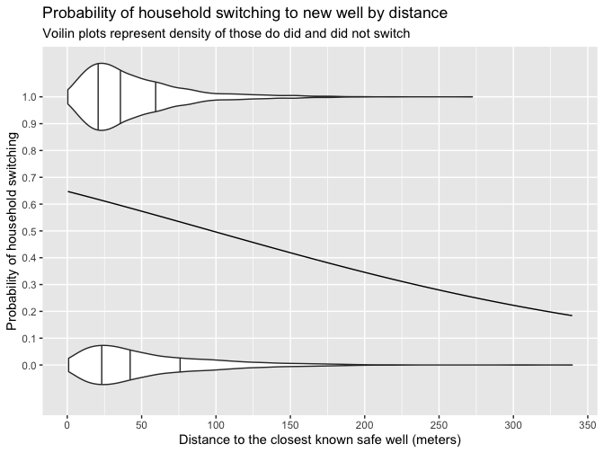

The empirical plot in the 2D EDA section showed that about 60% of
households switched at the closest distance and about 20% switched at
the farthest distance. The probabilities of the model at the extremes
are similar. Between the distance of 0 - 50 meters, the empirical plot
has a roughly constant percentage of households who switched, whereas
the model has a steady decline.

### Interpreting the logistic regression coefficients

Proportion of households who switched.

``` r
switch_prop <- mean(wells$switch)

switch_prop
```

    #> [1] 0.575

Log score for model with a constant prediction equal to the proportion
of households who switched.

``` r
log(switch_prop) * sum(wells$switch) + log(1 - switch_prop) * sum(!wells$switch)
```

    #> [1] -2059

Since the LOO log score for the model with distance is -2040, distance
supplies some predictive information.

### Adding a second input variable

Fit a model using scaled distance and arsenic level.

``` r
set.seed(733)

fit_3 <- 
  stan_glm(
    switch ~ dist100 + arsenic,
    family = binomial(link = "logit"),
    data = wells,
    refresh = 0
  )

fit_3
```

    #> stan_glm
    #>  family:       binomial [logit]
    #>  formula:      switch ~ dist100 + arsenic
    #>  observations: 3020
    #>  predictors:   3
    #> ------
    #>             Median MAD_SD
    #> (Intercept)  0.0    0.1  
    #> dist100     -0.9    0.1  
    #> arsenic      0.5    0.0  
    #> 
    #> ------
    #> * For help interpreting the printed output see ?print.stanreg
    #> * For info on the priors used see ?prior_summary.stanreg

LOO log score

``` r
loo_3 <- loo(fit_3)

loo_3
```

    #> 
    #> Computed from 4000 by 3020 log-likelihood matrix
    #> 
    #>          Estimate   SE
    #> elpd_loo  -1968.5 15.7
    #> p_loo         3.2  0.1
    #> looic      3936.9 31.4
    #> ------
    #> Monte Carlo SE of elpd_loo is 0.0.
    #> 
    #> All Pareto k estimates are good (k < 0.5).
    #> See help('pareto-k-diagnostic') for details.

Compare log scores.

``` r
loo_compare(loo_2, loo_3)
```

    #>       elpd_diff se_diff
    #> fit_3   0.0       0.0  
    #> fit_2 -71.7      12.2

Model 3 has the better log score, indicating that including arsenic
level in the model clearly improves the predictive accuracy.

### Graphing the fitted model with two predictors

Probability of household switching to new well by distance and arsenic
level.

``` r
v <- 
  tibble(
    arsenic = c(0.5, quantile(wells$arsenic, probs = c(0.25, 0.5, 0.75))),
    label = 
      case_when(
        names(arsenic) == "" ~ as.character(arsenic),
        TRUE ~ 
          str_glue(
            "{format(arsenic, digits = 1, nsmall = 1)} ({names(arsenic)})"
          ) %>% 
          as.character()
      ) %>% 
      fct_inorder(),
    dist = list(seq_range(wells$dist))
  ) %>% 
  unnest(dist) %>% 
  mutate(
    dist100 = dist / 100,
    .pred = 
      predict(fit_3, type = "response", newdata = tibble(arsenic, dist100))
  )

v %>% 
  ggplot(aes(dist)) +
  stat_ydensity(
    aes(y = switch, group = switch),
    data = wells,
    width = 0.25,
    draw_quantiles = c(0.25, 0.5, 0.75),
    scale = "count"
  ) +
  geom_line(aes(y = .pred, color = label)) +
  coord_cartesian(ylim = c(-0.125, 1.125)) +
  scale_y_continuous(breaks = seq(0, 1, 0.1), minor_breaks = NULL) +
  scale_x_continuous(breaks = scales::breaks_width(50)) +
  theme(legend.position = "bottom") +
  labs(
    title = 
      "Probability of household switching to new well by distance and arsenic level",
    subtitle =
      "Voilin plots represent density of those do did and did not switch",
    x = "Distance to the closest known safe well (meters)",
    y = "Probability of household switching",
    color = "Arsenic level (Quantile)"
  )
```

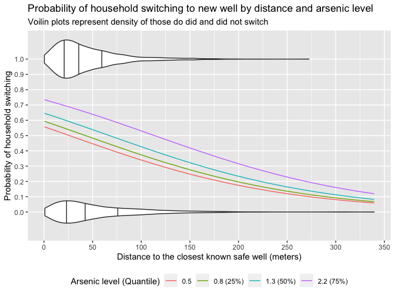

The probability decreases with distance and increases with arsenic
level.

Probability of household switching to new well by arsenic level and
distance.

``` r
v <- 
  tibble(
    dist = c(0, quantile(wells$dist, probs = c(0.25, 0.5, 0.75))),
    label = 
      case_when(
        names(dist) == "" ~ as.character(dist),
        TRUE ~ 
          str_glue(
            "{format(dist, digits = 0, nsmall = 0)} ({names(dist)})"
          ) %>% 
          as.character()
      ) %>% 
      fct_inorder(),
    arsenic = list(seq_range(wells$arsenic))
  ) %>% 
  unnest(arsenic) %>% 
  mutate(
    dist100 = dist / 100,
    .pred = 
      predict(fit_3, type = "response", newdata = tibble(arsenic, dist100))
  )

v %>% 
  ggplot(aes(arsenic)) +
  stat_ydensity(
    aes(y = switch, group = switch),
    data = wells,
    width = 0.25,
    draw_quantiles = c(0.25, 0.5, 0.75),
    scale = "count"
  ) +
  geom_line(aes(y = .pred, color = label)) +
  coord_cartesian(ylim = c(-0.125, 1.125)) +
  scale_y_continuous(breaks = seq(0, 1, 0.1), minor_breaks = NULL) +
  scale_x_continuous(breaks = scales::breaks_width(1)) +
  theme(legend.position = "bottom") +
  labs(
    title = 
      "Probability of household switching to new well by arsenic level and distance",
    subtitle =
      "Voilin plots represent density of those do did and did not switch",
    x = "Arsenic level",
    y = "Probability of household switching",
    color = "Distance in meters (Quantile)"
  )
```

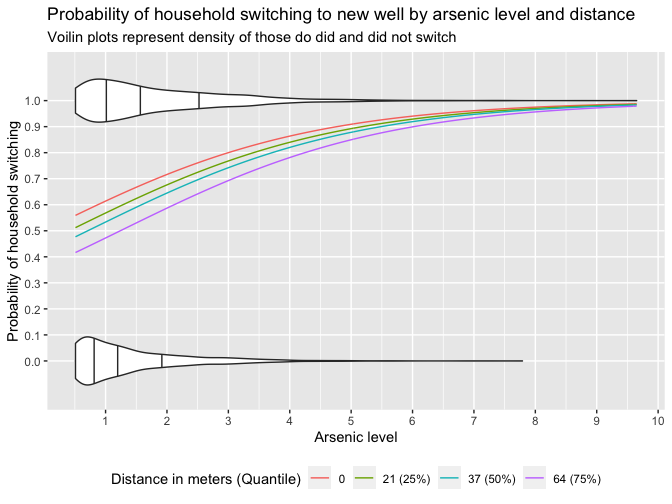

The probability increases with arsenic level and decreases with
distance.

# 14 Working with logistic regression

## 14.2 Logistic regression with interactions

Fit a model using scaled distance, arsenic level, and an interaction

``` r
set.seed(733)

fit_4 <- 
  stan_glm(
    switch ~ dist100 + arsenic + dist100:arsenic,
    family = binomial(link = "logit"),
    data = wells,
    refresh = 0
  )

print(fit_4, digits = 2)
```

    #> stan_glm
    #>  family:       binomial [logit]
    #>  formula:      switch ~ dist100 + arsenic + dist100:arsenic
    #>  observations: 3020
    #>  predictors:   4
    #> ------
    #>                 Median MAD_SD
    #> (Intercept)     -0.15   0.12 
    #> dist100         -0.58   0.23 
    #> arsenic          0.56   0.07 
    #> dist100:arsenic -0.18   0.11 
    #> 
    #> ------
    #> * For help interpreting the printed output see ?print.stanreg
    #> * For info on the priors used see ?prior_summary.stanreg

LOO log score

``` r
loo_4 <- loo(fit_4)

loo_4
```

    #> 
    #> Computed from 4000 by 3020 log-likelihood matrix
    #> 
    #>          Estimate   SE
    #> elpd_loo  -1968.3 15.9
    #> p_loo         4.7  0.3
    #> looic      3936.6 31.8
    #> ------
    #> Monte Carlo SE of elpd_loo is 0.0.
    #> 
    #> All Pareto k estimates are good (k < 0.5).
    #> See help('pareto-k-diagnostic') for details.

### Centering the input variables

``` r
wells <- 
  wells %>% 
  mutate(
    arsenic_c = arsenic - mean(arsenic),
    dist100_c = dist100 - mean(dist100)
  )
```

### Re-fitting the interaction model using the centered inputs

``` r
set.seed(733)

fit_5 <- 
  stan_glm(
    switch ~ dist100_c + arsenic_c + dist100_c:arsenic_c,
    family = binomial(link = "logit"),
    data = wells,
    refresh = 0
  )

print(fit_5, digits = 2)
```

    #> stan_glm
    #>  family:       binomial [logit]
    #>  formula:      switch ~ dist100_c + arsenic_c + dist100_c:arsenic_c
    #>  observations: 3020
    #>  predictors:   4
    #> ------
    #>                     Median MAD_SD
    #> (Intercept)          0.35   0.04 
    #> dist100_c           -0.88   0.10 
    #> arsenic_c            0.47   0.04 
    #> dist100_c:arsenic_c -0.18   0.10 
    #> 
    #> ------
    #> * For help interpreting the printed output see ?print.stanreg
    #> * For info on the priors used see ?prior_summary.stanreg

LOO log score

``` r
loo_5 <- loo(fit_5)

loo_5
```

    #> 
    #> Computed from 4000 by 3020 log-likelihood matrix
    #> 
    #>          Estimate   SE
    #> elpd_loo  -1968.1 15.9
    #> p_loo         4.4  0.3
    #> looic      3936.1 31.9
    #> ------
    #> Monte Carlo SE of elpd_loo is 0.0.
    #> 
    #> All Pareto k estimates are good (k < 0.5).
    #> See help('pareto-k-diagnostic') for details.

Compare log scores.

``` r
loo_compare(loo_4, loo_5)
```

    #>       elpd_diff se_diff
    #> fit_5  0.0       0.0   
    #> fit_4 -0.2       0.0

Centering the variables does not affect the model log score.

### Statistical significance of the interaction

Compare log scores.

``` r
loo_compare(loo_3, loo_4)
```

    #>       elpd_diff se_diff
    #> fit_4  0.0       0.0   
    #> fit_3 -0.2       1.9

Adding the interaction doesn’t change the predictive performance, and
there is no need to keep it in the model for predictive purposes (unless
new information can be obtained).

### Graphing the model with interactions

Probability of household switching to new well by distance and arsenic
level.

``` r
v <- 
  tibble(
    arsenic = c(0.5, quantile(wells$arsenic, probs = c(0.25, 0.5, 0.75))),
    label = 
      case_when(
        names(arsenic) == "" ~ as.character(arsenic),
        TRUE ~ 
          str_glue(
            "{format(arsenic, digits = 1, nsmall = 1)} ({names(arsenic)})"
          ) %>% 
          as.character()
      ) %>% 
      fct_inorder(),
    dist = list(seq_range(wells$dist))
  ) %>% 
  unnest(dist) %>% 
  mutate(
    dist100 = dist / 100,
    .pred = 
      predict(fit_4, type = "response", newdata = tibble(arsenic, dist100))
  )

v %>% 
  ggplot(aes(dist)) +
  stat_ydensity(
    aes(y = switch, group = switch),
    data = wells,
    width = 0.25,
    draw_quantiles = c(0.25, 0.5, 0.75),
    scale = "count"
  ) +
  geom_line(aes(y = .pred, color = label)) +
  coord_cartesian(ylim = c(-0.125, 1.125)) +
  scale_y_continuous(breaks = seq(0, 1, 0.1), minor_breaks = NULL) +
  scale_x_continuous(breaks = scales::breaks_width(50)) +
  theme(legend.position = "bottom") +
  labs(
    title = 
      "Probability of household switching to new well by distance and arsenic level",
    subtitle =
      "Voilin plots represent density of those do did and did not switch",
    x = "Distance to the closest known safe well (meters)",
    y = "Probability of household switching",
    color = "Arsenic level (Quantile)"
  )
```

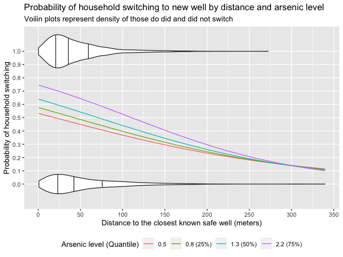

The probability decreases with distance and increases with arsenic
level.

Probability of household switching to new well by arsenic level and
distance.

``` r
v <- 
  tibble(
    dist = c(0, quantile(wells$dist, probs = c(0.25, 0.5, 0.75))),
    label = 
      case_when(
        names(dist) == "" ~ as.character(dist),
        TRUE ~ 
          str_glue(
            "{format(dist, digits = 0, nsmall = 0)} ({names(dist)})"
          ) %>% 
          as.character()
      ) %>% 
      fct_inorder(),
    arsenic = list(seq_range(wells$arsenic))
  ) %>% 
  unnest(arsenic) %>% 
  mutate(
    dist100 = dist / 100,
    .pred = 
      predict(fit_4, type = "response", newdata = tibble(arsenic, dist100))
  )

v %>% 
  ggplot(aes(arsenic)) +
  stat_ydensity(
    aes(y = switch, group = switch),
    data = wells,
    width = 0.25,
    draw_quantiles = c(0.25, 0.5, 0.75),
    scale = "count"
  ) +
  geom_line(aes(y = .pred, color = label)) +
  coord_cartesian(ylim = c(-0.125, 1.125)) +
  scale_y_continuous(breaks = seq(0, 1, 0.1), minor_breaks = NULL) +
  scale_x_continuous(breaks = scales::breaks_width(1)) +
  theme(legend.position = "bottom") +
  labs(
    title = 
      "Probability of household switching to new well by arsenic level and distance",
    subtitle =
      "Voilin plots represent density of those do did and did not switch",
    x = "Arsenic level",
    y = "Probability of household switching",
    color = "Distance in meters (Quantile)"
  )
```

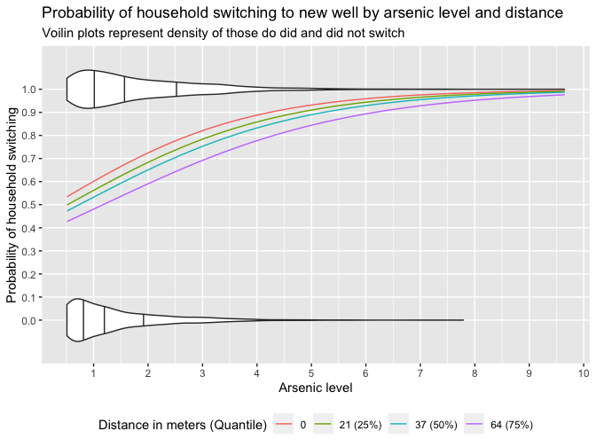

The probability increases with arsenic level and decreases with
distance.

### Adding social predictors

Fit a model using scaled distance, arsenic level, education of head of
household, and community organization activity.

``` r
set.seed(733)

fit_6 <- 
  stan_glm(
    switch ~ dist100 + arsenic + educ4 + assoc,
    family = binomial(link = "logit"),
    data = wells,
    refresh = 0
  )

print(fit_6, digits = 2)
```

    #> stan_glm
    #>  family:       binomial [logit]
    #>  formula:      switch ~ dist100 + arsenic + educ4 + assoc
    #>  observations: 3020
    #>  predictors:   5
    #> ------
    #>             Median MAD_SD
    #> (Intercept) -0.16   0.10 
    #> dist100     -0.90   0.11 
    #> arsenic      0.47   0.04 
    #> educ4        0.17   0.04 
    #> assoc       -0.12   0.08 
    #> 
    #> ------
    #> * For help interpreting the printed output see ?print.stanreg
    #> * For info on the priors used see ?prior_summary.stanreg

LOO log score

``` r
loo_6 <- loo(fit_6)

loo_6
```

    #> 
    #> Computed from 4000 by 3020 log-likelihood matrix
    #> 
    #>          Estimate   SE
    #> elpd_loo  -1959.1 16.1
    #> p_loo         5.3  0.1
    #> looic      3918.3 32.2
    #> ------
    #> Monte Carlo SE of elpd_loo is 0.0.
    #> 
    #> All Pareto k estimates are good (k < 0.5).
    #> See help('pareto-k-diagnostic') for details.

Compare log scores.

``` r
loo_compare(loo_4, loo_6)
```

    #>       elpd_diff se_diff
    #> fit_6  0.0       0.0   
    #> fit_4 -9.1       5.1

Belonging to a community association, perhaps surprisingly, is
associated in our data with a *lower* probability of switching, after
adjusting for the other factors in the model. However, this coefficient
is not estimated precisely, and so for clarity and stability we remove
it from the model.

Fit a model using scaled distance, arsenic level, and education of head
of household.

``` r
set.seed(733)

fit_7 <- 
  stan_glm(
    switch ~ dist100 + arsenic + educ4,
    family = binomial(link = "logit"),
    data = wells,
    refresh = 0
  )

print(fit_7, digits = 2)
```

    #> stan_glm
    #>  family:       binomial [logit]
    #>  formula:      switch ~ dist100 + arsenic + educ4
    #>  observations: 3020
    #>  predictors:   4
    #> ------
    #>             Median MAD_SD
    #> (Intercept) -0.21   0.09 
    #> dist100     -0.90   0.10 
    #> arsenic      0.47   0.04 
    #> educ4        0.17   0.04 
    #> 
    #> ------
    #> * For help interpreting the printed output see ?print.stanreg
    #> * For info on the priors used see ?prior_summary.stanreg

LOO log score

``` r
loo_7 <- loo(fit_7)

loo_7
```

    #> 
    #> Computed from 4000 by 3020 log-likelihood matrix
    #> 
    #>          Estimate   SE
    #> elpd_loo  -1959.4 16.1
    #> p_loo         4.3  0.1
    #> looic      3918.8 32.2
    #> ------
    #> Monte Carlo SE of elpd_loo is 0.0.
    #> 
    #> All Pareto k estimates are good (k < 0.5).
    #> See help('pareto-k-diagnostic') for details.

Compare log scores.

``` r
loo_compare(loo_4, loo_7)
```

    #>       elpd_diff se_diff
    #> fit_7  0.0       0.0   
    #> fit_4 -8.9       4.8

Adding education improves predictive log score, but there is
considerable uncertainty.

``` r
loo_compare(loo_6, loo_7)
```

    #>       elpd_diff se_diff
    #> fit_6  0.0       0.0   
    #> fit_7 -0.3       1.6

Removing the association variable doesn’t change the predictive
performance.

### Adding further interactions

Create centered education variable.

``` r
wells <- 
  wells %>% 
  mutate(educ4_c = educ4 - mean(educ4))
```

Fit a model using scaled distance, arsenic level, education of head of
household, and interactions with education.

``` r
set.seed(733)

fit_8 <- 
  stan_glm(
    switch ~ 
      dist100_c + arsenic_c + educ4_c + dist100_c:educ4_c + arsenic_c:educ4_c,
    family = binomial(link = "logit"),
    data = wells,
    refresh = 0
  )

print(fit_8, digits = 2)
```

    #> stan_glm
    #>  family:       binomial [logit]
    #>  formula:      switch ~ dist100_c + arsenic_c + educ4_c + dist100_c:educ4_c + 
    #>     arsenic_c:educ4_c
    #>  observations: 3020
    #>  predictors:   6
    #> ------
    #>                   Median MAD_SD
    #> (Intercept)        0.35   0.04 
    #> dist100_c         -0.92   0.10 
    #> arsenic_c          0.49   0.04 
    #> educ4_c            0.19   0.04 
    #> dist100_c:educ4_c  0.33   0.10 
    #> arsenic_c:educ4_c  0.08   0.04 
    #> 
    #> ------
    #> * For help interpreting the printed output see ?print.stanreg
    #> * For info on the priors used see ?prior_summary.stanreg

LOO log score

``` r
loo_8 <- loo(fit_8)

loo_8
```

    #> 
    #> Computed from 4000 by 3020 log-likelihood matrix
    #> 
    #>          Estimate   SE
    #> elpd_loo  -1952.7 16.5
    #> p_loo         6.4  0.3
    #> looic      3905.4 33.0
    #> ------
    #> Monte Carlo SE of elpd_loo is 0.0.
    #> 
    #> All Pareto k estimates are good (k < 0.5).
    #> See help('pareto-k-diagnostic') for details.

Compare log scores.

``` r
loo_compare(loo_7, loo_8)
```

    #>       elpd_diff se_diff
    #> fit_8  0.0       0.0   
    #> fit_7 -6.7       4.4

Adding the interactions with education in model 8 improves predictive
performance over model 7.

``` r
loo_compare(loo_3, loo_8)
```

    #>       elpd_diff se_diff
    #> fit_8   0.0       0.0  
    #> fit_3 -15.8       6.3

The education variable and its interactions in model 8 substantially
improves predictive performance over model 3.

## 14.3 Predictive simulation

### Simulating the uncertainty in the estimated coefficients

Posterior draws of logistic regression coefficients.

``` r
sims_2 <- as_tibble(fit_2)
coef <- 
  tibble(
    `(Intercept)` = coef(fit_2)[["(Intercept)"]],
    dist100 = coef(fit_2)[["dist100"]]
  )

sims_2 %>% 
  ggplot(aes(`(Intercept)`, dist100)) +
  geom_point(size = 0.1) +
  geom_point(data = coef, color = "red", size = 1.5) +
  labs(
    title = "Posterior draws of logistic regression coefficients"
  )
```

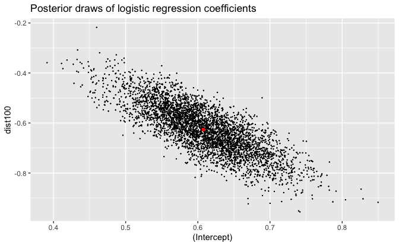

Probability of household switching to new well by distance with
uncertainty: With 50% and 90% predictive intervals.

``` r
new <- tibble(dist = seq_range(wells$dist))
linpred <- posterior_linpred(fit_1, newdata = new)
v <- 
  new %>% 
  mutate(
    .pred = predict(fit_1, type = "response", newdata = new),
    `5%`  = apply(linpred, 2, quantile, probs = 0.05) %>% plogis(),
    `25%` = apply(linpred, 2, quantile, probs = 0.25) %>% plogis(),
    `75%` = apply(linpred, 2, quantile, probs = 0.75) %>% plogis(),
    `95%` = apply(linpred, 2, quantile, probs = 0.95) %>% plogis()
  )

v %>% 
  ggplot(aes(dist)) +
  stat_ydensity(
    aes(y = switch, group = switch),
    data = wells,
    width = 0.25,
    draw_quantiles = c(0.25, 0.5, 0.75),
    scale = "count"
  ) +
  geom_ribbon(aes(ymin = `5%`, ymax = `95%`), alpha = 0.25) +
  geom_ribbon(aes(ymin = `25%`, ymax = `75%`), alpha = 0.5) +
  geom_line(aes(y = .pred)) +
  coord_cartesian(ylim = c(-0.125, 1.125)) +
  scale_y_continuous(breaks = seq(0, 1, 0.1), minor_breaks = NULL) +
  scale_x_continuous(breaks = scales::breaks_width(50)) +
  labs(
    title = "Probability of household switching to new well by distance",
    subtitle =
      "With 50% and 90% predictive intervals\nVoilin plots represent density of those do did and did not switch",
    x = "Distance to the closest known safe well (meters)",
    y = "Probability of household switching"
  )
```

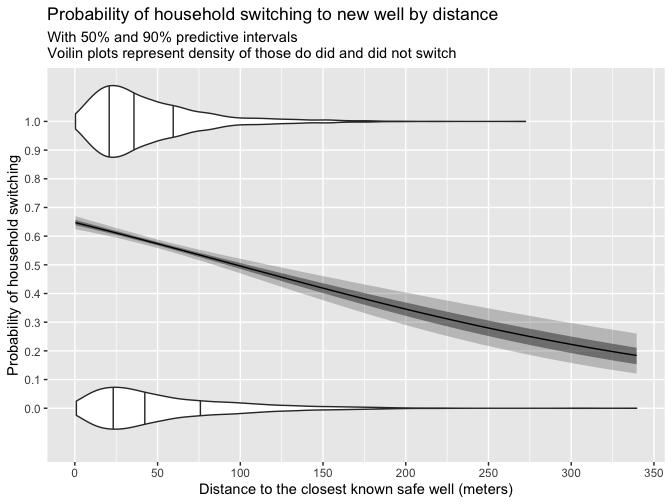

In the region of sparse data for large distances, the uncertainty from
the posterior distribution of the model is much less than the
uncertainty seen in the [2D EDA section](#2d-eda) using LOESS.
