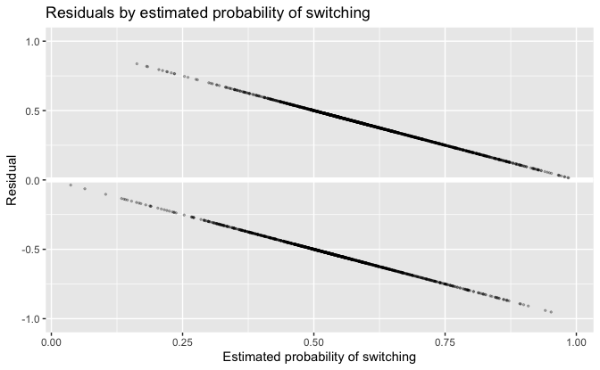
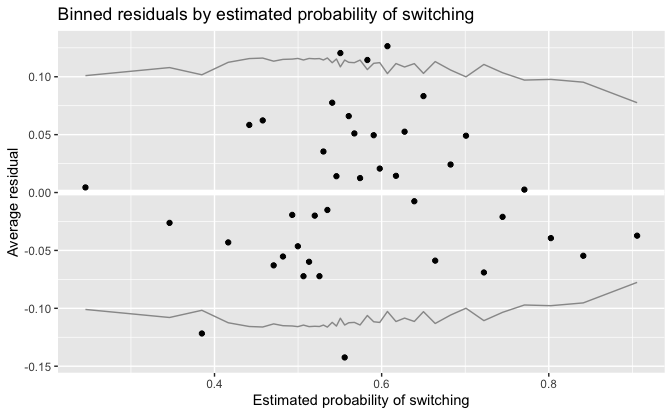
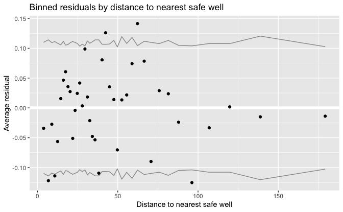
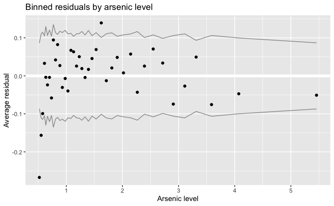
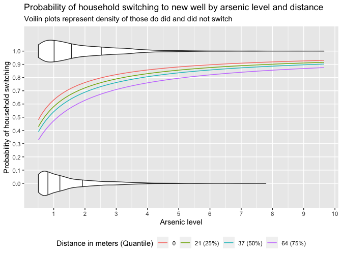
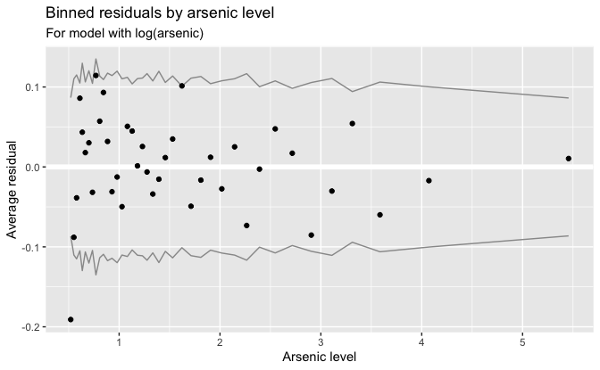

Regression and Other Stories: Arsenic model residuals
================
Andrew Gelman, Jennifer Hill, Aki Vehtari
2021-04-20

-   [14 Working with logistic
    regression](#14-working-with-logistic-regression)
    -   [14.5 Residuals for discrete-data
        regression](#145-residuals-for-discrete-data-regression)
        -   [Residuals and binned
            residuals](#residuals-and-binned-residuals)
        -   [Plotting binned residuals versus inputs of
            interest](#plotting-binned-residuals-versus-inputs-of-interest)
        -   [Improving a model by
            transformation](#improving-a-model-by-transformation)

Tidyverse version by Bill Behrman.

Binned residual plots for a logistic regression model: wells in
Bangladesh. See Chapter 14 in Regression and Other Stories.

------------------------------------------------------------------------

``` r
# Packages
library(tidyverse)
library(rstanarm)

# Parameters
  # Data on arsenic in unsafe wells in Bangladesh
file_wells <- here::here("Arsenic/data/wells.csv")
  # Common code
file_common <- here::here("_common.R")

#===============================================================================

# Run common code
source(file_common)
```

# 14 Working with logistic regression

## 14.5 Residuals for discrete-data regression

### Residuals and binned residuals

Data

``` r
wells <- read_csv(file_wells)

summary(wells)
```

    #>      switch         arsenic          dist        dist100         assoc      
    #>  Min.   :0.000   Min.   :0.51   Min.   :  0   Min.   :0.00   Min.   :0.000  
    #>  1st Qu.:0.000   1st Qu.:0.82   1st Qu.: 21   1st Qu.:0.21   1st Qu.:0.000  
    #>  Median :1.000   Median :1.30   Median : 37   Median :0.37   Median :0.000  
    #>  Mean   :0.575   Mean   :1.66   Mean   : 48   Mean   :0.48   Mean   :0.423  
    #>  3rd Qu.:1.000   3rd Qu.:2.20   3rd Qu.: 64   3rd Qu.:0.64   3rd Qu.:1.000  
    #>  Max.   :1.000   Max.   :9.65   Max.   :340   Max.   :3.40   Max.   :1.000  
    #>       educ           educ4     
    #>  Min.   : 0.00   Min.   :0.00  
    #>  1st Qu.: 0.00   1st Qu.:0.00  
    #>  Median : 5.00   Median :1.25  
    #>  Mean   : 4.83   Mean   :1.21  
    #>  3rd Qu.: 8.00   3rd Qu.:2.00  
    #>  Max.   :17.00   Max.   :4.25

The variables are:

-   `switch`: Outcome variable:
    -   1 if household switched to a new well
    -   0 if household continued using its own well
-   `arsenic`: Arsenic level of respondent’s well
-   `dist`: Distance (in meters) to the closest known safe well
-   `dist100` = `dist / 100`
-   `assoc`: Whether any members of the household are active in
    community organizations
-   `educ`: Education level of the head of household
-   `educ4` = `educ / 4`

Create transformed and centered variables.

``` r
wells <- 
  wells %>% 
  mutate(
    arsenic_log = log(arsenic),
    arsenic_c = arsenic - mean(arsenic),
    arsenic_log_c = arsenic_log - mean(arsenic_log),
    dist100_c = dist100 - mean(dist100),
    educ4_c = educ4 - mean(educ4)
  )
```

Fit a model using scaled distance, arsenic level, education of head of
household, and interactions with education.

``` r
set.seed(733)

fit_8 <- 
  stan_glm(
    switch ~ 
      dist100_c + arsenic_c + educ4_c + dist100_c:educ4_c + arsenic_c:educ4_c,
    family = binomial(link = "logit"),
    data = wells,
    refresh = 0
  )

print(fit_8, digits = 2)
```

    #> stan_glm
    #>  family:       binomial [logit]
    #>  formula:      switch ~ dist100_c + arsenic_c + educ4_c + dist100_c:educ4_c + 
    #>     arsenic_c:educ4_c
    #>  observations: 3020
    #>  predictors:   6
    #> ------
    #>                   Median MAD_SD
    #> (Intercept)        0.35   0.04 
    #> dist100_c         -0.92   0.10 
    #> arsenic_c          0.49   0.04 
    #> educ4_c            0.19   0.04 
    #> dist100_c:educ4_c  0.33   0.10 
    #> arsenic_c:educ4_c  0.08   0.04 
    #> 
    #> ------
    #> * For help interpreting the printed output see ?print.stanreg
    #> * For info on the priors used see ?prior_summary.stanreg

LOO log score

``` r
loo_8 <- loo(fit_8)

loo_8
```

    #> 
    #> Computed from 4000 by 3020 log-likelihood matrix
    #> 
    #>          Estimate   SE
    #> elpd_loo  -1952.7 16.5
    #> p_loo         6.4  0.3
    #> looic      3905.4 33.0
    #> ------
    #> Monte Carlo SE of elpd_loo is 0.0.
    #> 
    #> All Pareto k estimates are good (k < 0.5).
    #> See help('pareto-k-diagnostic') for details.

Residuals by estimated probability of switching.

``` r
v <- 
  tibble(
    .pred = predict(fit_8, type = "response"),
    resid = residuals(fit_8)
  )

v %>% 
  ggplot(aes(.pred, resid)) + 
  geom_hline(yintercept = 0, color = "white", size = 2) +
  geom_point(alpha = 0.25, size = 0.5) +
  coord_cartesian(ylim = c(-1, 1)) +
  labs(
    title = "Residuals by estimated probability of switching",
    x = "Estimated probability of switching",
    y = "Residual"
  )
```



Function for binned means.

``` r
binned_means <- function(x, y, n_bins = 40) {
  tibble(x, y) %>% 
    mutate(bin = cut_number(x, n = n_bins)) %>% 
    group_by(bin) %>% 
    summarize(
      x_mean = mean(x),
      y_mean = mean(y),
      y_se = sd(y) / sqrt(n())
    )
}
```

Plot binned residuals.

``` r
plot_binned_residuals <- function(.data) {
  .data %>% 
    ggplot(aes(x_mean)) +
    geom_hline(yintercept = 0, color = "white", size = 2) +
    geom_line(aes(y = 2 * y_se), color = "grey60") +
    geom_line(aes(y = -2 * y_se), color = "grey60") +
    geom_point(aes(y = y_mean)) +
    labs(y = "Average residual")
}
```

Binned residuals by estimated probability of switching.

``` r
v <- 
  binned_means(
    x = predict(fit_8, type = "response"),
    y = residuals(fit_8)
  )

v %>% 
  plot_binned_residuals() +
  labs(
    title = "Binned residuals by estimated probability of switching",
    x = "Estimated probability of switching"
  )
```



### Plotting binned residuals versus inputs of interest

Binned residuals by distance to nearest safe well.

``` r
v <- 
  binned_means(
    x = wells$dist,
    y = residuals(fit_8)
  )

v %>% 
  plot_binned_residuals() +
  labs(
    title = "Binned residuals by distance to nearest safe well",
    x = "Distance to nearest safe well"
  )
```



Binned residuals by arsenic level.

``` r
v <- 
  binned_means(
    x = wells$arsenic,
    y = residuals(fit_8)
  )

v %>% 
  plot_binned_residuals() +
  labs(
    title = "Binned residuals by arsenic level",
    x = "Arsenic level"
  )
```



A rising and falling pattern of residuals as in the above plot is a
signal to consider taking the logarithm of the predictor on the x-axis –
in this case, arsenic level.

### Improving a model by transformation

``` r
set.seed(733)

fit_9 <- 
  stan_glm(
    switch ~ 
      dist100_c + arsenic_log_c + educ4_c + 
      dist100_c:educ4_c + arsenic_log_c:educ4_c,
    family = binomial(link = "logit"),
    data = wells,
    refresh = 0
  )

print(fit_9, digits = 2)
```

    #> stan_glm
    #>  family:       binomial [logit]
    #>  formula:      switch ~ dist100_c + arsenic_log_c + educ4_c + dist100_c:educ4_c + 
    #>     arsenic_log_c:educ4_c
    #>  observations: 3020
    #>  predictors:   6
    #> ------
    #>                       Median MAD_SD
    #> (Intercept)            0.34   0.04 
    #> dist100_c             -1.01   0.11 
    #> arsenic_log_c          0.91   0.07 
    #> educ4_c                0.18   0.04 
    #> dist100_c:educ4_c      0.35   0.10 
    #> arsenic_log_c:educ4_c  0.06   0.07 
    #> 
    #> ------
    #> * For help interpreting the printed output see ?print.stanreg
    #> * For info on the priors used see ?prior_summary.stanreg

LOO log score

``` r
loo_9 <- loo(fit_9)

loo_9
```

    #> 
    #> Computed from 4000 by 3020 log-likelihood matrix
    #> 
    #>          Estimate   SE
    #> elpd_loo  -1938.0 17.2
    #> p_loo         6.1  0.2
    #> looic      3876.0 34.3
    #> ------
    #> Monte Carlo SE of elpd_loo is 0.0.
    #> 
    #> All Pareto k estimates are good (k < 0.5).
    #> See help('pareto-k-diagnostic') for details.

Compare log scores.

``` r
loo_compare(loo_8, loo_9)
```

    #>       elpd_diff se_diff
    #> fit_9   0.0       0.0  
    #> fit_8 -14.7       4.3

Using the log transformation of arsenic in model 9 increases predictive
performance.

Use non-centered predictors for easier plotting.

``` r
set.seed(733)

fit_9p <- 
  stan_glm(
    switch ~ 
      dist100 + arsenic_log + educ4 + dist100:educ4 + arsenic_log:educ4,
    family = binomial(link = "logit"),
    data = wells,
    refresh = 0
  )
```

Probability of household switching to new well by arsenic level and
distance.

``` r
v <- 
  tibble(
    dist = c(0, quantile(wells$dist, probs = c(0.25, 0.5, 0.75))),
    label = 
      case_when(
        names(dist) == "" ~ as.character(dist),
        TRUE ~ 
          str_glue(
            "{format(dist, digits = 0, nsmall = 0)} ({names(dist)})"
          ) %>% 
          as.character()
      ) %>% 
      fct_inorder(),
    arsenic = list(seq_range(wells$arsenic))
  ) %>% 
  unnest(arsenic) %>% 
  mutate(
    dist100 = dist / 100,
    arsenic_log = log(arsenic),
    educ4 = mean(wells$educ4),
    .pred = 
      predict(
        fit_9p,
        type = "response",
        newdata = tibble(dist100, arsenic_log, educ4)
      )
  )

v %>% 
  ggplot(aes(arsenic)) +
  stat_ydensity(
    aes(y = switch, group = switch),
    data = wells,
    width = 0.25,
    draw_quantiles = c(0.25, 0.5, 0.75),
    scale = "count"
  ) +
  geom_line(aes(y = .pred, color = label)) +
  coord_cartesian(ylim = c(-0.125, 1.125)) +
  scale_y_continuous(breaks = seq(0, 1, 0.1), minor_breaks = NULL) +
  scale_x_continuous(breaks = scales::breaks_width(1)) +
  theme(legend.position = "bottom") +
  labs(
    title = 
      "Probability of household switching to new well by arsenic level and distance",
    subtitle =
      "Voilin plots represent density of those do did and did not switch",
    x = "Arsenic level",
    y = "Probability of household switching",
    color = "Distance in meters (Quantile)"
  )
```



The probability increases with arsenic level and decreases with
distance.

Binned residuals by arsenic level.

``` r
v <- 
  binned_means(
    x = wells$arsenic,
    y = residuals(fit_9)
  )

v %>% 
  plot_binned_residuals() +
  labs(
    title = "Binned residuals by arsenic level",
    subtitle = "For model with log(arsenic)",
    x = "Arsenic level"
  )
```



Compared to the earlier model, the residuals look better, but a problem
remains at the very low end.
