Regression and Other Stories: Beauty and Teaching Quality
================
Andrew Gelman, Jennifer Hill, Aki Vehtari
2021-04-20

-   [10 Linear regression and multiple
    predictions](#10-linear-regression-and-multiple-predictions)
    -   [10.11 Exercises](#1011-exercises)

Tidyverse version by Bill Behrman.

See Chapter 10 in Regression and Other Stories.

Hamermesh and Parker (2005) data on student evaluations of instructors’
beauty and teaching quality for several courses at the University of
Texas. See Chapter 10 in Regression and Other Stories.

Hamermesh, D. S., and Parker, A. M. (2005). Beauty in the classroom:
Instructors’ pulchritude and putative pedagogical productivity.
Economics of Education Review, 24:369-376.
([Preprint](https://utexas.app.box.com/s/nl3ft5e1hunsnfomu87t))

------------------------------------------------------------------------

``` r
# Packages
library(tidyverse)
library(rstanarm)

# Parameters
  # Course evaluation and instructor data
file_beauty <- here::here("Beauty/data/beauty.csv")
  # Common code
file_common <- here::here("_common.R")

#===============================================================================

# Run common code
source(file_common)
```

# 10 Linear regression and multiple predictions

## 10.11 Exercises

Data

``` r
beauty <- 
  file_beauty %>% 
  read_csv() %>% 
  mutate(across(c(female, minority, nonenglish, lower, course_id), factor))
```

#### 1D Exporatory data analysis

``` r
glimpse(beauty)
```

    #> Rows: 463
    #> Columns: 8
    #> $ eval       <dbl> 4.3, 4.5, 3.7, 4.3, 4.4, 4.2, 4.0, 3.4, 4.5, 3.9, 3.1, 4.0,…
    #> $ beauty     <dbl> 0.2016, -0.8261, -0.6603, -0.7663, 1.4214, 0.5002, -0.2144,…
    #> $ female     <fct> 1, 0, 0, 1, 1, 0, 1, 1, 1, 0, 0, 0, 0, 0, 1, 0, 1, 0, 1, 1,…
    #> $ age        <dbl> 36, 59, 51, 40, 31, 62, 33, 51, 33, 47, 35, 37, 42, 49, 37,…
    #> $ minority   <fct> 1, 0, 0, 0, 0, 0, 0, 0, 0, 0, 1, 0, 0, 0, 0, 0, 0, 0, 0, 0,…
    #> $ nonenglish <fct> 0, 0, 0, 0, 0, 0, 0, 0, 0, 0, 1, 0, 0, 1, 0, 0, 0, 0, 0, 0,…
    #> $ lower      <fct> 0, 0, 0, 0, 0, 0, 0, 0, 0, 0, 0, 0, 0, 0, 0, 0, 0, 1, 0, 0,…
    #> $ course_id  <fct> 3, 0, 4, 2, 0, 0, 4, 0, 0, 4, 4, 0, 0, 0, 9, 9, 10, 0, 0, 0…

``` r
summary(beauty)
```

    #>       eval         beauty       female       age       minority nonenglish
    #>  Min.   :2.1   Min.   :-1.539   0:268   Min.   :29.0   0:399    0:435     
    #>  1st Qu.:3.6   1st Qu.:-0.745   1:195   1st Qu.:42.0   1: 64    1: 28     
    #>  Median :4.0   Median :-0.156           Median :48.0                      
    #>  Mean   :4.0   Mean   :-0.088           Mean   :48.4                      
    #>  3rd Qu.:4.4   3rd Qu.: 0.457           3rd Qu.:57.0                      
    #>  Max.   :5.0   Max.   : 1.882           Max.   :73.0                      
    #>                                                                           
    #>  lower     course_id  
    #>  0:306   0      :306  
    #>  1:157   4      : 19  
    #>          21     : 14  
    #>          22     : 11  
    #>          3      :  8  
    #>          9      :  8  
    #>          (Other): 97

`eval`

``` r
beauty %>% 
  ggplot(aes(eval)) +
  geom_bar()
```

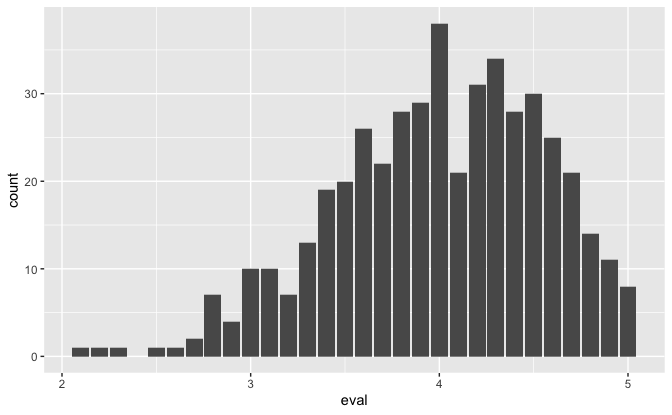

Most evaluations are between 3 and 5 with a mean and median of 4.

`beauty`

``` r
beauty %>% 
  ggplot(aes(beauty)) +
  geom_histogram(binwidth = 0.2)
```

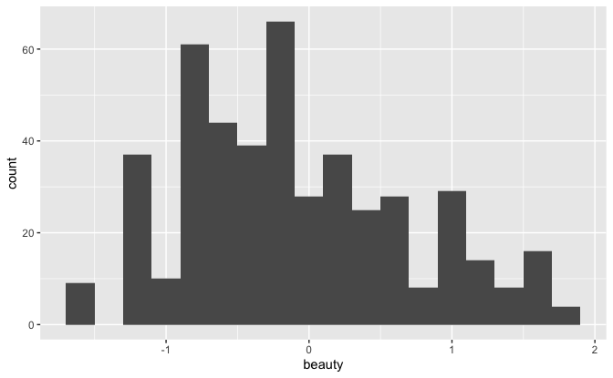

`beauty` appears to have been normalized so that the mean is
approximately 0.

`age`

``` r
beauty %>% 
  ggplot(aes(age)) +
  geom_histogram(binwidth = 5, boundary = 0)
```

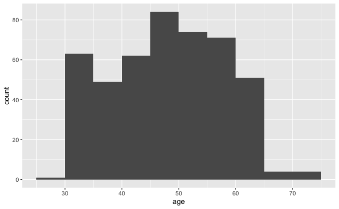

A fairly uniform distribution between ages 30 and 65, with mean and
median around 48.

`female`

``` r
beauty %>% 
  count(female) %>% 
  mutate(prop = n / sum(n))
```

    #> # A tibble: 2 x 3
    #>   female     n  prop
    #> * <fct>  <int> <dbl>
    #> 1 0        268 0.579
    #> 2 1        195 0.421

About 42% of the instructors are female.

`minority`

``` r
beauty %>% 
  count(minority) %>% 
  mutate(prop = n / sum(n))
```

    #> # A tibble: 2 x 3
    #>   minority     n  prop
    #> * <fct>    <int> <dbl>
    #> 1 0          399 0.862
    #> 2 1           64 0.138

About 14% of the instructors are from a minority.

`nonenglish`

``` r
beauty %>% 
  count(nonenglish) %>% 
  mutate(prop = n / sum(n))
```

    #> # A tibble: 2 x 3
    #>   nonenglish     n   prop
    #> * <fct>      <int>  <dbl>
    #> 1 0            435 0.940 
    #> 2 1             28 0.0605

Only about 6% of the instructors are non-native English speakers.

`lower`

``` r
beauty %>% 
  count(lower) %>% 
  mutate(prop = n / sum(n))
```

    #> # A tibble: 2 x 3
    #>   lower     n  prop
    #> * <fct> <int> <dbl>
    #> 1 0       306 0.661
    #> 2 1       157 0.339

About 34% of the classes are lower division.

`couse_id`

``` r
beauty %>% 
  count(course_id, sort = TRUE) %>% 
  mutate(prop = n / sum(n))
```

    #> # A tibble: 31 x 3
    #>    course_id     n   prop
    #>    <fct>     <int>  <dbl>
    #>  1 0           306 0.661 
    #>  2 4            19 0.0410
    #>  3 21           14 0.0302
    #>  4 22           11 0.0238
    #>  5 3             8 0.0173
    #>  6 9             8 0.0173
    #>  7 30            8 0.0173
    #>  8 17            7 0.0151
    #>  9 6             6 0.0130
    #> 10 19            6 0.0130
    #> # … with 21 more rows

66% of courses have a `course_id` 0. It’s hard to imagine 306 offerings
of the same course. Perhaps 0 indicates `NA`. In any case, this does not
appear to be a useful variable for modeling.

#### 2D Exporatory data analysis

##### Relationship of variables to `eval`

``` r
beauty %>% 
  ggplot(aes(beauty, eval)) +
  geom_count() +
  geom_smooth(method = "loess", formula = "y ~ x")
```

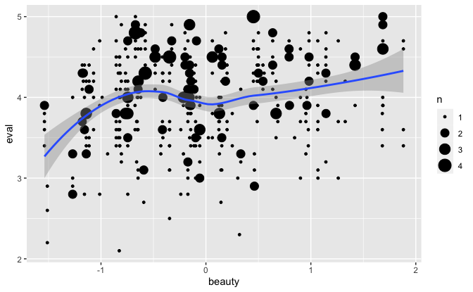

There appears to be a slight positive relationship between `beauty` and
`eval`.

``` r
beauty %>% 
  ggplot(aes(age, eval)) +
  geom_count() +
  geom_smooth(method = "loess", formula = "y ~ x")
```

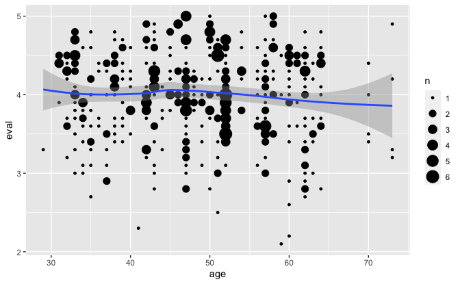

There does not appear to be much of a relationship between `age` and
`eval`.

``` r
beauty %>% 
  ggplot(aes(female, eval)) +
  geom_boxplot()
```

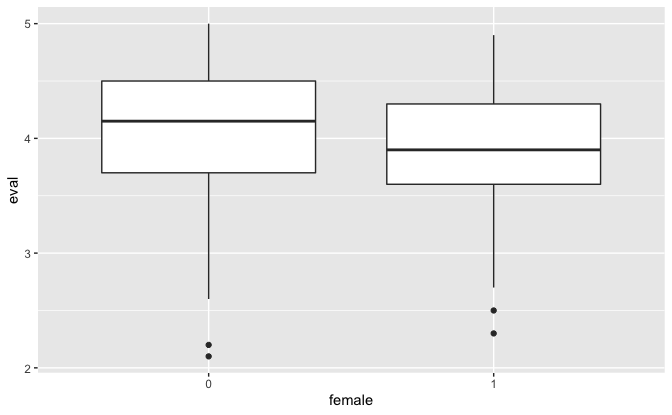

On average, female instructors receive lower evaluations.

``` r
beauty %>% 
  ggplot(aes(minority, eval)) +
  geom_boxplot()
```

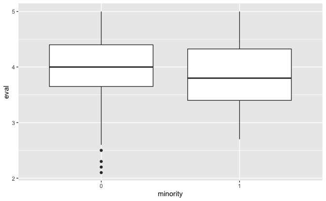

On average, minority instructors receive lower evaluations.

``` r
beauty %>% 
  ggplot(aes(nonenglish, eval)) +
  geom_boxplot()
```

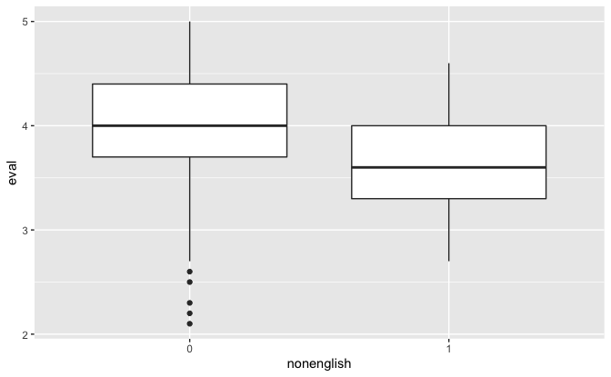

On average, instructors who are non-native English speakers receive
lower evaluations.

``` r
beauty %>% 
  ggplot(aes(lower, eval)) +
  geom_boxplot()
```

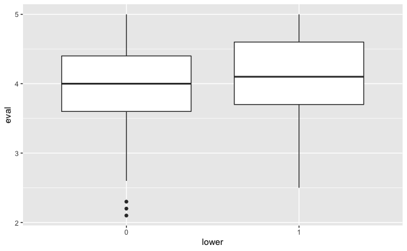

On average, lower division classes receive slightly higher evaluations.

##### Relationship of variables to `beauty`

``` r
beauty %>% 
  ggplot(aes(age, beauty)) +
  geom_count() +
  geom_smooth(method = "loess", formula = "y ~ x")
```

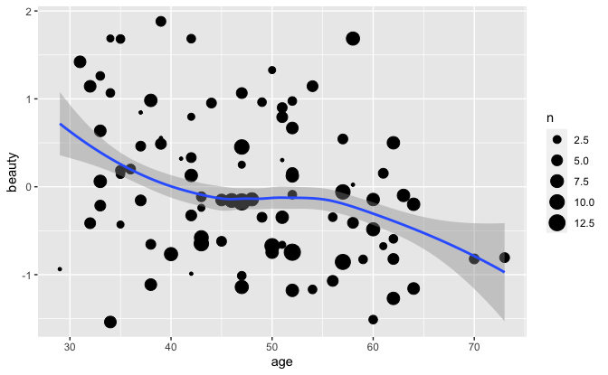

There appears to be a negative relationship between `age` and `beauty`.

``` r
beauty %>% 
  ggplot(aes(female, beauty)) +
  geom_boxplot()
```

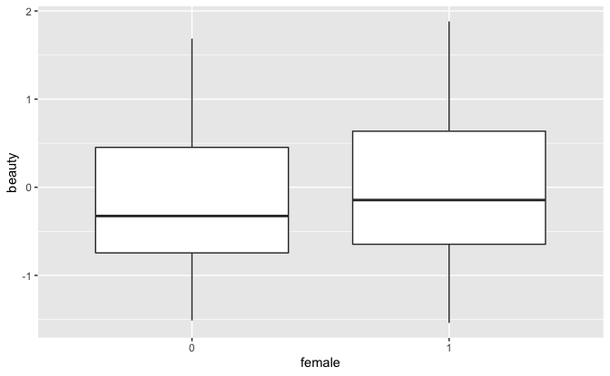

Female instructors receive higher beauty scores.

``` r
beauty %>% 
  ggplot(aes(minority, beauty)) +
  geom_boxplot()
```

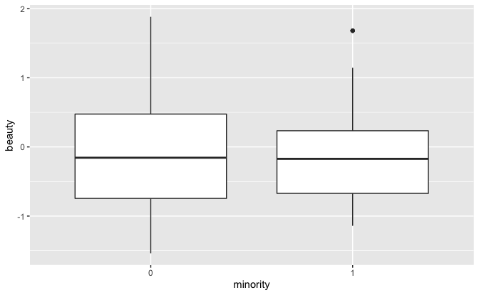

Minority instructors receive roughly the same beauty scores as white
instructors.

``` r
beauty %>% 
  ggplot(aes(nonenglish, beauty)) +
  geom_boxplot()
```

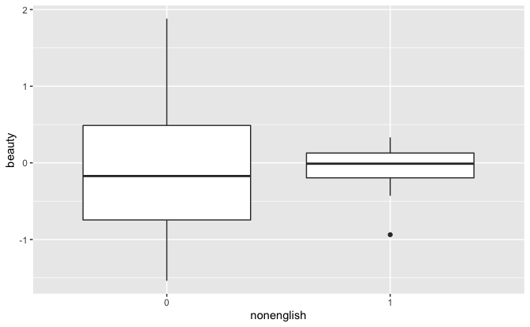

Instructors who are non-native English speakers receive slightly higher
beauty scores.

#### Linear regressions

Fit linear regression with predictor: `beauty`

``` r
set.seed(616)

fit_1 <- stan_glm(eval ~ beauty, data = beauty, refresh = 0)

print(fit_1, digits = 2)
```

    #> stan_glm
    #>  family:       gaussian [identity]
    #>  formula:      eval ~ beauty
    #>  observations: 463
    #>  predictors:   2
    #> ------
    #>             Median MAD_SD
    #> (Intercept) 4.01   0.03  
    #> beauty      0.13   0.03  
    #> 
    #> Auxiliary parameter(s):
    #>       Median MAD_SD
    #> sigma 0.55   0.02  
    #> 
    #> ------
    #> * For help interpreting the printed output see ?print.stanreg
    #> * For info on the priors used see ?prior_summary.stanreg

For instructors with the average beauty score of 0, the predicted
teaching evaluation score is 4.0. The relationship of beauty score to
predicted teaching evaluation score is slightly positive with a slope of
0.13.

Average teaching evaluation vs. beauty score.

``` r
v <- 
  tibble(beauty = seq_range(beauty$beauty)) %>% 
  predictive_intervals(fit = fit_1)

v %>% 
  ggplot(aes(beauty)) +
  geom_ribbon(aes(ymin = `5%`, ymax = `95%`), alpha = 0.25) +
  geom_ribbon(aes(ymin = `25%`, ymax = `75%`), alpha = 0.5) +
  geom_line(aes(y = .pred)) +
  geom_count(aes(y = eval), data = beauty) +
  theme(legend.position = "bottom") +
  labs(
    title = "Average teaching evaluation vs. beauty score",
    subtitle = "With 50% and 90% predictive intervals",
    x = "Beauty score",
    y = "Average teaching evaluation",
    size = "Count"
  )
```

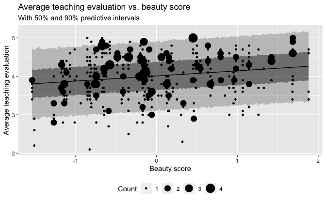

There is considerable uncertainty in the relationship between the beauty
score and the average teaching evaluation.

Fit linear regression with predictors: `beauty`, `female`

``` r
set.seed(616)

fit_2 <- 
  stan_glm(eval ~ beauty + female + beauty:female, data = beauty, refresh = 0)

print(fit_2, digits = 2)
```

    #> stan_glm
    #>  family:       gaussian [identity]
    #>  formula:      eval ~ beauty + female + beauty:female
    #>  observations: 463
    #>  predictors:   4
    #> ------
    #>                Median MAD_SD
    #> (Intercept)     4.10   0.03 
    #> beauty          0.20   0.04 
    #> female1        -0.20   0.05 
    #> beauty:female1 -0.11   0.06 
    #> 
    #> Auxiliary parameter(s):
    #>       Median MAD_SD
    #> sigma 0.54   0.02  
    #> 
    #> ------
    #> * For help interpreting the printed output see ?print.stanreg
    #> * For info on the priors used see ?prior_summary.stanreg

For instructors with the average beauty score of 0, the predicted
teaching evaluation score is 4.1 for men and 3.9 for women. The
relationship of beauty score to predicted teaching evaluation score is
more positive for men, with a slope of 0.20 for men and 0.09 for women.

Average teaching evaluation vs. beauty score and sex.

``` r
lines <- 
  tribble(
    ~female, ~intercept, ~slope,
    0, coef(fit_2)[["(Intercept)"]], coef(fit_2)[["beauty"]],
    1, 
      coef(fit_2)[["(Intercept)"]] + coef(fit_2)[["female1"]],
      coef(fit_2)[["beauty"]] + coef(fit_2)[["beauty:female1"]]
  ) %>% 
  mutate(across(female, factor))

beauty %>% 
  ggplot(aes(beauty, eval, color = female)) +
  geom_count() +
  geom_abline(
    aes(slope = slope, intercept = intercept, color = female),
    data = lines
  ) +
  scale_color_discrete(breaks = 1:0, labels = c("Female", "Male"), direction = -1) +
  theme(legend.position = "bottom") +
  labs(
    title = "Average teaching evaluation vs. beauty score and sex",
    x = "Beauty score",
    y = "Average teaching evaluation",
    color = "Sex",
    size = "Count"
  )
```

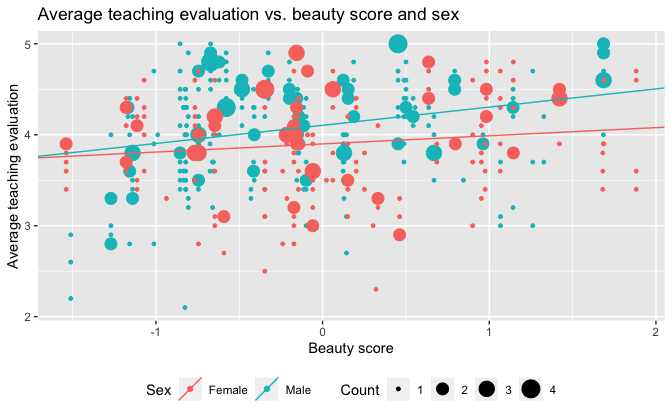

Fit linear regression with predictors: `beauty`, `female`, `minority`,
`nonenglish`, `lower`

``` r
set.seed(616)

fit_3 <- 
  stan_glm(
    eval ~ beauty + female + beauty:female + minority + nonenglish + lower,
    data = beauty,
    refresh = 0
  )

print(fit_3, digits = 2)
```

    #> stan_glm
    #>  family:       gaussian [identity]
    #>  formula:      eval ~ beauty + female + beauty:female + minority + nonenglish + 
    #>     lower
    #>  observations: 463
    #>  predictors:   7
    #> ------
    #>                Median MAD_SD
    #> (Intercept)     4.09   0.04 
    #> beauty          0.20   0.04 
    #> female1        -0.19   0.05 
    #> minority1      -0.04   0.08 
    #> nonenglish1    -0.29   0.11 
    #> lower1          0.09   0.06 
    #> beauty:female1 -0.11   0.06 
    #> 
    #> Auxiliary parameter(s):
    #>       Median MAD_SD
    #> sigma 0.53   0.02  
    #> 
    #> ------
    #> * For help interpreting the printed output see ?print.stanreg
    #> * For info on the priors used see ?prior_summary.stanreg

A male, white, native English speaking instructor, not teaching a lower
division course, and with the average beauty score of 0, has the
baseline predicted teaching evaluation score of 4.09. Compared to this
baseline, for other instructors with the average beauty score of 0, the
predicted teaching evaluation score for:

-   Women is 0.19 lower.
-   Minority instructors is 0.04 lower.
-   Non-native English speaking instructors is 0.29 lower.
-   Instructors of lower division classes is 0.09 higher.

The relationship of beauty score to predicted teaching evaluation score
is more positive for men, with a slope of 0.20 for men and 0.09 for
women.

Regression residuals vs. predicted values.

``` r
v <- 
  tibble(
    pred = predict(fit_3),
    resid = residuals(fit_3)
  )

v %>% 
  ggplot(aes(pred, resid)) +
  geom_hline(yintercept = 0, color = "white", size = 2) +
  geom_count() +
  theme(legend.position = "bottom") +
  labs(
    title = "Regression residuals vs. predicted values",
    x = "Predicted value",
    y = "Residual",
    size = "Count"
  )
```

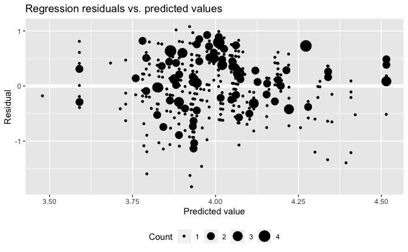

The residuals appear to be evenly distributed about 0 with no patterns.
