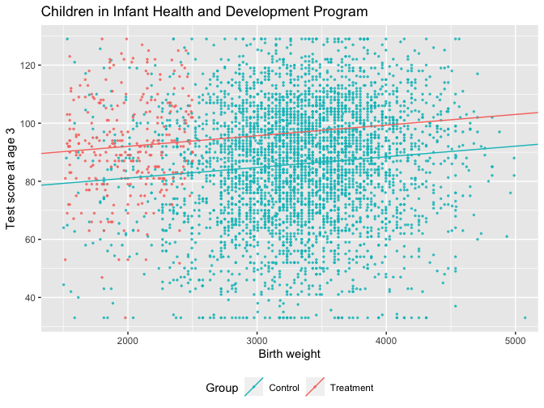
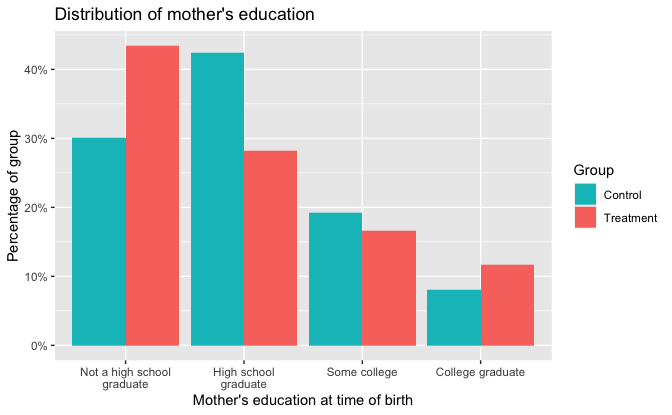
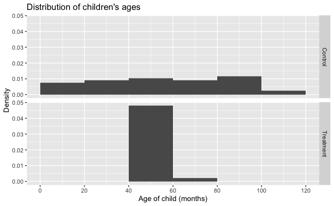

Regression and Other Stories: ChildCare
================
Andrew Gelman, Jennifer Hill, Aki Vehtari
2021-04-20

-   [20 Observational studies with measured
    confounders](#20-observational-studies-with-measured-confounders)
    -   [20.5 Example: evaluating a child care
        program](#205-example-evaluating-a-child-care-program)
        -   [Examining imbalances for several
            covariates](#examining-imbalances-for-several-covariates)
    -   [20.6 Subclassification and average treatment
        effects](#206-subclassification-and-average-treatment-effects)
        -   [Subclassification as a simple nonparameteric
            approach](#subclassification-as-a-simple-nonparameteric-approach)

Tidyverse version by Bill Behrman.

Code and figures for Infant Health and Development Program (IHDP)
example. See Chapter 20 in Regression and Other Stories.

The intervention for low-birth-weight children is described by

-   Brooks-Gunn, J., Liaw, F. R., and Klebanov, P. K. (1992). Effects of
    early intervention on cognitive function of low birth weight preterm
    infants. Journal of Pediatrics 120, 350–359.
-   Hill, J. L., Brooks-Gunn, J., and Waldfogel, J. (2003). Sustained
    effects of high participation in an early intervention for
    low-birth-weight premature infants. Developmental Psychology 39,
    730–744.

------------------------------------------------------------------------

``` r
# Packages
library(tidyverse)
library(rstanarm)

# Parameters
  # Infant Health and Development Program (IHDP) data
file_cc2 <- here::here("Childcare/data/cc2.csv") 
  # Variables used in analysis
vars <- 
  vars(
    momage, b_marr, work_dur, prenatal, sex, first, bw, preterm, age, dayskidh,
    ppvtr_36, st5, st9, st12, st25, st36, st42, st48, st53, income, treat,
    black, hispanic, white, lths, hs, ltcoll, college, bwg, educ
  )
  # Common code
file_common <- here::here("_common.R")

#===============================================================================

# Run common code
source(file_common)
```

# 20 Observational studies with measured confounders

## 20.5 Example: evaluating a child care program

Data

``` r
cc2 <- 
  file_cc2 %>% 
  read_csv() %>% 
  janitor::clean_names() %>% 
  select(!!! vars)

glimpse(cc2)
```

    #> Rows: 4,381
    #> Columns: 30
    #> $ momage   <dbl> 33, 22, 13, 25, 19, 19, 26, 20, 23, 28, 32, 23, 29, 18, 25, 1…
    #> $ b_marr   <dbl> 1, 0, 0, 1, 0, 0, 0, 1, 1, 1, 0, 0, 1, 0, 1, 0, 0, 1, 1, 0, 1…
    #> $ work_dur <dbl> 1, 0, 0, 1, 0, 1, 1, 0, 1, 1, 1, 1, 0, 0, 1, 0, 1, 1, 1, 1, 1…
    #> $ prenatal <dbl> 1, 1, 1, 1, 1, 1, 1, 1, 1, 1, 1, 1, 1, 1, 1, 1, 1, 1, 1, 1, 1…
    #> $ sex      <dbl> 1, 1, 1, 1, 1, 0, 1, 0, 0, 1, 0, 0, 1, 1, 0, 1, 0, 1, 0, 1, 1…
    #> $ first    <dbl> 0, 0, 1, 1, 0, 1, 0, 0, 0, 0, 0, 0, 1, 1, 0, 1, 0, 0, 0, 0, 1…
    #> $ bw       <dbl> 1559, 2240, 1900, 1550, 2270, 1550, 2330, 2410, 1776, 2140, 2…
    #> $ preterm  <dbl> 10, 3, 6, 8, 5, 4, 9, 3, 6, 5, 5, 7, 6, 10, 8, 6, 7, 6, 6, 6,…
    #> $ age      <dbl> 60.8, 59.8, 59.5, 59.2, 58.8, 58.5, 58.4, 57.9, 57.8, 57.7, 5…
    #> $ dayskidh <dbl> 31, 4, 9, 50, 4, 13, 8, 6, 30, 2, 3, 27, 13, 24, 71, 1, 6, 4,…
    #> $ ppvtr_36 <dbl> 111.0, 81.0, 92.0, 103.0, 81.0, 94.0, 104.0, 82.6, 107.0, 79.…
    #> $ st5      <dbl> 1, 1, 1, 1, 1, 1, 1, 1, 1, 1, 1, 1, 1, 1, 1, 1, 1, 1, 1, 1, 1…
    #> $ st9      <dbl> 0, 0, 0, 0, 0, 0, 0, 0, 0, 0, 0, 0, 0, 0, 0, 0, 0, 0, 0, 0, 0…
    #> $ st12     <dbl> 0, 0, 0, 0, 0, 0, 0, 0, 0, 0, 0, 0, 0, 0, 0, 0, 0, 0, 0, 0, 0…
    #> $ st25     <dbl> 0, 0, 0, 0, 0, 0, 0, 0, 0, 0, 0, 0, 0, 0, 0, 0, 0, 0, 0, 0, 0…
    #> $ st36     <dbl> 0, 0, 0, 0, 0, 0, 0, 0, 0, 0, 0, 0, 0, 0, 0, 0, 0, 0, 0, 0, 0…
    #> $ st42     <dbl> 0, 0, 0, 0, 0, 0, 0, 0, 0, 0, 0, 0, 0, 0, 0, 0, 0, 0, 0, 0, 0…
    #> $ st48     <dbl> 0, 0, 0, 0, 0, 0, 0, 0, 0, 0, 0, 0, 0, 0, 0, 0, 0, 0, 0, 0, 0…
    #> $ st53     <dbl> 0, 0, 0, 0, 0, 0, 0, 0, 0, 0, 0, 0, 0, 0, 0, 0, 0, 0, 0, 0, 0…
    #> $ income   <dbl> 42500, 5000, 12500, 42500, 5000, 12500, 17500, 11344, 30000, …
    #> $ treat    <dbl> 1, 1, 1, 1, 1, 1, 1, 1, 1, 1, 1, 1, 1, 1, 1, 1, 1, 1, 1, 1, 1…
    #> $ black    <dbl> 0, 1, 1, 1, 1, 1, 0, 0, 0, 1, 0, 1, 0, 1, 0, 0, 0, 0, 1, 1, 0…
    #> $ hispanic <dbl> 0, 0, 0, 0, 0, 0, 0, 0, 0, 0, 0, 0, 0, 0, 0, 0, 0, 0, 0, 0, 0…
    #> $ white    <dbl> 1, 0, 0, 0, 0, 0, 1, 1, 1, 0, 1, 0, 1, 0, 1, 1, 1, 1, 0, 0, 1…
    #> $ lths     <dbl> 0, 1, 1, 0, 1, 0, 1, 1, 0, 0, 1, 0, 1, 1, 0, 1, 1, 1, 0, 1, 0…
    #> $ hs       <dbl> 0, 0, 0, 0, 0, 1, 0, 0, 1, 1, 0, 1, 0, 0, 0, 0, 0, 0, 1, 0, 0…
    #> $ ltcoll   <dbl> 0, 0, 0, 0, 0, 0, 0, 0, 0, 0, 0, 0, 0, 0, 0, 0, 0, 0, 0, 0, 1…
    #> $ college  <dbl> 1, 0, 0, 1, 0, 0, 0, 0, 0, 0, 0, 0, 0, 0, 1, 0, 0, 0, 0, 0, 0…
    #> $ bwg      <dbl> 0, 1, 0, 0, 1, 0, 1, 1, 0, 1, 1, 0, 1, 1, 0, 1, 1, 1, 1, 1, 0…
    #> $ educ     <dbl> 4, 1, 1, 4, 1, 2, 1, 1, 2, 2, 1, 2, 1, 1, 4, 1, 1, 1, 2, 1, 3…

The variables are:

-   `momage`: Mother’s age at time of birth.
-   `b_marr`: Indicator for whether mother was married at birth.
-   `work_dur`: Indicator for whether mother worked in the year before
    she gave birth.
-   `prenatal`: Indicator for whether mother received prenatal care.
-   `sex`: Indicator for whether child was born male or female.
-   `first`: Indicator for whether child was the first born for the
    mother.
-   `bw`: Child’s birth weight (grams).
-   `preterm`: Number of weeks preterm child was born.
-   `age`: Age of child (months).
-   `dayskidh`: Number of days child was in the hospital after being
    born.
-   `ppvtr_36`: IQ measured at age 36 months.
-   `st5`, `st9`, `st12`, `st25`, `st36`, `st42`, `st48`, `st53`:
    Indicator for state where household resides.
-   `income`: Family income one year after the child was born.
-   `treat`: Indicator for whether family was allowed to receive IHDP
    services (1 = yes).
-   `black`, `hispanic`, `white`: Indicators for child’s race/ethnicity.
-   `lths`, `hs`, `ltcoll`, `college`: Indicators for mother’s education
    at time of birth.
-   `bwg`: Indicator for whether child was born low birth weight.
-   `educ`: Mother’s education at time of birth.

``` r
summary(cc2)
```

    #>      momage         b_marr        work_dur        prenatal          sex       
    #>  Min.   :13.0   Min.   :0.00   Min.   :0.000   Min.   :0.000   Min.   :0.000  
    #>  1st Qu.:21.0   1st Qu.:0.00   1st Qu.:0.000   1st Qu.:1.000   1st Qu.:0.000  
    #>  Median :24.0   Median :1.00   Median :1.000   Median :1.000   Median :0.000  
    #>  Mean   :23.8   Mean   :0.67   Mean   :0.619   Mean   :0.985   Mean   :0.496  
    #>  3rd Qu.:26.0   3rd Qu.:1.00   3rd Qu.:1.000   3rd Qu.:1.000   3rd Qu.:1.000  
    #>  Max.   :41.0   Max.   :1.00   Max.   :1.000   Max.   :1.000   Max.   :1.000  
    #>      first             bw          preterm          age           dayskidh    
    #>  Min.   :0.000   Min.   :1503   Min.   :-7.0   Min.   :  3.0   Min.   :  0.0  
    #>  1st Qu.:0.000   1st Qu.:2892   1st Qu.: 1.0   1st Qu.: 33.0   1st Qu.:  2.0  
    #>  Median :0.000   Median :3289   Median : 1.0   Median : 57.0   Median :  3.0  
    #>  Mean   :0.425   Mean   :3247   Mean   : 1.5   Mean   : 56.4   Mean   :  4.9  
    #>  3rd Qu.:1.000   3rd Qu.:3657   3rd Qu.: 2.0   3rd Qu.: 82.0   3rd Qu.:  5.0  
    #>  Max.   :1.000   Max.   :7598   Max.   :14.0   Max.   :106.0   Max.   :100.0  
    #>     ppvtr_36          st5            st9             st12           st25      
    #>  Min.   : 33.0   Min.   :0.00   Min.   :0.000   Min.   :0.00   Min.   :0.000  
    #>  1st Qu.: 73.0   1st Qu.:0.00   1st Qu.:0.000   1st Qu.:0.00   1st Qu.:0.000  
    #>  Median : 88.0   Median :0.00   Median :0.000   Median :0.00   Median :0.000  
    #>  Mean   : 86.4   Mean   :0.02   Mean   :0.028   Mean   :0.05   Mean   :0.022  
    #>  3rd Qu.:101.0   3rd Qu.:0.00   3rd Qu.:0.000   3rd Qu.:0.00   3rd Qu.:0.000  
    #>  Max.   :129.0   Max.   :1.00   Max.   :1.000   Max.   :1.00   Max.   :1.000  
    #>       st36            st42            st48            st53      
    #>  Min.   :0.000   Min.   :0.000   Min.   :0.000   Min.   :0.000  
    #>  1st Qu.:0.000   1st Qu.:0.000   1st Qu.:0.000   1st Qu.:0.000  
    #>  Median :0.000   Median :0.000   Median :0.000   Median :0.000  
    #>  Mean   :0.059   Mean   :0.043   Mean   :0.088   Mean   :0.023  
    #>  3rd Qu.:0.000   3rd Qu.:0.000   3rd Qu.:0.000   3rd Qu.:0.000  
    #>  Max.   :1.000   Max.   :1.000   Max.   :1.000   Max.   :1.000  
    #>      income            treat           black          hispanic    
    #>  Min.   : -55307   Min.   :0.000   Min.   :0.000   Min.   :0.000  
    #>  1st Qu.:   7729   1st Qu.:0.000   1st Qu.:0.000   1st Qu.:0.000  
    #>  Median :  17025   Median :0.000   Median :0.000   Median :0.000  
    #>  Mean   :  28085   Mean   :0.066   Mean   :0.298   Mean   :0.205  
    #>  3rd Qu.:  31200   3rd Qu.:0.000   3rd Qu.:1.000   3rd Qu.:0.000  
    #>  Max.   :1378212   Max.   :1.000   Max.   :1.000   Max.   :1.000  
    #>      white            lths            hs            ltcoll         college     
    #>  Min.   :0.000   Min.   :0.00   Min.   :0.000   Min.   :0.000   Min.   :0.000  
    #>  1st Qu.:0.000   1st Qu.:0.00   1st Qu.:0.000   1st Qu.:0.000   1st Qu.:0.000  
    #>  Median :0.000   Median :0.00   Median :0.000   Median :0.000   Median :0.000  
    #>  Mean   :0.497   Mean   :0.31   Mean   :0.415   Mean   :0.191   Mean   :0.084  
    #>  3rd Qu.:1.000   3rd Qu.:1.00   3rd Qu.:1.000   3rd Qu.:0.000   3rd Qu.:0.000  
    #>  Max.   :1.000   Max.   :1.00   Max.   :1.000   Max.   :1.000   Max.   :1.000  
    #>       bwg             educ     
    #>  Min.   :0.000   Min.   :1.00  
    #>  1st Qu.:1.000   1st Qu.:1.00  
    #>  Median :1.000   Median :2.00  
    #>  Mean   :0.949   Mean   :2.05  
    #>  3rd Qu.:1.000   3rd Qu.:3.00  
    #>  Max.   :1.000   Max.   :4.00

We can see from the above that there are no `NA`s in the data.

``` r
v <- 
  cc2 %>% 
  count(negative = income < 0)

v
```

    #> # A tibble: 2 x 2
    #>   negative     n
    #> * <lgl>    <int>
    #> 1 FALSE     4175
    #> 2 TRUE       206

`income` has 206 negative values.

``` r
cc2 %>% 
  select(!c(momage, bw, preterm, age, dayskidh, ppvtr_36, income, educ)) %>% 
  unlist() %>% 
  setequal(0:1)
```

    #> [1] TRUE

And all variables other than `momage`, `bw`, `preterm`, `age`,
`dayskidh`, `ppvtr_36`, `income`, and `educ` are indicator variables.

``` r
cc2 %>% 
  count(educ, lths, hs, ltcoll, college)
```

    #> # A tibble: 4 x 6
    #>    educ  lths    hs ltcoll college     n
    #>   <dbl> <dbl> <dbl>  <dbl>   <dbl> <int>
    #> 1     1     1     0      0       0  1358
    #> 2     2     0     1      0       0  1820
    #> 3     3     0     0      1       0   837
    #> 4     4     0     0      0       1   366

`educ` combines the indicators variables `lths`, `hs`, `ltcoll`, and
`college`.

### Examining imbalances for several covariates

Children in Infant Health and Development Program.

``` r
fit <- stan_glm(ppvtr_36 ~ bw + treat, data = cc2, refresh = 0)

lines <- 
  tribble(
      ~treat, ~intercept, ~slope,
      0, coef(fit)[["(Intercept)"]], coef(fit)[["bw"]],
      1, coef(fit)[["(Intercept)"]] + coef(fit)[["treat"]], coef(fit)[["bw"]]
    ) %>% 
  mutate(treat = factor(treat, labels = c("Control", "Treatment")))

cc2 %>% 
  mutate(treat = factor(treat, labels = c("Control", "Treatment"))) %>% 
  arrange(treat) %>% 
  ggplot(aes(bw, ppvtr_36, color = treat)) +
  geom_point(size = 0.5, alpha = 0.75) +
  geom_abline(
    aes(slope = slope, intercept = intercept, color = treat),
    data = lines
  ) +
  coord_cartesian(xlim = c(NA, 5000)) +
  scale_y_continuous(breaks = scales::breaks_width(20)) +
  scale_color_discrete(direction = -1) +
  theme(legend.position = "bottom") +
  labs(
    title = "Children in Infant Health and Development Program",
    x = "Birth weight",
    y = "Test score at age 3",
    color = "Group"
  )
```



Distribution of mother’s education.

``` r
educ_labels <- 
  c(
    "Not a high school\ngraduate",
    "High school\ngraduate",
    "Some college",
    "College graduate"
  )

cc2 %>% 
  mutate(
    educ = factor(educ, labels = educ_labels),
    treat = factor(treat, labels = c("Control", "Treatment"))
  ) %>% 
  count(educ, treat) %>% 
  group_by(treat) %>% 
  mutate(prop = n / sum(n)) %>% 
  ungroup() %>% 
  ggplot(aes(educ, prop, fill = treat)) +
  geom_col(position = "dodge") +
  scale_y_continuous(labels = scales::label_percent(accuracy = 1)) +
  scale_fill_discrete(direction = -1) +
  labs(
    title = "Distribution of mother's education",
    x = "Mother's education at time of birth",
    y = "Percentage of group",
    fill = "Group"
  )
```



Each category includes observations in each treatment group. However,
the percentages falling in each category differ when comparing treatment
and control groups – thus there is clearly an imbalance.

Distribution of children’s ages.

``` r
cc2 %>% 
  mutate(treat = factor(treat, labels = c("Control", "Treatment"))) %>% 
  ggplot(aes(age, y = stat(density))) +
  geom_histogram(binwidth = 20, boundary = 0) +
  facet_grid(rows = vars(treat)) +
  scale_x_continuous(breaks = scales::breaks_width(20)) +
  labs(
    title = "Distribution of children's ages",
    x = "Age of child (months)",
    y = "Density"
  )
```



The averages of children’s ages differ little across treatment groups,
but the vast majority of control children have ages that are not
represented in the treatment group.

## 20.6 Subclassification and average treatment effects

### Subclassification as a simple nonparameteric approach

Difference in mean test scores within each subclass defined by mother’s
education, as well as the associated standard error and sample size in
each subclass.

``` r
v <- 
  cc2 %>% 
  group_by(educ) %>% 
  summarize(
    treatment_effect = mean(ppvtr_36[treat == 1]) - mean(ppvtr_36[treat == 0]),
    var_treatment = var(ppvtr_36[treat == 1]),
    n_treatment = sum(treat == 1),
    var_control = var(ppvtr_36[treat == 0]),
    n_control = sum(treat == 0),
    std_error = sqrt(var_treatment / n_treatment + var_control / n_control)
  ) %>% 
  select(educ, treatment_effect, std_error, n_treatment, n_control)


v %>% 
  mutate(
    educ = case_when(
      educ == 1 ~ "Not a high school graduate",
      educ == 2 ~ "High school graduate",
      educ == 3 ~ "Some college",
      educ == 4 ~ "College graduate",
      TRUE ~ NA_character_
    )
  ) %>% 
  knitr::kable()
```

| educ                       | treatment\_effect | std\_error | n\_treatment | n\_control |
|:---------------------------|------------------:|-----------:|-------------:|-----------:|
| Not a high school graduate |              9.30 |       1.46 |          126 |       1232 |
| High school graduate       |              4.06 |       1.87 |           82 |       1738 |
| Some college               |              7.87 |       2.40 |           48 |        789 |
| College graduate           |              4.62 |       2.32 |           34 |        332 |

Estimated average treatment effect.

``` r
v <- 
  v %>% 
  mutate(n = n_treatment + n_control)

weighted.mean(v$treatment_effect, v$n)
```

    #> [1] 6.46

Standard error.

``` r
sqrt(sum(v$std_error^2 * v$n^2) / sum(v$n)^2)
```

    #> [1] 1.03

Average effect of the treatment on the treated.

``` r
weighted.mean(v$treatment_effect, v$n_treatment)
```

    #> [1] 7.03

Standard error.

``` r
sqrt(sum(v$std_error^2 * v$n_treatment^2) / sum(v$n_treatment)^2)
```

    #> [1] 0.957

------------------------------------------------------------------------

The remainder of this example uses functions defined
[here](https://github.com/avehtari/ROS-Examples/tree/master/Childcare/library)
and from the survey package. The code for calling these functions can be
found
[here](https://avehtari.github.io/ROS-Examples/Childcare/childcare.html).
