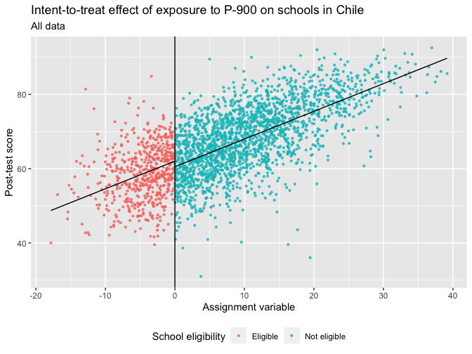
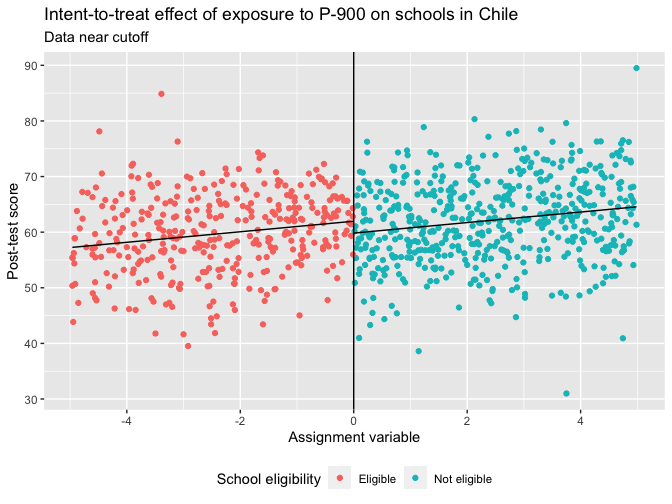
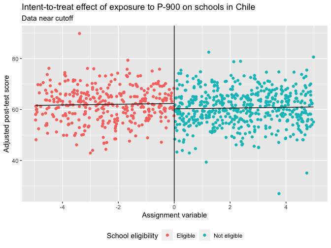
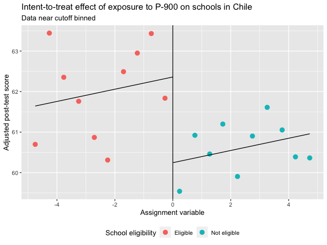

Regression and Other Stories: ChileSchools
================
Andrew Gelman, Jennifer Hill, Aki Vehtari
2021-04-20

-   [21 Additional topics in causal
    inference](#21-additional-topics-in-causal-inference)
    -   [21.3 Regression discontinuity: known assignment mechanism but
        no
        overlap](#213-regression-discontinuity-known-assignment-mechanism-but-no-overlap)
        -   [Example: The effect of an educational program on test
            scores in
            Chile](#example-the-effect-of-an-educational-program-on-test-scores-in-chile)

Tidyverse version by Bill Behrman.

Code and figures for ChileSchools example. See Chapter 21 in Regression
and Other Stories.

Data are from

-   Chay, K. Y., McEwan, P. J., and Urquiola, M. (2005). The central
    role of noise in evaluating interventions that use test scores to
    rank schools. American Economic Review 95, 1237–1258.

------------------------------------------------------------------------

``` r
# Packages
library(tidyverse)
library(rstanarm)

# Parameters
  # Seed
SEED <- 733
  # Results of educational experiment
file_chile <- here::here("ChileSchools/data/chile.csv") 
  # Common code
file_common <- here::here("_common.R")

#===============================================================================

# Run common code
source(file_common)
```

# 21 Additional topics in causal inference

## 21.3 Regression discontinuity: known assignment mechanism but no overlap

### Example: The effect of an educational program on test scores in Chile

Data

``` r
chile_all <- read_csv(file_chile)

glimpse(chile_all)
```

    #> Rows: 2,591
    #> Columns: 11
    #> $ p90        <dbl> 0, 0, 0, 0, 0, 1, 0, 1, 1, 1, 0, 0, 1, 0, 0, 1, 1, 0, 0, 0,…
    #> $ cmb_regn   <chr> "Regions 2,5,10", "Regions 6,8", "Regions 6,8", "Region 13"…
    #> $ urban88    <dbl> 1, 1, 1, 1, 1, 1, 1, 1, 1, 1, 1, 1, 1, 1, 1, 1, 1, 1, 1, 1,…
    #> $ rule2      <dbl> 3.415, 31.815, 4.445, 16.800, 0.095, -2.030, 3.600, -2.625,…
    #> $ cutoff     <dbl> 49.4, 43.4, 43.4, 46.4, 49.4, 46.4, 43.4, 49.4, 49.4, 49.4,…
    #> $ cutoff_cmb <dbl> 49.4, 43.4, 43.4, 46.4, 49.4, 46.4, 43.4, 49.4, 49.4, 49.4,…
    #> $ eligible   <dbl> 0, 0, 0, 0, 0, 1, 0, 1, 1, 1, 0, 0, 0, 0, 0, 1, 1, 0, 0, 0,…
    #> $ read92     <dbl> 57.0, 85.5, 52.0, 66.4, 52.5, 55.3, 68.0, 67.8, 57.3, 68.4,…
    #> $ read88     <dbl> 54.4, 79.1, 47.8, 65.1, 49.3, 50.5, 49.7, 48.5, 42.5, 42.4,…
    #> $ math92     <dbl> 67.1, 84.7, 53.3, 56.4, 50.9, 59.0, 64.1, 73.1, 52.3, 62.6,…
    #> $ math88     <dbl> 51.3, 71.4, 47.9, 61.3, 49.7, 38.2, 44.3, 45.0, 39.9, 42.2,…

Check consistency of `eligible` and `rule2`.

``` r
chile_all %>% 
  count(eligible, rule2 < 0, rule2 == 0, rule2 > 0)
```

    #> # A tibble: 2 x 5
    #>   eligible `rule2 < 0` `rule2 == 0` `rule2 > 0`     n
    #>      <dbl> <lgl>       <lgl>        <lgl>       <int>
    #> 1        0 FALSE       FALSE        TRUE         2019
    #> 2        1 TRUE        FALSE        FALSE         572

`eligible` accurately reflects whether `rule2` is greater than or less
than 0.

#### Basic regression discontinuity analysis

Fit linear regression on all data.

``` r
set.seed(SEED)

fit_1 <- stan_glm(read92 ~ eligible + rule2, data = chile_all, refresh = 0)

fit_1
```

    #> stan_glm
    #>  family:       gaussian [identity]
    #>  formula:      read92 ~ eligible + rule2
    #>  observations: 2591
    #>  predictors:   3
    #> ------
    #>             Median MAD_SD
    #> (Intercept) 60.5    0.3  
    #> eligible     1.5    0.5  
    #> rule2        0.7    0.0  
    #> 
    #> Auxiliary parameter(s):
    #>       Median MAD_SD
    #> sigma 7.1    0.1   
    #> 
    #> ------
    #> * For help interpreting the printed output see ?print.stanreg
    #> * For info on the priors used see ?prior_summary.stanreg

Intent-to-treat effect of exposure to P-900 on schools in Chile: All
data.

``` r
coefs <- 
  tribble(
    ~eligible, ~intercept, ~slope,
    0, coef(fit_1)[["(Intercept)"]], coef(fit_1)[["rule2"]],
    1, coef(fit_1)[["(Intercept)"]] + coef(fit_1)[["eligible"]],
      coef(fit_1)[["rule2"]]
  )

plot <- function(data, coefs, all = FALSE, binned = FALSE) {
  segments <- 
    coefs %>% 
    mutate(
      x = if_else(eligible == 1, min(data$rule2), 0),
      xend = if_else(eligible == 1, 0, max(data$rule2)),
      y = intercept + slope * x,
      yend = intercept + slope * xend
    )

  size <- if_else(binned, 3, if_else(all, 0.75, 1.5))
  alpha <- if_else(binned, 1, if_else(all, 0.75, 1))
  breaks_width <- if_else(all, 10, 2)
  
  data %>%
    ggplot(aes(rule2, read92)) +
    geom_point(aes(color = factor(eligible)), size = size, alpha = alpha) +
    geom_vline(xintercept = 0) +
    geom_segment(aes(x, y, xend = xend, yend = yend), data = segments) +
    scale_x_continuous(breaks = scales::breaks_width(breaks_width)) +
    scale_color_discrete(
      breaks = c(1, 0),
      labels = c("Eligible", "Not eligible"),
      direction = -1
    ) +
    theme(legend.position = "bottom") +
    labs(
      title = "Intent-to-treat effect of exposure to P-900 on schools in Chile",
      x = "Assignment variable",
      color = "School eligibility"
    )
}

chile_all %>% 
  plot(coefs = coefs, all = TRUE) +
  labs(
    subtitle = "All data",
    y = "Post-test score"
  )
```



Data near cutoff.

``` r
chile_5 <- 
  chile_all %>% 
  filter(abs(rule2) <= 5)
```

Fit linear regression on data near cutoff.

``` r
set.seed(SEED)

fit_2 <- stan_glm(read92 ~ eligible + rule2, data = chile_5, refresh = 0)

fit_2
```

    #> stan_glm
    #>  family:       gaussian [identity]
    #>  formula:      read92 ~ eligible + rule2
    #>  observations: 883
    #>  predictors:   3
    #> ------
    #>             Median MAD_SD
    #> (Intercept) 59.8    0.5  
    #> eligible     2.1    1.0  
    #> rule2        0.9    0.2  
    #> 
    #> Auxiliary parameter(s):
    #>       Median MAD_SD
    #> sigma 7.3    0.2   
    #> 
    #> ------
    #> * For help interpreting the printed output see ?print.stanreg
    #> * For info on the priors used see ?prior_summary.stanreg

Intent-to-treat effect of exposure to P-900 on schools in Chile: Data
near cutoff.

``` r
coefs <- 
  tribble(
    ~eligible, ~intercept, ~slope,
    0, coef(fit_2)[["(Intercept)"]], coef(fit_2)[["rule2"]],
    1, coef(fit_2)[["(Intercept)"]] + coef(fit_2)[["eligible"]],
      coef(fit_2)[["rule2"]]
  )

chile_5 %>% 
  plot(coefs = coefs) +
  labs(
    subtitle = "Data near cutoff",
    y = "Post-test score"
  )
```



#### Including other pre-treatment variables as regression predictors

Fit linear regression on data near cutoff, including pre-treatment
variables.

``` r
set.seed(SEED)

fit_3 <- 
  stan_glm(
    read92 ~ eligible + rule2 + read88 + math88,
    data = chile_5,
    refresh = 0
  )

fit_3
```

    #> stan_glm
    #>  family:       gaussian [identity]
    #>  formula:      read92 ~ eligible + rule2 + read88 + math88
    #>  observations: 883
    #>  predictors:   5
    #> ------
    #>             Median MAD_SD
    #> (Intercept) 23.4    4.4  
    #> eligible     2.1    0.9  
    #> rule2        0.2    0.2  
    #> read88       0.6    0.1  
    #> math88       0.2    0.1  
    #> 
    #> Auxiliary parameter(s):
    #>       Median MAD_SD
    #> sigma 6.9    0.2   
    #> 
    #> ------
    #> * For help interpreting the printed output see ?print.stanreg
    #> * For info on the priors used see ?prior_summary.stanreg

Intent-to-treat effect of exposure to P-900 on schools in Chile: Data
near cutoff.

``` r
v <- 
  chile_5 %>% 
  mutate(
    read92 = 
      read92 - coef(fit_3)[["read88"]] * (read88 - mean(read88)) -
      coef(fit_3)[["math88"]] * (math88 - mean(math88))
  )

intercept_0 <- 
  coef(fit_3)[["(Intercept)"]] + 
  coef(fit_3)[["read88"]] * mean(chile_5$read88) +
  coef(fit_3)[["math88"]] * mean(chile_5$math88)

coefs <- 
  tribble(
    ~eligible, ~intercept, ~slope,
    0, intercept_0, coef(fit_3)[["rule2"]],
    1, intercept_0 + coef(fit_3)[["eligible"]], coef(fit_3)[["rule2"]]
  )

v %>% 
  plot(coefs = coefs) +
  labs(
    subtitle = "Data near cutoff",
    y = "Adjusted post-test score"
  )
```



Intent-to-treat effect of exposure to P-900 on schools in Chile: Data
near cutoff binned

``` r
n_bins <- 20

v <- 
  chile_5 %>% 
  mutate(
    read92 = 
      read92 - coef(fit_3)[["read88"]] * (read88 - mean(read88)) -
      coef(fit_3)[["math88"]] * (math88 - mean(math88)),
    bin = 
      cut(
        rule2,
        breaks = seq(-5, 5, length.out = n_bins + 1),
        include.lowest = TRUE
      )
  ) %>% 
  group_by(bin) %>% 
  summarize(
    eligible = as.double(min(rule2) < 0),
    rule2 = mean(rule2),
    read92 = mean(read92)
  )

v %>% 
  plot(coefs = coefs, binned = TRUE) +
  labs(
    subtitle = "Data near cutoff binned",
    y = "Adjusted post-test score"
  )
```



This plot is different from the one in the book. The adjustment above
only uses the data near the cutoff that is used in the model. The plot
in the book adjusts using all data.

#### Including interactions

Center and scale `read88` and `math88`.

``` r
chile_5 <- 
  chile_5 %>% 
  mutate(
    read88_z = scale(read88) %>% as.double(),
    math88_z = scale(math88) %>% as.double()
  )
```

Fit linear regression with interaction.

``` r
set.seed(SEED)

fit_4 <- 
  stan_glm(
    read92 ~ eligible + rule2 + read88_z + math88_z + eligible:read88_z,
    data = chile_5,
    refresh = 0
  )

fit_4
```

    #> stan_glm
    #>  family:       gaussian [identity]
    #>  formula:      read92 ~ eligible + rule2 + read88_z + math88_z + eligible:read88_z
    #>  observations: 883
    #>  predictors:   6
    #> ------
    #>                   Median MAD_SD
    #> (Intercept)       60.2    0.5  
    #> eligible           2.0    0.9  
    #> rule2              0.1    0.2  
    #> read88_z           2.8    0.4  
    #> math88_z           0.6    0.3  
    #> eligible:read88_z -0.3    0.6  
    #> 
    #> Auxiliary parameter(s):
    #>       Median MAD_SD
    #> sigma 6.9    0.2   
    #> 
    #> ------
    #> * For help interpreting the printed output see ?print.stanreg
    #> * For info on the priors used see ?prior_summary.stanreg

The results are again different from those in the book, since we have
centered and scaled only using the data near the cutoff that is used in
the model.

In this case, the available data are clearly too noisy to estimate this
interaction.

#### Regression fit to all the data

Fit linear regression on all data, including pre-treatment variables.

``` r
set.seed(SEED)

fit_5 <- 
  stan_glm(
    read92 ~ eligible + rule2 + read88 + math88,
    data = chile_all,
    refresh = 0
  )

fit_5
```

    #> stan_glm
    #>  family:       gaussian [identity]
    #>  formula:      read92 ~ eligible + rule2 + read88 + math88
    #>  observations: 2591
    #>  predictors:   5
    #> ------
    #>             Median MAD_SD
    #> (Intercept) 21.6    2.3  
    #> eligible     1.9    0.4  
    #> rule2        0.0    0.1  
    #> read88       0.7    0.0  
    #> math88       0.1    0.0  
    #> 
    #> Auxiliary parameter(s):
    #>       Median MAD_SD
    #> sigma 6.7    0.1   
    #> 
    #> ------
    #> * For help interpreting the printed output see ?print.stanreg
    #> * For info on the priors used see ?prior_summary.stanreg
