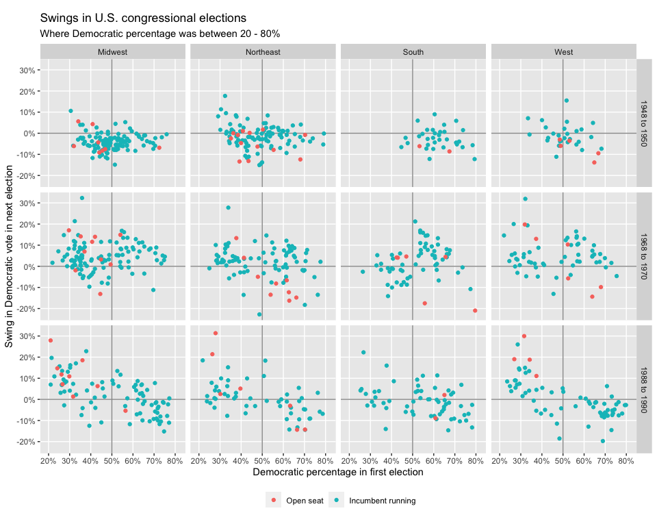

Regression and Other Stories: Congress
================
Andrew Gelman, Jennifer Hill, Aki Vehtari
2021-04-20

-   [2 Data and measurement](#2-data-and-measurement)
    -   [2.3 All graphs are comparisons](#23-all-graphs-are-comparisons)
        -   [Grids of plots](#grids-of-plots)

Tidyverse version by Bill Behrman.

Predictive uncertainty for congressional elections. See Chapter 2 in
Regression and Other Stories.

------------------------------------------------------------------------

``` r
# Packages
library(tidyverse)

# Parameters
  # Directory with congressional election data
dir_elections <- here::here("Congress/data")
  # Data variables
elections_rename <- 
  c(
    state_code = "X1",
    district_code = "X2",
    incumbent = "X3",
    d_vote = "X4",
    r_vote = "X5"
  )
  # Regions
regions <- c("Northeast", "Midwest", "South", "West")
  # Common code
file_common <- here::here("_common.R")
  
#===============================================================================

# Run common code
source(file_common)
```

# 2 Data and measurement

## 2.3 All graphs are comparisons

### Grids of plots

Data

``` r
elections <- 
  fs::dir_ls(path = dir_elections, regexp = "\\d{4}.asc$") %>% 
  map_dfr(~ read_table2(., col_names = FALSE), .id = "year") %>% 
  rename(!!! elections_rename) %>% 
  mutate(
    year = str_match(year, "(\\d{4}).asc$")[, 2] %>% as.integer(),
    across(!year, na_if, -9),
    incumbent =
      case_when(
        incumbent %in% c(-1, 1) ~ TRUE,
        incumbent == 0 ~ FALSE,
        TRUE ~ NA
      )
  )
```

``` r
elections %>% 
  count(is.na(d_vote), is.na(r_vote))
```

    #> # A tibble: 4 x 3
    #>   `is.na(d_vote)` `is.na(r_vote)`     n
    #>   <lgl>           <lgl>           <int>
    #> 1 FALSE           FALSE           19984
    #> 2 FALSE           TRUE               37
    #> 3 TRUE            FALSE             111
    #> 4 TRUE            TRUE             1179

We’ll omit races with `NA`s for votes.

``` r
elections <- 
  elections %>% 
  drop_na(d_vote, r_vote)
```

``` r
range(elections$state_code)
```

    #> [1]  1 82

``` r
elections %>% 
  count(state_code) %>% 
  slice_max(order_by = state_code, n = 5)
```

    #> # A tibble: 5 x 2
    #>   state_code     n
    #>        <dbl> <int>
    #> 1         82    25
    #> 2         81    18
    #> 3         73   268
    #> 4         72   167
    #> 5         71  1030

The formula in the original code to assign regions is
`floor(state_code / 20) + 1`. Since there are only four regions, we will
omit rows with `state_code` 81 and 82, for which the formula would yield
5.

``` r
elections <- 
  elections %>% 
  filter(!state_code %in% 81:82) %>% 
  mutate(region = regions[floor(state_code / 20) + 1])
```

Finally, we’ll calculate the Democratic proportion of the vote for the
current and previous election.

``` r
elections <- 
  elections %>% 
  mutate(d_prop = d_vote / (d_vote + r_vote))

elections <- 
  sort(unique(elections$year))[-1] %>% 
  map_dfr(
    ~ elections %>% 
      filter(year == .x) %>% 
      inner_join(
        elections %>% 
          filter(year == .x - 2) %>% 
          select(state_code, district_code, d_prop_prev = d_prop),
        by = c("state_code", "district_code")
      )
  )

elections %>% 
  slice(1:10) %>% 
  knitr::kable()
```

| year | state\_code | district\_code | incumbent | d\_vote | r\_vote | region    | d\_prop | d\_prop\_prev |
|-----:|------------:|---------------:|:----------|--------:|--------:|:----------|--------:|--------------:|
| 1898 |           1 |              1 | TRUE      |   13520 |   18818 | Northeast |   0.418 |         0.282 |
| 1898 |           1 |              2 | TRUE      |   23556 |   27004 | Northeast |   0.466 |         0.383 |
| 1898 |           1 |              3 | TRUE      |    8507 |   12218 | Northeast |   0.410 |         0.334 |
| 1898 |           1 |              4 | TRUE      |   17754 |   23707 | Northeast |   0.428 |         0.339 |
| 1898 |           2 |              1 | TRUE      |    9072 |   14598 | Northeast |   0.383 |         0.313 |
| 1898 |           2 |              2 | TRUE      |    8126 |   15149 | Northeast |   0.349 |         0.273 |
| 1898 |           2 |              3 | TRUE      |    6634 |   12854 | Northeast |   0.340 |         0.277 |
| 1898 |           2 |              4 | TRUE      |    5534 |   12380 | Northeast |   0.309 |         0.301 |
| 1898 |           3 |              1 | TRUE      |    8760 |   14315 | Northeast |   0.380 |         0.322 |
| 1898 |           3 |              2 | TRUE      |    8054 |   13327 | Northeast |   0.377 |         0.282 |

Swings in U.S. congressional elections.

``` r
v <- 
  elections %>% 
  filter(
    year %in% c(1950, 1970, 1990),
    !is.na(incumbent),
    abs(d_prop - 0.5) < 0.3 & abs(d_prop_prev - 0.5) < 0.3
  ) %>% 
  mutate(period = str_glue("{year - 2} to {year}")) %>% 
  {
    bind_rows(
      filter(., incumbent),
      filter(., !incumbent)
    )
  }

v %>% 
  ggplot() +
  geom_vline(xintercept = 0.5, color = "grey60") +
  geom_hline(yintercept = 0, color = "grey60") +
  geom_point(aes(d_prop_prev, d_prop - d_prop_prev, color = incumbent)) +
  facet_grid(rows = vars(period), cols = vars(region)) +
  coord_fixed() +
  scale_x_continuous(
    breaks = scales::breaks_width(0.1),
    minor_breaks = NULL,
    labels = scales::label_percent(accuracy = 1),
    expand = expansion(add = 0.05)
  ) +
  scale_y_continuous(
    breaks = scales::breaks_width(0.1),
    minor_breaks = NULL,
    labels = scales::label_percent(accuracy = 1)
  ) +
  scale_color_discrete(
    breaks = c(FALSE, TRUE),
    labels = c("Open seat", "Incumbent running")
  ) +
  theme(legend.position = "bottom") +
  labs(
    title = "Swings in U.S. congressional elections",
    subtitle = "Where Democratic percentage was between 20 - 80%",
    x = "Democratic percentage in first election",
    y = "Swing in Democratic vote in next election",
    color = NULL
  )
```


