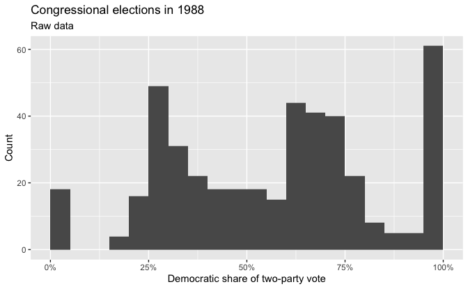
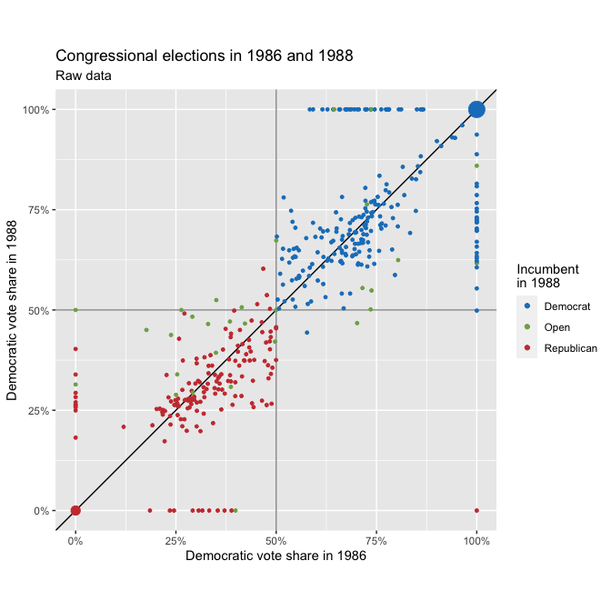
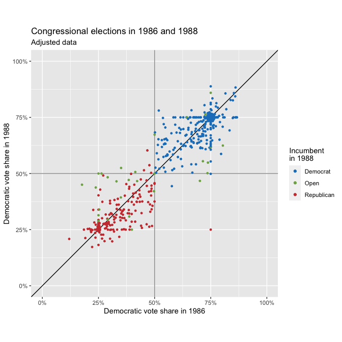
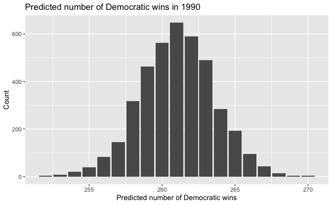

Regression and Other Stories: Congress
================
Andrew Gelman, Jennifer Hill, Aki Vehtari
2021-04-20

-   [10 Linear regression with multiple
    predicators](#10-linear-regression-with-multiple-predicators)
    -   [10.6 Example: uncertainty in predicting congressional
        elections](#106-example-uncertainty-in-predicting-congressional-elections)
        -   [Background](#background)
        -   [Data issues](#data-issues)
        -   [Fitting the model](#fitting-the-model)
        -   [Simulation for inferences and predictions of new data
            points](#simulation-for-inferences-and-predictions-of-new-data-points)
        -   [Predictive simulation for a nonlinear function of new
            data](#predictive-simulation-for-a-nonlinear-function-of-new-data)

Tidyverse version by Bill Behrman.

Predictive uncertainty for congressional elections. See Chapter 10 in
Regression and Other Stories.

------------------------------------------------------------------------

``` r
# Packages
library(tidyverse)
library(rstanarm)

# Parameters
  # Congressional election data
file_congress <- here::here("Congress/data/congress.csv")
  # Party colors
party_colors <- 
  c(
    "Democrat"   = "#1a80c4",
    "Republican" = "#cc3d3d",
    "Open"       = "#7ead53"
  )
  # Common code
file_common <- here::here("_common.R")

#===============================================================================

# Run common code
source(file_common)
```

# 10 Linear regression with multiple predicators

## 10.6 Example: uncertainty in predicting congressional elections

### Background

Data

``` r
congress <- 
  file_congress %>% 
  read_csv() %>% 
  mutate(
    across(
      starts_with("inc"),
      ~ case_when(
        . == -1 ~ "Republican",
        . ==  0 ~ "Open",
        . ==  1 ~ "Democrat",
        TRUE ~ NA_character_
      )
    )
  )

congress
```

    #> # A tibble: 435 x 9
    #>    inc86      inc88      inc90        v86   v88   v90 v86_adj v88_adj v90_adj
    #>    <chr>      <chr>      <chr>      <dbl> <dbl> <dbl>   <dbl>   <dbl>   <dbl>
    #>  1 Democrat   Democrat   Democrat   0.745 0.772 0.714   0.745   0.772   0.714
    #>  2 Democrat   Democrat   Democrat   0.674 0.636 0.597   0.674   0.636   0.597
    #>  3 Democrat   Democrat   Open       0.696 0.665 0.521   0.696   0.665   0.521
    #>  4 Republican Republican Republican 0.465 0.274 0.234   0.465   0.274   0.234
    #>  5 Republican Republican Open       0.391 0.264 0.477   0.391   0.264   0.477
    #>  6 Republican Republican Republican 0.358 0.334 0.256   0.358   0.334   0.256
    #>  7 Open       Democrat   Open       0.549 0.632 0.602   0.549   0.632   0.602
    #>  8 Republican Republican Republican 0.227 0.338 0.490   0.227   0.338   0.490
    #>  9 Republican Republican Republican 0.222 0.173 0.224   0.222   0.173   0.224
    #> 10 Democrat   Democrat   Democrat   0.659 1     1       0.659   0.75    0.75 
    #> # … with 425 more rows

The `inc*` variables represent whether an incumbent is running for
reelection and, if so, their party.

The `*_adj` variables represent adjustments to account for uncontested
elections. If `vx` is 0, then `vx_adj` is 0.25. If `vx` is greater than
0.9, then `vx_adj` is 0.75.

Congressional elections in 1988: Raw data.

``` r
congress %>% 
  ggplot(aes(v88)) +
  geom_histogram(binwidth = 0.05, boundary = 0) +
  scale_x_continuous(labels = scales::label_percent(accuracy = 1)) +
  labs(
    title = "Congressional elections in 1988",
    subtitle = "Raw data",
    x = "Democratic share of two-party vote",
    y = "Count"
  )
```



Congressional elections in 1986 and 1988: Raw data.

``` r
set.seed(616)

congress %>% 
  {
    bind_rows(
      filter(., inc88 != "Open"),
      filter(., inc88 == "Open")
    )
  } %>% 
  ggplot(aes(v86, v88, color = inc88)) +
  geom_hline(yintercept = 0.5, color = "grey60") +
  geom_vline(xintercept = 0.5, color = "grey60") +
  geom_abline(slope = 1, intercept = 0) +
  geom_count() +
  coord_fixed() +
  scale_x_continuous(labels = scales::label_percent(accuracy = 1)) +
  scale_y_continuous(labels = scales::label_percent(accuracy = 1)) +
  scale_color_manual(values = party_colors) +
  guides(size = "none") +
  labs(
    title = "Congressional elections in 1986 and 1988",
    subtitle = "Raw data",
    x = "Democratic vote share in 1986",
    y = "Democratic vote share in 1988",
    color = "Incumbent\nin 1988"
  )
```



### Data issues

Congressional elections in 1986 and 1988: Adjusted data.

``` r
set.seed(616)

congress %>% 
  {
    bind_rows(
      filter(., inc88 != "Open"),
      filter(., inc88 == "Open")
    )
  } %>% 
  ggplot(aes(v86_adj, v88_adj, color = inc88)) +
  geom_hline(yintercept = 0.5, color = "grey60") +
  geom_vline(xintercept = 0.5, color = "grey60") +
  geom_abline(slope = 1, intercept = 0) +
  geom_count() +
  coord_fixed(xlim = 0:1, ylim = 0:1) +
  scale_x_continuous(labels = scales::label_percent(accuracy = 1)) +
  scale_y_continuous(labels = scales::label_percent(accuracy = 1)) +
  scale_color_manual(values = party_colors) +
  guides(size = "none") +
  labs(
    title = "Congressional elections in 1986 and 1988",
    subtitle = "Adjusted data",
    x = "Democratic vote share in 1986",
    y = "Democratic vote share in 1988",
    color = "Incumbent\nin 1988"
  )
```



### Fitting the model

Linear regression to predict `vote` (the Democratic share of the
two-party vote in each district), given `past_vote` (the Democrats’
share in the previous election) and `incumbent` (incumbency of seat).

``` r
set.seed(905)

data_88 <-  
  congress %>% 
  transmute(
    vote = v88_adj,
    vote_prev = v86_adj,
    incumbent = inc88
  )

fit_88 <- stan_glm(vote ~ vote_prev + incumbent, data = data_88, refresh = 0)

print(fit_88, digits = 2)
```

    #> stan_glm
    #>  family:       gaussian [identity]
    #>  formula:      vote ~ vote_prev + incumbent
    #>  observations: 435
    #>  predictors:   4
    #> ------
    #>                     Median MAD_SD
    #> (Intercept)          0.33   0.02 
    #> vote_prev            0.53   0.03 
    #> incumbentOpen       -0.08   0.02 
    #> incumbentRepublican -0.19   0.01 
    #> 
    #> Auxiliary parameter(s):
    #>       Median MAD_SD
    #> sigma 0.07   0.00  
    #> 
    #> ------
    #> * For help interpreting the printed output see ?print.stanreg
    #> * For info on the priors used see ?prior_summary.stanreg

### Simulation for inferences and predictions of new data points

Running `stan_glm()` produces a set of simulation draws expressing
uncertainty in the parameters in the fitted model. We can access these
simulations by extracting them from the fitted model object:

``` r
sims_88 <- as_tibble(fit_88)

nrow(sims_88)
```

    #> [1] 4000

We can use these simulations, along with data from 1988 and incumbency
information in 1990, to predict the district-by-district election
outcome in 1990. We start by creating a new tibble of predictors:

``` r
data_90 <-  
  congress %>% 
  transmute(
    vote_prev = v88_adj,
    incumbent = inc90
  )

nrow(data_90)
```

    #> [1] 435

We then simulate predictive simulations of new outcomes:

``` r
set.seed(620)

pred_90 <- 
  posterior_predict(fit_88, newdata = data_90) %>% 
  as_tibble()

dim(pred_90)
```

    #> [1] 4000  435

The resulting tibble has 4000 rows, one for each simulation, and 435
columns, one for each predicted congressional district.

### Predictive simulation for a nonlinear function of new data

For the congressional elections example, to perform inference on the
predicted number of elections won by the Democrats in 1990, we sum over
the rows of the tibble:

``` r
pred_90_dems <- 
  pred_90 %>% 
  mutate(across(everything(), ~ . > 0.5)) %>% 
  rowwise() %>% 
  mutate(pred_dems = sum(c_across(everything()))) %>% 
  pull(pred_dems)
```

Predicted number of Democratic wins in 1990.

``` r
tibble(pred_90_dems = pred_90_dems) %>% 
  ggplot(aes(pred_90_dems)) +
  geom_bar() +
  labs(
    title = "Predicted number of Democratic wins in 1990",
    x = "Predicted number of Democratic wins",
    y = "Count"
  )
```



``` r
cat(
  str_glue(
    "The mean predicted number of Democratic wins in 1990 is ",
    "{format(mean(pred_90_dems), digits = 1, nsmall = 1)} with a standard ",
    "deviation of {format(sd(pred_90_dems), digits = 1, nsmall = 1)}."
  )
)
```

    The mean predicted number of Democratic wins in 1990 is 261.0 with a standard deviation of 2.5.

The actual number of Democratic wins in 1990 was 267.

``` r
actual_90_dems <- 267

z <- (actual_90_dems - mean(pred_90_dems)) / sd(pred_90_dems)
z
```

    #> [1] 2.34

This was 2.34 standard deviations from the predicted number of wins.
