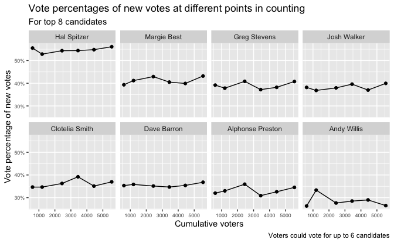
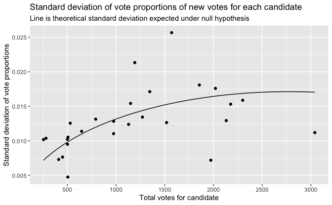

Regression and Other Stories: Coop
================
Andrew Gelman, Jennifer Hill, Aki Vehtari
2021-04-20

-   [4 Statistical inference](#4-statistical-inference)
    -   [4.6 Example of hypothesis testing: 55,000 residents need your
        help!](#46-example-of-hypothesis-testing-55000-residents-need-your-help)

Tidyverse version by Bill Behrman.

Coop - Example of hypothesis testing. See Chapter 4 in Regression and
Other Stories.

------------------------------------------------------------------------

``` r
# Packages
library(tidyverse)

# Parameters
  # Votes in an election
file_votes <- here::here("Coop/data/Riverbay.csv")
  # Common code
file_common <- here::here("_common.R")

#===============================================================================

# Run common code
source(file_common)
```

# 4 Statistical inference

## 4.6 Example of hypothesis testing: 55,000 residents need your help!

Data

``` r
votes <- 
  file_votes %>% 
  read_csv(
    col_names = 
      c("name_1", "600", "1200", "2444", "3444", "4444", "5553", "name_2")
  ) %>% 
  pivot_longer(
    cols = !starts_with("name"),
    names_to = "voters",
    names_transform = list(voters = as.double),
    values_to = "votes"
  ) %>% 
  group_by(name_1) %>% 
  mutate(
    vote_prop_cum = votes / voters,
    vote_prop_new = 
      (votes - lag(votes, default = 0, order_by = voters)) / 
      (voters - lag(voters, default = 0, order_by = voters))
  ) %>% 
  ungroup()

votes
```

    #> # A tibble: 162 x 6
    #>    name_1        name_2         voters votes vote_prop_cum vote_prop_new
    #>    <chr>         <chr>           <dbl> <dbl>         <dbl>         <dbl>
    #>  1 Othelia Jones Clotelia Smith    600   208        0.347         0.347 
    #>  2 Othelia Jones Clotelia Smith   1200   416        0.347         0.347 
    #>  3 Othelia Jones Clotelia Smith   2444   867        0.355         0.363 
    #>  4 Othelia Jones Clotelia Smith   3444  1259        0.366         0.392 
    #>  5 Othelia Jones Clotelia Smith   4444  1610        0.362         0.351 
    #>  6 Othelia Jones Clotelia Smith   5553  2020        0.364         0.370 
    #>  7 Roger Toppin  Earl Coppin       600    55        0.0917        0.0917
    #>  8 Roger Toppin  Earl Coppin      1200   106        0.0883        0.085 
    #>  9 Roger Toppin  Earl Coppin      2444   215        0.0880        0.0876
    #> 10 Roger Toppin  Earl Coppin      3444   313        0.0909        0.098 
    #> # … with 152 more rows

Candidates who received the most votes.

``` r
voters <- 
  votes %>% 
  pull(voters) %>% 
  unique() %>% 
  sort()
voters_total <- max(voters)

votes %>% 
  filter(voters == voters_total) %>% 
  select(starts_with("name"), votes) %>% 
  arrange(desc(votes))
```

    #> # A tibble: 27 x 3
    #>    name_1          name_2           votes
    #>    <chr>           <chr>            <dbl>
    #>  1 Al Shapiro      Hal Spitzer       3040
    #>  2 Marie Heath     Margie Best       2300
    #>  3 Craig Williams  Greg Stevens      2176
    #>  4 Saul Weber      Josh Walker       2131
    #>  5 Othelia Jones   Clotelia Smith    2020
    #>  6 Tom Barrett     Dave Barron       1973
    #>  7 Alonzo Newton   Alphonse Preston  1855
    #>  8 Tony Illis      Andy Willis       1571
    #>  9 Alan Berger     <NA>              1519
    #> 10 Ruben Berkowitz <NA>              1346
    #> # … with 17 more rows

Top 8 candidates.

``` r
candidates_top_8 <- 
  votes %>% 
  filter(voters == voters_total) %>% 
  slice_max(order_by = votes, n = 8) %>% 
  pull(name_2)
```

Cumulative vote percentages at different points in counting.

``` r
votes_top_8 <- 
  votes %>% 
  filter(name_2 %in% candidates_top_8) %>% 
  mutate(name = ordered(name_2, levels = candidates_top_8))

votes_top_8 %>% 
  ggplot(aes(voters, vote_prop_cum)) +
  geom_line() +
  geom_point() +
  scale_y_continuous(labels = scales::label_percent(accuracy = 1)) +
  facet_wrap(facets = vars(name), ncol = 4) +
  theme(axis.text = element_text(size = rel(0.6))) +
  labs(
    title = "Cumulative vote percentages at different points in counting",
    subtitle = "For top 8 candidates",
    x = "Cumulative voters",
    y = "Cumulative vote percentage",
    caption = "Voters could vote for up to 6 candidates"
  )
```


Vote percentages of new votes at different points in counting.

``` r
votes_top_8 %>% 
  ggplot(aes(voters, vote_prop_new)) +
  geom_line() +
  geom_point() +
  scale_y_continuous(labels = scales::label_percent(accuracy = 1)) +
  facet_wrap(facets = vars(name), ncol = 4) +
  theme(axis.text = element_text(size = rel(0.6))) +
  labs(
    title = "Vote percentages of new votes at different points in counting",
    subtitle = "For top 8 candidates",
    x = "Cumulative voters",
    y = "Vote percentage of new votes",
    caption = "Voters could vote for up to 6 candidates"
  )
```



Standard deviation of vote proportions of new votes for each candidate.

``` r
v <- 
  votes %>% 
  group_by(name_1) %>% 
  summarize(
    votes_final = votes[voters == voters_total],
    vote_prop_new_sd = sd(vote_prop_new),
  )

voters_new <- voters - lag(voters, default = 0)
vote_prop_new_sd_expected <- 
  tibble(
    votes_final = seq_range(c(min(v$votes_final), max(v$votes_final))),
    vote_prop_final = votes_final / voters_total,
    vote_prop_new_sd = 
      map_dbl(vote_prop_final, ~ sqrt(mean(. * (1 - .) / voters_new)))
  )

ggplot(mapping = aes(votes_final, vote_prop_new_sd)) +
  geom_line(data = vote_prop_new_sd_expected) +
  geom_point(data = v) +
  scale_x_continuous(breaks = scales::breaks_width(500)) +
  labs(
    title = 
      "Standard deviation of vote proportions of new votes for each candidate",
    subtitle = 
      "Line is theoretical standard deviation expected under null hypothesis",
    x = "Total votes for candidate",
    y = "Standard deviation of vote proportions"
  )
```


