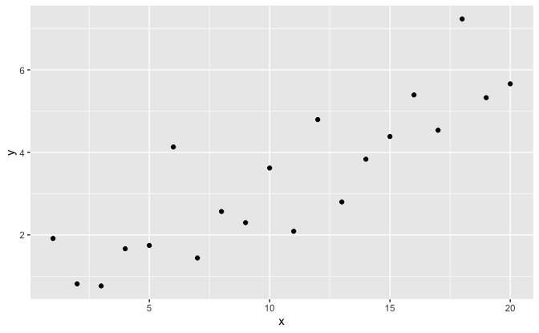
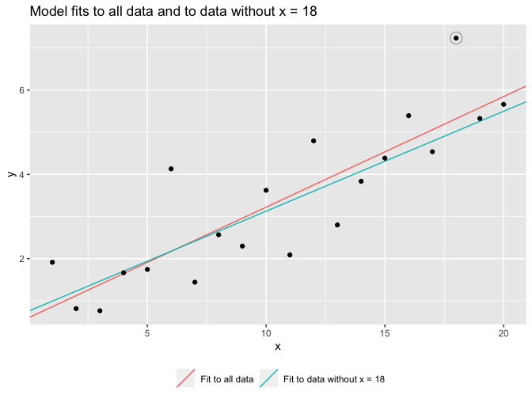
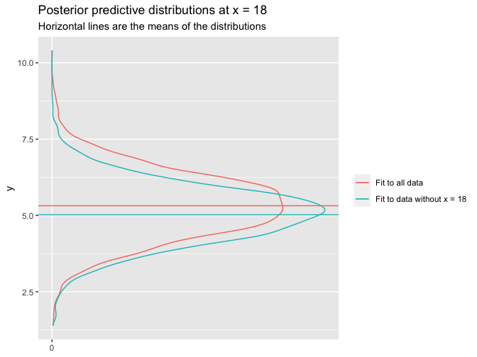
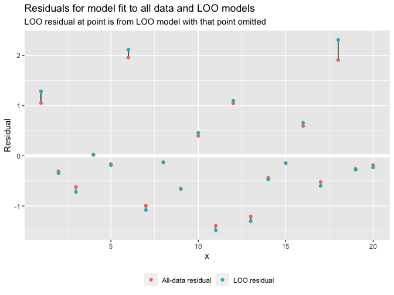
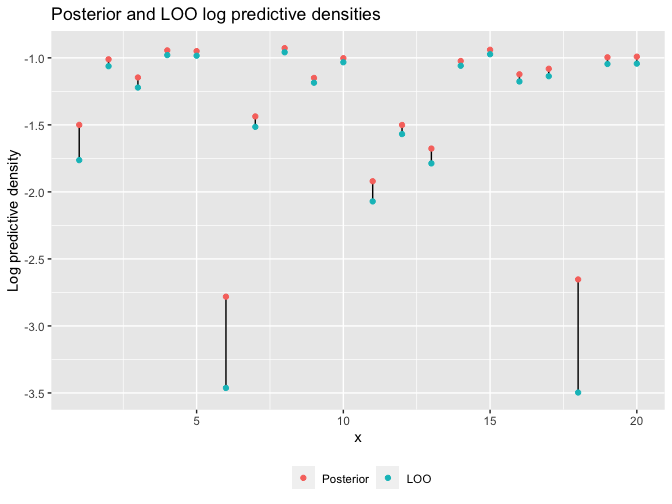

Regression and Other Stories: Cross-validation
================
Andrew Gelman, Jennifer Hill, Aki Vehtari
2021-04-20

-   [11 Assumptions, diagnostics, and model
    evaluation](#11-assumptions-diagnostics-and-model-evaluation)
    -   [11.8 Cross validation](#118-cross-validation)
        -   [Leave-one-out cross
            validation](#leave-one-out-cross-validation)
        -   [Summarizing prediction error using the log score and
            deviance](#summarizing-prediction-error-using-the-log-score-and-deviance)
        -   [Demonstration of adding pure noise predictors to a
            model](#demonstration-of-adding-pure-noise-predictors-to-a-model)

Tidyverse version by Bill Behrman.

Introduction to cross-validation for linear regression. See Chapter 11
in Regression and Other Stories.

------------------------------------------------------------------------

``` r
# Packages
library(tidyverse)
library(rstanarm)

# Parameters
  # Seed
SEED <- 2141
  # Kid test score data
file_kids <- here::here("KidIQ/data/kidiq.csv")
  # Common code
file_common <- here::here("_common.R")

#===============================================================================

# Run common code
source(file_common)
```

# 11 Assumptions, diagnostics, and model evaluation

## 11.8 Cross validation

### Leave-one-out cross validation

Data

``` r
set.seed(SEED)

n <- 20
a <- 0.2
b <- 0.3
sigma <- 1

data <- 
  tibble(
    x = seq_len(n),
    y = a + b * x + rnorm(n, mean = 0, sd = sigma)
  )
```

``` r
data %>% 
  ggplot(aes(x, y)) + 
  geom_point()
```



Fit linear model on all data.

``` r
fit_all <- stan_glm(y ~ x, data = data, refresh = 0, seed = SEED)

fit_all
```

    #> stan_glm
    #>  family:       gaussian [identity]
    #>  formula:      y ~ x
    #>  observations: 20
    #>  predictors:   2
    #> ------
    #>             Median MAD_SD
    #> (Intercept) 0.6    0.5   
    #> x           0.3    0.0   
    #> 
    #> Auxiliary parameter(s):
    #>       Median MAD_SD
    #> sigma 1.0    0.2   
    #> 
    #> ------
    #> * For help interpreting the printed output see ?print.stanreg
    #> * For info on the priors used see ?prior_summary.stanreg

Fit linear model to data without x = 18.

``` r
fit_m18 <- 
  stan_glm(y ~ x, data = data %>% filter(x != 18), refresh = 0, seed = SEED)

fit_m18
```

    #> stan_glm
    #>  family:       gaussian [identity]
    #>  formula:      y ~ x
    #>  observations: 19
    #>  predictors:   2
    #> ------
    #>             Median MAD_SD
    #> (Intercept) 0.8    0.4   
    #> x           0.2    0.0   
    #> 
    #> Auxiliary parameter(s):
    #>       Median MAD_SD
    #> sigma 0.9    0.1   
    #> 
    #> ------
    #> * For help interpreting the printed output see ?print.stanreg
    #> * For info on the priors used see ?prior_summary.stanreg

"Model fits to all data and to data without x = 18.

``` r
lines <- 
  tribble(
    ~intercept, ~slope, ~label,
    coef(fit_all)[["(Intercept)"]], coef(fit_all)[["x"]], "Fit to all data",
    coef(fit_m18)[["(Intercept)"]], coef(fit_m18)[["x"]],
      "Fit to data without x = 18"
  )

data %>% 
  ggplot(aes(x, y)) +
  geom_abline(
    aes(slope = slope, intercept = intercept, color = label),
    data = lines
  ) + 
  geom_point(
    data = data %>% filter(x == 18),
    color = "grey60",
    shape = "circle open",
    size = 5
  ) +
  geom_point() +
  theme(legend.position = "bottom") +
  labs(
    title = "Model fits to all data and to data without x = 18",
    color = NULL
  )
```



Posterior predictive distribution at x = 18 for model fit to all data.

``` r
set.seed(SEED)

new <- tibble(x = 18)

post_pred_all <- posterior_predict(fit_all, newdata = new)
```

Posterior predictive distribution at x = 18 for model fit to data
without x = 18.

``` r
set.seed(SEED)

post_pred_m18 <- posterior_predict(fit_m18, newdata = new)
```

Posterior predictive distributions at x = 18.

``` r
preds <- 
  tribble(
    ~y, ~label,
    predict(fit_all, newdata = new), "Fit to all data",
    predict(fit_m18, newdata = new), "Fit to data without x = 18"
  )

v <- 
  bind_rows(
    tibble(
      y = as.double(post_pred_all),
      label = "Fit to all data"
    ),
    tibble(
      y = as.double(post_pred_m18),
      label = "Fit to data without x = 18"
    )
  )

v %>% 
  ggplot(aes(y = y, color = label)) +
  stat_density(geom = "line", position = "identity") +
  geom_hline(aes(yintercept = y, color = label), data = preds) +
  scale_x_continuous(breaks = 0) +
  labs(
    title = "Posterior predictive distributions at x = 18",
    subtitle = "Horizontal lines are the means of the distributions",
    x = NULL,
    color = NULL
  )
```



Compute posterior and LOO residuals.

``` r
resid_all <- residuals(fit_all)
resid_loo <- data$y - loo_predict(fit_all)$value
```

Residuals for model fit to all data and LOO models.

``` r
v <- 
  bind_rows(
    tibble(x = data$x, y = resid_all, color = "all"),
    tibble(x = data$x, y = resid_loo, color = "loo")
  )

v_wide <- 
  v %>% 
  pivot_wider(names_from = color, values_from = y)

v %>% 
  ggplot(aes(x, y)) +
  geom_hline(yintercept = 0, color = "white", size = 2) +
  geom_segment(aes(xend = x, y = all, yend = loo), data = v_wide) +
  geom_point(aes(color = color)) +
  scale_color_discrete(
    breaks = c("all", "loo"),
    labels = c("All-data residual", "LOO residual")
  ) +
  theme(legend.position = "bottom") +
  labs(
    title = "Residuals for model fit to all data and LOO models",
    subtitle = 
      "LOO residual at point is from LOO model with that point omitted",
    y = "Residual",
    color = NULL
  )
```



### Summarizing prediction error using the log score and deviance

Posterior pointwise log-likelihood matrix.

``` r
log_lik_post <- log_lik(fit_all)
```

Posterior log predictive densities.

``` r
lpd_post <- matrixStats::colLogSumExps(log_lik_post) - log(nrow(log_lik_post))
```

LOO log predictive densities.

``` r
lpd_loo <- loo(fit_all)$pointwise[, "elpd_loo"]
```

Posterior and LOO log predictive densities.

``` r
v <- 
  bind_rows(
    tibble(x = data$x, y = lpd_post, color = "post"),
    tibble(x = data$x, y = lpd_loo, color = "loo")
  )

v_wide <- 
  v %>% 
  pivot_wider(names_from = color, values_from = y)

v %>% 
  ggplot(aes(x, y)) +
  geom_segment(aes(xend = x, y = post, yend = loo), data = v_wide) +
  geom_point(aes(color = color)) +
  scale_color_discrete(
    breaks = c("post", "loo"),
    labels = c("Posterior", "LOO"),
    direction = -1
  ) +
  theme(legend.position = "bottom") +
  labs(
    title = "Posterior and LOO log predictive densities",
    y = "Log predictive density",
    color = NULL
  )
```



The sum of log predictive densities is measure of a model’s predictive
performance called the *expected log predictive density* (ELPD) or the
log score. The `loo()` function calculates the LOO log score.

``` r
sum(lpd_loo)
```

    #> [1] -29.5

``` r
loo(fit_all)$estimate %>% 
  round(digits = 1)
```

    #>          Estimate  SE
    #> elpd_loo    -29.5 3.4
    #> p_loo         2.8 1.0
    #> looic        59.0 6.8

### Demonstration of adding pure noise predictors to a model

Child test scores.

``` r
kids <- read_csv(file_kids)

kids
```

    #> # A tibble: 434 x 5
    #>    kid_score mom_hs mom_iq mom_work mom_age
    #>        <dbl>  <dbl>  <dbl>    <dbl>   <dbl>
    #>  1        65      1  121.         4      27
    #>  2        98      1   89.4        4      25
    #>  3        85      1  115.         4      27
    #>  4        83      1   99.4        3      25
    #>  5       115      1   92.7        4      27
    #>  6        98      0  108.         1      18
    #>  7        69      1  139.         4      20
    #>  8       106      1  125.         3      23
    #>  9       102      1   81.6        1      24
    #> 10        95      1   95.1        1      19
    #> # … with 424 more rows

#### Effect of adding noise predictors to *R*<sup>2</sup> and the log score

Linear regression of child test score vs. mother high school completion
and IQ. (We use the seed 765 used previously with this model.)

``` r
set.seed(765)

fit_3 <- stan_glm(kid_score ~ mom_hs + mom_iq, data = kids, refresh = 0)

fit_3
```

    #> stan_glm
    #>  family:       gaussian [identity]
    #>  formula:      kid_score ~ mom_hs + mom_iq
    #>  observations: 434
    #>  predictors:   3
    #> ------
    #>             Median MAD_SD
    #> (Intercept) 25.6    5.9  
    #> mom_hs       6.0    2.2  
    #> mom_iq       0.6    0.1  
    #> 
    #> Auxiliary parameter(s):
    #>       Median MAD_SD
    #> sigma 18.1    0.6  
    #> 
    #> ------
    #> * For help interpreting the printed output see ?print.stanreg
    #> * For info on the priors used see ?prior_summary.stanreg

Add five pure noise predictors to the data.

``` r
set.seed(765)

kids <- 
  kids %>% 
  mutate(noise = matrix(rnorm(n() * 5), nrow = n(), ncol = 5))
```

Linear regression with additional noise predictors.

``` r
set.seed(765)

fit_3n <- 
  stan_glm(kid_score ~ mom_hs + mom_iq + noise, data = kids, refresh = 0)

fit_3n
```

    #> stan_glm
    #>  family:       gaussian [identity]
    #>  formula:      kid_score ~ mom_hs + mom_iq + noise
    #>  observations: 434
    #>  predictors:   8
    #> ------
    #>             Median MAD_SD
    #> (Intercept) 25.3    5.9  
    #> mom_hs       5.8    2.3  
    #> mom_iq       0.6    0.1  
    #> noise1       0.8    0.8  
    #> noise2       0.7    0.9  
    #> noise3       0.6    0.9  
    #> noise4       1.1    0.9  
    #> noise5      -1.3    0.9  
    #> 
    #> Auxiliary parameter(s):
    #>       Median MAD_SD
    #> sigma 18.1    0.6  
    #> 
    #> ------
    #> * For help interpreting the printed output see ?print.stanreg
    #> * For info on the priors used see ?prior_summary.stanreg

*R*<sup>2</sup> and LOO *R*<sup>2</sup> for both models.

``` r
set.seed(765)

r2 <- function(y, pred) {
  1 - var(y - pred) / var(y)
}

fit_3_r2 <- r2(kids$kid_score, predict(fit_3))
fit_3n_r2 <- r2(kids$kid_score, predict(fit_3n))
fit_3_r2_loo <- r2(kids$kid_score, loo_predict(fit_3)$value)
fit_3n_r2_loo <- r2(kids$kid_score, loo_predict(fit_3n)$value)
```

*R*<sup>2</sup> increases with the addition of noise.

``` r
fit_3n_r2 - fit_3_r2
```

    #> [1] 0.0101

LOO *R*<sup>2</sup> decreases with the addition of noise.

``` r
fit_3n_r2_loo - fit_3_r2_loo
```

    #> [1] -0.0107

Posterior and LOO log scores both models.

``` r
fit_3_elpd <- loo::elpd(log_lik(fit_3))$estimates[["elpd", "Estimate"]]
fit_3n_elpd <- loo::elpd(log_lik(fit_3n))$estimates[["elpd", "Estimate"]]
fit_3_elpd_loo <- loo(fit_3)$estimates[["elpd_loo", "Estimate"]]
fit_3n_elpd_loo <- loo(fit_3n)$estimates[["elpd_loo", "Estimate"]]
```

Posterior log score increases with the addition of noise.

``` r
fit_3n_elpd - fit_3_elpd
```

    #> [1] 2.73

LOO log score decreases with the addition of noise.

``` r
fit_3n_elpd_loo - fit_3_elpd_loo
```

    #> [1] -2.38

As we saw above, the `loo()` function computes the LOO log score
`elpd_loo`. It also computes the effective number of parameters `p_loo`
and the LOO information criterion `looic` (equal to `-2 * elpd_loo`).
And it provides diagnostic information on its calculations.

``` r
loo_3 <- loo(fit_3)

loo_3
```

    #> 
    #> Computed from 4000 by 434 log-likelihood matrix
    #> 
    #>          Estimate   SE
    #> elpd_loo  -1876.0 14.2
    #> p_loo         4.0  0.4
    #> looic      3752.1 28.5
    #> ------
    #> Monte Carlo SE of elpd_loo is 0.0.
    #> 
    #> All Pareto k estimates are good (k < 0.5).
    #> See help('pareto-k-diagnostic') for details.

#### Using `loo_compare()` to compare models

Linear regression of child test score vs. mother high school completion.

``` r
set.seed(765)

fit_1 <- stan_glm(kid_score ~ mom_hs, data = kids, refresh = 0)
```

LOO log score for the simpler model.

``` r
loo_1 <- loo(fit_1)

loo_1
```

    #> 
    #> Computed from 4000 by 434 log-likelihood matrix
    #> 
    #>          Estimate   SE
    #> elpd_loo  -1914.8 13.8
    #> p_loo         3.0  0.3
    #> looic      3829.5 27.6
    #> ------
    #> Monte Carlo SE of elpd_loo is 0.0.
    #> 
    #> All Pareto k estimates are good (k < 0.5).
    #> See help('pareto-k-diagnostic') for details.

The LOO log score decreased from from -1876.0 for the model with two
predictors to -1914.8 for the model with just one. A higher LOO log
score indicates better predictive performance. The model with one
predictor has a LOO log score that is -38.7 lower.

The two models can be compared directly with `loo_compare()`.

``` r
loo_compare(loo_3, loo_1)
```

    #>       elpd_diff se_diff
    #> fit_3   0.0       0.0  
    #> fit_1 -38.7       8.4

Linear regression of child test score vs. mother high school completion,
IQ, and the interaction of these two predictors.

``` r
set.seed(765)

fit_4 <- 
  stan_glm(kid_score ~ mom_hs + mom_iq + mom_hs:mom_iq,
    data = kids,
    refresh = 0
  )
```

Compare this model to the model without the interaction.

``` r
loo_4 <- loo(fit_4)
loo_compare(loo_3, loo_4)
```

    #>       elpd_diff se_diff
    #> fit_4  0.0       0.0   
    #> fit_3 -3.5       2.8

Differences in `elpd_loo` of less than 4 are hard to distinguish from
noise, so the addition of the interaction does not appear to provide
much predictive advantage.
