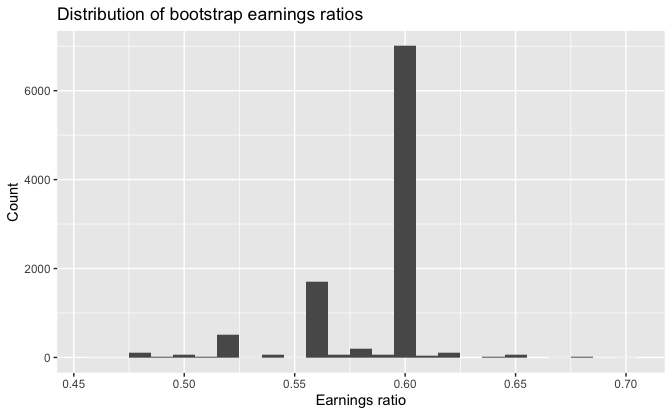

Regression and Other Stories: Earnings
================
Andrew Gelman, Jennifer Hill, Aki Vehtari
2021-04-20

-   [5 Simulation](#5-simulation)
    -   [5.4 Bootstrapping to simulate a sampling
        distribution](#54-bootstrapping-to-simulate-a-sampling-distribution)

Tidyverse version by Bill Behrman.

Bootstrapping to simulate the sampling distribution. See Chapter 5 in
Regression and Other Stories.

------------------------------------------------------------------------

``` r
# Packages
library(tidyverse)

# Parameters
  # Earnings data
file_earnings <- here::here("Earnings/data/earnings.csv")
  # Common code
file_common <- here::here("_common.R")

#===============================================================================

# Run common code
source(file_common)
```

# 5 Simulation

## 5.4 Bootstrapping to simulate a sampling distribution

Data

``` r
earnings <- 
  file_earnings %>% 
  read_csv() %>% 
  mutate(
    sex = 
      case_when(
        male == 0 ~ "Female",
        male == 1 ~ "Male",
        TRUE ~ NA_character_
      )
  ) %>% 
  select(age, sex, earn)
```

EDA

``` r
earnings %>% 
  select(age, earn) %>% 
  summary()
```

    #>       age            earn       
    #>  Min.   :18.0   Min.   :     0  
    #>  1st Qu.:29.0   1st Qu.:  6000  
    #>  Median :39.0   Median : 16000  
    #>  Mean   :42.9   Mean   : 21147  
    #>  3rd Qu.:56.0   3rd Qu.: 27000  
    #>  Max.   :91.0   Max.   :400000

``` r
earnings %>% 
  count(sex)
```

    #> # A tibble: 2 x 2
    #>   sex        n
    #> * <chr>  <int>
    #> 1 Female  1141
    #> 2 Male     675

``` r
earnings %>%
  group_by(sex) %>% 
  summarize(across(earn, list(median = median, mean = mean)))
```

    #> # A tibble: 2 x 3
    #>   sex    earn_median earn_mean
    #> * <chr>        <dbl>     <dbl>
    #> 1 Female       15000    15848.
    #> 2 Male         25000    30105.

Median of women’s earnings divided by the median of men’s earnings.

``` r
earnings %>% 
  summarize(
    earnings_ratio = median(earn[sex == "Female"]) / median(earn[sex == "Male"])
  ) %>% 
  pull(earnings_ratio)
```

    #> [1] 0.6

Earnings ratio of bootstrap sample.

``` r
earnings_ratio <- function() {
  earnings %>% 
    select(sex, earn) %>% 
    slice_sample(prop = 1, replace = TRUE) %>% 
    summarize(
      earnings_ratio = 
        median(earn[sex == "Female"]) / median(earn[sex == "Male"])
    ) %>% 
    pull(earnings_ratio)
}
```

A set of bootstrap simulations.

``` r
set.seed(194)

n_sims <- 1e4

earnings_ratio_boot <- 
  tibble(earnings_ratio = map_dbl(seq_len(n_sims), ~ earnings_ratio()))
```

Distribution of bootstrap earnings ratios.

``` r
earnings_ratio_boot %>% 
  ggplot(aes(earnings_ratio)) +
  geom_histogram(binwidth = 0.01) +
  labs(
    title = "Distribution of bootstrap earnings ratios",
    x = "Earnings ratio",
    y = "Count"
  )
```



``` r
earnings_ratio_boot %>% 
  count(earnings_ratio, sort = TRUE) %>% 
  mutate(prop_cum = cumsum(n) / sum(n))
```

    #> # A tibble: 48 x 3
    #>    earnings_ratio     n prop_cum
    #>             <dbl> <int>    <dbl>
    #>  1          0.6    6998    0.700
    #>  2          0.56   1698    0.870
    #>  3          0.52    508    0.920
    #>  4          0.580   151    0.936
    #>  5          0.48    109    0.946
    #>  6          0.625   102    0.957
    #>  7          0.59     66    0.963
    #>  8          0.5      56    0.969
    #>  9          0.652    52    0.974
    #> 10          0.570    49    0.979
    #> # … with 38 more rows

Because of the nature of the data, one value accounts for 70% of the
earnings ratios in the bootstrap samples and the top three account for
92%.

Standard deviation of bootstrap earnings ratios.

``` r
sd(earnings_ratio_boot$earnings_ratio)
```

    #> [1] 0.0271
