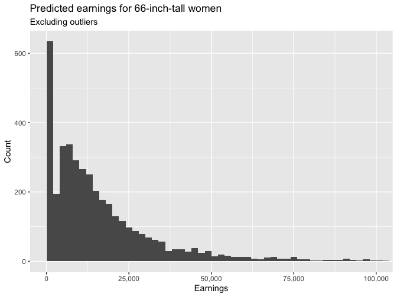

Regression and Other Stories: Earnings
================
Andrew Gelman, Jennifer Hill, Aki Vehtari
2021-04-20

-   [15 Other generalized linear
    models](#15-other-generalized-linear-models)
    -   [15.8 Going beyond generalized linear
        models](#158-going-beyond-generalized-linear-models)
        -   [Mixed discrete/continuous
            data](#mixed-discretecontinuous-data)

Tidyverse version by Bill Behrman.

Predict respondents’ yearly earnings using survey data from 1990. See
Chapter 15 in Regression and Other Stories.

------------------------------------------------------------------------

``` r
# Packages
library(tidyverse)
library(rstanarm)

# Parameters
  # Seed
SEED <- 7783
  # Earnings data
file_earnings <- here::here("Earnings/data/earnings.csv")
  # Common code
file_common <- here::here("_common.R")

#===============================================================================

# Run common code
source(file_common)
```

# 15 Other generalized linear models

## 15.8 Going beyond generalized linear models

### Mixed discrete/continuous data

Data

``` r
earnings <- 
  file_earnings %>% 
  read_csv() %>% 
  mutate(
    sex = 
      case_when(
        male == 0 ~ "Female",
        male == 1 ~ "Male",
        TRUE ~ NA_character_
      ),
    earn_pos = earn > 0
  )

earnings %>% 
  select(height, sex, earn, earn_pos)
```

    #> # A tibble: 1,816 x 4
    #>    height sex     earn earn_pos
    #>     <dbl> <chr>  <dbl> <lgl>   
    #>  1     74 Male   50000 TRUE    
    #>  2     66 Female 60000 TRUE    
    #>  3     64 Female 30000 TRUE    
    #>  4     65 Female 25000 TRUE    
    #>  5     63 Female 50000 TRUE    
    #>  6     68 Female 62000 TRUE    
    #>  7     63 Female 51000 TRUE    
    #>  8     64 Female  9000 TRUE    
    #>  9     62 Female 29000 TRUE    
    #> 10     73 Male   32000 TRUE    
    #> # … with 1,806 more rows

It can be appropriate to model a variable such as earnings in two steps:
first a logistic regression for Pr(y &gt; 0) fit to all the data, then a
linear regression on log(y), fit just to the subset of the data for
which y &gt; 0.

We first fit a logistic regression to predict whether earnings are
positive.

``` r
fit_pos <- 
  stan_glm(
    earn_pos ~ height + sex,
    family = binomial(link = "logit"),
    data = earnings,
    refresh = 0,
    seed = SEED
  )

print(fit_pos, digits = 2)
```

    #> stan_glm
    #>  family:       binomial [logit]
    #>  formula:      earn_pos ~ height + sex
    #>  observations: 1816
    #>  predictors:   3
    #> ------
    #>             Median MAD_SD
    #> (Intercept) -2.83   2.00 
    #> height       0.07   0.03 
    #> sexMale      1.67   0.32 
    #> 
    #> ------
    #> * For help interpreting the printed output see ?print.stanreg
    #> * For info on the priors used see ?prior_summary.stanreg

We then fit a log regression model to the respondents with positive
earnings.

``` r
fit_log_2 <- 
  stan_glm(
    log(earn) ~ height + sex,
    data = earnings %>% filter(earn_pos),
    refresh = 0,
    seed = SEED
  )

print(fit_log_2, digits = 2)
```

    #> stan_glm
    #>  family:       gaussian [identity]
    #>  formula:      log(earn) ~ height + sex
    #>  observations: 1629
    #>  predictors:   3
    #> ------
    #>             Median MAD_SD
    #> (Intercept) 7.97   0.49  
    #> height      0.02   0.01  
    #> sexMale     0.37   0.06  
    #> 
    #> Auxiliary parameter(s):
    #>       Median MAD_SD
    #> sigma 0.87   0.01  
    #> 
    #> ------
    #> * For help interpreting the printed output see ?print.stanreg
    #> * For info on the priors used see ?prior_summary.stanreg

Thus, for example, a 66-inch-tall woman has an estimated probability of

``` r
v <- plogis(coef(fit_pos)[["(Intercept)"]] + coef(fit_pos)[["height"]] * 66)

v
```

    #> [1] 0.865

or an 87% chance, of having positive income.

If her earnings are positive, their predicted value is

``` r
exp(coef(fit_log_2)[["(Intercept)"]] + coef(fit_log_2)[["height"]] * 66)
```

    #> [1] 14119

Combining these gives a mixture of a spike at 0 and a lognormal
distribution, which is most easily manipulated using simulations.

``` r
set.seed(SEED)

new <- tibble(height = 66, sex = "Female")

pred_pos <- 
  posterior_predict(fit_pos, newdata = new) %>% 
  as.logical()
pred_log_2 <- 
  posterior_predict(fit_log_2, newdata = new) %>% 
  as.numeric()
pred <- if_else(pred_pos, exp(pred_log_2), 0)
```

Predicted earnings for 66-inch-tall women.

``` r
tibble(pred) %>% 
  ggplot(aes(pred)) + 
  geom_histogram(binwidth = 2000, boundary = 0) +
  coord_cartesian(xlim = c(NA, 1e5)) +
  scale_x_continuous(labels = scales::label_comma()) +
  labs(
    title = "Predicted earnings for 66-inch-tall women",
    subtitle = "Excluding outliers",
    x = "Earnings",
    y = "Count"
  )
```


