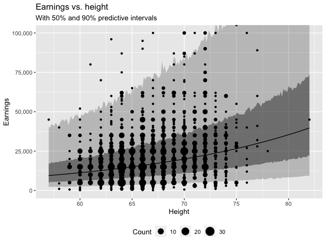

Regression and Other Stories: Earnings
================
Andrew Gelman, Jennifer Hill, Aki Vehtari
2021-04-20

-   [6 Background on regression
    modeling](#6-background-on-regression-modeling)
    -   [6.3 Interpret coefficients as comparisons, not
        effects](#63-interpret-coefficients-as-comparisons-not-effects)
-   [12 Transformations and
    regression](#12-transformations-and-regression)
    -   [12.4 Logarithmic
        transformations](#124-logarithmic-transformations)
        -   [Earnings and height example](#earnings-and-height-example)
        -   [Why we use natural log rather than log base
            10](#why-we-use-natural-log-rather-than-log-base-10)
        -   [Building a regression model on the log
            scale](#building-a-regression-model-on-the-log-scale)
        -   [Log-log model: transforming the input and outcome
            variables](#log-log-model-transforming-the-input-and-outcome-variables)

Tidyverse version by Bill Behrman.

Predict respondents’ yearly earnings using survey data from 1990. See
Chapters 6 and 12 in Regression and Other Stories.

------------------------------------------------------------------------

``` r
# Packages
library(tidyverse)
library(bayesplot)
library(rstanarm)

# Parameters
  # Seed
SEED <- 7783
  # Earnings data
file_earnings <- here::here("Earnings/data/earnings.csv")
  # Common code
file_common <- here::here("_common.R")

# Functions
  # Plot kernel density of data and sample replicates
plot_density_overlay <- function(y, y_rep) {
  ggplot(mapping = aes(y)) +
    stat_density(
      aes(group = rep, color = "y_rep"),
      data = 
        seq_len(nrow(y_rep)) %>% map_dfr(~ tibble(rep = ., y = y_rep[., ])),
      geom = "line",
      position = "identity",
      alpha = 0.5,
      size = 0.25
    ) +
    stat_density(aes(color = "y"), data = tibble(y), geom = "line", size = 1) +
    scale_y_continuous(breaks = 0) +
    scale_color_discrete(
      breaks = c("y", "y_rep"),
      labels = c("y", expression(y[rep]))
    ) +
    theme(legend.text.align = 0) +
    labs(
      x = NULL,
      y = NULL,
      color = NULL
    )
}

#===============================================================================

# Run common code
source(file_common)
```

# 6 Background on regression modeling

## 6.3 Interpret coefficients as comparisons, not effects

Data

``` r
earnings <- 
  file_earnings %>% 
  read_csv() %>% 
  mutate(
    sex = 
      case_when(
        male == 0 ~ "Female",
        male == 1 ~ "Male",
        TRUE ~ NA_character_
      )
  )

earnings %>% 
  select(height, sex, earn)
```

    #> # A tibble: 1,816 x 3
    #>    height sex     earn
    #>     <dbl> <chr>  <dbl>
    #>  1     74 Male   50000
    #>  2     66 Female 60000
    #>  3     64 Female 30000
    #>  4     65 Female 25000
    #>  5     63 Female 50000
    #>  6     68 Female 62000
    #>  7     63 Female 51000
    #>  8     64 Female  9000
    #>  9     62 Female 29000
    #> 10     73 Male   32000
    #> # … with 1,806 more rows

Fit linear regression of earnings on height and sex with no interaction.

``` r
fit_2 <- 
  stan_glm(earn ~ height + sex, data = earnings, refresh = 0, seed = SEED)

print(fit_2)
```

    #> stan_glm
    #>  family:       gaussian [identity]
    #>  formula:      earn ~ height + sex
    #>  observations: 1816
    #>  predictors:   3
    #> ------
    #>             Median   MAD_SD  
    #> (Intercept) -26129.1  11683.7
    #> height         650.6    179.7
    #> sexMale      10630.6   1445.1
    #> 
    #> Auxiliary parameter(s):
    #>       Median  MAD_SD 
    #> sigma 21393.9   360.2
    #> 
    #> ------
    #> * For help interpreting the printed output see ?print.stanreg
    #> * For info on the priors used see ?prior_summary.stanreg

Linear regression of earnings on height and sex with no interaction.

``` r
lines <- 
  tribble(
    ~sex, ~intercept, ~slope,
    "Female", coef(fit_2)[["(Intercept)"]], coef(fit_2)[["height"]],
    "Male", 
      coef(fit_2)[["(Intercept)"]] + coef(fit_2)[["sexMale"]],
      coef(fit_2)[["height"]]
  )

offset <- 0.2

earnings %>% 
  mutate(
    height =
      case_when(
        sex == "Female" ~ height - offset,
        sex == "Male" ~ height + offset,
        TRUE ~ NA_real_
      )
  ) %>% 
  ggplot(aes(height, earn, color = sex)) +
  geom_count() +
  geom_abline(
    aes(slope = slope, intercept = intercept, color = sex),
    data = lines
  ) +
  coord_cartesian(ylim = c(0, 1e5)) +
  scale_x_continuous(breaks = scales::breaks_width(1), minor_breaks = NULL) +
  scale_y_continuous(labels = scales::label_comma()) +
  theme(legend.position = "bottom") +
  labs(
    title = 
      "Linear regression of earnings on height and sex with no interaction",
    x = "Height",
    y = "Earnings",
    color = "Sex",
    size = "Count"
  )
```


The equations for the regression lines are:

    Men:   y = -15499 + 651 x
    Women: y = -26129 + 651 x

Fit linear regression of earnings on height and sex with interaction.

``` r
fit_3 <- 
  stan_glm(
    earn ~ height + sex + height:sex,
    data = earnings,
    refresh = 0,
    seed = SEED
  )

print(fit_3)
```

    #> stan_glm
    #>  family:       gaussian [identity]
    #>  formula:      earn ~ height + sex + height:sex
    #>  observations: 1816
    #>  predictors:   4
    #> ------
    #>                Median   MAD_SD  
    #> (Intercept)     -9779.4  15218.0
    #> height            399.0    234.7
    #> sexMale        -28439.8  23449.0
    #> height:sexMale    577.6    345.4
    #> 
    #> Auxiliary parameter(s):
    #>       Median  MAD_SD 
    #> sigma 21401.5   351.6
    #> 
    #> ------
    #> * For help interpreting the printed output see ?print.stanreg
    #> * For info on the priors used see ?prior_summary.stanreg

Linear regression of earnings on height and sex with interaction.

``` r
lines <- 
  tribble(
    ~sex, ~intercept, ~slope,
    "Female", coef(fit_3)[["(Intercept)"]], coef(fit_3)[["height"]],
    "Male", 
      coef(fit_3)[["(Intercept)"]] + coef(fit_3)[["sexMale"]],
      coef(fit_3)[["height"]] + coef(fit_3)[["height:sexMale"]]
  )

offset <- 0.2

earnings %>% 
  mutate(
    height =
      case_when(
        sex == "Female" ~ height - offset,
        sex == "Male" ~ height + offset,
        TRUE ~ NA_real_
      )
  ) %>% 
  ggplot(aes(height, earn, color = sex)) +
  geom_count() +
  geom_abline(
    aes(slope = slope, intercept = intercept, color = sex), 
    data = lines
  ) +
  coord_cartesian(ylim = c(0, 1e5)) +
  scale_x_continuous(breaks = scales::breaks_width(1), minor_breaks = NULL) +
  scale_y_continuous(labels = scales::label_comma()) +
  theme(legend.position = "bottom") +
  labs(
    title = 
      "Linear regression of earnings on height and sex with interaction",
    x = "Height",
    y = "Earnings",
    color = "Sex",
    size = "Count"
  )
```


The equations for the regression lines are:

    Men:   y = -38219 + 977 x
    Women: y =  -9779 + 399 x

From the plots, we can see that many more women than men have no
earnings.

``` r
earnings %>% 
  count(earn, sex) %>% 
  group_by(sex) %>% 
  mutate(prop = n / sum(n)) %>% 
  ungroup() %>% 
  filter(earn == 0)
```

    #> # A tibble: 2 x 4
    #>    earn sex        n   prop
    #>   <dbl> <chr>  <int>  <dbl>
    #> 1     0 Female   172 0.151 
    #> 2     0 Male      15 0.0222

15% of women have no earnings, whereas only 2% of men have no earnings.

# 12 Transformations and regression

## 12.4 Logarithmic transformations

### Earnings and height example

#### Direct interpretation of small coefficients on the log scale

Linear regression with log earnings as outcome.

``` r
fit_log_1 <- 
  stan_glm(
    log(earn) ~ height,
    data = earnings %>% filter(earn > 0),
    seed = SEED,
    refresh = 0
  )

print(fit_log_1, digits = 2)
```

    #> stan_glm
    #>  family:       gaussian [identity]
    #>  formula:      log(earn) ~ height
    #>  observations: 1629
    #>  predictors:   2
    #> ------
    #>             Median MAD_SD
    #> (Intercept) 5.90   0.37  
    #> height      0.06   0.01  
    #> 
    #> Auxiliary parameter(s):
    #>       Median MAD_SD
    #> sigma 0.88   0.01  
    #> 
    #> ------
    #> * For help interpreting the printed output see ?print.stanreg
    #> * For info on the priors used see ?prior_summary.stanreg

Earnings vs. height on log scale: With 50% and 90% predictive intervals.

``` r
v <- 
  tibble(height = seq_range(earnings$height)) %>% 
  predictive_intervals(fit = fit_log_1) %>% 
  mutate(across(!height, exp))

v %>% 
  ggplot(aes(height)) +
  geom_ribbon(aes(ymin = `5%`, ymax = `95%`), alpha = 0.25) +
  geom_ribbon(aes(ymin = `25%`, ymax = `75%`), alpha = 0.5) +
  geom_line(aes(y = .pred)) +
  geom_count(aes(y = earn), data = earnings %>% filter(earn > 0)) +
  scale_y_log10(labels = scales::label_comma()) +
  theme(legend.position = "bottom") +
  labs(
    title = "Earnings vs. height on log scale",
    subtitle = "With 50% and 90% predictive intervals",
    x = "Height",
    y = "Earnings",
    size = "Count"
  )
```


Earnings vs. height: With 50% and 90% predictive intervals.

``` r
v %>% 
  ggplot(aes(height)) +
  geom_ribbon(aes(ymin = `5%`, ymax = `95%`), alpha = 0.25) +
  geom_ribbon(aes(ymin = `25%`, ymax = `75%`), alpha = 0.5) +
  geom_line(aes(y = .pred)) +
  geom_count(aes(y = earn), data = earnings %>% filter(earn > 0)) +
  coord_cartesian(ylim = c(0, 1e5)) +
  scale_y_continuous(labels = scales::label_comma()) +
  theme(legend.position = "bottom") +
  labs(
    title = "Earnings vs. height",
    subtitle = "With 50% and 90% predictive intervals",
    x = "Height",
    y = "Earnings",
    size = "Count"
  )
```



#### Predictive checking

Linear regression with non-log, positive earnings.

``` r
fit_1 <- 
  stan_glm(
    earn ~ height,
    data = earnings %>% filter(earn > 0),
    seed = SEED,
    refresh = 0
  )

print(fit_1, digits = 2)
```

    #> stan_glm
    #>  family:       gaussian [identity]
    #>  formula:      earn ~ height
    #>  observations: 1629
    #>  predictors:   2
    #> ------
    #>             Median    MAD_SD   
    #> (Intercept) -68475.92   9819.15
    #> height        1378.87    147.30
    #> 
    #> Auxiliary parameter(s):
    #>       Median   MAD_SD  
    #> sigma 21931.53   400.85
    #> 
    #> ------
    #> * For help interpreting the printed output see ?print.stanreg
    #> * For info on the priors used see ?prior_summary.stanreg

Simulate new data for non-log model.

``` r
set.seed(377)

y_rep_1 <- posterior_predict(fit_1)

n_sims <- nrow(y_rep_1)
n_rep <- 100
sims_sample <- sample(n_sims, n_rep)
```

Kernel density of data and 100 sample replicates from non-log model.

``` r
plot_density_overlay(
  y = earnings$earn %>% keep(. > 0),
  y_rep = y_rep_1[sims_sample, ]
) +
  labs(
    title = 
      str_glue(
        "Kernel density of data and {n_rep} sample replicates from non-log model"
      ),
    x = "Earnings"
  )
```


Kernel density of data and 100 sample replicates from non-log model
using bayesplot.

``` r
ppc_dens_overlay(
  y = earnings$earn %>% keep(. > 0),
  yrep = y_rep_1[sims_sample, ]
) +
  theme(
    axis.line.y = element_blank(),
    text = element_text(family = "sans")
  ) +
  labs(title = "earn")
```


Simulate new data for log model.

``` r
set.seed(377)

y_rep_log_1 <- posterior_predict(fit_log_1)
```

Kernel density of data and 100 sample replicates from log model.

``` r
plot_density_overlay(
  y = earnings$earn %>% keep(. > 0) %>% log(),
  y_rep = y_rep_log_1[sims_sample, ]
) +
  scale_x_continuous(breaks = scales::breaks_width(2)) +
  labs(
    title = 
      str_glue(
        "Kernel density of data and {n_rep} sample replicates from log model"
      ),
    x = "Log earnings"
  )
```


Kernel density of data and 100 sample replicates from log model using
bayesplot.

``` r
ppc_dens_overlay(
  y = earnings$earn %>% keep(. > 0) %>% log(),
  yrep = y_rep_log_1[sims_sample, ]
) +
  theme(
    axis.line.y = element_blank(),
    text = element_text(family = "sans")
  ) +
  labs(title = "log(earn)")
```


### Why we use natural log rather than log base 10

Linear regression with log10 earnings as outcome.

``` r
fit_log10_1 <- 
  stan_glm(
    log10(earn) ~ height,
    data = earnings %>% filter(earn > 0),
    seed = SEED,
    refresh = 0
  )

print(fit_log10_1, digits = 2)
```

    #> stan_glm
    #>  family:       gaussian [identity]
    #>  formula:      log10(earn) ~ height
    #>  observations: 1629
    #>  predictors:   2
    #> ------
    #>             Median MAD_SD
    #> (Intercept) 2.57   0.17  
    #> height      0.02   0.00  
    #> 
    #> Auxiliary parameter(s):
    #>       Median MAD_SD
    #> sigma 0.38   0.01  
    #> 
    #> ------
    #> * For help interpreting the printed output see ?print.stanreg
    #> * For info on the priors used see ?prior_summary.stanreg

The `height` coefficient of 0.0247 tells us that a difference of 1 inch
in height corresponds to a difference of 0.0247 in
log<sub>10</sub>(earnings), that is a multiplicative difference of
10<sup>0.0247</sup> = 1.06. That is the same as the 6% change as before,
but it cannot be seen by simply looking at the coefficient as could be
done in the natural-log case.

### Building a regression model on the log scale

#### Adding another predictor

Linear regression of log earnings with both height and sex as
predictors.

``` r
fit_log_2 <- 
  stan_glm(
    log(earn) ~ height + sex,
    data = earnings %>% filter(earn > 0),
    seed = SEED,
    refresh = 0
  )

print(fit_log_2, digits = 2)
```

    #> stan_glm
    #>  family:       gaussian [identity]
    #>  formula:      log(earn) ~ height + sex
    #>  observations: 1629
    #>  predictors:   3
    #> ------
    #>             Median MAD_SD
    #> (Intercept) 7.97   0.49  
    #> height      0.02   0.01  
    #> sexMale     0.37   0.06  
    #> 
    #> Auxiliary parameter(s):
    #>       Median MAD_SD
    #> sigma 0.87   0.01  
    #> 
    #> ------
    #> * For help interpreting the printed output see ?print.stanreg
    #> * For info on the priors used see ?prior_summary.stanreg

#### Including an interaction

We now consider a model with an interaction between height and sex, so
that the predictive comparison for height can differ for men and women.

``` r
fit_log_3 <- 
  stan_glm(
    log(earn) ~ height + sex + height:sex,
    data = earnings %>% filter(earn > 0),
    seed = SEED,
    refresh = 0
  )

print(fit_log_3, digits = 2)
```

    #> stan_glm
    #>  family:       gaussian [identity]
    #>  formula:      log(earn) ~ height + sex + height:sex
    #>  observations: 1629
    #>  predictors:   4
    #> ------
    #>                Median MAD_SD
    #> (Intercept)     8.47   0.68 
    #> height          0.02   0.01 
    #> sexMale        -0.80   1.01 
    #> height:sexMale  0.02   0.01 
    #> 
    #> Auxiliary parameter(s):
    #>       Median MAD_SD
    #> sigma 0.87   0.01  
    #> 
    #> ------
    #> * For help interpreting the printed output see ?print.stanreg
    #> * For info on the priors used see ?prior_summary.stanreg

#### Linear transformation to make coefficients more interpretable

Create rescaled variable `height_z` to have mean 0 and standard
deviation 1.

``` r
earnings <- 
  earnings %>% 
  mutate(height_z = (height - mean(height)) / sd(height))
```

The previous linear regression using rescaled height.

``` r
fit_log_4 <- 
  stan_glm(
    log(earn) ~ height_z + sex + height_z:sex,
    data = earnings %>% filter(earn > 0),
    seed = SEED,
    refresh = 0
  )

print(fit_log_4, digits = 2)
```

    #> stan_glm
    #>  family:       gaussian [identity]
    #>  formula:      log(earn) ~ height_z + sex + height_z:sex
    #>  observations: 1629
    #>  predictors:   4
    #> ------
    #>                  Median MAD_SD
    #> (Intercept)      9.54   0.04  
    #> height_z         0.06   0.04  
    #> sexMale          0.35   0.06  
    #> height_z:sexMale 0.08   0.06  
    #> 
    #> Auxiliary parameter(s):
    #>       Median MAD_SD
    #> sigma 0.87   0.02  
    #> 
    #> ------
    #> * For help interpreting the printed output see ?print.stanreg
    #> * For info on the priors used see ?prior_summary.stanreg

### Log-log model: transforming the input and outcome variables

If the log transformation is applied to an input variable as well as the
outcome, the coefficient can be interpreted as the proportional
difference in y per proportional difference in x. For example:

``` r
fit_log_5 <- 
  stan_glm(
    log(earn) ~ log(height) + sex,
    data = earnings %>% filter(earn > 0),
    seed = SEED,
    refresh = 0
  )

print(fit_log_5, digits = 2)
```

    #> stan_glm
    #>  family:       gaussian [identity]
    #>  formula:      log(earn) ~ log(height) + sex
    #>  observations: 1629
    #>  predictors:   3
    #> ------
    #>             Median MAD_SD
    #> (Intercept) 2.83   2.20  
    #> log(height) 1.60   0.53  
    #> sexMale     0.37   0.06  
    #> 
    #> Auxiliary parameter(s):
    #>       Median MAD_SD
    #> sigma 0.87   0.02  
    #> 
    #> ------
    #> * For help interpreting the printed output see ?print.stanreg
    #> * For info on the priors used see ?prior_summary.stanreg

For each 1% difference in height, the predicted difference in earnings
is 1.60%
