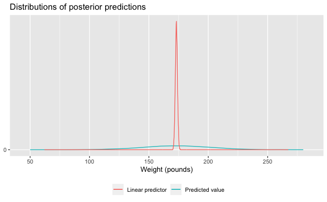

Regression and Other Stories: Height and weight
================
Andrew Gelman, Jennifer Hill, Aki Vehtari
2021-04-20

-   [9 Prediction and Bayesian
    inference](#9-prediction-and-bayesian-inference)
    -   [9.2 Prediction and uncertainty: `predict()`,
        `posterior_linpred()`, and
        `posterior_predict()`](#92-prediction-and-uncertainty-predict-posterior_linpred-and-posterior_predict)
        -   [Simulating uncertainty for the linear predictor and new
            observations](#simulating-uncertainty-for-the-linear-predictor-and-new-observations)
-   [10 Linear regression with multiple
    predictions](#10-linear-regression-with-multiple-predictions)
    -   [10.4 Indicator variables](#104-indicator-variables)
        -   [Centering a predictor](#centering-a-predictor)
        -   [Including a binary variable in a
            regression](#including-a-binary-variable-in-a-regression)
        -   [Using indicator variables for multiple levels of a
            categorical
            variable](#using-indicator-variables-for-multiple-levels-of-a-categorical-variable)
        -   [Changing the baseline factor
            level](#changing-the-baseline-factor-level)

Tidyverse version by Bill Behrman.

Predict weight from height. See Chapters 9 and 10 in Regression and
Other Stories.

------------------------------------------------------------------------

``` r
# Packages
library(tidyverse)
library(rstanarm)

# Parameters
  # Earnings data
file_earnings <- here::here("Earnings/data/earnings.csv")
  # Common code
file_common <- here::here("_common.R")

#===============================================================================

# Run common code
source(file_common)
```

# 9 Prediction and Bayesian inference

## 9.2 Prediction and uncertainty: `predict()`, `posterior_linpred()`, and `posterior_predict()`

Data

``` r
earnings <- 
  file_earnings %>% 
  read_csv() %>% 
  mutate(
    sex = 
      case_when(
        male == 0 ~ "Female",
        male == 1 ~ "Male",
        TRUE ~ NA_character_
      )
  )

earnings %>% 
  select(height, weight, sex, ethnicity)
```

    #> # A tibble: 1,816 x 4
    #>    height weight sex    ethnicity
    #>     <dbl>  <dbl> <chr>  <chr>    
    #>  1     74    210 Male   White    
    #>  2     66    125 Female White    
    #>  3     64    126 Female White    
    #>  4     65    200 Female White    
    #>  5     63    110 Female Other    
    #>  6     68    165 Female Black    
    #>  7     63    190 Female White    
    #>  8     64    125 Female White    
    #>  9     62    200 Female White    
    #> 10     73    230 Male   White    
    #> # … with 1,806 more rows

``` r
mean(earnings$height)
```

    #> [1] 66.6

### Simulating uncertainty for the linear predictor and new observations

Fit linear regression of weight against height.

The option `refresh = 0` suppresses the default Stan sampling progress
output. This is useful for small data with fast computation. For more
complex models and bigger data, it can be useful to see the progress.

``` r
set.seed(733)

fit_1 <- stan_glm(weight ~ height, data = earnings, refresh = 0)

fit_1
```

    #> stan_glm
    #>  family:       gaussian [identity]
    #>  formula:      weight ~ height
    #>  observations: 1789
    #>  predictors:   2
    #> ------
    #>             Median MAD_SD
    #> (Intercept) -173.4   12.3
    #> height         4.9    0.2
    #> 
    #> Auxiliary parameter(s):
    #>       Median MAD_SD
    #> sigma 29.0    0.5  
    #> 
    #> ------
    #> * For help interpreting the printed output see ?print.stanreg
    #> * For info on the priors used see ?prior_summary.stanreg

Center heights.

``` r
earnings <- 
  earnings %>% 
  mutate(height_c = height - 66)
```

Fit using centered heights.

``` r
set.seed(733)

fit_2 <- stan_glm(weight ~ height_c, data = earnings, refresh = 0)

fit_2
```

    #> stan_glm
    #>  family:       gaussian [identity]
    #>  formula:      weight ~ height_c
    #>  observations: 1789
    #>  predictors:   2
    #> ------
    #>             Median MAD_SD
    #> (Intercept) 153.4    0.7 
    #> height_c      4.9    0.2 
    #> 
    #> Auxiliary parameter(s):
    #>       Median MAD_SD
    #> sigma 29.0    0.5  
    #> 
    #> ------
    #> * For help interpreting the printed output see ?print.stanreg
    #> * For info on the priors used see ?prior_summary.stanreg

New data for a 70-inch-tall person.

``` r
new <- tibble(height_c = 4)
```

Point prediction.

``` r
point_pred <- predict(fit_2, newdata = new)

as.double(point_pred)
```

    #> [1] 173

Posterior simulations where variation is from posterior uncertainty in
the coefficients.

``` r
linpred <- posterior_linpred(fit_2, newdata = new)
```

Posterior simulations where variation is from posterior uncertainty in
the coefficients and predictive uncertainty.

``` r
set.seed(733)

pred <- posterior_predict(fit_2, newdata = new)
```

``` r
preds <- tibble(linpred = as.double(linpred), pred = as.double(pred))

preds %>% 
  summarize(across(everything(), list(median = median, mad = mad)))
```

    #> # A tibble: 1 x 4
    #>   linpred_median linpred_mad pred_median pred_mad
    #>            <dbl>       <dbl>       <dbl>    <dbl>
    #> 1           173.       0.915        173.     28.3

The medians of the two sets of posterior simulations are similar, but
the median absolute deviations are very different.

Distributions of posterior predictions.

``` r
preds %>% 
  ggplot(aes(y = stat(density))) +
  geom_freqpoly(aes(pred, color = "pred"), binwidth = 10) +
  geom_freqpoly(aes(linpred, color = "linpred"), binwidth = 0.2) +
  scale_x_continuous(breaks = scales::breaks_width(50)) +
  scale_y_continuous(breaks = 0) +
  scale_color_discrete(
    breaks = c("linpred", "pred"),
    labels = c("Linear predictor", "Predicted value")
  ) +
  theme(legend.position = "bottom") +
  labs(
    title = "Distributions of posterior predictions",
    x = "Weight (pounds)",
    y = NULL,
    color = NULL
  )
```



# 10 Linear regression with multiple predictions

## 10.4 Indicator variables

Data

``` r
earnings %>% 
  select(height, weight, sex, ethnicity)
```

    #> # A tibble: 1,816 x 4
    #>    height weight sex    ethnicity
    #>     <dbl>  <dbl> <chr>  <chr>    
    #>  1     74    210 Male   White    
    #>  2     66    125 Female White    
    #>  3     64    126 Female White    
    #>  4     65    200 Female White    
    #>  5     63    110 Female Other    
    #>  6     68    165 Female Black    
    #>  7     63    190 Female White    
    #>  8     64    125 Female White    
    #>  9     62    200 Female White    
    #> 10     73    230 Male   White    
    #> # … with 1,806 more rows

Fit linear regression of weight against height.

``` r
set.seed(733)

fit_1 <- stan_glm(weight ~ height, data = earnings, refresh = 0)

fit_1
```

    #> stan_glm
    #>  family:       gaussian [identity]
    #>  formula:      weight ~ height
    #>  observations: 1789
    #>  predictors:   2
    #> ------
    #>             Median MAD_SD
    #> (Intercept) -173.4   12.3
    #> height         4.9    0.2
    #> 
    #> Auxiliary parameter(s):
    #>       Median MAD_SD
    #> sigma 29.0    0.5  
    #> 
    #> ------
    #> * For help interpreting the printed output see ?print.stanreg
    #> * For info on the priors used see ?prior_summary.stanreg

Predict the weight for a 66-inch-tall person.

``` r
set.seed(733)

new <- tibble(height = 66)

pred <- posterior_predict(fit_1, newdata = new)
```

``` r
cat(
  str_glue(
    "The predicted weight for 66-inch-tall person is ",
    "{format(mean(pred), digits = 1, nsmall = 1)} pounds with a sd of ",
    "{format(sd(pred), digits = 1, nsmall = 1)}."
  )
)
```

    The predicted weight for 66-inch-tall person is 153.2 pounds with a sd of 29.0.

### Centering a predictor

Center heights.

``` r
earnings <- 
  earnings %>% 
  mutate(height_c = height - 66)
```

Fit using centered heights.

``` r
set.seed(733)

fit_2 <- stan_glm(weight ~ height_c, data = earnings, refresh = 0)

fit_2
```

    #> stan_glm
    #>  family:       gaussian [identity]
    #>  formula:      weight ~ height_c
    #>  observations: 1789
    #>  predictors:   2
    #> ------
    #>             Median MAD_SD
    #> (Intercept) 153.4    0.7 
    #> height_c      4.9    0.2 
    #> 
    #> Auxiliary parameter(s):
    #>       Median MAD_SD
    #> sigma 29.0    0.5  
    #> 
    #> ------
    #> * For help interpreting the printed output see ?print.stanreg
    #> * For info on the priors used see ?prior_summary.stanreg

### Including a binary variable in a regression

Fit linear regression of weight against height and sex.

``` r
set.seed(733)

fit_3 <- stan_glm(weight ~ height_c + sex, data = earnings, refresh = 0)

fit_3
```

    #> stan_glm
    #>  family:       gaussian [identity]
    #>  formula:      weight ~ height_c + sex
    #>  observations: 1789
    #>  predictors:   3
    #> ------
    #>             Median MAD_SD
    #> (Intercept) 149.5    0.9 
    #> height_c      3.9    0.3 
    #> sexMale      11.8    2.0 
    #> 
    #> Auxiliary parameter(s):
    #>       Median MAD_SD
    #> sigma 28.7    0.5  
    #> 
    #> ------
    #> * For help interpreting the printed output see ?print.stanreg
    #> * For info on the priors used see ?prior_summary.stanreg

Predict the weight for a 70-inch-tall woman.

``` r
set.seed(733)

new <- tibble(height_c = 4, sex = "Female")

pred <- posterior_predict(fit_3, newdata = new)
```

``` r
cat(
  str_glue(
    "The predicted weight for 70-inch-tall woman is ",
    "{format(mean(pred), digits = 1, nsmall = 1)} pounds with a sd of ",
    "{format(sd(pred), digits = 1, nsmall = 1)}."
  )
)
```

    The predicted weight for 70-inch-tall woman is 165.0 pounds with a sd of 28.8.

Predict the weight for a 70-inch-tall man.

``` r
set.seed(733)

new <- tibble(height_c = 4, sex = "Male")

pred <- posterior_predict(fit_3, newdata = new)
```

``` r
cat(
  str_glue(
    "The predicted weight for 70-inch-tall man is ",
    "{format(mean(pred), digits = 1, nsmall = 1)} pounds with a sd of ",
    "{format(sd(pred), digits = 1, nsmall = 1)}."
  )
)
```

    The predicted weight for 70-inch-tall man is 176.8 pounds with a sd of 28.7.

### Using indicator variables for multiple levels of a categorical variable

``` r
earnings %>% 
  count(ethnicity)
```

    #> # A tibble: 4 x 2
    #>   ethnicity     n
    #> * <chr>     <int>
    #> 1 Black       180
    #> 2 Hispanic    104
    #> 3 Other        38
    #> 4 White      1494

Fit linear regression of weight against height, sex, and ethnicity.

``` r
set.seed(733)

fit_4 <- 
  stan_glm(weight ~ height_c + sex + ethnicity, data = earnings, refresh = 0)

fit_4
```

    #> stan_glm
    #>  family:       gaussian [identity]
    #>  formula:      weight ~ height_c + sex + ethnicity
    #>  observations: 1789
    #>  predictors:   6
    #> ------
    #>                   Median MAD_SD
    #> (Intercept)       154.3    2.2 
    #> height_c            3.9    0.3 
    #> sexMale            12.2    2.0 
    #> ethnicityHispanic  -6.2    3.5 
    #> ethnicityOther    -12.3    5.1 
    #> ethnicityWhite     -5.2    2.3 
    #> 
    #> Auxiliary parameter(s):
    #>       Median MAD_SD
    #> sigma 28.6    0.5  
    #> 
    #> ------
    #> * For help interpreting the printed output see ?print.stanreg
    #> * For info on the priors used see ?prior_summary.stanreg

### Changing the baseline factor level

Make `"White"` the baseline factor level for `ethnicity`.

``` r
earnings <- 
  earnings %>% 
  mutate(
    ethnicity = 
      factor(ethnicity, levels = c("White", "Black", "Hispanic", "Other"))
  )
```

Fit linear regression of weight against height, sex, and ethnicity with
new baseline factor level.

``` r
set.seed(733)

fit_5 <- 
  stan_glm(weight ~ height_c + sex + ethnicity, data = earnings, refresh = 0)

fit_5
```

    #> stan_glm
    #>  family:       gaussian [identity]
    #>  formula:      weight ~ height_c + sex + ethnicity
    #>  observations: 1789
    #>  predictors:   6
    #> ------
    #>                   Median MAD_SD
    #> (Intercept)       149.1    0.9 
    #> height_c            3.8    0.3 
    #> sexMale            12.1    1.9 
    #> ethnicityBlack      5.2    2.2 
    #> ethnicityHispanic  -1.0    2.9 
    #> ethnicityOther     -7.1    4.6 
    #> 
    #> Auxiliary parameter(s):
    #>       Median MAD_SD
    #> sigma 28.6    0.5  
    #> 
    #> ------
    #> * For help interpreting the printed output see ?print.stanreg
    #> * For info on the priors used see ?prior_summary.stanreg

Equivalently, create indicator variables for the four ethnic groups.

``` r
earnings <- 
  earnings %>% 
  mutate(
    ethnicity_white = if_else(ethnicity == "White", 1, 0),
    ethnicity_black = if_else(ethnicity == "Black", 1, 0),
    ethnicity_hispanic = if_else(ethnicity == "Hispanic", 1, 0),
    ethnicity_other = if_else(ethnicity == "Other", 1, 0)
  )
```

Fit linear regression of weight against height, sex, and ethnicity
expressed as indicator variables.

``` r
set.seed(733)

fit_6 <- 
  stan_glm(
    weight ~ 
      height_c + sex + ethnicity_black + ethnicity_hispanic + ethnicity_other,
    data = earnings,
    refresh = 0
  )

fit_6
```

    #> stan_glm
    #>  family:       gaussian [identity]
    #>  formula:      weight ~ height_c + sex + ethnicity_black + ethnicity_hispanic + 
    #>     ethnicity_other
    #>  observations: 1789
    #>  predictors:   6
    #> ------
    #>                    Median MAD_SD
    #> (Intercept)        149.1    0.9 
    #> height_c             3.8    0.3 
    #> sexMale             12.1    1.9 
    #> ethnicity_black      5.2    2.2 
    #> ethnicity_hispanic  -1.0    2.9 
    #> ethnicity_other     -7.1    4.6 
    #> 
    #> Auxiliary parameter(s):
    #>       Median MAD_SD
    #> sigma 28.6    0.5  
    #> 
    #> ------
    #> * For help interpreting the printed output see ?print.stanreg
    #> * For info on the priors used see ?prior_summary.stanreg
