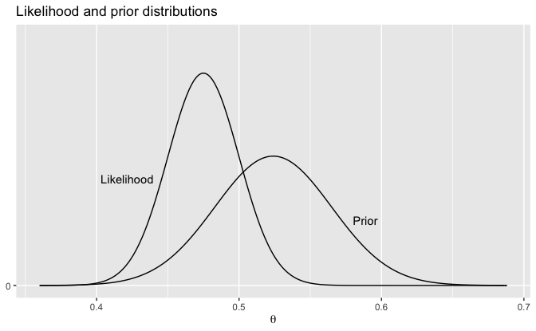
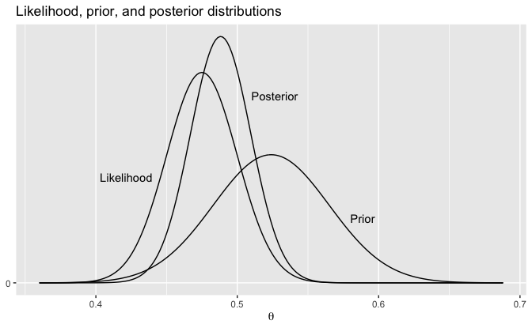

Regression and Other Stories: Elections Economy - Bayes
================
Andrew Gelman, Jennifer Hill, Aki Vehtari
2021-04-20

-   [9 Prediction and Bayesian
    inference](#9-prediction-and-bayesian-inference)
    -   [9.3 Prior information and Bayesian
        synthesis](#93-prior-information-and-bayesian-synthesis)
        -   [Bayesian information
            aggregation](#bayesian-information-aggregation)

Tidyverse version by Bill Behrman.

Demonstration of Bayesian information aggregation. See Chapter 9 in
Regression and Other Stories.

------------------------------------------------------------------------

``` r
# Packages
library(tidyverse)

# Parameters
  # Common code
file_common <- here::here("_common.R")

#===============================================================================

# Run common code
source(file_common)
```

# 9 Prediction and Bayesian inference

## 9.3 Prior information and Bayesian synthesis

### Bayesian information aggregation

Data

Prior distribution based on a previously-fitted model using economic and
political conditions.

``` r
theta_hat_prior <- 0.524
se_prior <- 0.041
```

Survey of 400 people, of whom 190 say they will vote for the Democratic
candidate.

``` r
n <- 400
y <- 190
```

Distribution based upon survey data.

``` r
theta_hat_data <- y / n
se_data <- sqrt((y / n) * (1 - y / n) / n)
```

Bayes estimate.

``` r
theta_hat_bayes <- 
  (theta_hat_prior / se_prior^2 + theta_hat_data / se_data^2) / 
  (1 / se_prior^2 + 1 / se_data^2)
se_bayes <- sqrt(1 / (1 / se_prior^2 + 1 / se_data^2))
```

``` r
x_min = min(theta_hat_prior - 4 * se_prior, theta_hat_data - 4 * se_data)
x_max = max(theta_hat_prior + 4 * se_prior, theta_hat_data + 4 * se_data)
v <- 
  tibble(
    x = seq(x_min, x_max, length.out = 201),
    y_prior = dnorm(x, mean = theta_hat_prior, sd = se_prior),
    y_data = dnorm(x, mean = theta_hat_data, sd = se_data),
    y_bayes = dnorm(x, mean = theta_hat_bayes, sd = se_bayes)
  )

labels <- 
  tribble(
      ~x,   ~y,       ~label, ~hjust,
    0.58,  4.9,      "Prior",      0,
    0.44,  8.0, "Likelihood",      1,
    0.51, 14.2,  "Posterior",      0
  )
```

Likelihood and prior distributions.

``` r
v %>% 
  ggplot(aes(x)) +
  geom_blank(aes(y = y_bayes)) +
  geom_line(aes(y = y_prior)) +
  geom_line(aes(y = y_data)) +
  geom_text(
    aes(x, y, label = label, hjust = hjust), 
    data = labels %>% filter(label != "Posterior")
  ) +
  scale_y_continuous(breaks = 0) +
  labs(
    title = "Likelihood and prior distributions",
    x = expression(theta),
    y = NULL
  )
```



Likelihood, prior, and posterior distributions.

``` r
v %>% 
  ggplot(aes(x)) +
  geom_line(aes(y = y_prior)) +
  geom_line(aes(y = y_data)) +
  geom_line(aes(y = y_bayes)) +
  geom_text(aes(x, y, label = label, hjust = hjust), data = labels) +
  scale_y_continuous(breaks = 0) +
  labs(
    title = "Likelihood, prior, and posterior distributions",
    x = expression(theta),
    y = NULL
  )
```


