Regression and Other Stories: Elections Economy
================
Andrew Gelman, Jennifer Hill, Aki Vehtari
2021-04-20

-   [1 Overview](#1-overview)
    -   [1.2 Why learn regression?](#12-why-learn-regression)
-   [7 Linear regression with a single
    predictor](#7-linear-regression-with-a-single-predictor)
    -   [7.1 Example: predicting presidential vote share from the
        economy](#71-example-predicting-presidential-vote-share-from-the-economy)
        -   [Fitting a linear model to
            data](#fitting-a-linear-model-to-data)
        -   [Understanding the fitted
            model](#understanding-the-fitted-model)
        -   [Graphing the fitted regression
            line](#graphing-the-fitted-regression-line)
        -   [Using the model to predict](#using-the-model-to-predict)
-   [8 Fitting regression models](#8-fitting-regression-models)
    -   [8.1 Least squares, maximum likelihood, and Bayesian
        inference](#81-least-squares-maximum-likelihood-and-bayesian-inference)
        -   [Where do the standard errors come from? Using the
            likelihood surface to assess uncertainty in the parameter
            estimates](#where-do-the-standard-errors-come-from-using-the-likelihood-surface-to-assess-uncertainty-in-the-parameter-estimates)
-   [9 Prediction and Bayesian
    inference](#9-prediction-and-bayesian-inference)
    -   [9.1 Propagating uncertainty in inference using posterior
        simulations](#91-propagating-uncertainty-in-inference-using-posterior-simulations)
        -   [Uncertainty in the regression coefficients and implied
            uncertainty in the regression
            line](#uncertainty-in-the-regression-coefficients-and-implied-uncertainty-in-the-regression-line)
        -   [Using the matrix of posterior simulations to express
            uncertainty about a parameter estimate or function of
            parameter
            estimates](#using-the-matrix-of-posterior-simulations-to-express-uncertainty-about-a-parameter-estimate-or-function-of-parameter-estimates)
    -   [9.2 Prediction and uncertainty: `predict()`,
        `posterior_linpred()`, and
        `posterior_predict()`](#92-prediction-and-uncertainty-predict-posterior_linpred-and-posterior_predict)
        -   [Point prediction using
            `predict()`](#point-prediction-using-predict)
        -   [Linear predictor with uncertainty using
            `posterior_linpred()`](#linear-predictor-with-uncertainty-using-posterior_linpred)
        -   [Predictive distribution for a new observation using
            `posterior_predict()`](#predictive-distribution-for-a-new-observation-using-posterior_predict)
        -   [Prediction given a range of input
            values](#prediction-given-a-range-of-input-values)
        -   [Propagating uncertainty](#propagating-uncertainty)
    -   [9.5 Uniform, weakly informative, and informative priors in
        regression](#95-uniform-weakly-informative-and-informative-priors-in-regression)
        -   [Uniform prior distribution](#uniform-prior-distribution)
        -   [Default prior distribution](#default-prior-distribution)
        -   [Weakly informative prior distribution based on
            subject-matter
            knowledge](#weakly-informative-prior-distribution-based-on-subject-matter-knowledge)
-   [22 Advanced regression and multilevel
    methods](#22-advanced-regression-and-multilevel-methods)
    -   [22.8 Computational efficiency](#228-computational-efficiency)

Tidyverse version by Bill Behrman.

Predicting presidential vote share from the economy. See Chapters 1, 7,
8, 9, and 22 in Regression and Other Stories.

------------------------------------------------------------------------

``` r
# Packages
library(tidyverse)
library(rstanarm)

# Parameters
  # U.S. Presidential election results and GDP growth
file_hibbs <- here::here("ElectionsEconomy/data/hibbs.dat")
  # Common code
file_common <- here::here("_common.R")
  
#===============================================================================

# Run common code
source(file_common)
```

# 1 Overview

## 1.2 Why learn regression?

Data

``` r
hibbs <- 
  file_hibbs %>% 
  read.table(header = TRUE) %>% 
  as_tibble()

hibbs
```

    #> # A tibble: 16 x 5
    #>     year growth  vote inc_party_candidate other_candidate
    #>    <int>  <dbl> <dbl> <chr>               <chr>          
    #>  1  1952   2.4   44.6 Stevenson           Eisenhower     
    #>  2  1956   2.89  57.8 Eisenhower          Stevenson      
    #>  3  1960   0.85  49.9 Nixon               Kennedy        
    #>  4  1964   4.21  61.3 Johnson             Goldwater      
    #>  5  1968   3.02  49.6 Humphrey            Nixon          
    #>  6  1972   3.62  61.8 Nixon               McGovern       
    #>  7  1976   1.08  49.0 Ford                Carter         
    #>  8  1980  -0.39  44.7 Carter              Reagan         
    #>  9  1984   3.86  59.2 Reagan              Mondale        
    #> 10  1988   2.27  53.9 Bush, Sr.           Dukakis        
    #> # … with 6 more rows

Forecasting the election from the economy.

``` r
hibbs %>% 
  ggplot(aes(growth, vote)) +
  geom_hline(yintercept = 50, color = "grey60") +
  geom_text(aes(label = year)) +
  scale_x_continuous(labels = scales::label_percent(accuracy = 1, scale = 1)) +
  scale_y_continuous(labels = scales::label_percent(accuracy = 1, scale = 1)) +
  labs(
    title = "Forecasting the election from the economy",
    x = "Average recent growth in personal income",
    y = "Incumbent party's vote share"
  )
```

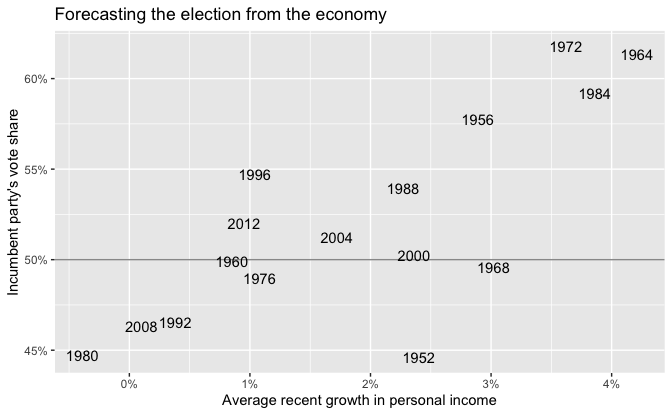

Linear regression.

The option `refresh = 0` suppresses the default Stan sampling progress
output. This is useful for small data with fast computation. For more
complex models and bigger data, it can be useful to see the progress.

``` r
set.seed(264)

fit <- stan_glm(vote ~ growth, data = hibbs, refresh = 0)
```

Print default summary of the fitted model.

``` r
fit
```

    #> stan_glm
    #>  family:       gaussian [identity]
    #>  formula:      vote ~ growth
    #>  observations: 16
    #>  predictors:   2
    #> ------
    #>             Median MAD_SD
    #> (Intercept) 46.3    1.7  
    #> growth       3.1    0.7  
    #> 
    #> Auxiliary parameter(s):
    #>       Median MAD_SD
    #> sigma 3.9    0.7   
    #> 
    #> ------
    #> * For help interpreting the printed output see ?print.stanreg
    #> * For info on the priors used see ?prior_summary.stanreg

Print summary of the priors used.

``` r
prior_summary(fit)
```

    #> Priors for model 'fit' 
    #> ------
    #> Intercept (after predictors centered)
    #>   Specified prior:
    #>     ~ normal(location = 52, scale = 2.5)
    #>   Adjusted prior:
    #>     ~ normal(location = 52, scale = 14)
    #> 
    #> Coefficients
    #>   Specified prior:
    #>     ~ normal(location = 0, scale = 2.5)
    #>   Adjusted prior:
    #>     ~ normal(location = 0, scale = 10)
    #> 
    #> Auxiliary (sigma)
    #>   Specified prior:
    #>     ~ exponential(rate = 1)
    #>   Adjusted prior:
    #>     ~ exponential(rate = 0.18)
    #> ------
    #> See help('prior_summary.stanreg') for more details

Almost all models in Regression and Other Stories have very good
sampling behavior. `summary()` function can be used to obtain the
summary of the convergence diagnostics for MCMC sampling.

``` r
summary(fit)
```

    #> 
    #> Model Info:
    #>  function:     stan_glm
    #>  family:       gaussian [identity]
    #>  formula:      vote ~ growth
    #>  algorithm:    sampling
    #>  sample:       4000 (posterior sample size)
    #>  priors:       see help('prior_summary')
    #>  observations: 16
    #>  predictors:   2
    #> 
    #> Estimates:
    #>               mean   sd   10%   50%   90%
    #> (Intercept) 46.3    1.8 44.1  46.3  48.5 
    #> growth       3.0    0.8  2.1   3.1   4.0 
    #> sigma        4.0    0.8  3.1   3.9   5.1 
    #> 
    #> Fit Diagnostics:
    #>            mean   sd   10%   50%   90%
    #> mean_PPD 52.1    1.5 50.2  52.1  53.9 
    #> 
    #> The mean_ppd is the sample average posterior predictive distribution of the outcome variable (for details see help('summary.stanreg')).
    #> 
    #> MCMC diagnostics
    #>               mcse Rhat n_eff
    #> (Intercept)   0.0  1.0  3056 
    #> growth        0.0  1.0  3162 
    #> sigma         0.0  1.0  2352 
    #> mean_PPD      0.0  1.0  3299 
    #> log-posterior 0.0  1.0  1256 
    #> 
    #> For each parameter, mcse is Monte Carlo standard error, n_eff is a crude measure of effective sample size, and Rhat is the potential scale reduction factor on split chains (at convergence Rhat=1).

Posterior interval.

``` r
posterior_interval(fit) %>% 
  round(digits = 1)
```

    #>               5%  95%
    #> (Intercept) 43.5 49.1
    #> growth       1.8  4.3
    #> sigma        3.0  5.5

Data and linear fit.

``` r
intercept <- coef(fit)[["(Intercept)"]]
slope <- coef(fit)[["growth"]]
eqn <- 
  str_glue(
    "y = {format(intercept, digits = 1, nsmall = 1)} + ",
    "{format(slope, digits = 1, nsmall = 1)} x"
  )

hibbs %>% 
  ggplot(aes(growth, vote)) +
  geom_hline(yintercept = 50, color = "grey60") +
  geom_abline(slope = slope, intercept = intercept) +
  geom_point() +
  annotate("text", x = 3.05, y = 53.75, label = eqn, hjust = 0) +
  scale_x_continuous(labels = scales::label_percent(accuracy = 1, scale = 1)) +
  scale_y_continuous(labels = scales::label_percent(accuracy = 1, scale = 1)) +
  labs(
    title = "Data and linear fit",
    x = "Average recent growth in personal income",
    y = "Incumbent party's vote share"
  )
```

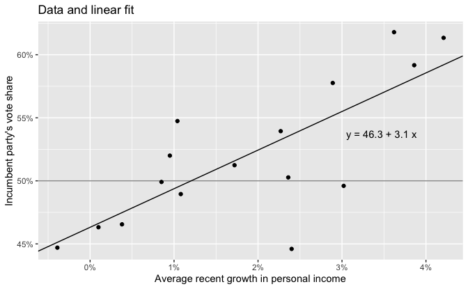

# 7 Linear regression with a single predictor

## 7.1 Example: predicting presidential vote share from the economy

Forecasting elections from the economy.

``` r
v <- 
  hibbs %>% 
  mutate(
    label = str_glue("  {inc_party_candidate} vs. {other_candidate} ({year})  "),
    hjust = 
      if_else(
        year %in% c(1960, 1964, 1972, 1976, 1984, 1996, 2012),
        "right",
        "left"
      ),
    vjust =
      case_when(
        year == 1992 ~ 0,
        year == 2000 ~ 0.2,
        year %in% c(1960, 2008) ~ 1,
        TRUE ~ 0.5
      )
  )

v %>% 
  ggplot(aes(growth, vote)) +
  geom_hline(yintercept = 50, color = "grey60") +
  geom_point() +
  geom_text(aes(label = label, hjust = hjust, vjust = vjust)) +
  scale_x_continuous(
    labels = scales::label_percent(accuracy = 1, scale = 1),
    expand = expansion(add = c(0.8, 1.2))
  ) +
  scale_y_continuous(labels = scales::label_percent(accuracy = 1, scale = 1)) +
  labs(
    title = "Forecasting elections from the economy",
    x = "Income growth",
    y = "Incumbent party's share of the popular vote"
  )
```

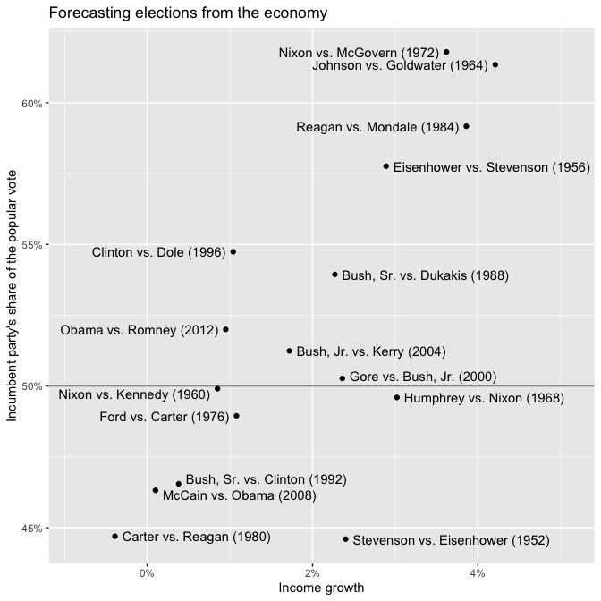

### Fitting a linear model to data

Data

``` r
hibbs <- 
  file_hibbs %>% 
  read.table(header = TRUE) %>% 
  as_tibble()

hibbs
```

    #> # A tibble: 16 x 5
    #>     year growth  vote inc_party_candidate other_candidate
    #>    <int>  <dbl> <dbl> <chr>               <chr>          
    #>  1  1952   2.4   44.6 Stevenson           Eisenhower     
    #>  2  1956   2.89  57.8 Eisenhower          Stevenson      
    #>  3  1960   0.85  49.9 Nixon               Kennedy        
    #>  4  1964   4.21  61.3 Johnson             Goldwater      
    #>  5  1968   3.02  49.6 Humphrey            Nixon          
    #>  6  1972   3.62  61.8 Nixon               McGovern       
    #>  7  1976   1.08  49.0 Ford                Carter         
    #>  8  1980  -0.39  44.7 Carter              Reagan         
    #>  9  1984   3.86  59.2 Reagan              Mondale        
    #> 10  1988   2.27  53.9 Bush, Sr.           Dukakis        
    #> # … with 6 more rows

Fit linear model.

``` r
set.seed(264)

fit <- stan_glm(vote ~ growth, data = hibbs, refresh = 0)
```

### Understanding the fitted model

``` r
fit
```

    #> stan_glm
    #>  family:       gaussian [identity]
    #>  formula:      vote ~ growth
    #>  observations: 16
    #>  predictors:   2
    #> ------
    #>             Median MAD_SD
    #> (Intercept) 46.3    1.7  
    #> growth       3.1    0.7  
    #> 
    #> Auxiliary parameter(s):
    #>       Median MAD_SD
    #> sigma 3.9    0.7   
    #> 
    #> ------
    #> * For help interpreting the printed output see ?print.stanreg
    #> * For info on the priors used see ?prior_summary.stanreg

### Graphing the fitted regression line

Plots are in [Section 1.2](#12-why-learn-regression).

### Using the model to predict

Probability forecast of Hillary Clinton vote share in 2016.

``` r
growth <- 2

vote_pred <- predict(fit, newdata = tibble(growth = growth))
sd <- sigma(fit)

v <- 
  tibble(
    vote = c(50, seq(vote_pred - 4 * sd, vote_pred + 4 * sd, length.out = 201)),
    y = dnorm(vote, mean = vote_pred, sd = sd)
  )

label <-
  str_glue(
    "Predicted\n",
    "{format(100 * (1 - pnorm(50, mean = vote_pred, sd = sd)), digits = 0)}% ",
    "chance\n",
    "of Clinton victory"
  )

v %>% 
  ggplot(aes(vote, y)) +
  geom_area(data = . %>% filter(vote >= 50), fill = "grey70") +
  geom_line() +
  geom_segment(
    aes(x = 50, xend = 50, y = 0, yend = dnorm(50, mean = vote_pred, sd = sd))
  ) +
  annotate("text", x = 51.5, y = 0.025, label = label, hjust = 0) +
  scale_x_continuous(
    breaks = scales::breaks_width(5),
    labels = scales::label_percent(accuracy = 1, scale = 1)
  ) +
  scale_y_continuous(breaks = 0) +
  labs(
    title = "Probability forecast of Hillary Clinton vote share in 2016",
    subtitle = str_glue("Based upon {growth}% rate of economic growth"),
    x = "Clinton share of the two-party vote",
    y = NULL
  )
```

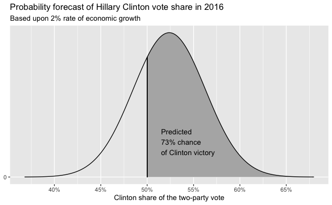

# 8 Fitting regression models

## 8.1 Least squares, maximum likelihood, and Bayesian inference

### Where do the standard errors come from? Using the likelihood surface to assess uncertainty in the parameter estimates

Data and linear fit.

``` r
hibbs %>% 
  ggplot(aes(growth, vote)) +
  geom_abline(slope = slope, intercept = intercept) +
  geom_point() +
  annotate("text", x = 3.05, y = 53.75, label = eqn, hjust = 0) +
  scale_x_continuous(labels = scales::label_percent(accuracy = 1, scale = 1)) +
  scale_y_continuous(labels = scales::label_percent(accuracy = 1, scale = 1)) +
  labs(
    title = "Data and linear fit",
    x = "Average recent growth in personal income",
    y = "Incumbent party's vote share"
  )
```

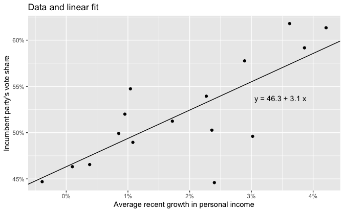

Data and range of possible linear fits.

``` r
sims <- as_tibble(fit)
```

``` r
set.seed(189)

n_lines <- 50

hibbs %>% 
  ggplot(aes(growth, vote)) +
  geom_abline(
    aes(slope = growth, intercept = `(Intercept)`),
    data = sims %>% slice_sample(n = n_lines),
    alpha = 0.25
  ) +
  geom_abline(slope = slope, intercept = intercept, color = "red") +
  geom_point(color = "white", size = 2) +
  geom_point() +
  scale_x_continuous(labels = scales::label_percent(accuracy = 1, scale = 1)) +
  scale_y_continuous(labels = scales::label_percent(accuracy = 1, scale = 1)) +
  labs(
    title = "Data and range of possible linear fits",
    x = "Average recent growth in personal income",
    y = "Incumbent party's vote share"
  )
```

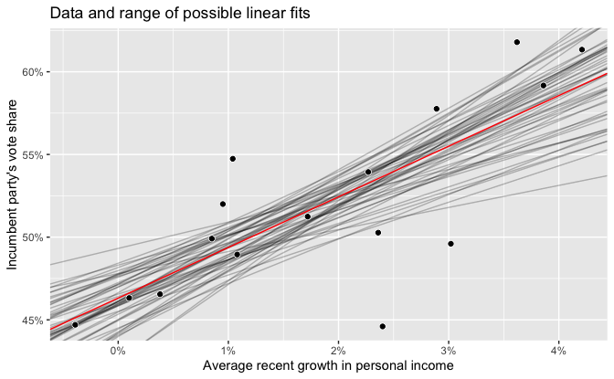

This plot shows a range of lines that are consistent with the data, with
the lines representing 50 draws from the Bayesian posterior
distribution.

# 9 Prediction and Bayesian inference

## 9.1 Propagating uncertainty in inference using posterior simulations

The fit for the election forecasting model above.

``` r
print(fit, digits = 2)
```

    #> stan_glm
    #>  family:       gaussian [identity]
    #>  formula:      vote ~ growth
    #>  observations: 16
    #>  predictors:   2
    #> ------
    #>             Median MAD_SD
    #> (Intercept) 46.32   1.71 
    #> growth       3.06   0.73 
    #> 
    #> Auxiliary parameter(s):
    #>       Median MAD_SD
    #> sigma 3.90   0.73  
    #> 
    #> ------
    #> * For help interpreting the printed output see ?print.stanreg
    #> * For info on the priors used see ?prior_summary.stanreg

Extract the simulations.

``` r
sims <- as_tibble(fit)
```

Median and median absolute deviation of parameters.

``` r
sims %>% 
  pivot_longer(
    cols = everything(),
    names_to = "param"
  ) %>% 
  group_by(param) %>% 
  summarize(
    median = median(value),
    mad = mad(value)
  )
```

    #> # A tibble: 3 x 3
    #>   param       median   mad
    #> * <chr>        <dbl> <dbl>
    #> 1 (Intercept)  46.3  1.71 
    #> 2 growth        3.06 0.730
    #> 3 sigma         3.90 0.732

For convenience, we sometimes call the posterior median absolute
deviation the “standard error,” as this is the term typically used by
practitioners to represent inferential uncertainty.

### Uncertainty in the regression coefficients and implied uncertainty in the regression line

Rename intercept and slope.

``` r
sims <- 
  sims %>% 
  rename(a = "(Intercept)", b = "growth")
```

Posterior simulations of the intercept.

``` r
a_median <- median(sims$a)
a_mad <- mad(sims$a)
lines_mad <- a_median + setdiff(-2:2, 0) * a_mad

sims %>% 
  ggplot(aes(a)) +
  geom_histogram(binwidth = 0.5, boundary = 0) +
  geom_vline(xintercept = a_median, color = "red") +
  geom_vline(xintercept = lines_mad, color = "grey60") +
  scale_x_continuous(breaks = scales::breaks_width(2)) +
  labs(
    title = "Posterior simulations of the intercept",
    subtitle = 
      "With posterior median in red and ±1 and 2 standard errors in grey"
  )
```

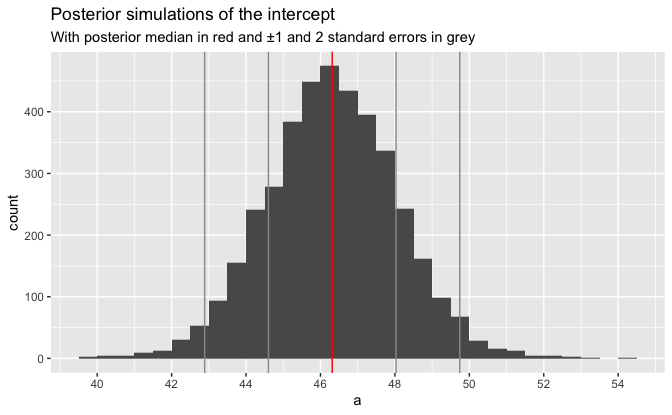

Posterior simulations of the slope.

``` r
b_median <- median(sims$b)
b_mad <- mad(sims$b)
lines_mad <- b_median + setdiff(-2:2, 0) * b_mad

sims %>% 
  ggplot(aes(b)) +
  geom_histogram(binwidth = 0.2, boundary = 0) +
  geom_vline(xintercept = b_median, color = "red") +
  geom_vline(xintercept = lines_mad, color = "grey60") +
  scale_x_continuous(breaks = scales::breaks_width(1)) +
  labs(
    title = "Posterior simulations of the slope",
    subtitle = 
      "With posterior median in red and ±1 and 2 standard errors in grey"
  )
```

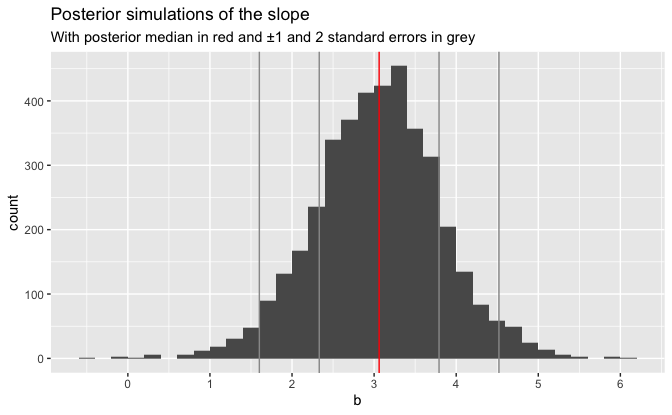

Posterior draws of the regression coefficients a, b.

``` r
a <- coef(fit)[["(Intercept)"]]
b <- coef(fit)[["growth"]]

sims %>% 
  ggplot(aes(a, b)) +
  geom_point(size = 0.1) +
  geom_point(data = tibble(a = a, b = b), color = "red", size = 1.5) +
  scale_x_continuous(breaks = scales::breaks_width(2)) +
  labs(title = "Posterior draws of the regression coefficients a, b")
```

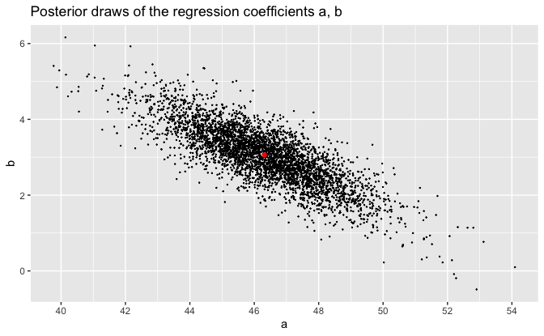

``` r
n_lines <- 100
```

Data and 100 posterior draws of the line, y = a + b x.

``` r
set.seed(189)

hibbs %>% 
  ggplot(aes(growth, vote)) +
  geom_abline(
    aes(slope = b, intercept = a),
    data = sims %>% slice_sample(n = n_lines),
    alpha = 0.25
  ) +
  geom_abline(slope = b, intercept = a, color = "red") +
  geom_point(color = "white", size = 2) +
  geom_point() +
  scale_x_continuous(labels = scales::label_percent(accuracy = 1, scale = 1)) +
  scale_y_continuous(labels = scales::label_percent(accuracy = 1, scale = 1)) +
  labs(
    title = 
      str_glue("Data and {n_lines} posterior draws of the line, y = a + b x"),
    x = "Average recent growth in personal income",
    y = "Incumbent party's vote share"
  )
```

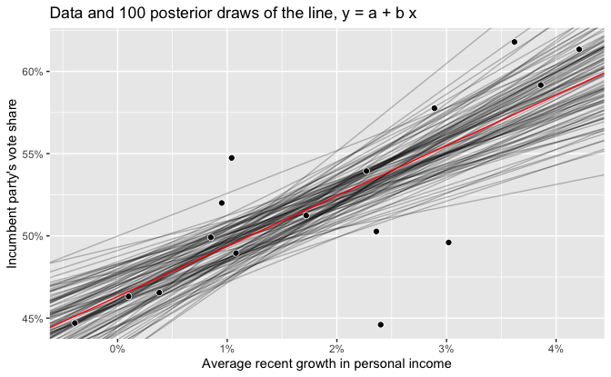

Data and linear fit with 50% and 90% predictive intervals.

``` r
v <- 
  tibble(growth = seq_range(hibbs$growth)) %>% 
  predictive_intervals(fit = fit)

v %>% 
  ggplot(aes(growth)) +
  geom_ribbon(aes(ymin = `5%`, ymax = `95%`), alpha = 0.25) +
  geom_ribbon(aes(ymin = `25%`, ymax = `75%`), alpha = 0.5) +
  geom_line(aes(y = .pred)) +
  geom_point(aes(y = vote), data = hibbs, color = "white", size = 2) +
  geom_point(aes(y = vote), data = hibbs) +
  scale_x_continuous(labels = scales::label_percent(accuracy = 1, scale = 1)) +
  scale_y_continuous(labels = scales::label_percent(accuracy = 1, scale = 1)) +
  labs(
    title = "Data and linear fit with 50% and 90% predictive intervals",
    x = "Average recent growth in personal income",
    y = "Incumbent party's vote share"
  )
```

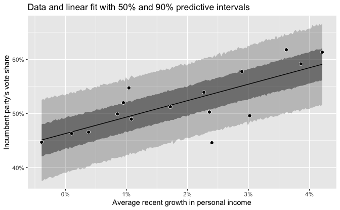

### Using the matrix of posterior simulations to express uncertainty about a parameter estimate or function of parameter estimates

Median and standard error for a derived quantity a / b.

``` r
sims %>% 
  mutate(z = a / b) %>% 
  summarize(across(z, list(median = median, mad = mad)))
```

    #> # A tibble: 1 x 2
    #>   z_median z_mad
    #>      <dbl> <dbl>
    #> 1     15.1  3.92

## 9.2 Prediction and uncertainty: `predict()`, `posterior_linpred()`, and `posterior_predict()`

### Point prediction using `predict()`

Point prediction given 2% growth.

``` r
new <- tibble(growth = 2)

y_point_pred <- predict(fit, newdata = new)
```

Manual calculation for point prediction.

``` r
y_point_pred_manual <- mean(sims$a + sims$b * new$growth)

y_point_pred_manual - as.double(y_point_pred)
```

    #> [1] 0

### Linear predictor with uncertainty using `posterior_linpred()`

Create a linear prediction for each of the 4000 posterior simulations of
the model parameters.

``` r
y_linpred <- posterior_linpred(fit, newdata = new)
```

Manual calculation for linear predictions.

``` r
y_linpred_manual <- sims$a + sims$b * new$growth

max(abs(y_linpred_manual - y_linpred))
```

    #> [1] 0

### Predictive distribution for a new observation using `posterior_predict()`

Predictive uncertainty.

``` r
set.seed(835)

y_pred <- posterior_predict(fit, newdata = new)
```

Manual calculation for predictive uncertainty.

``` r
set.seed(835)

y_pred_manual <- 
  sims$a + sims$b * new$growth + rnorm(nrow(sims), mean = 0, sd = sims$sigma)

max(abs(y_pred_manual - y_pred))
```

    #> [1] 0

Predicted percentage of two-party vote with 2% growth.

``` r
tibble(y_pred = as.numeric(y_pred)) %>% 
  ggplot(aes(y_pred)) +
  geom_histogram(binwidth = 1) +
  geom_vline(xintercept = median(y_pred), color = "red") +
  scale_x_continuous(breaks = scales::breaks_width(2)) +
  labs(
    title = 
      str_glue(
        "Predicted percentage of two-party vote with {new$growth}% growth"
      ),
    subtitle = 
      str_glue(
        "Median prediction is {format(median(y_pred), digits = 1, nsmall = 1)}%"
      ),
    x = "Percentage of two-party vote",
    y = "Count"
  )
```

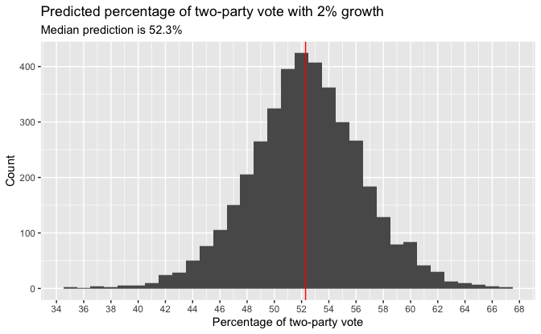

Summary of predictions.

``` r
cat(
  str_glue(
    "Predicted Clinton percentage of two-party vote: ",
    "{format(median(y_pred), digits = 1, nsmall = 1)} with s.e. ",
    "{format(mad(y_pred), digits = 1, nsmall = 1)}\n",
    "Pr(Clinton win) = {format(mean(y_pred > 50), digits = 2, nsmall = 2)}"
  )
)
```

    Predicted Clinton percentage of two-party vote: 52.3 with s.e. 3.9
    Pr(Clinton win) = 0.73

### Prediction given a range of input values

We can also generate a range of predicted values, for example,
predicting the election outcome for a grid of possible values of
economic growth from -2% to 4%.

``` r
new_grid <- tibble(growth = seq(-2, 4, 0.5))
y_point_pred_grid <- predict(fit, newdata = new_grid)
y_linpred_grid <- posterior_linpred(fit, newdata = new_grid)
y_pred_grid <- posterior_predict(fit, newdata = new_grid)
```

### Propagating uncertainty

Let us say, in advance of the election, our best estimate of economic
growth was 2.0% but with some uncertainty that we shall express as a
normal distribution with standard deviation 0.3%. We can then *propagate
the uncertainty* in this predictor to obtain a forecast distribution
that more completely expresses our uncertainty.

``` r
set.seed(672)

v <- 
  tibble(
    x_new = rnorm(nrow(sims), mean = 2, sd = 0.3),
    y_pred = rnorm(nrow(sims), mean = sims$a + sims$b * x_new, sd = sims$sigma)
  )

cat(
  str_glue(
    "Predicted Clinton percentage of two-party vote: ",
    "{format(median(v$y_pred), digits = 1, nsmall = 1)} with s.e. ",
    "{format(mad(v$y_pred), digits = 1, nsmall = 1)}\n",
    "Pr(Clinton win) = {format(mean(v$y_pred > 50), digits = 2, nsmall = 2)}"
  )
)
```

    Predicted Clinton percentage of two-party vote: 52.3 with s.e. 4.3
    Pr(Clinton win) = 0.71

## 9.5 Uniform, weakly informative, and informative priors in regression

### Uniform prior distribution

Fit linear regression with uniform prior.

``` r
set.seed(264)

fit_uniform <-
  stan_glm(
    vote ~ growth,
    data = hibbs,
    refresh = 0,
    prior = NULL,
    prior_intercept = NULL,
    prior_aux = NULL
  )

fit_uniform
```

    #> stan_glm
    #>  family:       gaussian [identity]
    #>  formula:      vote ~ growth
    #>  observations: 16
    #>  predictors:   2
    #> ------
    #>             Median MAD_SD
    #> (Intercept) 46.2    1.8  
    #> growth       3.1    0.7  
    #> 
    #> Auxiliary parameter(s):
    #>       Median MAD_SD
    #> sigma 4.0    0.8   
    #> 
    #> ------
    #> * For help interpreting the printed output see ?print.stanreg
    #> * For info on the priors used see ?prior_summary.stanreg

Posterior draws of the regression coefficients a, b.

``` r
sims_uniform <- 
  as_tibble(fit_uniform) %>% 
  rename(a = "(Intercept)", b = "growth")

a <- coef(fit_uniform)[["(Intercept)"]]
b <- coef(fit_uniform)[["growth"]]

sims_uniform %>% 
  ggplot(aes(a, b)) +
  geom_point(size = 0.1) +
  geom_point(data = tibble(a = a, b = b), color = "red", size = 1.5) +
  scale_x_continuous(breaks = scales::breaks_width(2)) +
  labs(
    title = 
      "Posterior draws of the regression coefficients a, b",
    subtitle = "Uniform prior"
  )
```

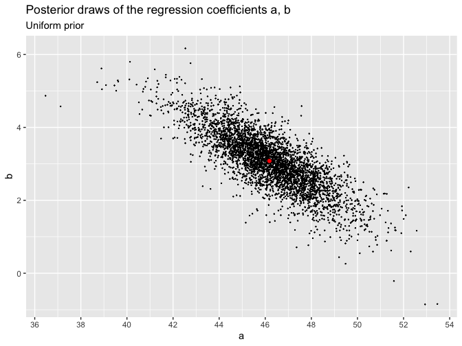

### Default prior distribution

Fit linear regression with implicit default prior.

``` r
set.seed(264)

fit_default_implicit <- stan_glm(vote ~ growth, data = hibbs, refresh = 0)

fit_default_implicit
```

    #> stan_glm
    #>  family:       gaussian [identity]
    #>  formula:      vote ~ growth
    #>  observations: 16
    #>  predictors:   2
    #> ------
    #>             Median MAD_SD
    #> (Intercept) 46.3    1.7  
    #> growth       3.1    0.7  
    #> 
    #> Auxiliary parameter(s):
    #>       Median MAD_SD
    #> sigma 3.9    0.7   
    #> 
    #> ------
    #> * For help interpreting the printed output see ?print.stanreg
    #> * For info on the priors used see ?prior_summary.stanreg

``` r
prior_summary(fit_default_implicit)
```

    #> Priors for model 'fit_default_implicit' 
    #> ------
    #> Intercept (after predictors centered)
    #>   Specified prior:
    #>     ~ normal(location = 52, scale = 2.5)
    #>   Adjusted prior:
    #>     ~ normal(location = 52, scale = 14)
    #> 
    #> Coefficients
    #>   Specified prior:
    #>     ~ normal(location = 0, scale = 2.5)
    #>   Adjusted prior:
    #>     ~ normal(location = 0, scale = 10)
    #> 
    #> Auxiliary (sigma)
    #>   Specified prior:
    #>     ~ exponential(rate = 1)
    #>   Adjusted prior:
    #>     ~ exponential(rate = 0.18)
    #> ------
    #> See help('prior_summary.stanreg') for more details

Fit linear regression with explicit default prior.

``` r
set.seed(264)

y_mean <- mean(hibbs$vote)
x_sd <- sd(hibbs$growth)
y_sd <- sd(hibbs$vote)

fit_default_explicit <-
  stan_glm(
    vote ~ growth,
    data = hibbs,
    refresh = 0,
    prior = normal(location = 0, scale = 2.5 * y_sd / x_sd),
    prior_intercept = normal(location = y_mean, scale = 2.5 * y_sd),
    prior_aux = exponential(rate = 1 / y_sd)
  )

fit_default_explicit
```

    #> stan_glm
    #>  family:       gaussian [identity]
    #>  formula:      vote ~ growth
    #>  observations: 16
    #>  predictors:   2
    #> ------
    #>             Median MAD_SD
    #> (Intercept) 46.3    1.7  
    #> growth       3.1    0.7  
    #> 
    #> Auxiliary parameter(s):
    #>       Median MAD_SD
    #> sigma 3.9    0.7   
    #> 
    #> ------
    #> * For help interpreting the printed output see ?print.stanreg
    #> * For info on the priors used see ?prior_summary.stanreg

``` r
prior_summary(fit_default_explicit)
```

    #> Priors for model 'fit_default_explicit' 
    #> ------
    #> Intercept (after predictors centered)
    #>  ~ normal(location = 52, scale = 14)
    #> 
    #> Coefficients
    #>  ~ normal(location = 0, scale = 10)
    #> 
    #> Auxiliary (sigma)
    #>  ~ exponential(rate = 0.18)
    #> ------
    #> See help('prior_summary.stanreg') for more details

The models with implicit and explicit default priors are the same.

### Weakly informative prior distribution based on subject-matter knowledge

Fit linear regression with weakly informative prior.

``` r
set.seed(264)

fit_inform <-
  stan_glm(
    vote ~ growth,
    data = hibbs,
    refresh = 0,
    prior = normal(location = 5, scale = 5),
    prior_intercept = normal(location = 50, scale = 10)
  )

fit_inform
```

    #> stan_glm
    #>  family:       gaussian [identity]
    #>  formula:      vote ~ growth
    #>  observations: 16
    #>  predictors:   2
    #> ------
    #>             Median MAD_SD
    #> (Intercept) 46.2    1.6  
    #> growth       3.1    0.7  
    #> 
    #> Auxiliary parameter(s):
    #>       Median MAD_SD
    #> sigma 3.9    0.7   
    #> 
    #> ------
    #> * For help interpreting the printed output see ?print.stanreg
    #> * For info on the priors used see ?prior_summary.stanreg

``` r
prior_summary(fit_inform)
```

    #> Priors for model 'fit_inform' 
    #> ------
    #> Intercept (after predictors centered)
    #>  ~ normal(location = 50, scale = 10)
    #> 
    #> Coefficients
    #>  ~ normal(location = 5, scale = 5)
    #> 
    #> Auxiliary (sigma)
    #>   Specified prior:
    #>     ~ exponential(rate = 1)
    #>   Adjusted prior:
    #>     ~ exponential(rate = 0.18)
    #> ------
    #> See help('prior_summary.stanreg') for more details

These inferences are essentially identical to the earlier results with
the flat prior and the default prior, which makes sense in this
particular example, because here our prior contains very little
information compared to the data (as can be seen because the posterior
standard error (mad sd) of b is 0.7, is much smaller than the prior
standard deviation of 5).

# 22 Advanced regression and multilevel methods

## 22.8 Computational efficiency

Let’s return to the model fit in [Section 1.2](#12-why-learn-regression)
and plotted in [Section
8.1](#81-least-squares-maximum-likelihood-and-bayesian-inference). We
can check the convergence diagnostics:

``` r
summary(fit)
```

    #> 
    #> Model Info:
    #>  function:     stan_glm
    #>  family:       gaussian [identity]
    #>  formula:      vote ~ growth
    #>  algorithm:    sampling
    #>  sample:       4000 (posterior sample size)
    #>  priors:       see help('prior_summary')
    #>  observations: 16
    #>  predictors:   2
    #> 
    #> Estimates:
    #>               mean   sd   10%   50%   90%
    #> (Intercept) 46.3    1.8 44.1  46.3  48.5 
    #> growth       3.0    0.8  2.1   3.1   4.0 
    #> sigma        4.0    0.8  3.1   3.9   5.1 
    #> 
    #> Fit Diagnostics:
    #>            mean   sd   10%   50%   90%
    #> mean_PPD 52.1    1.5 50.2  52.1  53.9 
    #> 
    #> The mean_ppd is the sample average posterior predictive distribution of the outcome variable (for details see help('summary.stanreg')).
    #> 
    #> MCMC diagnostics
    #>               mcse Rhat n_eff
    #> (Intercept)   0.0  1.0  3056 
    #> growth        0.0  1.0  3162 
    #> sigma         0.0  1.0  2352 
    #> mean_PPD      0.0  1.0  3299 
    #> log-posterior 0.0  1.0  1256 
    #> 
    #> For each parameter, mcse is Monte Carlo standard error, n_eff is a crude measure of effective sample size, and Rhat is the potential scale reduction factor on split chains (at convergence Rhat=1).

The relevant diagnostic part of the output is:

``` r
summary(fit)[c("(Intercept)", "growth", "sigma"), c("mcse", "Rhat", "n_eff")]
```

    #>               mcse Rhat n_eff
    #> (Intercept) 0.0319    1  3056
    #> growth      0.0136    1  3162
    #> sigma       0.0167    1  2352

`Rhat` denotes the split-*R̂* convergence diagnostic, which compares the
results from different chains, reaching the value 1 at convergence and
being higher than 1 for chains that have not fully mixed. `n_eff`
denotes the effective sample size of the Hamiltonian Monte Carlo run,
which due to its iterative nature can be less or more than the
efficiency of independent draws. Usually, `n_eff` &gt; 400 is sufficient
for reliable diagnostics and accurate parameter estimates. `mcse` stands
for Monte Carlo standard error, which is the additional uncertainty due
to using a stochastic algorithm (not to be confused with the uncertainty
presented by the posterior distribution).
