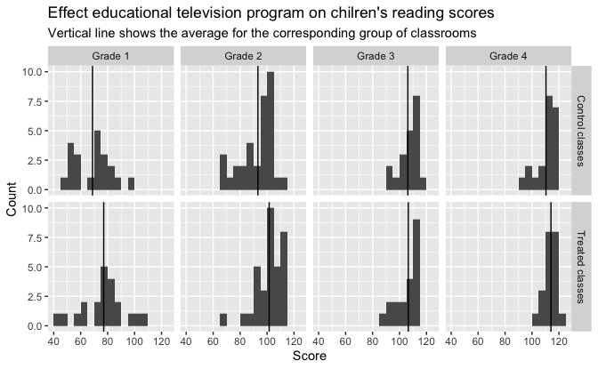
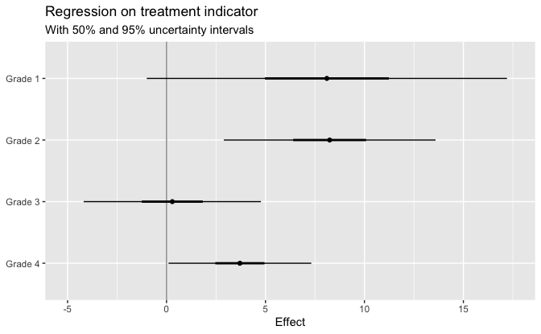
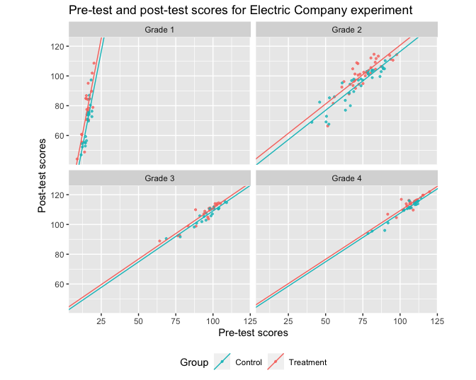
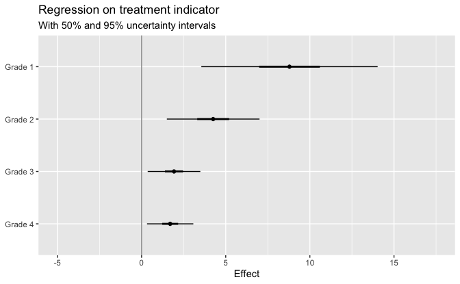
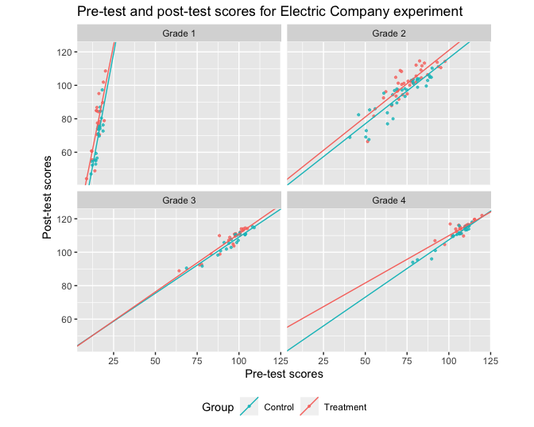
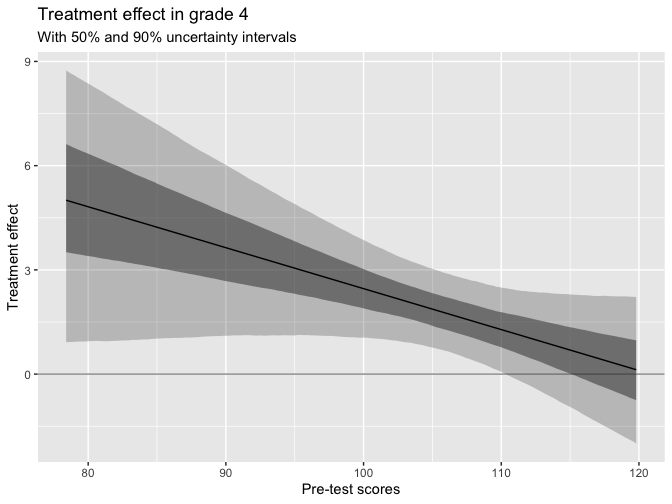
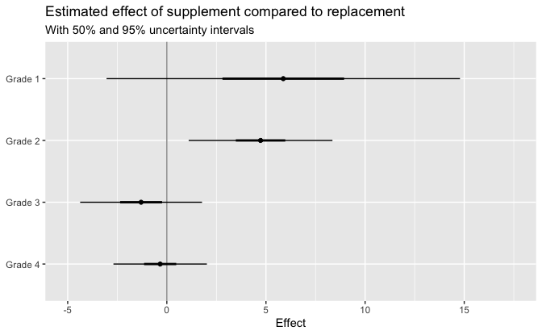
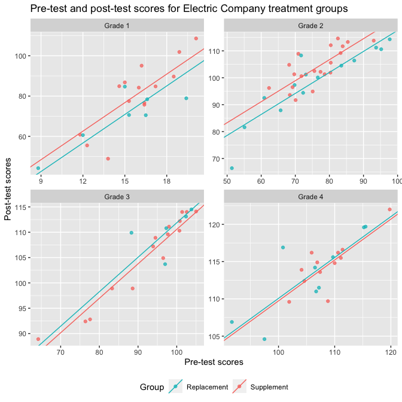

Regression and Other Stories: Electric Company
================
Andrew Gelman, Jennifer Hill, Aki Vehtari
2021-04-20

-   [1 Overview](#1-overview)
    -   [1.3 Some examples of
        regression](#13-some-examples-of-regression)
        -   [A randomized experiment on the effect of an educational
            television
            program](#a-randomized-experiment-on-the-effect-of-an-educational-television-program)
-   [16 Design and sample size
    decisions](#16-design-and-sample-size-decisions)
    -   [16.8 Exercises](#168-exercises)
-   [19 Causal inference using direct
    regression](#19-causal-inference-using-direct-regression)
    -   [19.2 Example: the effect of showing children an educational
        television
        show](#192-example-the-effect-of-showing-children-an-educational-television-show)
        -   [Displaying the data two different
            ways](#displaying-the-data-two-different-ways)
        -   [Simple difference estimate (equivalently, regression on an
            indicator for treatment), appropriate for a completely
            randomized experiment with no pre-treatment
            variables](#simple-difference-estimate-equivalently-regression-on-an-indicator-for-treatment-appropriate-for-a-completely-randomized-experiment-with-no-pre-treatment-variables)
        -   [Separate analysis within each
            grade](#separate-analysis-within-each-grade)
    -   [19.3 Including pre-treatment
        predictors](#193-including-pre-treatment-predictors)
        -   [Adjusting for pre-test to get more precise
            estimates](#adjusting-for-pre-test-to-get-more-precise-estimates)
        -   [Benefits of adjusting for pre-treatment
            score](#benefits-of-adjusting-for-pre-treatment-score)
    -   [19.4 Varying treatment effects, interactions, and
        poststratification](#194-varying-treatment-effects-interactions-and-poststratification)
-   [20 Observational studies with measured
    confounders](#20-observational-studies-with-measured-confounders)
    -   [20.2 Using regression to estimate a causal effect from
        observational
        data](#202-using-regression-to-estimate-a-causal-effect-from-observational-data)
        -   [Setting up a regression for causal
            inference](#setting-up-a-regression-for-causal-inference)
    -   [20.4 Imbalance and lack of complete
        overlap](#204-imbalance-and-lack-of-complete-overlap)
        -   [Examining overlap in the Electric Company embedded
            observational
            study](#examining-overlap-in-the-electric-company-embedded-observational-study)

Tidyverse version by Bill Behrman.

Analysis of “Electric company” data. See Chapters 1, 16, 19, and 20 in
Regression and Other Stories.

------------------------------------------------------------------------

``` r
# Packages
library(tidyverse)
library(rstanarm)

# Parameters
  # Results of educational experiment
file_electric <- here::here("ElectricCompany/data/electric.csv") 
  # Results of educational experiment in wide format
file_electric_wide <- here::here("ElectricCompany/data/electric_wide.txt")
  # Common code
file_common <- here::here("_common.R")

#===============================================================================

# Run common code
source(file_common)
```

# 1 Overview

## 1.3 Some examples of regression

### A randomized experiment on the effect of an educational television program

Data

``` r
electric_wide <- read_table2(file_electric_wide)

glimpse(electric_wide)
```

    #> Rows: 96
    #> Columns: 7
    #> $ city             <chr> "Fresno", "Fresno", "Fresno", "Fresno", "Fresno", "Fr…
    #> $ grade            <dbl> 1, 1, 1, 1, 1, 1, 1, 1, 1, 1, 1, 2, 2, 2, 2, 2, 2, 2,…
    #> $ treated_pretest  <dbl> 13.8, 16.5, 18.5, 8.8, 15.3, 15.0, 19.4, 15.0, 11.8, …
    #> $ treated_posttest <dbl> 48.9, 70.5, 89.7, 44.2, 77.5, 84.7, 78.9, 86.8, 60.8,…
    #> $ control_pretest  <dbl> 12.3, 14.4, 17.7, 11.5, 16.4, 16.8, 18.7, 18.2, 15.4,…
    #> $ control_posttest <dbl> 52.3, 55.0, 80.4, 47.0, 69.7, 74.1, 72.7, 97.3, 74.1,…
    #> $ supplement       <chr> "Supplement", "Replace", "Supplement", "Replace", "Su…

Effect educational television program on children’s reading scores.

``` r
electric_post <- 
  electric_wide %>% 
  pivot_longer(
    cols = matches("(control|treated)_(pretest|posttest)"),
    names_to = c("group", "test"),
    names_pattern = "(.*)_(.*)",
    values_to = "score"
  ) %>% 
  filter(test == "posttest")

score_means <- 
  electric_post %>% 
  group_by(grade, group) %>% 
  summarize(score_mean = mean(score)) %>% 
  ungroup()

grade_labels <- function(x) str_glue("Grade {x}")
group_labels <- 
  c(
    control = "Control classes",
    treated = "Treated classes"
  )

electric_post %>% 
  ggplot(aes(score)) +
  geom_histogram(binwidth = 5, boundary = 0) +
  geom_vline(aes(xintercept = score_mean), data = score_means) +
  facet_grid(
    rows = vars(group),
    cols = vars(grade),
    labeller = labeller(grade = grade_labels, group = group_labels)
  ) + 
  labs(
    title = 
      "Effect educational television program on chilren's reading scores",
    subtitle = 
      "Vertical line shows the average for the corresponding group of classrooms",
    x = "Score",
    y = "Count"
  )
```



# 16 Design and sample size decisions

## 16.8 Exercises

# 19 Causal inference using direct regression

## 19.2 Example: the effect of showing children an educational television show

### Displaying the data two different ways

The plot in this section was done in [Section
1.3](#13-some-examples-of-regression) above.

### Simple difference estimate (equivalently, regression on an indicator for treatment), appropriate for a completely randomized experiment with no pre-treatment variables

Data

``` r
electric <-
  read_csv(file_electric) %>% 
  select(!X1)

glimpse(electric)
```

    #> Rows: 192
    #> Columns: 6
    #> $ post_test <dbl> 48.9, 70.5, 89.7, 44.2, 77.5, 84.7, 78.9, 86.8, 60.8, 75.7, …
    #> $ pre_test  <dbl> 13.8, 16.5, 18.5, 8.8, 15.3, 15.0, 19.4, 15.0, 11.8, 16.4, 1…
    #> $ grade     <dbl> 1, 1, 1, 1, 1, 1, 1, 1, 1, 1, 1, 2, 2, 2, 2, 2, 2, 2, 2, 2, …
    #> $ treatment <dbl> 1, 1, 1, 1, 1, 1, 1, 1, 1, 1, 1, 1, 1, 1, 1, 1, 1, 1, 1, 1, …
    #> $ supp      <dbl> 1, 0, 1, 0, 1, 0, 0, 1, 1, 1, 1, 0, 0, 0, 1, 1, 1, 1, 1, 0, …
    #> $ pair_id   <dbl> 1, 2, 3, 4, 5, 6, 7, 8, 9, 10, 11, 12, 13, 14, 15, 16, 17, 1…

Fit linear regression on treatment indicator variable to calculate the
difference in post-test averages for all grades.

``` r
set.seed(447)

fit_0 <- stan_glm(post_test ~ treatment, data = electric, refresh = 0)

fit_0
```

    #> stan_glm
    #>  family:       gaussian [identity]
    #>  formula:      post_test ~ treatment
    #>  observations: 192
    #>  predictors:   2
    #> ------
    #>             Median MAD_SD
    #> (Intercept) 94.3    1.8  
    #> treatment    5.6    2.5  
    #> 
    #> Auxiliary parameter(s):
    #>       Median MAD_SD
    #> sigma 17.6    0.9  
    #> 
    #> ------
    #> * For help interpreting the printed output see ?print.stanreg
    #> * For info on the priors used see ?prior_summary.stanreg

Applied to the Electric Company data, this yields an estimate of 5.6 and
a standard error of 2.5. This estimate is a starting point, but we
should be able to do better, because it makes sense that the effects of
the television show could vary by grade.

### Separate analysis within each grade

Given the large variation in test scores from grade to grade, it makes
sense to take the next step and perform a separate regression analysis
on each grade’s data. This is equivalent to fitting a model in which
treatment effects vary by grade – that is, an interaction between
treatment and grade indicators – and where the residual variance can be
different from grade to grade as well.

For each grade, fit separate model with treatment:

``` r
set.seed(447)

fits_1 <- 
  1:4 %>% 
  map(
    ~ stan_glm(
      post_test ~ treatment,
      data = electric %>% filter(grade == .x),
      refresh = 0
    )
  )
```

Regression on treatment indicator: With 50% and 95% uncertainty
intervals.

``` r
plot_effects <- function(fit, var = "treatment") {
  v <- 
    fit %>% 
    map_dfr(
      ~ tibble(
        effect = coef(.)[[var]],
        se = se(.)[[var]],
        q_025 = qnorm(0.025, mean = effect, sd = se),
        q_25 = qnorm(0.25, mean = effect, sd = se),
        q_75 = qnorm(0.75, mean = effect, sd = se),
        q_975 = qnorm(0.975, mean = effect, sd = se)
      ),
      .id = "grade"
    ) %>% 
    mutate(grade = str_c("Grade ", grade))
  
  v %>% 
    ggplot(aes(y = grade)) +
    geom_vline(xintercept = 0, color = "grey60") +
    geom_linerange(aes(xmin = q_025, xmax = q_975)) +
    geom_linerange(aes(xmin = q_25, xmax = q_75), size = 1) +
    geom_point(aes(x = effect)) +
    coord_cartesian(xlim = c(-5, 17.5)) +
    scale_y_discrete(limits = rev) +
    labs(
      title = str_glue("Regression on {var} indicator"),
      subtitle = "With 50% and 95% uncertainty intervals",
      x = "Effect",
      y = NULL
    )
}

plot_effects(fits_1)
```



The treatment appears to be generally effective, perhaps more so in the
low grades, but it is hard to be sure, given the large standard errors
of estimation.

## 19.3 Including pre-treatment predictors

### Adjusting for pre-test to get more precise estimates

We we now use the pre-test to improve our treatment effect estimates.

For each grade, fit separate model with treatment and pretest:

``` r
set.seed(447)

fits_2 <- 
  1:4 %>% 
  map(
    ~ stan_glm(
      post_test ~ treatment + pre_test,
      data = electric %>% filter(grade == .x),
      refresh = 0
    )
  )
```

Pre-test and post-test scores for Electric Company experiment.

``` r
plot_fits <- function(fits, interaction = FALSE) {
  lines <- 
    fits %>% 
    map_dfr(
      ~ tribble(
        ~treatment, ~intercept, ~slope,
        0, coef(.)[["(Intercept)"]], coef(.)[["pre_test"]],
        1, coef(.)[["(Intercept)"]] + coef(.)[["treatment"]],
          coef(.)[["pre_test"]] +
          if(!interaction) 0 else coef(.)[["treatment:pre_test"]]
      ),
      .id = "grade"
    ) %>% 
    mutate(
      grade = str_c("Grade ", grade),
      treatment = factor(treatment, labels = c("Control", "Treatment"))
    )
  
  electric %>% 
    mutate(
      grade = str_c("Grade ", grade),
      treatment = factor(treatment, labels = c("Control", "Treatment"))
    ) %>% 
    ggplot(aes(pre_test, post_test, color = treatment)) +
    geom_point(size = 0.75, alpha = 0.75) +
    geom_abline(aes(
      slope = slope, intercept = intercept, color = treatment),
      data = lines
    ) +
    coord_fixed() +
    facet_wrap(facets = vars(grade)) +
    scale_color_discrete(direction = -1) +
    theme(legend.position = "bottom") +
    labs(
      title = "Pre-test and post-test scores for Electric Company experiment",
      x = "Pre-test scores",
      y = "Post-test scores",
      color = "Group"
    )
}

plot_fits(fits_2)
```



For each grade, the difference between the regression lines for the two
groups represents the estimated treatment effect as a function of
pre-treatment score. The lines for the treated groups are slightly
higher than those for the control groups.

### Benefits of adjusting for pre-treatment score

Regression on treatment indicator: With 50% and 95% uncertainty
intervals.

``` r
plot_effects(fits_2)
```



It now appears that the treatment is effective on average for each of
the grades, although the effects seem larger in the lower grades.

## 19.4 Varying treatment effects, interactions, and poststratification

For each grade, fit separate model with treatment, pre-test, and an
interaction:

``` r
set.seed(447)

fits_3 <- 
  1:4 %>% 
  map(
    ~ stan_glm(
      post_test ~ treatment + pre_test + treatment:pre_test,
      data = electric %>% filter(grade == .x),
      refresh = 0
    )
  )
```

Pre-test and post-test scores for Electric Company experiment.

``` r
plot_fits(fits_3, interaction = TRUE)
```



The non-parallel lines in the above plot represent interactions in the
fitted models.

Let’s now look at the three models for grade 4. First, the model with
only the treatment indicator:

``` r
fits_1[[4]]
```

    #> stan_glm
    #>  family:       gaussian [identity]
    #>  formula:      post_test ~ treatment
    #>  observations: 42
    #>  predictors:   2
    #> ------
    #>             Median MAD_SD
    #> (Intercept) 110.4    1.3 
    #> treatment     3.7    1.8 
    #> 
    #> Auxiliary parameter(s):
    #>       Median MAD_SD
    #> sigma 6.0    0.7   
    #> 
    #> ------
    #> * For help interpreting the printed output see ?print.stanreg
    #> * For info on the priors used see ?prior_summary.stanreg

The estimated treatment effect is 3.7 with a standard error of 1.8.

We can reduce the standard error of the estimate by adjusting for
pre-test:

``` r
fits_2[[4]]
```

    #> stan_glm
    #>  family:       gaussian [identity]
    #>  formula:      post_test ~ treatment + pre_test
    #>  observations: 42
    #>  predictors:   3
    #> ------
    #>             Median MAD_SD
    #> (Intercept) 42.2    4.4  
    #> treatment    1.7    0.7  
    #> pre_test     0.7    0.0  
    #> 
    #> Auxiliary parameter(s):
    #>       Median MAD_SD
    #> sigma 2.2    0.3   
    #> 
    #> ------
    #> * For help interpreting the printed output see ?print.stanreg
    #> * For info on the priors used see ?prior_summary.stanreg

The new estimated treatment effect is 1.7 with a standard error of 0.7.

We next include the interaction of treatment with pre-test:

``` r
fits_3[[4]]
```

    #> stan_glm
    #>  family:       gaussian [identity]
    #>  formula:      post_test ~ treatment + pre_test + treatment:pre_test
    #>  observations: 42
    #>  predictors:   4
    #> ------
    #>                    Median MAD_SD
    #> (Intercept)        38.8    4.6  
    #> treatment          14.5    8.7  
    #> pre_test            0.7    0.0  
    #> treatment:pre_test -0.1    0.1  
    #> 
    #> Auxiliary parameter(s):
    #>       Median MAD_SD
    #> sigma 2.2    0.2   
    #> 
    #> ------
    #> * For help interpreting the printed output see ?print.stanreg
    #> * For info on the priors used see ?prior_summary.stanreg

Now the treatment effect is a function of the pre-test score.

Simulations for grade 4.

``` r
sims <- as_tibble(fits_3[[4]])
```

Function for simulation treatment effects as a function of `pre_test` in
grade 4.

``` r
effect <- function(pre_test) {
  sims$treatment + sims$`treatment:pre_test` * pre_test
}
```

Treatment effect in grade 4: With 50% and 90% uncertainty intervals.

``` r
v <- 
  tibble(
    pre_test = seq_range(electric %>% filter(grade == 4) %>% pull(pre_test)),
    .pred = mean(sims$treatment) + mean(sims$`treatment:pre_test`) * pre_test,
    q_05 = map_dbl(pre_test, ~ quantile(effect(.), probs = 0.05)),
    q_25 = map_dbl(pre_test, ~ quantile(effect(.), probs = 0.25)),
    q_75 = map_dbl(pre_test, ~ quantile(effect(.), probs = 0.75)),
    q_95 = map_dbl(pre_test, ~ quantile(effect(.), probs = 0.95))
  )

v %>% 
  ggplot(aes(pre_test)) +
  geom_hline(yintercept = 0, color = "grey60") +
  geom_ribbon(aes(ymin = q_05, ymax = q_95), alpha = 0.25) +
  geom_ribbon(aes(ymin = q_25, ymax = q_75), alpha = 0.5) +
  geom_line(aes(y = .pred)) +
  labs(
    title = "Treatment effect in grade 4",
    subtitle = "With 50% and 90% uncertainty intervals",
    x = "Pre-test scores",
    y = "Treatment effect"
  )
```



The dark line here – the estimated treatment effect as a function of
pre-test score – is the difference between the two regression lines in
the grade 4 plot above.

Finally, we can estimate a mean treatment effect by averaging over the
values of `pre_test` in the data.

``` r
v <- 
  electric %>% 
  filter(grade == 4) %>% 
  pull(pre_test) %>% 
  map_dfc(effect) %>% 
  rowwise() %>% 
  summarize(effect_mean = mean(c_across(everything()))) %>% 
  ungroup() %>% 
  summarize(across(effect_mean, list(median = median, mad = mad)))

v
```

    #> # A tibble: 1 x 2
    #>   effect_mean_median effect_mean_mad
    #>                <dbl>           <dbl>
    #> 1               1.77           0.698

The result is 1.8 with a standard deviation of 0.7 – similar to the
result from the model adjusting for pre-test but with no interactions.

# 20 Observational studies with measured confounders

## 20.2 Using regression to estimate a causal effect from observational data

### Setting up a regression for causal inference

Estimate the effect of supplement, as compared to the replacement, for
each grade as a regression of post-test on this indicator and
`pre_test`.

``` r
set.seed(447)

fits_4 <- 
  1:4 %>% 
  map(
    ~ stan_glm(
      post_test ~ supp + pre_test,
      data = electric %>% filter(grade == .x, !is.na(supp)),
      refresh = 0
    )
  )
```

Estimated effect of supplement compared to replacement: With 50% and 95%
uncertainty intervals.

``` r
plot_effects(fits_4, var = "supp") +
  labs(title = "Estimated effect of supplement compared to replacement")
```



The uncertainties are high enough that the comparison is inconclusive
except in grade 2, but on the whole the pattern is consistent with the
reasonable hypothesis that supplementing is more effective than
replacing in the lower grades.

## 20.4 Imbalance and lack of complete overlap

### Examining overlap in the Electric Company embedded observational study

Pre-test and post-test scores for Electric Company treatment groups.

``` r
lines <- 
  fits_4 %>% 
  map_dfr(
    ~ tribble(
      ~supp, ~intercept, ~slope,
      0, coef(.)[["(Intercept)"]], coef(.)[["pre_test"]],
      1, coef(.)[["(Intercept)"]] + coef(.)[["supp"]], coef(.)[["pre_test"]]
    ),
    .id = "grade"
  ) %>% 
  mutate(
    grade = str_c("Grade ", grade),
    supp = factor(supp, labels = c("Replacement", "Supplement"))
  )

electric %>% 
  filter(treatment == 1) %>% 
  mutate(
    grade = str_c("Grade ", grade),
    supp = factor(supp, labels = c("Replacement", "Supplement"))
  ) %>% 
  ggplot(aes(pre_test, post_test, color = supp)) +
  geom_point(alpha = 0.75) +
  geom_abline(aes(
    slope = slope, intercept = intercept, color = supp),
    data = lines
  ) +
  facet_wrap(facets = vars(grade), scales = "free") +
  scale_color_discrete(direction = -1) +
  theme(legend.position = "bottom") +
  labs(
    title = 
      "Pre-test and post-test scores for Electric Company treatment groups",
    x = "Pre-test scores",
    y = "Post-test scores",
    color = "Group"
  )
```



For the most part, the above plot reveals a reasonable amount of overlap
in pre-test scores across treatment groups within each grade. Grade 3,
however, has some classrooms that received the supplement whose average
pre-test scores are lower than any of the classrooms that received the
replacement. It might be appropriate to decide that no counterfactual
classrooms exist in our data for these classrooms, and thus the data
cannot support causal inferences for these classrooms.
