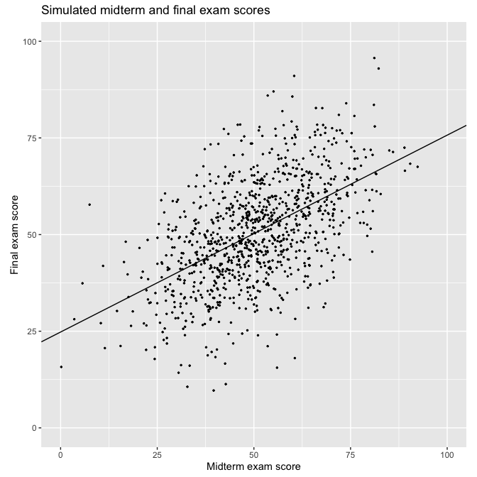

Regression and Other Stories: Fake midterm and final exam
================
Andrew Gelman, Jennifer Hill, Aki Vehtari
2021-04-20

-   [6 Background on regression
    modeling](#6-background-on-regression-modeling)
    -   [6.5 The paradox of regression to the
        mean](#65-the-paradox-of-regression-to-the-mean)
        -   [How regression to the mean can confuse people about causal
            inference; demonstration using fake
            data](#how-regression-to-the-mean-can-confuse-people-about-causal-inference-demonstration-using-fake-data)

Tidyverse version by Bill Behrman.

Fake dataset of 1000 students’ scores on a midterm and final exam. See
Chapter 6 in Regression and Other Stories.

------------------------------------------------------------------------

``` r
# Packages
library(tidyverse)
library(rstanarm)

# Parameters
  # Common code
file_common <- here::here("_common.R")

#===============================================================================

# Run common code
source(file_common)
```

# 6 Background on regression modeling

## 6.5 The paradox of regression to the mean

### How regression to the mean can confuse people about causal inference; demonstration using fake data

Data

``` r
set.seed(2243)

n_sims <- 1000

exams <- 
  tibble(
    true_ability = rnorm(n_sims, mean = 50, sd = 10),
    noise_1 = rnorm(n_sims, mean = 0, sd = 10),
    noise_2 = rnorm(n_sims, mean = 0, sd = 10),
    midterm = true_ability + noise_1,
    final = true_ability + noise_2
  )
```

Fit linear regression.

The option `refresh = 0` suppresses the default Stan sampling progress
output. This is useful for small data with fast computation. For more
complex models and bigger data, it can be useful to see the progress.

``` r
set.seed(857)

fit <- stan_glm(final ~ midterm, data = exams, refresh = 0)

print(fit, digits = 2)
```

    #> stan_glm
    #>  family:       gaussian [identity]
    #>  formula:      final ~ midterm
    #>  observations: 1000
    #>  predictors:   2
    #> ------
    #>             Median MAD_SD
    #> (Intercept) 24.79   1.36 
    #> midterm      0.51   0.03 
    #> 
    #> Auxiliary parameter(s):
    #>       Median MAD_SD
    #> sigma 11.60   0.25 
    #> 
    #> ------
    #> * For help interpreting the printed output see ?print.stanreg
    #> * For info on the priors used see ?prior_summary.stanreg

Simulated midterm and final exam scores.

``` r
intercept <- coef(fit)[["(Intercept)"]]
slope <- coef(fit)[["midterm"]]

exams %>% 
  ggplot(aes(midterm, final)) +
  geom_point(size = 0.5) +
  geom_abline(slope = slope, intercept = intercept) +
  coord_fixed(xlim = c(0, 100), ylim = c(0, 100)) +
  labs(
    title = "Simulated midterm and final exam scores",
    x = "Midterm exam score",
    y = "Final exam score"
  )
```


