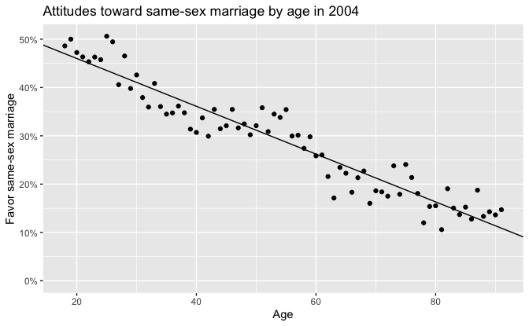
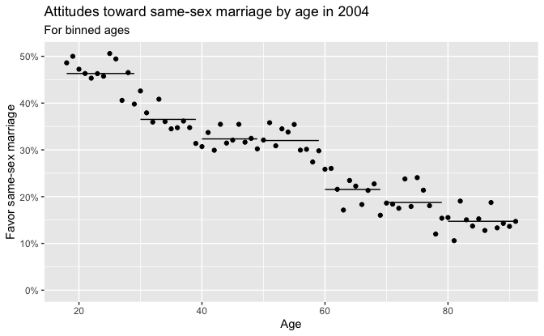

Regression and Other Stories: Gay
================
Andrew Gelman, Aki Vehtari
2021-04-20

-   [12 Transformations and
    regression](#12-transformations-and-regression)
    -   [12.5 Other transformation](#125-other-transformation)
        -   [Index and indicator
            variables](#index-and-indicator-variables)

Tidyverse version by Bill Behrman.

Simple models (linear and discretized age) and attitudes as a function
of age. See Chapter 12 in Regression and Other Stories.

------------------------------------------------------------------------

``` r
# Packages
library(tidyverse)
library(rstanarm)

# Parameters
  # Data on support for same-sex marriage
file_data <- here::here("Gay/data/naes04.csv")
  # Common code
file_common <- here::here("_common.R")

#===============================================================================

# Run common code
source(file_common)
```

# 12 Transformations and regression

## 12.5 Other transformation

### Index and indicator variables

Data

``` r
data <- 
  file_data %>% 
  read_csv() %>% 
  drop_na(age, gayFavorStateMarriage) %>% 
  select(age, gayFavorStateMarriage)

data  
```

    #> # A tibble: 20,455 x 2
    #>      age gayFavorStateMarriage
    #>    <dbl> <chr>                
    #>  1    73 No                   
    #>  2    48 Yes                  
    #>  3    58 Yes                  
    #>  4    63 No                   
    #>  5    29 No                   
    #>  6    56 Yes                  
    #>  7    70 No                   
    #>  8    45 No                   
    #>  9    64 No                   
    #> 10    42 Yes                  
    #> # … with 20,445 more rows

``` r
summary(data$age)
```

    #>    Min. 1st Qu.  Median    Mean 3rd Qu.    Max. 
    #>    18.0    35.0    47.0    47.8    59.0    97.0

`age` ranges from 18 to 97.

``` r
data %>% 
  count(age) %>% 
  arrange(desc(age))
```

    #> # A tibble: 80 x 2
    #>      age     n
    #>    <dbl> <int>
    #>  1    97     1
    #>  2    96     2
    #>  3    95     3
    #>  4    94     3
    #>  5    93     4
    #>  6    92    10
    #>  7    91    11
    #>  8    90    22
    #>  9    89    21
    #> 10    88    30
    #> # … with 70 more rows

Because of the relatively small number of respondents over age 90, we
will let age 91 represent respondents ages 91 and over. We will also
create a variable for binned ages.

``` r
age_max <-  91

data <- 
  data %>% 
  mutate(age = if_else(age >= age_max , age_max, age)) %>%
  group_by(age) %>% 
  summarize(favor = sum(gayFavorStateMarriage == "Yes") / n()) %>% 
  mutate(
    age_bin = cut(age, breaks = c(min(age) - 1, seq(29, 79, 10), age_max))
  )

data
```

    #> # A tibble: 74 x 3
    #>      age favor age_bin
    #>  * <dbl> <dbl> <fct>  
    #>  1    18 0.486 (17,29]
    #>  2    19 0.5   (17,29]
    #>  3    20 0.472 (17,29]
    #>  4    21 0.463 (17,29]
    #>  5    22 0.453 (17,29]
    #>  6    23 0.463 (17,29]
    #>  7    24 0.458 (17,29]
    #>  8    25 0.506 (17,29]
    #>  9    26 0.494 (17,29]
    #> 10    27 0.406 (17,29]
    #> # … with 64 more rows

Fit linear regression model.

``` r
set.seed(235)

fit_linear <- stan_glm(favor ~ age, data = data, refresh = 0)

print(fit_linear, digits = 4)
```

    #> stan_glm
    #>  family:       gaussian [identity]
    #>  formula:      favor ~ age
    #>  observations: 74
    #>  predictors:   2
    #> ------
    #>             Median  MAD_SD 
    #> (Intercept)  0.5591  0.0108
    #> age         -0.0049  0.0002
    #> 
    #> Auxiliary parameter(s):
    #>       Median MAD_SD
    #> sigma 0.0337 0.0029
    #> 
    #> ------
    #> * For help interpreting the printed output see ?print.stanreg
    #> * For info on the priors used see ?prior_summary.stanreg

Attitudes toward same-sex marriage by age in 2004.

``` r
intercept <- coef(fit_linear)[["(Intercept)"]]
slope <- coef(fit_linear)[["age"]]

data %>% 
  ggplot() +
  geom_abline(slope = slope, intercept = intercept) +
  geom_point(aes(age, favor)) +
  coord_cartesian(ylim = c(0, NA)) +
  scale_y_continuous(labels = scales::label_percent(accuracy = 1)) +
  labs(
    title = "Attitudes toward same-sex marriage by age in 2004",
    x = "Age",
    y = "Favor same-sex marriage"
  )
```



Fit model with binned ages.

``` r
set.seed(235)

fit_binned <- stan_glm(favor ~ age_bin, data = data, refresh = 0)

print(fit_binned, digits = 2)
```

    #> stan_glm
    #>  family:       gaussian [identity]
    #>  formula:      favor ~ age_bin
    #>  observations: 74
    #>  predictors:   7
    #> ------
    #>                Median MAD_SD
    #> (Intercept)     0.46   0.01 
    #> age_bin(29,39] -0.10   0.01 
    #> age_bin(39,49] -0.14   0.01 
    #> age_bin(49,59] -0.14   0.01 
    #> age_bin(59,69] -0.25   0.01 
    #> age_bin(69,79] -0.28   0.01 
    #> age_bin(79,91] -0.32   0.01 
    #> 
    #> Auxiliary parameter(s):
    #>       Median MAD_SD
    #> sigma 0.03   0.00  
    #> 
    #> ------
    #> * For help interpreting the printed output see ?print.stanreg
    #> * For info on the priors used see ?prior_summary.stanreg

Attitudes toward same-sex marriage by age in 2004: For binned ages.

``` r
levels <- 
  coef(fit_binned) %>% 
  enframe(value = "favor") %>% 
  mutate(name = if_else(name == "(Intercept)", "17,29", name)) %>% 
  extract(
    col = name,
    into = c("age_min", "age_max"),
    regex = "(\\d+),(\\d+)",
    convert = TRUE
  ) %>% 
  mutate(
    age_min = age_min + 1L,
    favor = 
      case_when(
        age_min == 18 ~ favor,
        TRUE ~ favor[age_min == 18] + favor
      )
  )

data %>% 
  ggplot() +
  geom_segment(
    aes(x = age_min, xend = age_max, y = favor, yend = favor), 
    data = levels
  ) +
  geom_point(aes(age, favor)) +
  coord_cartesian(ylim = c(0, NA)) +
  scale_y_continuous(labels = scales::label_percent(accuracy = 1)) +
  labs(
    title = "Attitudes toward same-sex marriage by age in 2004",
    subtitle = "For binned ages",
    x = "Age",
    y = "Favor same-sex marriage"
  )
```


