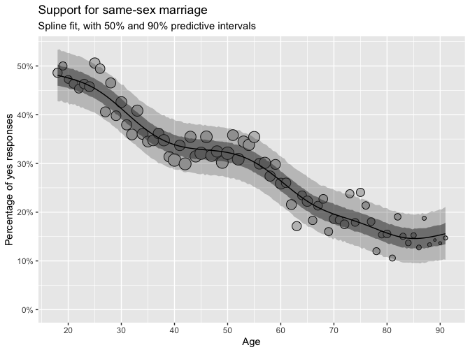

Regression and Other Stories: Gay
================
Andrew Gelman, Aki Vehtari
2021-04-20

-   [22 Advanced regression and multilevel
    models](#22-advanced-regression-and-multilevel-models)
    -   [22.7 Nonparametric regression and machine
        learning](#227-nonparametric-regression-and-machine-learning)
        -   [Demonstration: political attitudes as a function of
            age](#demonstration-political-attitudes-as-a-function-of-age)

Tidyverse version by Bill Behrman.

Nonlinear models (LOESS and spline) and political attitudes as a
function of age. See Chapter 22 in Regression and Other Stories.

------------------------------------------------------------------------

``` r
# Packages
library(tidyverse)
library(rstanarm)

# Parameters
  # NAES survey data
file_naes <- here::here("Gay/data/naes04.csv") 
  # Common code
file_common <- here::here("_common.R")

#===============================================================================

# Run common code
source(file_common)
```

# 22 Advanced regression and multilevel models

## 22.7 Nonparametric regression and machine learning

### Demonstration: political attitudes as a function of age

Data

``` r
naes <- 
  file_naes %>% 
  read_csv() %>% 
  select(!X1)

naes
```

    #> # A tibble: 81,422 x 6
    #>      age gender race    gayFavorFederalMarri… gayFavorStateMarri… gayKnowSomeone
    #>    <dbl> <chr>  <chr>   <chr>                 <chr>               <chr>         
    #>  1    70 Female Hispan… No                    <NA>                <NA>          
    #>  2    54 Female White   No                    <NA>                <NA>          
    #>  3    74 Male   White   No                    <NA>                <NA>          
    #>  4    73 Female Other   Yes                   No                  No            
    #>  5    48 Female White   No                    Yes                 Yes           
    #>  6    58 Male   White   No                    Yes                 Yes           
    #>  7    35 Female White   Yes                   <NA>                <NA>          
    #>  8    74 Female White   No                    <NA>                <NA>          
    #>  9    63 Female White   No                    No                  No            
    #> 10    64 Male   White   Yes                   <NA>                <NA>          
    #> # … with 81,412 more rows

Let’s understand the `NA`s in the data.

``` r
v <- 
  naes %>% 
  summarize(across(everything(), ~ sum(is.na(.)) / n()))

glimpse(v)
```

    #> Rows: 1
    #> Columns: 6
    #> $ age                     <dbl> 0.0122
    #> $ gender                  <dbl> 0
    #> $ race                    <dbl> 0.0185
    #> $ gayFavorFederalMarriage <dbl> 0
    #> $ gayFavorStateMarriage   <dbl> 0.745
    #> $ gayKnowSomeone          <dbl> 0.679

The variables we wish to study have a high percentage of `NA`s.
`gayFavorStateMarriage` has 74.5% `NA`s, and `gayKnowSomeone` has 67.9%
`NA`s. This could be a problem, but we will ignore it.

Let’s now look at `age`.

``` r
age_count <- function(var) {
  naes %>% 
    drop_na({{var}}) %>% 
    count(age) %>% 
    arrange(desc(age))
}

age_count(gayFavorStateMarriage)
```

    #> # A tibble: 81 x 2
    #>      age     n
    #>    <dbl> <int>
    #>  1    97     1
    #>  2    96     2
    #>  3    95     3
    #>  4    94     3
    #>  5    93     4
    #>  6    92    10
    #>  7    91    11
    #>  8    90    22
    #>  9    89    21
    #> 10    88    30
    #> # … with 71 more rows

``` r
age_count(gayKnowSomeone)
```

    #> # A tibble: 81 x 2
    #>      age     n
    #>    <dbl> <int>
    #>  1    97     1
    #>  2    96     3
    #>  3    95     2
    #>  4    94     5
    #>  5    93    10
    #>  6    92    11
    #>  7    91    20
    #>  8    90    26
    #>  9    89    27
    #> 10    88    36
    #> # … with 71 more rows

There are very few respondents over 90, so we will combine those over 90
to an age of 91. We’ll also drop those for whom `age` is `NA`.

``` r
naes <- 
  naes %>% 
  drop_na(age) %>% 
  mutate(age = if_else(age <= 90, age, 91))
```

Create indicator variable `y` from `var` and add to naes.

``` r
indicator <- function(var) {
  naes %>% 
    drop_na({{var}}) %>% 
    mutate(
      y =
        case_when(
          {{var}} == "Yes" ~ 1,
          {{var}} == "No" ~ 0,
          TRUE ~ NA_real_
        )
    )
}
```

Return tibble with proportion of “Yes” responses and total number of
responses for each age for variable `var`.

``` r
yes_prop <- function(var) {
  naes %>% 
    drop_na({{var}}) %>% 
    group_by(age) %>% 
    summarize(
      y = sum({{var}} == "Yes") / n(),
      n = n()
    )
}
```

Fit model to data using loess or splines; then predict using fit over
`age` range.

``` r
pred <- function(var, method = c("loess", "splines")) {
  method <- match.arg(method)
  
  if (method == "loess") {
    data <- indicator({{var}})
    fit <- loess(y ~ age, data = data)
    tibble(
      age = seq_range(data$age),
      y = predict(fit, newdata = tibble(age))
    )
  } else if (method == "splines") {
    data <- yes_prop({{var}})
    fit <- stan_gamm4(y ~ s(age), data = data, refresh = 0, adapt_delta = 0.99)
    tibble(age = seq_range(data$age)) %>% 
      predictive_intervals(fit = fit)
  }
}
```

Plot data and model prediction.

``` r
plot <- function(var, method = c("", "loess", "splines")) {
  method <- match.arg(method)
  
  title <- 
    tibble(
      gayFavorStateMarriage = "Support for same-sex marriage",
      gayKnowSomeone = "Do you know any gay people?"
    )

  plot <-
    yes_prop({{var}}) %>% 
    ggplot(aes(age)) +
    geom_point(aes(y = y, size = n), shape = "circle filled", fill = "grey75") +
    coord_cartesian(ylim = c(0, NA)) +
    scale_x_continuous(breaks = scales::breaks_width(10)) +
    scale_y_continuous(
      breaks = scales::breaks_width(0.1),
      labels = scales::label_percent(accuracy = 1)
    ) +
    theme(legend.position = "none") +
    labs(
      title = title %>% pull({{var}}),
      x = "Age",
      y = "Percentage of yes responses"
    )
  
  if (method == "loess") {
    plot <-
      plot +
      geom_line(aes(age, y), data = pred(var = {{var}}, method = "loess")) +
      labs(subtitle = "Loess fit")
  } else if (method == "splines") {
    v <- pred(var = {{var}}, method = "splines")
    plot <-
      plot +
      geom_ribbon(aes(ymin = `5%`, ymax = `95%`), data = v, alpha = 0.25) +
      geom_ribbon(aes(ymin = `25%`, ymax = `75%`), data = v, alpha = 0.5) +
      geom_line(aes(y = .pred), data = v) +
      labs(subtitle = "Spline fit, with 50% and 90% predictive intervals")
  }

  plot
}
```

Plots of data.

``` r
vars(gayFavorStateMarriage, gayKnowSomeone) %>% 
  map(plot) %>% 
  walk(print)
```


Plots of data and model predictions.

``` r
expand_grid(
  var = vars(gayFavorStateMarriage, gayKnowSomeone),
  method = c("loess", "splines")
) %>% 
  pmap(plot) %>%
  walk(print)
```


