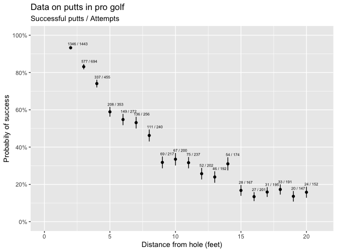
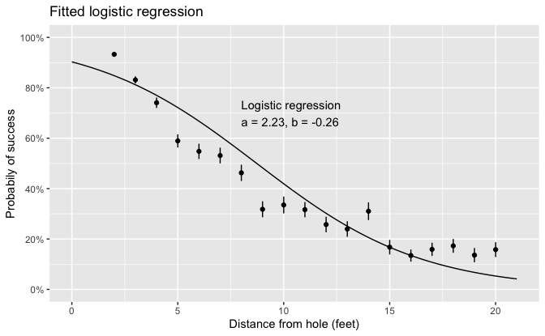
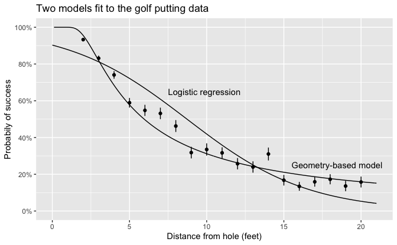

Regression and Other Stories: Golf
================
Andrew Gelman, Jennifer Hill, Aki Vehtari
2021-04-20

-   [22 Advanced regression and multilevel
    models](#22-advanced-regression-and-multilevel-models)
    -   [22.6 Nonlinear models, a demonstration using
        Stan](#226-nonlinear-models-a-demonstration-using-stan)
        -   [Data from golf puts](#data-from-golf-puts)
        -   [Logistic regression using
            Stan](#logistic-regression-using-stan)
        -   [Fitting a nonlinear model from scratch using
            Stan](#fitting-a-nonlinear-model-from-scratch-using-stan)
        -   [Comparing the two models](#comparing-the-two-models)

Tidyverse version by Bill Behrman.

Golf putting accuracy: Fitting a nonlinear model using Stan. See Chapter
22 in Regression and Other Stories.

------------------------------------------------------------------------

``` r
# Packages
library(tidyverse)
library(rstan)
library(rstanarm)

# Parameters
  # Seed
SEED <- 660
  # Golf data
file_golf <- here::here("Golf/data/golf.txt") 
  # Common code
file_common <- here::here("_common.R")

#===============================================================================

# Run common code
source(file_common)
```

# 22 Advanced regression and multilevel models

## 22.6 Nonlinear models, a demonstration using Stan

### Data from golf puts

Data

``` r
golf <- 
  file_golf %>% 
  read_table2(skip = 2) %>% 
  mutate(prob_se = sqrt((y / n) * (1 - y / n) / n))

golf
```

    #> # A tibble: 19 x 4
    #>        x     n     y prob_se
    #>    <dbl> <dbl> <dbl>   <dbl>
    #>  1     2  1443  1346 0.00659
    #>  2     3   694   577 0.0142 
    #>  3     4   455   337 0.0205 
    #>  4     5   353   208 0.0262 
    #>  5     6   272   149 0.0302 
    #>  6     7   256   136 0.0312 
    #>  7     8   240   111 0.0322 
    #>  8     9   217    69 0.0316 
    #>  9    10   200    67 0.0334 
    #> 10    11   237    75 0.0302 
    #> # … with 9 more rows

The variables are:

-   `x`: Putt distance (feet)
-   `n`: Number of attempts
-   `y`: Number of successful putts
-   `prob_se`: The standard error of `y` / `n`

Data on putts in pro golf.

``` r
golf <- 
  golf %>% 
  mutate(
    prob = y / n,
    lower = prob - prob_se,
    upper = prob + prob_se,
    label = str_c(y, " / ", n)
  )

plot <-
  golf %>% 
  ggplot(aes(x, prob)) +
  geom_linerange(aes(ymin = lower, ymax = upper)) +
  geom_point() +
  coord_cartesian(xlim = c(0, max(golf$x) + 1), ylim = 0:1) +
  scale_y_continuous(
    breaks = scales::breaks_width(0.2),
    labels = scales::label_percent(accuracy = 1)
  ) +
  labs(
    x = "Distance from hole (feet)",
    y = "Probabily of success"
  )

plot + 
  geom_text(
    aes(y = upper, label = label),
    size = 2,
    hjust = 0.15,
    vjust = -0.5
  ) +
  labs(
    title = "Data on putts in pro golf",
    subtitle = "Successful putts / Attempts"
  )
```



Fit logistic regression using `stan_glm()`.

``` r
set.seed(SEED)

fit_1_stan_glm <- 
  stan_glm(
    cbind(y, n - y) ~ x,
    family = binomial(link = "logit"),
    data = golf,
    refresh = 0
  )

print(fit_1_stan_glm, digits = 2)
```

    #> stan_glm
    #>  family:       binomial [logit]
    #>  formula:      cbind(y, n - y) ~ x
    #>  observations: 19
    #>  predictors:   2
    #> ------
    #>             Median MAD_SD
    #> (Intercept)  2.23   0.06 
    #> x           -0.26   0.01 
    #> 
    #> ------
    #> * For help interpreting the printed output see ?print.stanreg
    #> * For info on the priors used see ?prior_summary.stanreg

Fitted logistic regression.

``` r
line <- 
  tibble(
    model = 1,
    x = seq_range(c(0, max(golf$x) + 1)),
    prob = predict(fit_1_stan_glm, type = "response", newdata = tibble(x))
  )

label <- 
  tribble(
    ~x, ~prob, ~label,
     8,   0.7, 
      str_glue(
        "Logistic regression\n",
        "a = {format(coef(fit_1_stan_glm)[['(Intercept)']], digits = 2, nsmall = 2)}, ",
        "b = {format(coef(fit_1_stan_glm)[['x']], digits = 2, nsmall = 2)}"
      )
  )

plot +
  geom_line(data = line) +
  geom_text(aes(label = label), data = label, hjust = 0) +
  labs(title = "Fitted logistic regression")
```



### Logistic regression using Stan

Here is the above logistic regression model expressed in the Stan
language:

``` r
model_1 <-
"
data {
  int N;
  vector [N] x;
  int n[N];
  int y[N];
}
parameters {
  real a;
  real b;
}
model {
  y ~ binomial_logit(n, a + b * x);
}
"
```

Data in form required by `stan()`.

``` r
data_1 <- c(list(N = nrow(golf)), as.list(golf))
```

Fit logistic regression using `stan()`.

``` r
set.seed(SEED)

fit_1_stan <- stan(model_code = model_1, data = data_1, refresh = 0)
```

Here is the result:

``` r
summary(fit_1_stan, pars = c("a", "b"), probs = c(0.25, 0.5, 0.75))$summary
```

    #>     mean  se_mean      sd   25%    50%    75% n_eff Rhat
    #> a  2.233 0.001673 0.05503  2.20  2.232  2.269  1081    1
    #> b -0.256 0.000194 0.00633 -0.26 -0.256 -0.252  1068    1

Let’s compare the coefficients and their standard errors from both
methods.

``` r
coef(fit_1_stan_glm)[["(Intercept)"]] - summary(fit_1_stan)$summary["a", "mean"]
```

    #> [1] -0.00168

``` r
coef(fit_1_stan_glm)[["x"]] - summary(fit_1_stan)$summary["b", "mean"]
```

    #> [1] 0.000262

``` r
se(fit_1_stan_glm)[["(Intercept)"]] - summary(fit_1_stan)$summary["a", "sd"]
```

    #> [1] 0.00501

``` r
se(fit_1_stan_glm)[["x"]] - summary(fit_1_stan)$summary["b", "sd"]
```

    #> [1] 0.000485

In all cases, the coefficients and standard errors from both methods are
close.

### Fitting a nonlinear model from scratch using Stan

As an alternative to logistic regression, we build a model from first
principles and fit it to the data.

``` r
model_2 <-
"
data {
  real RADIUS_DIFF;
  int N;
  vector [N] x;
  int n[N];
  int y[N];
}
parameters {
  real <lower = 0> sigma;
}
model {
  vector [N] p = 2 * Phi(asin(RADIUS_DIFF ./ x) / sigma) - 1;
  y ~ binomial(n, p);
}
"

RADIUS_HOLE <- (4.25 / 2) / 12
RADIUS_BALL <- (1.68 / 2) / 12
RADIUS_DIFF <- RADIUS_HOLE - RADIUS_BALL

data_2 <- c(list(RADIUS_DIFF = RADIUS_DIFF, N = nrow(golf)), as.list(golf))
```

Fit nonlinear model using `stan()`.

``` r
set.seed(SEED)

fit_2_stan <- stan(model_code = model_2, data = data_2, refresh = 0)
```

Here is the result:

``` r
summary(fit_2_stan, pars = "sigma", probs = c(0.25, 0.5, 0.75))$summary
```

    #>         mean  se_mean       sd    25%    50%    75% n_eff Rhat
    #> sigma 0.0267 1.06e-05 0.000403 0.0264 0.0267 0.0269  1438    1

### Comparing the two models

Two models fit to the golf putting data.

``` r
sigma <- 
  as_tibble(fit_2_stan) %>% 
  pull(sigma) %>% 
  median()

lines <- 
  line %>% 
  bind_rows(
    tibble(
      model = 2,
      x = seq_range(c(RADIUS_DIFF, max(golf$x) + 1)),
      prob = 2 * pnorm(asin(RADIUS_DIFF / x ) / sigma) - 1
    )
  )

labels <- 
  tribble(
      ~x, ~prob, ~label,
     7.5,  0.65, "Logistic regression",
    15.5,  0.25, "Geometry-based model"
  )

plot +
  geom_line(aes(group = model), data = lines) +
  geom_text(aes(label = label), data = labels, hjust = 0) +
  labs(title = "Two models fit to the golf putting data")
```



The above plots the data and the fitted model (here using the posterior
median of *σ* but in this case the uncertainty is so narrow that any
reasonable posterior summary would give essentially the same result),
along with the logistic regression fitted earlier. The custom nonlinear
model fits the data much better.
