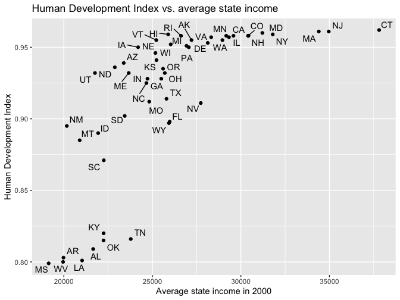
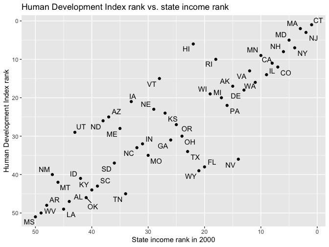
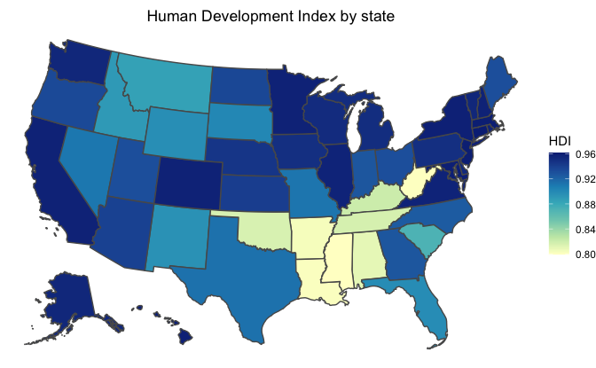
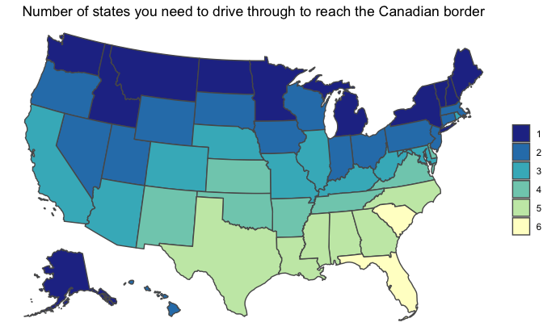

Regression and Other Stories: Human Development Index
================
Andrew Gelman, Jennifer Hill, Aki Vehtari
2021-04-20

-   [2 Data and measurement](#2-data-and-measurement)
    -   [2.1 Examining where data come
        from](#21-examining-where-data-come-from)

Tidyverse version by Bill Behrman.

Human Development Index - Looking at data in different ways. See Chapter
2 in Regression and Other Stories.

------------------------------------------------------------------------

``` r
# Packages
library(tidyverse)
library(haven)
library(sf)

# Parameters
  # Human Development Index data
file_hdi <- here::here("HDI/data/hdi.dat")
  # Data that includes state income
file_income <- here::here("HDI/data/state vote and income, 68-00.dta")
  # Common code
file_common <- here::here("_common.R")

#===============================================================================

# Run common code
source(file_common)
```

# 2 Data and measurement

## 2.1 Examining where data come from

Data

Human Development Index data.

``` r
hdi <- 
  file_hdi %>% 
  read.table(header = TRUE) %>% 
  as_tibble() %>% 
  select(state, hdi, hdi_rank = rank, canada_dist = canada.dist)

hdi
```

    #> # A tibble: 51 x 4
    #>    state              hdi hdi_rank canada_dist
    #>    <chr>            <dbl>    <int>       <int>
    #>  1 Connecticut      0.962        1           2
    #>  2 Massachusetts    0.961        2           2
    #>  3 New Jersey       0.961        3           2
    #>  4 Washington, D.C. 0.96         4           4
    #>  5 Maryland         0.96         5           3
    #>  6 Hawaii           0.959        6           2
    #>  7 New York         0.959        7           1
    #>  8 New Hampshire    0.958        8           1
    #>  9 Minnesota        0.958        9           1
    #> 10 Rhode Island     0.958       10           3
    #> # … with 41 more rows

State income data for 2000.

``` r
income <- 
  file_income %>% 
  read_dta() %>% 
  filter(st_year == 2000) %>% 
  select(
    state = st_state,
    state_abbr = st_stateabb,
    income_2000 = st_income
  ) %>% 
  mutate(income_2000_rank = min_rank(-income_2000))

income
```

    #> # A tibble: 50 x 4
    #>    state       state_abbr income_2000 income_2000_rank
    #>    <chr>       <chr>            <dbl>            <int>
    #>  1 Alabama     AL              21656.               44
    #>  2 Alaska      AK              27210.               15
    #>  3 Arizona     AZ              23381.               37
    #>  4 Arkansas    AR              19978.               48
    #>  5 California  CA              29581.                8
    #>  6 Colorado    CO              30406.                7
    #>  7 Connecticut CT              37808.                1
    #>  8 Delaware    DE              28128.               13
    #>  9 Florida     FL              25978.               20
    #> 10 Georgia     GA              25502.               26
    #> # … with 40 more rows

`hdi` has 51 rows and `income` has 50. Let’s verify that the difference
is the District of Columbia and that we can otherwise join on the
states.

``` r
all(income$state %in% hdi$state)
```

    #> [1] TRUE

``` r
setdiff(hdi$state, income$state)
```

    #> [1] "Washington, D.C."

``` r
hdi_income <- 
  hdi %>% 
  full_join(income, by = "state")

hdi_income
```

    #> # A tibble: 51 x 7
    #>    state        hdi hdi_rank canada_dist state_abbr income_2000 income_2000_rank
    #>    <chr>      <dbl>    <int>       <int> <chr>            <dbl>            <int>
    #>  1 Connectic… 0.962        1           2 CT              37808.                1
    #>  2 Massachus… 0.961        2           2 MA              34401.                3
    #>  3 New Jersey 0.961        3           2 NJ              34963.                2
    #>  4 Washingto… 0.96         4           4 <NA>               NA                NA
    #>  5 Maryland   0.96         5           3 MD              31213.                5
    #>  6 Hawaii     0.959        6           2 HI              25892.               22
    #>  7 New York   0.959        7           1 NY              31799.                4
    #>  8 New Hamps… 0.958        8           1 NH              30431.                6
    #>  9 Minnesota  0.958        9           1 MN              29173.               10
    #> 10 Rhode Isl… 0.958       10           3 RI              26620.               18
    #> # … with 41 more rows

Human Development Index vs. average state income.

``` r
hdi_income %>% 
  drop_na(income_2000) %>% 
  ggplot(aes(income_2000, hdi)) +
  geom_point() +
  ggrepel::geom_text_repel(aes(label = state_abbr)) +
  labs(
    title = "Human Development Index vs. average state income",
    x = "Average state income in 2000",
    y = "Human Development Index"
  )
```



Human Development Index rank vs. state income rank.

``` r
hdi_income %>% 
  drop_na(income_2000_rank) %>%
  ggplot(aes(income_2000_rank, hdi_rank)) +
  geom_point() +
  ggrepel::geom_text_repel(aes(label = state_abbr)) +
  scale_x_reverse() +
  scale_y_reverse() +
  labs(
    title = "Human Development Index rank vs. state income rank",
    x = "State income rank in 2000",
    y = "Human Development Index rank"
  )
```



Boundaries for U.S. states using [ussf
package](https://github.com/dcl-docs/ussf).

``` r
us <- ussf::boundaries(geography = "state")
```

``` r
setdiff(us$NAME, hdi$state)
```

    #> [1] "District of Columbia"

``` r
setdiff(hdi$state, us$NAME)
```

    #> [1] "Washington, D.C."

Join boundaries to Human Development Index data.

``` r
us_hdi <- 
  us %>% 
  left_join(
    hdi %>% 
      mutate(
        state = str_replace(state, "Washington, D.C.", "District of Columbia")
      ),
    by = c("NAME" = "state")
  )
```

Human Development Index by state.

``` r
us_hdi %>% 
  ggplot() +
  geom_sf(aes(fill = hdi)) +
  scale_fill_distiller(palette = "YlGnBu", direction = 1) +
  theme_void() +
  theme(plot.title = element_text(hjust = 0.5)) +
  labs(
    title = "Human Development Index by state",
    fill = "HDI"
  )
```



Number of states you need to drive through to reach the Canadian border.

``` r
us_hdi %>% 
  ggplot() +
  geom_sf(aes(fill = factor(canada_dist))) +
  scale_fill_brewer(palette = "YlGnBu", direction = -1) +
  theme_void() +
  theme(plot.title = element_text(hjust = 0.5)) +
  labs(
    title = 
      "Number of states you need to drive through to reach the Canadian border",
    fill = NULL
  )
```


