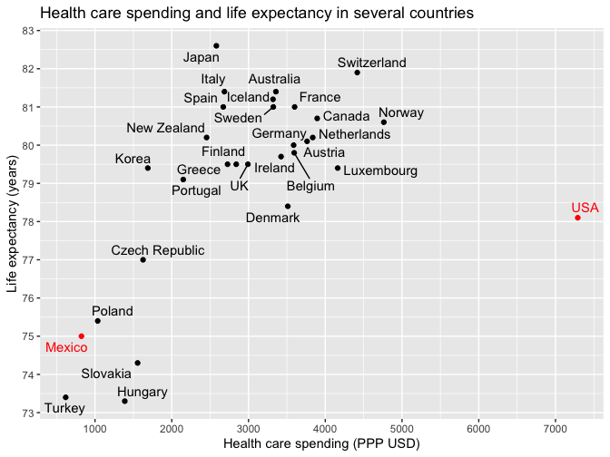

Regression and Other Stories: Health Expenditure
================
Andrew Gelman, Jennifer Hill, Aki Vehtari
2021-04-20

-   [2 Data and measurement](#2-data-and-measurement)
    -   [2.3 All graphs are comparisons](#23-all-graphs-are-comparisons)
        -   [Simple scatterplots](#simple-scatterplots)

Tidyverse version by Bill Behrman.

Health Expenditure - Discovery through graphs of data and models. See
Chapter 2 in Regression and Other Stories.

------------------------------------------------------------------------

``` r
# Packages
library(tidyverse)

# Parameters
  # Global health expenditures and life expectancy
file_health <- here::here("HealthExpenditure/data/healthdata.txt")
  # Common code
file_common <- here::here("_common.R")
  
#===============================================================================

# Run common code
source(file_common)
```

# 2 Data and measurement

## 2.3 All graphs are comparisons

### Simple scatterplots

Data

``` r
health <- 
  file_health %>% 
  read.table(header = TRUE) %>% 
  as_tibble()

health
```

    #> # A tibble: 30 x 3
    #>    country   spending lifespan
    #>    <chr>        <int>    <dbl>
    #>  1 Australia     3357     81.4
    #>  2 Austria       3763     80.1
    #>  3 Belgium       3595     79.8
    #>  4 Canada        3895     80.7
    #>  5 Czech         1626     77  
    #>  6 Denmark       3512     78.4
    #>  7 Finland       2840     79.5
    #>  8 France        3601     81  
    #>  9 Germany       3588     80  
    #> 10 Greece        2727     79.5
    #> # … with 20 more rows

Health care spending and life expectancy in several countries.

``` r
set.seed(576)

country_recode <- 
  c(
    "Czech" = "Czech Republic",
    "N.Zealand" = "New Zealand"
  )

v <- 
  health %>% 
  mutate(country = recode(country, !!! country_recode))

v %>% 
  ggplot(aes(spending, lifespan, color = country %in% c("Mexico", "USA"))) +
  geom_point() +
  ggrepel::geom_text_repel(aes(label = country)) +
  scale_x_continuous(breaks = scales::breaks_width(1000)) +
  scale_y_continuous(breaks = scales::breaks_width(1)) +
  scale_color_manual(
    breaks = c(TRUE, FALSE),
    values = c("red", "black")
  ) +
  theme(legend.position = "none") +
  labs(
    title = "Health care spending and life expectancy in several countries",
    x = "Health care spending (PPP USD)",
    y = "Life expectancy (years)"
  )
```


