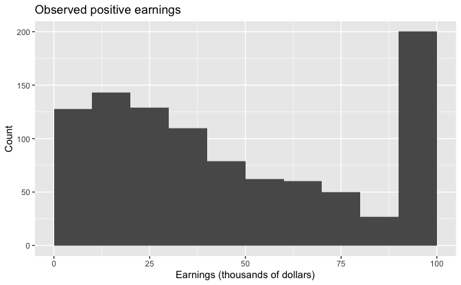
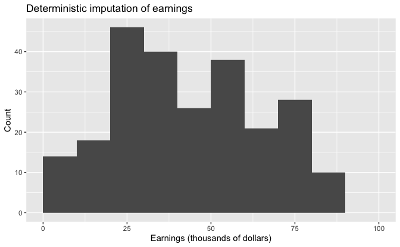
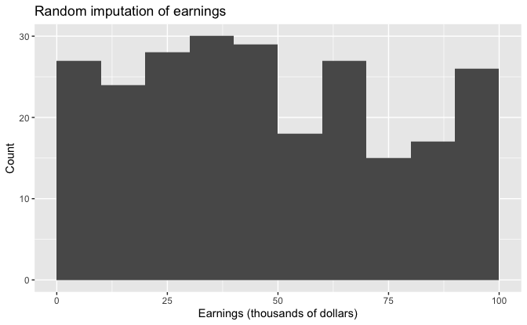
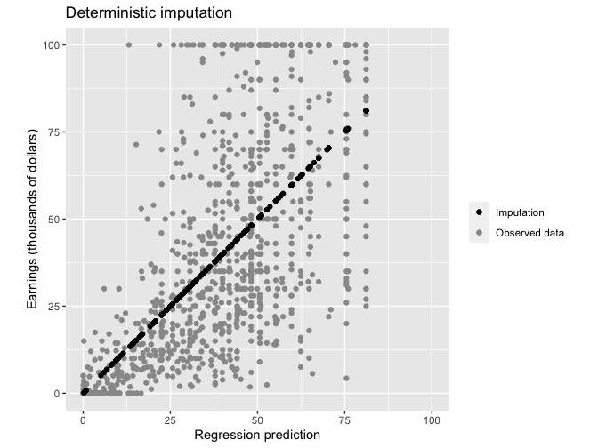
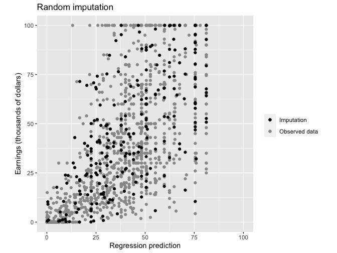

Regression and Other Stories: Imputation
================
Andrew Gelman, Jennifer Hill, Aki Vehtari
2021-04-20

-   [17 Poststratificiation and missing-data
    imputation](#17-poststratificiation-and-missing-data-imputation)
    -   [17.5 Understanding multiple
        imputation](#175-understanding-multiple-imputation)
        -   [Simple random imputation](#simple-random-imputation)
        -   [Zero coding and topcoding](#zero-coding-and-topcoding)
        -   [The problem with using regression predictions for
            deterministic
            imputation](#the-problem-with-using-regression-predictions-for-deterministic-imputation)
        -   [Transformations](#transformations)
        -   [Random regression
            imputation](#random-regression-imputation)
        -   [Two-stage modeling to impute a variable that can be
            positive or
            zero](#two-stage-modeling-to-impute-a-variable-that-can-be-positive-or-zero)
        -   [Iterative regression
            imputation](#iterative-regression-imputation)

Tidyverse version by Bill Behrman.

Regression-based imputation for the Social Indicators Survey. See
Chapter 17 in Regression and Other Stories.

------------------------------------------------------------------------

``` r
# Packages
library(tidyverse)
library(rstanarm)

# Parameters
  # Social Indicator Survey data
file_sis <- here::here("Imputation/data/SIS.csv")
  # Common code
file_common <- here::here("_common.R")

#===============================================================================

# Run common code
source(file_common)
```

# 17 Poststratificiation and missing-data imputation

## 17.5 Understanding multiple imputation

Data

``` r
sis <- 
  read_csv(file_sis) %>% 
  select(!c(retirement, assistance, other))

glimpse(sis)
```

    #> Rows: 1,501
    #> Columns: 12
    #> $ earnings    <dbl> 84.0, NA, 27.5, 85.0, 135.0, 0.0, 92.0, 0.0, 35.0, 27.0, 0…
    #> $ interest    <dbl> 0.20, 0.00, 0.16, 5.00, 0.10, NA, 1.50, 0.00, 0.65, 0.00, …
    #> $ male        <dbl> 1, 0, 1, 1, 1, 0, 0, 0, 0, 1, 1, 1, 0, 0, 1, 1, 1, 1, 0, 0…
    #> $ over65      <dbl> 0, 0, 0, 1, 0, 0, 0, 1, 0, 0, 1, 0, 0, 0, 0, 0, 0, 0, 0, 0…
    #> $ white       <dbl> 1, 0, 0, 1, 0, 0, 1, 0, 1, 0, 0, 1, 0, 1, 0, 0, 1, 1, 1, 0…
    #> $ immig       <dbl> 1, 1, 1, 0, 0, 0, 0, 0, 0, 0, 0, 0, 1, 0, 0, 1, 0, 1, 1, 1…
    #> $ educ_r      <dbl> 4.0, 4.0, 2.0, 4.0, 4.0, 4.0, 4.0, 2.0, 4.0, 3.0, 1.0, 4.0…
    #> $ workmos     <dbl> 12, 12, 10, 11, 12, 0, 12, 0, 7, 12, 0, 8, 12, 4, 6, 12, 1…
    #> $ workhrs_top <dbl> 40, 40, 40, 8, 40, 40, 40, 0, 40, 32, 0, 30, 35, 5, 40, 40…
    #> $ any_ssi     <dbl> 0, 0, 0, 0, 0, 0, 0, 0, 0, 0, 0, 0, 0, 0, 0, 0, 0, 0, 0, 0…
    #> $ any_welfare <dbl> 0, 0, 0, 0, 0, 0, 0, 0, 0, 0, 0, 0, 0, 0, 0, 0, 0, 0, 0, 0…
    #> $ any_charity <dbl> 0, 0, 0, 0, 0, 0, 0, 0, 0, 0, 0, 0, 0, 0, 0, 0, 0, 0, 0, 1…

``` r
summary(sis)
```

    #>     earnings       interest        male           over65          white      
    #>  Min.   :   0   Min.   :  0   Min.   :0.000   Min.   :0.000   Min.   :0.000  
    #>  1st Qu.:   5   1st Qu.:  0   1st Qu.:0.000   1st Qu.:0.000   1st Qu.:0.000  
    #>  Median :  28   Median :  0   Median :0.000   Median :0.000   Median :0.000  
    #>  Mean   :  52   Mean   :  2   Mean   :0.362   Mean   :0.077   Mean   :0.318  
    #>  3rd Qu.:  65   3rd Qu.:  0   3rd Qu.:1.000   3rd Qu.:0.000   3rd Qu.:1.000  
    #>  Max.   :3250   Max.   :650   Max.   :1.000   Max.   :1.000   Max.   :1.000  
    #>  NA's   :241    NA's   :277                                                  
    #>      immig           educ_r        workmos       workhrs_top      any_ssi     
    #>  Min.   :0.000   Min.   :1.00   Min.   : 0.00   Min.   : 0.0   Min.   :0.000  
    #>  1st Qu.:0.000   1st Qu.:2.00   1st Qu.: 7.00   1st Qu.:26.0   1st Qu.:0.000  
    #>  Median :0.000   Median :3.00   Median :12.00   Median :40.0   Median :0.000  
    #>  Mean   :0.392   Mean   :2.75   Mean   : 8.99   Mean   :30.2   Mean   :0.037  
    #>  3rd Qu.:1.000   3rd Qu.:4.00   3rd Qu.:12.00   3rd Qu.:40.0   3rd Qu.:0.000  
    #>  Max.   :1.000   Max.   :4.00   Max.   :12.00   Max.   :40.0   Max.   :1.000  
    #>                                                                               
    #>   any_welfare     any_charity  
    #>  Min.   :0.000   Min.   :0.00  
    #>  1st Qu.:0.000   1st Qu.:0.00  
    #>  Median :0.000   Median :0.00  
    #>  Mean   :0.039   Mean   :0.01  
    #>  3rd Qu.:0.000   3rd Qu.:0.00  
    #>  Max.   :1.000   Max.   :1.00  
    #> 

### Simple random imputation

The simplest approach to is to impute missing values of earnings based
on the observed data for this variable. We can write this as an R
function:

``` r
random_imp <- function(x) {
  n_non_na <- sum(!is.na(x))
  if (n_non_na == 0) {
    stop("No non-NA values")
  } else if (n_non_na == 1) {
    x[is.na(x)] <- x[!is.na(x)]
  } else {
    x[is.na(x)] <- sample(x[!is.na(x)], size = sum(is.na(x)), replace = TRUE)
  }
  x
}
```

### Zero coding and topcoding

Topcode function to set all values in vector `x` above the value of
`top` to `top`.

``` r
topcode <- function(x, top) {
  if_else(x <= top, x, top)
}
```

Create new variable `earnings_top` where all earnings about $100,000 are
set to $100,000 (`earnings` are in thousands of dollars).

``` r
sis <- 
  sis %>% 
  mutate(earnings_top = topcode(earnings, top = 100)) %>% 
  relocate(earnings_top, .after = earnings)
```

Observed positive earnings.

``` r
sis %>% 
  filter(earnings_top > 0) %>% 
  ggplot(aes(earnings_top)) +
  geom_histogram(binwidth = 10, boundary = 0) +
  labs(
    title = "Observed positive earnings",
    x = "Earnings (thousands of dollars)",
    y = "Count"
  )
```



### The problem with using regression predictions for deterministic imputation

A simple and general imputation procedure that uses individual-level
information uses a regression to the nonzero values of earnings. We
first fit a regression to positive values of earnings:

``` r
set.seed(971)

fit_imp_1 <- 
  stan_glm(
    earnings ~ 
      male + over65 + white + immig + educ_r + workmos + workhrs_top + any_ssi +
      any_welfare + any_charity,
    data = sis %>% filter(earnings > 0),
    refresh = 0
  )

fit_imp_1
```

    #> stan_glm
    #>  family:       gaussian [identity]
    #>  formula:      earnings ~ male + over65 + white + immig + educ_r + workmos + 
    #>     workhrs_top + any_ssi + any_welfare + any_charity
    #>  observations: 988
    #>  predictors:   11
    #> ------
    #>             Median MAD_SD
    #> (Intercept) -86.4   30.5 
    #> male         -0.6    8.7 
    #> over65      -38.5   38.0 
    #> white        26.2   10.4 
    #> immig       -12.1    9.0 
    #> educ_r       22.4    4.5 
    #> workmos       5.3    2.1 
    #> workhrs_top   0.8    0.7 
    #> any_ssi     -35.2   37.9 
    #> any_welfare -11.9   23.9 
    #> any_charity -29.8   41.1 
    #> 
    #> Auxiliary parameter(s):
    #>       Median MAD_SD
    #> sigma 132.3    3.0 
    #> 
    #> ------
    #> * For help interpreting the printed output see ?print.stanreg
    #> * For info on the priors used see ?prior_summary.stanreg

Point predictions of earnings for all rows of data.

``` r
predictors <- vars(male:any_charity)

sis <- 
  sis %>% 
  mutate(pred_1 = predict(fit_imp_1, newdata = sis %>% select(!!! predictors)))
```

To get predictions for all rows of earnings, we needed to select just
the predictors. We needed to exclude `earnings` and `interest`, which
have missing values (`NA` in R) and would cause the `predict()` function
to skip these cases.

Next, we write a function for replacing missing values in a vector with
imputed values:

``` r
impute <- function(x, replace) {
  if_else(!is.na(x), x, replace)
}
```

and use this to impute missing earnings:

``` r
sis <- 
  sis %>% 
  mutate(earnings_imp_1 = impute(earnings, replace = pred_1))
```

### Transformations

For the purpose of predicting incomes in the low and middle range, where
we are most interested in this application, we work on the square root
scale of income, topcoded to 100 (in thousands of dollars); we would
expect a linear prediction model to fit better on that compressed scale.
Here is the imputation procedure:

``` r
set.seed(971)

fit_imp_2 <- 
  stan_glm(
    sqrt(earnings_top) ~ 
      male + over65 + white + immig + educ_r + workmos + workhrs_top + any_ssi +
      any_welfare + any_charity,
    data = sis %>% filter(earnings_top > 0),
    refresh = 0
  )

fit_imp_2
```

    #> stan_glm
    #>  family:       gaussian [identity]
    #>  formula:      sqrt(earnings_top) ~ male + over65 + white + immig + educ_r + 
    #>     workmos + workhrs_top + any_ssi + any_welfare + any_charity
    #>  observations: 988
    #>  predictors:   11
    #> ------
    #>             Median MAD_SD
    #> (Intercept) -1.7    0.4  
    #> male         0.3    0.1  
    #> over65      -1.4    0.6  
    #> white        1.0    0.1  
    #> immig       -0.6    0.1  
    #> educ_r       0.8    0.1  
    #> workmos      0.3    0.0  
    #> workhrs_top  0.1    0.0  
    #> any_ssi     -1.0    0.5  
    #> any_welfare -1.4    0.4  
    #> any_charity -1.2    0.6  
    #> 
    #> Auxiliary parameter(s):
    #>       Median MAD_SD
    #> sigma 2.0    0.0   
    #> 
    #> ------
    #> * For help interpreting the printed output see ?print.stanreg
    #> * For info on the priors used see ?prior_summary.stanreg

Imputation using point predictions.

``` r
sis <- 
  sis %>% 
  mutate(
    pred_2 = 
      predict(fit_imp_2, newdata = sis %>% select(!!! predictors))^2 %>% 
      topcode(top = 100),
    earnings_imp_2 = impute(earnings_top, replace = pred_2)
  )
```

Deterministic imputation of earnings.

``` r
sis %>% 
  filter(is.na(earnings_top)) %>% 
  ggplot(aes(earnings_imp_2)) +
  geom_histogram(binwidth = 10, boundary = 0) +
  coord_cartesian(xlim = c(0, 100)) +
  labs(
    title = "Deterministic imputation of earnings",
    x = "Earnings (thousands of dollars)",
    y = "Count"
  )
```



From this graph, it appears that most of the nonrespondents have incomes
in the middle range. Actually, the central tendency is an artifact of
the deterministic imputation procedure.

### Random regression imputation

We can add uncertainty into the imputations by adding prediction error.
For this example, we do this by creating a vector of random predicted
values for the 241 missing cases – here we simply grab the first row of
the matrix of simulated predictions.

``` r
set.seed(441)

sis <- 
  sis %>% 
  mutate(
    pred_4 =
      posterior_predict(
        fit_imp_2,
        newdata = sis %>% select(!!! predictors),
        draws = 1
      )^2 %>% 
      as.double() %>% 
      topcode(top = 100),
    earnings_imp_4 = impute(earnings_top, replace = pred_4)
  )
```

Random imputation earnings.

``` r
sis %>% 
  filter(is.na(earnings_top)) %>% 
  ggplot(aes(earnings_imp_4)) +
  geom_histogram(binwidth = 10, boundary = 0) +
  coord_cartesian(xlim = c(0, 100)) +
  labs(
    title = "Random imputation of earnings",
    x = "Earnings (thousands of dollars)",
    y = "Count"
  )
```



Compared to deterministic imputation, these random imputations are more
appropriately spread across the range of the population.

We’ll now look at the imputations as a function of the predicted
earnings from the regression model.

Deterministic imputation.

``` r
sis %>% 
  drop_na(earnings_top) %>% 
  ggplot(aes(pred_2)) +
  geom_point(aes(y = earnings_top, color = "Observed data")) +
  geom_point(
    aes(y = earnings_imp_2, color = "Imputation"),
    data = sis %>% filter(is.na(earnings_top))
  ) +
  scale_color_manual(
    breaks = c("Imputation", "Observed data"),
    values = c("black", "grey60")
  ) +
  coord_fixed(xlim = c(0, 100)) +
  labs(
    title = "Deterministic imputation",
    x = "Regression prediction",
    y = "Earnings (thousands of dollars)",
    color = NULL
  )
```



The deterministic imputations are exactly at the regression predictions
and ignore predictive uncertainty.

Random imputation.

``` r
sis %>% 
  drop_na(earnings_top) %>% 
  ggplot(aes(pred_2)) +
  geom_point(aes(y = earnings_top, color = "Observed data")) +
  geom_point(
    aes(y = earnings_imp_4, color = "Imputation"),
    data = sis %>% filter(is.na(earnings_top))
  ) +
  scale_color_manual(
    breaks = c("Imputation", "Observed data"),
    values = c("black", "grey60")
  ) +
  coord_fixed(xlim = c(0, 100)) +
  labs(
    title = "Random imputation",
    x = "Regression prediction",
    y = "Earnings (thousands of dollars)",
    color = NULL
  )
```



In contrast, the random imputations are more variable and better capture
the range of earnings in the data.

### Two-stage modeling to impute a variable that can be positive or zero

We will now impute missing responses to the earnings question in two
steps: first, imputing an indicator for whether earnings are positive,
and, second, imputing the continuous positive values of earnings.

Fit logistic regression for whether earnings are positive.

``` r
set.seed(971)

fit_pos <- 
  stan_glm(
    (earnings > 0) ~ 
      male + over65 + white + immig + educ_r + any_ssi + any_welfare +
      any_charity,
    family = binomial(link = "logit"),
    data = sis,
    refresh = 0
  )

fit_pos
```

    #> stan_glm
    #>  family:       binomial [logit]
    #>  formula:      (earnings > 0) ~ male + over65 + white + immig + educ_r + any_ssi + 
    #>     any_welfare + any_charity
    #>  observations: 1260
    #>  predictors:   9
    #> ------
    #>             Median MAD_SD
    #> (Intercept)  0.4    0.3  
    #> male         0.3    0.2  
    #> over65      -4.0    0.4  
    #> white       -0.1    0.2  
    #> immig        0.2    0.2  
    #> educ_r       0.6    0.1  
    #> any_ssi     -2.5    0.4  
    #> any_welfare -0.6    0.3  
    #> any_charity  0.5    0.8  
    #> 
    #> ------
    #> * For help interpreting the printed output see ?print.stanreg
    #> * For info on the priors used see ?prior_summary.stanreg

Then we impute an indicator for whether the missing earnings are
positive:

``` r
set.seed(906)

sis <- 
  sis %>% 
  mutate(
    pred_pos = 
      posterior_predict(
        fit_pos,
        newdata = sis %>% select(!!! predictors),
        draws = 1
      ) %>% 
      as.double()
  )

sis$pred_pos[1:20]
```

    #>  [1] 1 1 1 0 1 1 1 0 1 1 0 1 1 0 1 1 1 1 0 1

`fit_imp_2` above was fit to impute continuous positive values of
earnings, and the `sis` variable `pred_4` are random imputations from
it. We now combine `pred_pos` and `pred_4` to impute earnings:

``` r
sis <- 
  sis %>% 
  mutate(earnings_imp_5 = impute(earnings_top, replace = pred_pos * pred_4))
```

### Iterative regression imputation

Let’s look at the `NA` pattern for `earnings` and `interest`.

``` r
sis %>% 
  count(is.na(earnings), is.na(interest))
```

    #> # A tibble: 4 x 3
    #>   `is.na(earnings)` `is.na(interest)`     n
    #>   <lgl>             <lgl>             <int>
    #> 1 FALSE             FALSE              1065
    #> 2 FALSE             TRUE                195
    #> 3 TRUE              FALSE               159
    #> 4 TRUE              TRUE                 82

Of the 436 rows where at least one of these variables is `NA`, only 82
rows have both variables `NA`. Since they have non-overlapping patterns
of missingness, each can be used to help impute the other.

We create random imputations to get the process started:

``` r
set.seed(453)

sis <- 
  sis %>% 
  mutate(
    earnings_imp = random_imp(earnings),
    interest_imp = random_imp(interest)
  )
```

The function below first imputes `earnings_imp` using a model based upon
`interest_imp` and then imputes `interest_imp` using a model based upon
`earnings_imp`.

``` r
predictors <- vars(earnings_imp, interest_imp, male:any_charity)

earnings_interest_imp <- function() {
  fit <- 
    stan_glm(
      earnings ~ 
        interest_imp + male + over65 + white + immig + educ_r + workmos +
        workhrs_top + any_ssi + any_welfare + any_charity,
      data = sis,
      refresh = 0
    )
  sis <- 
    sis %>% 
    mutate(
      earnings_imp =
        posterior_predict(
          fit,
          newdata = sis %>% select(!!! predictors),
          draw = 1
        ) %>% 
        as.double() %>% 
        impute(earnings, replace = .)
    )
  fit <- 
    stan_glm(
      interest ~ 
        earnings_imp + male + over65 + white + immig + educ_r + workmos +
        workhrs_top + any_ssi + any_welfare + any_charity,
      data = sis,
      refresh = 0
    )
  sis <- 
    sis %>% 
    mutate(
      interest_imp =
        posterior_predict(
          fit,
          newdata = sis %>% select(!!! predictors),
          draw = 1
        ) %>% 
        as.double() %>% 
        impute(interest, replace = .)
    )
}
```

``` r
n <- 10
```

We now iterate the function `earnings_interest_imp()` 10 times.

``` r
seq_len(n) %>% 
  walk(~ earnings_interest_imp())
```
