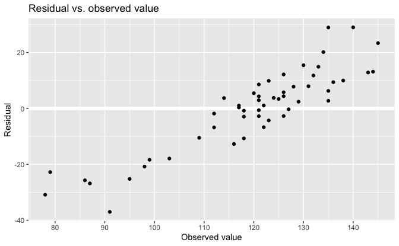
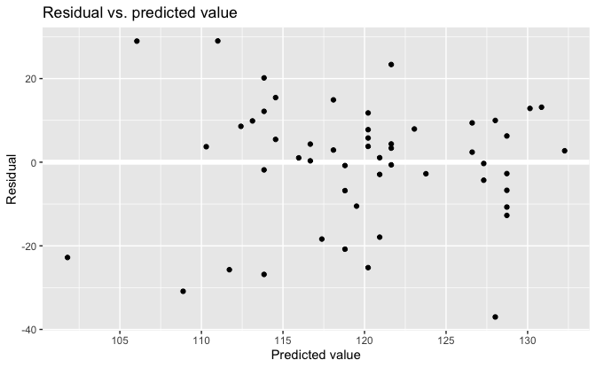
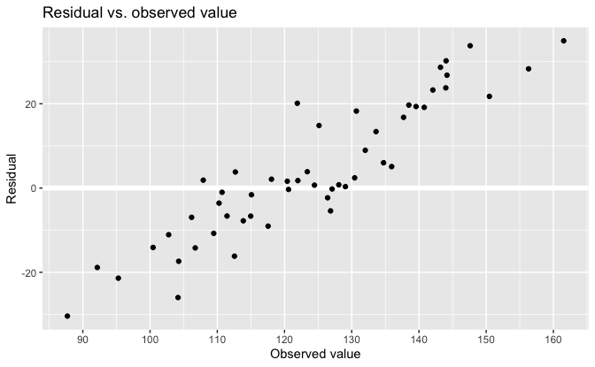
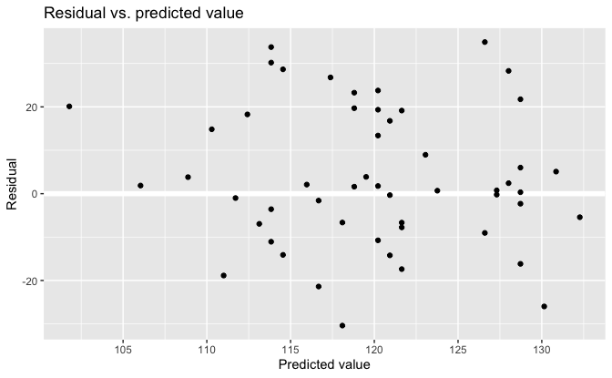

Regression and Other Stories: Introclass
================
Andrew Gelman, Jennifer Hill, Aki Vehtari
2021-04-20

-   [11 Assumptions, diagnostics, and model
    evaluation](#11-assumptions-diagnostics-and-model-evaluation)
    -   [11.3 Residual plots](#113-residual-plots)
        -   [A confusing choice: plot residuals vs. predicted values, or
            residuals vs. observed
            values?](#a-confusing-choice-plot-residuals-vs-predicted-values-or-residuals-vs-observed-values)
        -   [Understanding the choice using fake-data
            simulation](#understanding-the-choice-using-fake-data-simulation)

Tidyverse version by Bill Behrman.

Plot residuals vs. predicted values, or residuals vs. observed values?
See Chapter 11 in Regression and Other Stories.

------------------------------------------------------------------------

``` r
# Packages
library(tidyverse)
library(rstanarm)

# Parameters
  # Course scores
file_scores <- here::here("Introclass/data/gradesW4315.dat")
  # Common code
file_common <- here::here("_common.R")

#===============================================================================

# Run common code
source(file_common)
```

# 11 Assumptions, diagnostics, and model evaluation

## 11.3 Residual plots

### A confusing choice: plot residuals vs. predicted values, or residuals vs. observed values?

Data

``` r
scores <- 
  file_scores %>% 
  read.table(header = TRUE) %>% 
  as_tibble()

scores
```

    #> # A tibble: 52 x 9
    #>      hw1   hw2   hw3   hw4 midterm   hw5   hw6   hw7 final
    #>    <int> <int> <int> <int>   <int> <int> <int> <int> <int>
    #>  1    95    88   100    95      80    96    99     0   103
    #>  2     0    74    74     0      53    83    97     0    79
    #>  3   100     0   105   100      91    96   100    96   122
    #>  4     0    90    76   100      63    91    95     0    78
    #>  5   100    96    99   100      91    93   100    92   135
    #>  6    90    83    95   100      73    89   100    90   117
    #>  7    95    98   100   100      59    98    98    94   135
    #>  8    80   100    97   100      69    94    98   101   123
    #>  9    95    90    98    90      78    95    99   100   109
    #> 10    90    94    95    98      91    94   100    89   126
    #> # … with 42 more rows

Fit linear regression model.

The option `refresh = 0` suppresses the default Stan sampling progress
output. This is useful for small data with fast computation. For more
complex models and bigger data, it can be useful to see the progress.

``` r
set.seed(733)

fit <- stan_glm(final ~ midterm, data = scores, refresh = 0)

fit
```

    #> stan_glm
    #>  family:       gaussian [identity]
    #>  formula:      final ~ midterm
    #>  observations: 52
    #>  predictors:   2
    #> ------
    #>             Median MAD_SD
    #> (Intercept) 64.2   17.7  
    #> midterm      0.7    0.2  
    #> 
    #> Auxiliary parameter(s):
    #>       Median MAD_SD
    #> sigma 14.9    1.6  
    #> 
    #> ------
    #> * For help interpreting the printed output see ?print.stanreg
    #> * For info on the priors used see ?prior_summary.stanreg

Predicted values and residuals.

``` r
v <- 
  scores %>% 
  mutate(
    pred = predict(fit),
    resid = residuals(fit)
  )
```

Residual vs. observed value.

``` r
v %>% 
  ggplot(aes(final, resid)) +
  geom_hline(yintercept = 0, color = "white", size = 2) +
  geom_point() +
  scale_x_continuous(breaks = scales::breaks_width(10)) +
  labs(
    title = "Residual vs. observed value",
    x = "Observed value",
    y = "Residual"
  )
```



Residual vs. predicted value.

``` r
v %>% 
  ggplot(aes(pred, resid)) +
  geom_hline(yintercept = 0, color = "white", size = 2) +
  geom_point() +
  scale_x_continuous(breaks = scales::breaks_width(5)) +
  labs(
    title = "Residual vs. predicted value",
    x = "Predicted value",
    y = "Residual"
  )
```



### Understanding the choice using fake-data simulation

Simulate final scores using the actual midterm scores and model
parameters.

``` r
set.seed(746)

intercept <- coef(fit)[["(Intercept)"]]
slope <- coef(fit)[["midterm"]]
sigma <- sigma(fit)

scores_sim <- 
  scores %>% 
  mutate(
    pred = intercept + slope * midterm,
    final_sim = pred + rnorm(n(), mean = 0, sd = sigma),
    resid = final_sim - pred
  )
```

Residual vs. observed value.

``` r
scores_sim %>% 
  ggplot(aes(final_sim, resid)) +
  geom_hline(yintercept = 0, color = "white", size = 2) +
  geom_point() +
  scale_x_continuous(breaks = scales::breaks_width(10)) +
  labs(
    title = "Residual vs. observed value",
    x = "Observed value",
    y = "Residual"
  )
```



Residual vs. predicted value.

``` r
scores_sim %>% 
  ggplot(aes(pred, resid)) +
  geom_hline(yintercept = 0, color = "white", size = 2) +
  geom_point() +
  scale_x_continuous(breaks = scales::breaks_width(5)) +
  labs(
    title = "Residual vs. predicted value",
    x = "Predicted value",
    y = "Residual"
  )
```


