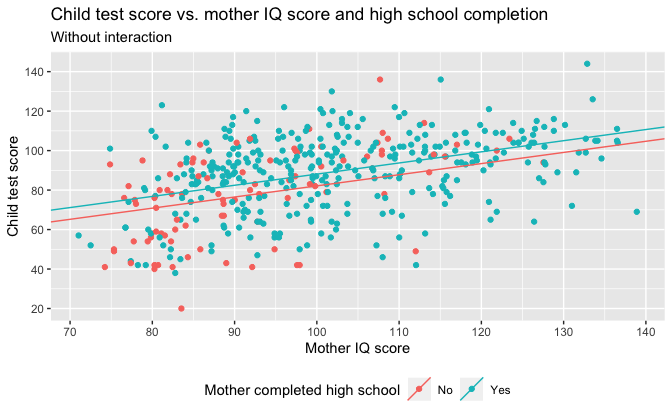
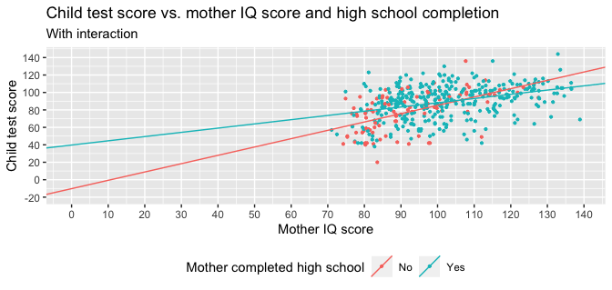

Regression and Other Stories: KidIQ
================
Andrew Gelman, Jennifer Hill, Aki Vehtari
2021-04-20

-   [10 Linear regression with multiple
    predictors](#10-linear-regression-with-multiple-predictors)
    -   [10.1 Adding predictors to a
        model](#101-adding-predictors-to-a-model)
        -   [Starting with a binary
            predictor](#starting-with-a-binary-predictor)
        -   [A single continuous
            predictor](#a-single-continuous-predictor)
        -   [Including both predictors](#including-both-predictors)
    -   [10.3 Interactions](#103-interactions)
-   [11 Assumptions, diagnostics, and model
    evaluation](#11-assumptions-diagnostics-and-model-evaluation)
    -   [11.2 Plotting the data and fitted
        model](#112-plotting-the-data-and-fitted-model)
        -   [Displaying uncertainty in the fitted
            regression](#displaying-uncertainty-in-the-fitted-regression)
        -   [Displaying using one plot for each input
            variable](#displaying-using-one-plot-for-each-input-variable)
    -   [11.3 Residual plots](#113-residual-plots)
-   [12 Transformations and
    regression](#12-transformations-and-regression)
    -   [12.2 Centering and standardizing for models with
        interactions](#122-centering-and-standardizing-for-models-with-interactions)
        -   [Centering by subtracting the mean of the
            data](#centering-by-subtracting-the-mean-of-the-data)
        -   [Using a conventional centering
            point](#using-a-conventional-centering-point)
        -   [Standardizing by subtracting the mean and dividing by 2
            standard
            deviations](#standardizing-by-subtracting-the-mean-and-dividing-by-2-standard-deviations)
    -   [12.5 Other transformations](#125-other-transformations)
        -   [Using discrete rather than continuous
            predictors](#using-discrete-rather-than-continuous-predictors)

Tidyverse version by Bill Behrman.

Linear regression with multiple predictors. See Chapters 10, 11, and 12
in Regression and Other Stories.

------------------------------------------------------------------------

``` r
# Packages
library(tidyverse)
library(rstanarm)

# Parameters
  # Kid test score data
file_kids <- here::here("KidIQ/data/kidiq.csv")
  # Common code
file_common <- here::here("_common.R")

#===============================================================================

# Run common code
source(file_common)
```

# 10 Linear regression with multiple predictors

## 10.1 Adding predictors to a model

### Starting with a binary predictor

Data

``` r
kids <- read_csv(file_kids)

kids
```

    #> # A tibble: 434 x 5
    #>    kid_score mom_hs mom_iq mom_work mom_age
    #>        <dbl>  <dbl>  <dbl>    <dbl>   <dbl>
    #>  1        65      1  121.         4      27
    #>  2        98      1   89.4        4      25
    #>  3        85      1  115.         4      27
    #>  4        83      1   99.4        3      25
    #>  5       115      1   92.7        4      27
    #>  6        98      0  108.         1      18
    #>  7        69      1  139.         4      20
    #>  8       106      1  125.         3      23
    #>  9       102      1   81.6        1      24
    #> 10        95      1   95.1        1      19
    #> # … with 424 more rows

Fit linear regression with binary predictor.

The option `refresh = 0` suppresses the default Stan sampling progress
output. This is useful for small data with fast computation. For more
complex models and bigger data, it can be useful to see the progress.

``` r
set.seed(765)

fit_1 <- stan_glm(kid_score ~ mom_hs, data = kids, refresh = 0)

fit_1
```

    #> stan_glm
    #>  family:       gaussian [identity]
    #>  formula:      kid_score ~ mom_hs
    #>  observations: 434
    #>  predictors:   2
    #> ------
    #>             Median MAD_SD
    #> (Intercept) 77.5    2.1  
    #> mom_hs      11.8    2.3  
    #> 
    #> Auxiliary parameter(s):
    #>       Median MAD_SD
    #> sigma 19.9    0.7  
    #> 
    #> ------
    #> * For help interpreting the printed output see ?print.stanreg
    #> * For info on the priors used see ?prior_summary.stanreg

Child test score vs. mother high school completion.

``` r
intercept <- coef(fit_1)[["(Intercept)"]]
slope <- coef(fit_1)[["mom_hs"]]

kids %>% 
  ggplot(aes(mom_hs, kid_score)) +
  geom_count() +
  geom_abline(slope = slope, intercept = intercept) +
  scale_x_continuous(
    breaks = 0:1,
    minor_breaks = NULL,
    labels = c("No", "Yes")
  ) +
  scale_y_continuous(breaks = scales::breaks_width(20)) +
  labs(
    title = "Child test score vs. mother high school completion",
    x = "Mother completed high school",
    y = "Child test score",
    size = "Count"
  )
```


### A single continuous predictor

Fit linear regression with a single continuous predictor.

``` r
set.seed(765)

fit_2 <- stan_glm(kid_score ~ mom_iq, data = kids, refresh = 0)

fit_2
```

    #> stan_glm
    #>  family:       gaussian [identity]
    #>  formula:      kid_score ~ mom_iq
    #>  observations: 434
    #>  predictors:   2
    #> ------
    #>             Median MAD_SD
    #> (Intercept) 25.9    6.1  
    #> mom_iq       0.6    0.1  
    #> 
    #> Auxiliary parameter(s):
    #>       Median MAD_SD
    #> sigma 18.3    0.6  
    #> 
    #> ------
    #> * For help interpreting the printed output see ?print.stanreg
    #> * For info on the priors used see ?prior_summary.stanreg

Child test score vs. mother IQ score.

``` r
intercept <- coef(fit_2)[["(Intercept)"]]
slope <- coef(fit_2)[["mom_iq"]]

kids %>% 
  ggplot(aes(mom_iq, kid_score)) +
  geom_point() +
  geom_abline(slope = slope, intercept = intercept) +
  scale_x_continuous(breaks = scales::breaks_width(10)) +
  scale_y_continuous(breaks = scales::breaks_width(20)) +
  labs(
    title = "Child test score vs. mother IQ score",
    x = "Mother IQ score",
    y = "Child test score"
  )
```


### Including both predictors

Fit linear regression with binary predictor and continuous predictor.

``` r
set.seed(765)

fit_3 <- stan_glm(kid_score ~ mom_hs + mom_iq, data = kids, refresh = 0)

fit_3
```

    #> stan_glm
    #>  family:       gaussian [identity]
    #>  formula:      kid_score ~ mom_hs + mom_iq
    #>  observations: 434
    #>  predictors:   3
    #> ------
    #>             Median MAD_SD
    #> (Intercept) 25.6    5.9  
    #> mom_hs       6.0    2.2  
    #> mom_iq       0.6    0.1  
    #> 
    #> Auxiliary parameter(s):
    #>       Median MAD_SD
    #> sigma 18.1    0.6  
    #> 
    #> ------
    #> * For help interpreting the printed output see ?print.stanreg
    #> * For info on the priors used see ?prior_summary.stanreg

Child test score vs. mother IQ score and high school completion.

``` r
lines <- 
  tribble(
    ~mom_hs, ~intercept, ~slope,
    0, coef(fit_3)[["(Intercept)"]], coef(fit_3)[["mom_iq"]],
    1, 
      coef(fit_3)[["(Intercept)"]] + coef(fit_3)[["mom_hs"]],
      coef(fit_3)[["mom_iq"]]
  )

kids %>% 
  ggplot(aes(mom_iq, kid_score, color = factor(mom_hs))) +
  geom_point() +
  geom_abline(
    aes(slope = slope, intercept = intercept, color = factor(mom_hs)),
    data = lines
  ) +
  scale_x_continuous(breaks = scales::breaks_width(10)) +
  scale_y_continuous(breaks = scales::breaks_width(20)) +
  scale_color_discrete(breaks = 0:1, labels = c("No", "Yes")) +
  theme(legend.position = "bottom") +
  labs(
    title = "Child test score vs. mother IQ score and high school completion",
    subtitle = "Without interaction",
    x = "Mother IQ score",
    y = "Child test score",
    color = "Mother completed high school"
  )
```



## 10.3 Interactions

Fit linear regression with binary predictor, continuous predictor, and
their interaction.

``` r
set.seed(765)

fit_4 <- 
  stan_glm(
    kid_score ~ mom_hs + mom_iq + mom_hs:mom_iq,
    data = kids,
    refresh = 0
  )

fit_4
```

    #> stan_glm
    #>  family:       gaussian [identity]
    #>  formula:      kid_score ~ mom_hs + mom_iq + mom_hs:mom_iq
    #>  observations: 434
    #>  predictors:   4
    #> ------
    #>               Median MAD_SD
    #> (Intercept)   -10.2   14.4 
    #> mom_hs         50.0   15.8 
    #> mom_iq          1.0    0.2 
    #> mom_hs:mom_iq  -0.5    0.2 
    #> 
    #> Auxiliary parameter(s):
    #>       Median MAD_SD
    #> sigma 18.0    0.6  
    #> 
    #> ------
    #> * For help interpreting the printed output see ?print.stanreg
    #> * For info on the priors used see ?prior_summary.stanreg

Child test score vs. mother IQ score and high school completion: With
interaction.

``` r
lines <- 
  tribble(
    ~mom_hs, ~intercept, ~slope,
    0, coef(fit_4)[["(Intercept)"]], coef(fit_4)[["mom_iq"]],
    1, 
      coef(fit_4)[["(Intercept)"]] + coef(fit_4)[["mom_hs"]],
      coef(fit_4)[["mom_iq"]] + coef(fit_4)[["mom_hs:mom_iq"]]
  )

kids %>% 
  ggplot(aes(mom_iq, kid_score, color = factor(mom_hs))) +
  geom_point() +
  geom_abline(
    aes(slope = slope, intercept = intercept, color = factor(mom_hs)),
    data = lines
  ) +
  scale_x_continuous(breaks = scales::breaks_width(10)) +
  scale_y_continuous(breaks = scales::breaks_width(20)) +
  scale_color_discrete(breaks = 0:1, labels = c("No", "Yes")) +
  theme(legend.position = "bottom") +
  labs(
    title = "Child test score vs. mother IQ score and high school completion",
    subtitle = "With interaction",
    x = "Mother IQ score",
    y = "Child test score",
    color = "Mother completed high school"
  )
```


Child test score vs. mother IQ score and high school completion. With
interaction.

``` r
kids %>% 
  ggplot(aes(mom_iq, kid_score, color = factor(mom_hs))) +
  geom_point(size = 0.75) +
  geom_abline(
    aes(slope = slope, intercept = intercept, color = factor(mom_hs)),
    data = lines
  ) +
  coord_cartesian(xlim = c(0, NA), ylim = c(-20, NA)) +
  scale_x_continuous(breaks = scales::breaks_width(10)) +
  scale_y_continuous(breaks = scales::breaks_width(20)) +
  scale_color_discrete(breaks = 0:1, labels = c("No", "Yes")) +
  theme(legend.position = "bottom") +
  labs(
    title = "Child test score vs. mother IQ score and high school completion",
    subtitle = "With interaction",
    x = "Mother IQ score",
    y = "Child test score",
    color = "Mother completed high school"
  )
```



# 11 Assumptions, diagnostics, and model evaluation

## 11.2 Plotting the data and fitted model

### Displaying uncertainty in the fitted regression

Child test score vs. mother IQ score: With 50% and 90% predictive
intervals.

``` r
v <- 
  tibble(mom_iq = seq_range(kids$mom_iq)) %>% 
  predictive_intervals(fit = fit_2)

v %>% 
  ggplot(aes(mom_iq)) +
  geom_ribbon(aes(ymin = `5%`, ymax = `95%`), alpha = 0.25) +
  geom_ribbon(aes(ymin = `25%`, ymax = `75%`), alpha = 0.5) +
  geom_line(aes(y = .pred)) +
  geom_point(aes(y = kid_score), data = kids) +
  scale_x_continuous(breaks = scales::breaks_width(10)) +
  scale_y_continuous(breaks = scales::breaks_width(20)) +
  labs(
    title = "Child test score vs. mother IQ score",
    subtitle = "With 50% and 90% predictive intervals",
    x = "Mother IQ score",
    y = "Child test score"
  )
```


### Displaying using one plot for each input variable

Child test score vs. mother IQ score and mean high school completion:
With 50% and 90% predictive intervals.

``` r
v <- 
  tibble(
    mom_hs = mean(kids$mom_hs),
    mom_iq = seq_range(kids$mom_iq)
  ) %>% 
  predictive_intervals(fit = fit_3)

v %>% 
  ggplot(aes(mom_iq)) +
  geom_ribbon(aes(ymin = `5%`, ymax = `95%`), alpha = 0.25) +
  geom_ribbon(aes(ymin = `25%`, ymax = `75%`), alpha = 0.5) +
  geom_line(aes(y = .pred)) +
  geom_point(aes(y = kid_score), data = kids) +
  scale_x_continuous(breaks = scales::breaks_width(10)) +
  scale_y_continuous(breaks = scales::breaks_width(20)) +
  labs(
    title = 
      "Child test score vs. mother IQ score and mean high school completion",
    subtitle = "With 50% and 90% predictive intervals",
    x = "Mother IQ score",
    y = "Child test score"
  )
```


Child test score vs. mother high school completion and mean IQ score.

``` r
v <- 
  tibble(
    mom_hs = 0:1,
    mom_iq = mean(kids$mom_iq)
  ) %>% 
  predictive_intervals(fit = fit_3)

v %>% 
  ggplot(aes(mom_hs)) +
  geom_ribbon(aes(ymin = `5%`, ymax = `95%`), alpha = 0.25) +
  geom_ribbon(aes(ymin = `25%`, ymax = `75%`), alpha = 0.5) +
  geom_line(aes(y = .pred)) +
  geom_count(aes(y = kid_score), data = kids) +
  scale_x_continuous(
    breaks = 0:1,
    minor_breaks = NULL,
    labels = c("No", "Yes")
  ) +
  scale_y_continuous(breaks = scales::breaks_width(20)) +
  labs(
    title =
      "Child test score vs. mother high school completion and mean IQ score",
    x = "Mother completed high school",
    y = "Child test score",
    size = "Count"
  )
```


## 11.3 Residual plots

Residual vs. mother IQ score.

``` r
kids %>% 
  mutate(resid = residuals(fit_2)) %>% 
  ggplot(aes(mom_iq, resid)) +
  geom_hline(yintercept = 0, color = "white", size = 2) +
  geom_point() +
  scale_x_continuous(breaks = scales::breaks_width(10)) +
  labs(
    title = "Residual vs. mother IQ score",
    x = "Mother IQ score",
    y = "Residual"
  )
```


# 12 Transformations and regression

## 12.2 Centering and standardizing for models with interactions

The linear model with binary predictor, continuous predictor, and their
interaction from [Section 10.3](#103-interactions).

``` r
fit_4
```

    #> stan_glm
    #>  family:       gaussian [identity]
    #>  formula:      kid_score ~ mom_hs + mom_iq + mom_hs:mom_iq
    #>  observations: 434
    #>  predictors:   4
    #> ------
    #>               Median MAD_SD
    #> (Intercept)   -10.2   14.4 
    #> mom_hs         50.0   15.8 
    #> mom_iq          1.0    0.2 
    #> mom_hs:mom_iq  -0.5    0.2 
    #> 
    #> Auxiliary parameter(s):
    #>       Median MAD_SD
    #> sigma 18.0    0.6  
    #> 
    #> ------
    #> * For help interpreting the printed output see ?print.stanreg
    #> * For info on the priors used see ?prior_summary.stanreg

### Centering by subtracting the mean of the data

We can simplify the interpretation of the regression model by first
subtracting the mean of each input variable:

``` r
kids <- 
  kids %>% 
  mutate(
    mom_hs_c1 = mom_hs - mean(mom_hs),
    mom_iq_c1 = mom_iq - mean(mom_iq)
  )
```

Each main effect now corresponds to a predictive difference with the
other input at its average value:

``` r
set.seed(765)

fit_4c1 <- 
  stan_glm(
    kid_score ~ mom_hs_c1 + mom_iq_c1 + mom_hs_c1:mom_iq_c1,
    data = kids,
    refresh = 0
  )

fit_4c1
```

    #> stan_glm
    #>  family:       gaussian [identity]
    #>  formula:      kid_score ~ mom_hs_c1 + mom_iq_c1 + mom_hs_c1:mom_iq_c1
    #>  observations: 434
    #>  predictors:   4
    #> ------
    #>                     Median MAD_SD
    #> (Intercept)         87.7    0.9  
    #> mom_hs_c1            2.9    2.4  
    #> mom_iq_c1            0.6    0.1  
    #> mom_hs_c1:mom_iq_c1 -0.5    0.2  
    #> 
    #> Auxiliary parameter(s):
    #>       Median MAD_SD
    #> sigma 18.0    0.6  
    #> 
    #> ------
    #> * For help interpreting the printed output see ?print.stanreg
    #> * For info on the priors used see ?prior_summary.stanreg

### Using a conventional centering point

Another option is to center based on an understandable reference point,
for example, the midpoint of the range for `mom_hs` and the population
average IQ.

``` r
kids <- 
  kids %>% 
  mutate(
    mom_hs_c2 = mom_hs - 0.5,
    mom_iq_c2 = mom_iq - 100
  )
```

In this parameterization, the coefficient of `mom_hs_c2` is the average
predictive difference between a child with `mom_hs` = 1 and `mom_hs` =
0, among those children with `mom_iq` = 100. Similarly, the coefficient
of `mom_iq_c2` corresponds to a comparison under the condition `mom_hs`
= 0.5, which includes no actual data but represents a midpoint of the
range.

``` r
set.seed(765)

fit_4c2 <- 
  stan_glm(
    kid_score ~ mom_hs_c2 + mom_iq_c2 + mom_hs_c2:mom_iq_c2,
    data = kids,
    refresh = 0
  )

fit_4c2
```

    #> stan_glm
    #>  family:       gaussian [identity]
    #>  formula:      kid_score ~ mom_hs_c2 + mom_iq_c2 + mom_hs_c2:mom_iq_c2
    #>  observations: 434
    #>  predictors:   4
    #> ------
    #>                     Median MAD_SD
    #> (Intercept)         86.8    1.3  
    #> mom_hs_c2            2.8    2.5  
    #> mom_iq_c2            0.7    0.1  
    #> mom_hs_c2:mom_iq_c2 -0.5    0.2  
    #> 
    #> Auxiliary parameter(s):
    #>       Median MAD_SD
    #> sigma 18.0    0.6  
    #> 
    #> ------
    #> * For help interpreting the printed output see ?print.stanreg
    #> * For info on the priors used see ?prior_summary.stanreg

### Standardizing by subtracting the mean and dividing by 2 standard deviations

A natural step is to scale the predictors by dividing by 2 standard
deviations:

``` r
kids <- 
  kids %>% 
  mutate(
    mom_hs_z = (mom_hs - mean(mom_hs)) / (2 * sd(mom_hs)),
    mom_iq_z = (mom_iq - mean(mom_iq)) / (2 * sd(mom_iq))
  )
```

We can now interpret all the coefficients on a roughly common scale
(except the intercept, which now corresponds to the average predicted
outcome with all inputs at their mean):

``` r
set.seed(765)

fit_4z <- 
  stan_glm(
    kid_score ~ mom_hs_z + mom_iq_z + mom_hs_z:mom_iq_z,
    data = kids,
    refresh = 0
  )

fit_4z
```

    #> stan_glm
    #>  family:       gaussian [identity]
    #>  formula:      kid_score ~ mom_hs_z + mom_iq_z + mom_hs_z:mom_iq_z
    #>  observations: 434
    #>  predictors:   4
    #> ------
    #>                   Median MAD_SD
    #> (Intercept)        87.7    0.9 
    #> mom_hs_z            2.4    1.9 
    #> mom_iq_z           17.7    1.9 
    #> mom_hs_z:mom_iq_z -11.9    4.1 
    #> 
    #> Auxiliary parameter(s):
    #>       Median MAD_SD
    #> sigma 18.0    0.6  
    #> 
    #> ------
    #> * For help interpreting the printed output see ?print.stanreg
    #> * For info on the priors used see ?prior_summary.stanreg

## 12.5 Other transformations

### Using discrete rather than continuous predictors

Another input variable that can be used in these models is maternal
employment, which is defined on a four-point ordered scale:

``` r
kids <- 
  kids %>% 
  mutate(mom_work = as.factor(mom_work))
```

Fitting a simple model using descrete predictors yields:

``` r
set.seed(765)

fit_5 <- stan_glm(kid_score ~ mom_work, data = kids, refresh = 0)

fit_5
```

    #> stan_glm
    #>  family:       gaussian [identity]
    #>  formula:      kid_score ~ mom_work
    #>  observations: 434
    #>  predictors:   4
    #> ------
    #>             Median MAD_SD
    #> (Intercept) 82.0    2.2  
    #> mom_work2    3.8    2.9  
    #> mom_work3   11.5    3.5  
    #> mom_work4    5.2    2.6  
    #> 
    #> Auxiliary parameter(s):
    #>       Median MAD_SD
    #> sigma 20.2    0.7  
    #> 
    #> ------
    #> * For help interpreting the printed output see ?print.stanreg
    #> * For info on the priors used see ?prior_summary.stanreg
