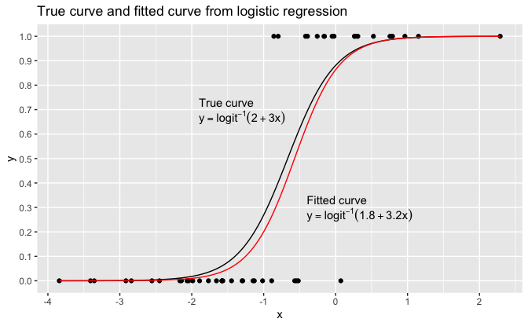
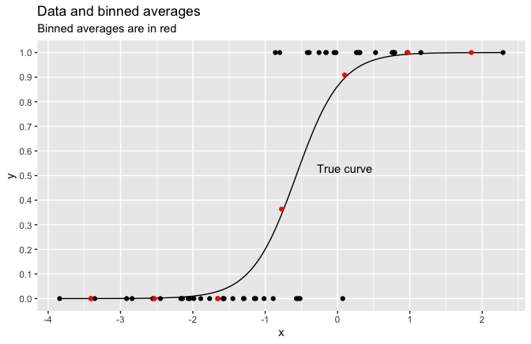
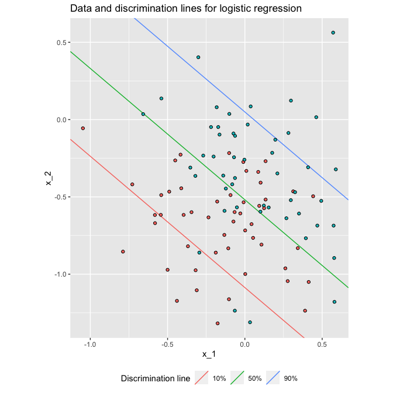

Regression and Other Stories: Logistic regression graphs
================
Andrew Gelman, Jennifer Hill, Aki Vehtari
2021-04-20

-   [14 Working with logistic
    regression](#14-working-with-logistic-regression)
    -   [14.1 Graphing logistic regression and binary
        data](#141-graphing-logistic-regression-and-binary-data)

Tidyverse version by Bill Behrman.

Different ways of displaying logistic regression. See Chapter 14 in
Regression and Other Stories.

------------------------------------------------------------------------

``` r
# Packages
library(tidyverse)
library(rstanarm)

# Parameters
  # Common code
file_common <- here::here("_common.R")

#===============================================================================

# Run common code
source(file_common)
```

# 14 Working with logistic regression

## 14.1 Graphing logistic regression and binary data

Simulated data from logit model with one predictor.

``` r
set.seed(485)

n <- 50
a <- 2
b <- 3

data_1 <- 
  tibble(
    x = rnorm(n, mean = -a / b, sd = 4 / b),
    y = rbinom(n, size = 1, prob = plogis(a + b * x))
  )

data_1
```

    #> # A tibble: 50 x 2
    #>        x     y
    #>    <dbl> <int>
    #>  1 -2.17     0
    #>  2 -3.84     0
    #>  3 -1.30     0
    #>  4 -1.29     0
    #>  5 -1.45     0
    #>  6 -3.41     0
    #>  7  1.15     1
    #>  8 -2.55     0
    #>  9 -1.89     0
    #> 10 -3.36     0
    #> # … with 40 more rows

Fit model.

``` r
set.seed(745)

fit_1 <- 
  stan_glm(
    y ~ x,
    family = binomial(link = "logit"),
    data = data_1, 
    refresh = 0
  )

fit_1
```

    #> stan_glm
    #>  family:       binomial [logit]
    #>  formula:      y ~ x
    #>  observations: 50
    #>  predictors:   2
    #> ------
    #>             Median MAD_SD
    #> (Intercept) 1.8    0.7   
    #> x           3.2    0.8   
    #> 
    #> ------
    #> * For help interpreting the printed output see ?print.stanreg
    #> * For info on the priors used see ?prior_summary.stanreg

True curve and fitted curve from logistic regression.

``` r
intercept <- coef(fit_1)[["(Intercept)"]]
slope <- coef(fit_1)[["x"]]

v <- 
  tibble(
    x = seq_range(data_1$x),
    y_true = plogis(a + b * x),
    y_fit = plogis(intercept + slope * x)
  )

labels <- 
  tribble(
      ~x,   ~y, ~label,
    -1.9, 0.73, "True~curve",
    -1.9, 0.67, "y == logit^{-1}*(2 + 3 * x)",
    -0.4, 0.33, "Fitted~curve",
    -0.4, 0.27, 
        str_glue(
          "y == logit^{-1}*({format(intercept, digits = 1, nsmall = 1)} + ",
          "{format(slope, digits = 1, nsmall = 1)} * x)"
        )

  )

v %>% 
  ggplot(aes(x)) +
  geom_point(aes(y = y), data = data_1) +
  geom_line(aes(y = y_true, color = "true")) +
  geom_line(aes(y = y_fit, color = "fit")) +
  geom_text(
    aes(y = y, label = label, hjust = hjust),
    data = labels,
    hjust = 0,
    parse = TRUE
  ) +
  scale_x_continuous(breaks = scales::breaks_width(1)) +
  scale_y_continuous(breaks = scales::breaks_width(0.1), minor_breaks = NULL) +
  scale_color_manual(breaks = c("true", "fit"), values = c("black", "red")) +
  theme(legend.position = "none") + 
  labs(title = "True curve and fitted curve from logistic regression")
```



Data and binned averages.

``` r
n_bins <- 7

binned_means <- 
  data_1 %>% 
  mutate(bin = cut(x, breaks = n_bins)) %>% 
  group_by(bin) %>% 
  summarize(y_mean = mean(y)) %>% 
  extract(
    col = bin,
    into = c("bin_min", "bin_max"),
    regex = "\\((.*),(.*)\\]"
  ) %>% 
  mutate(x = 0.5 * (as.double(bin_min) + as.double(bin_max)))

data_1 %>% 
  ggplot(aes(x)) +
  geom_point(aes(y = y)) +
  geom_line(aes(y = y_fit), data = v) +
  geom_point(aes(y = y_mean), data = binned_means, color = "red") +
  annotate("text", x = 0.1, y = 0.53, label = "True curve") +
  scale_x_continuous(breaks = scales::breaks_width(1)) +
  scale_y_continuous(breaks = scales::breaks_width(0.1), minor_breaks = NULL) +
  labs(
    title = "Data and binned averages",
    subtitle = "Binned averages are in red"
  )
```



Simulated data from logit model with two predictors.

``` r
set.seed(841)

n <- 100
b_0 <- 2
b_1 <- 3
b_2 <- 4
mean_1 <- 0
mean_2 <- -0.5
sd <- 0.4

data_2 <- 
  tibble(
    x_1 = rnorm(n, mean = mean_1, sd = sd),
    x_2 = rnorm(n, mean = mean_2, sd = sd),
    y = rbinom(n, 1, plogis(b_0 + b_1 * x_1 + b_2 * x_2))
  )
```

Fit model.

``` r
set.seed(657)

fit_2 <- 
  stan_glm(
    y ~ x_1 + x_2,
    family = binomial(link = "logit"),
    data = data_2, 
    refresh = 0
  )

fit_2
```

    #> stan_glm
    #>  family:       binomial [logit]
    #>  formula:      y ~ x_1 + x_2
    #>  observations: 100
    #>  predictors:   3
    #> ------
    #>             Median MAD_SD
    #> (Intercept) 2.0    0.5   
    #> x_1         3.3    0.9   
    #> x_2         3.9    0.9   
    #> 
    #> ------
    #> * For help interpreting the printed output see ?print.stanreg
    #> * For info on the priors used see ?prior_summary.stanreg

Data and discrimination lines for logistic regression.

``` r
coef <- coef(fit_2)
lines <- 
  tibble(
    prob = c(0.1, 0.5, 0.9),
    label = str_c(100 * prob, "%") %>% fct_inorder(),
    intercept = (qlogis(prob) - coef[1]) / coef[3],
    slope = -coef[2] / coef[3]
  )


data_2 %>% 
  ggplot(aes(x_1, x_2, fill = factor(y))) +
  geom_abline(
    aes(slope = slope, intercept = intercept, color = label),
    data = lines
  ) +
  geom_point(shape = "circle filled", show.legend = FALSE) +
  coord_fixed() +
  theme(legend.position = "bottom") +
  labs(
    title = "Data and discrimination lines for logistic regression",
    color = "Discrimination line"
  )
```


