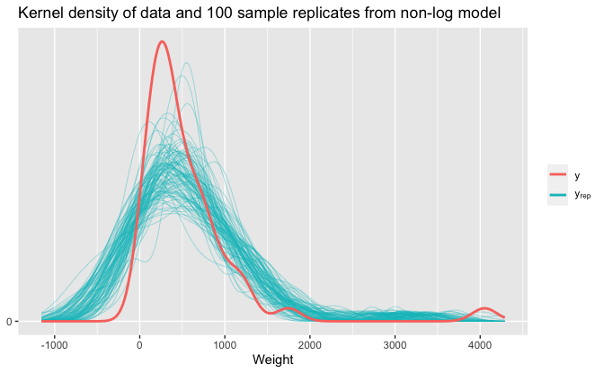
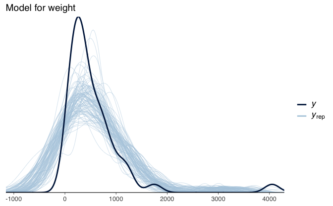
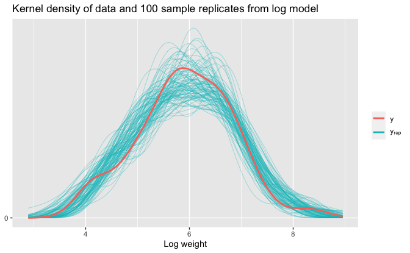
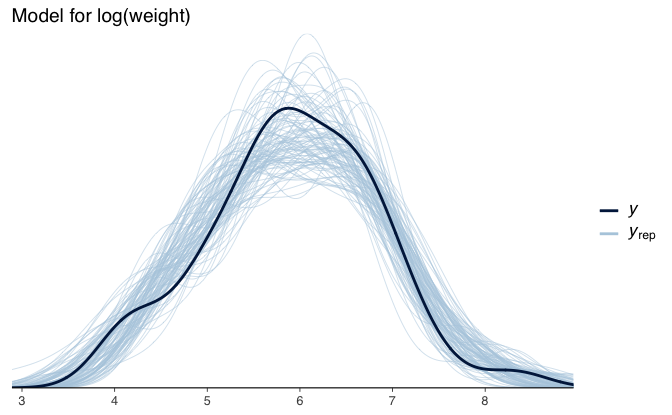
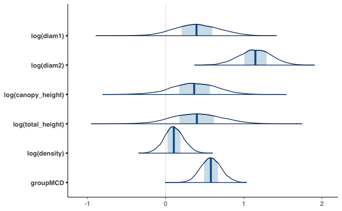
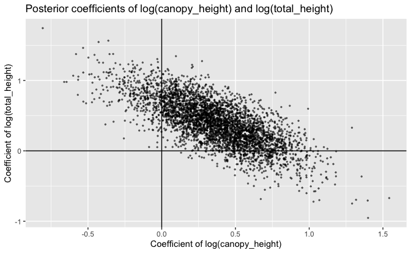

Regression and Other Stories: Mesquite
================
Andrew Gelman, Jennifer Hill, Aki Vehtari
2021-04-20

-   [12 Transformation and
    regression](#12-transformation-and-regression)
    -   [12.6 Building and comparing regression models for
        prediction](#126-building-and-comparing-regression-models-for-prediction)
        -   [Example predicting the yields of mesquite
            bushes](#example-predicting-the-yields-of-mesquite-bushes)
        -   [Using the Jacobian to adjust the predictive comparison
            after a
            tranformation](#using-the-jacobian-to-adjust-the-predictive-comparison-after-a-tranformation)
        -   [Constructing a simpler
            model](#constructing-a-simpler-model)

Tidyverse version by Bill Behrman.

Predicting the yields of mesquite bushes. See Chapter 12 in Regression
and Other Stories.

------------------------------------------------------------------------

``` r
# Packages
library(tidyverse)
library(bayesplot)
library(rstanarm)

# Parameters
  # Seed
SEED <- 4587
  # Mesquite biomass production data
file_mesquite <- here::here("Mesquite/data/mesquite.dat")
  # Common code
file_common <- here::here("_common.R")

# Functions
  # LOO R^2
loo_r2 <- function(fit, digits = 2) {
  round(median(loo_R2(fit)), digits = digits)
}
  # Bayesian R^2
bayes_r2 <- function(fit, digits = 2) {
  round(median(bayes_R2(fit)), digits = digits)
}
  # Plot kernel density of data and sample replicates
plot_density_overlay <- function(y, y_rep) {
  ggplot(mapping = aes(y)) +
    stat_density(
      aes(group = rep, color = "y_rep"),
      data = 
        seq_len(nrow(y_rep)) %>% map_dfr(~ tibble(rep = ., y = y_rep[., ])),
      geom = "line",
      position = "identity",
      alpha = 0.5,
      size = 0.25
    ) +
    stat_density(aes(color = "y"), data = tibble(y), geom = "line", size = 1) +
    scale_y_continuous(breaks = 0) +
    scale_color_discrete(
      breaks = c("y", "y_rep"),
      labels = c("y", expression(y[rep]))
    ) +
    theme(legend.text.align = 0) +
    labs(
      x = NULL,
      y = NULL,
      color = NULL
    )
}

#===============================================================================

# Run common code
source(file_common)
```

# 12 Transformation and regression

## 12.6 Building and comparing regression models for prediction

### Example predicting the yields of mesquite bushes

Data

``` r
mesquite <- read_table2(file_mesquite)

mesquite
```

    #> # A tibble: 46 x 8
    #>      obs group diam1 diam2 total_height canopy_height density weight
    #>    <dbl> <chr> <dbl> <dbl>        <dbl>         <dbl>   <dbl>  <dbl>
    #>  1     1 MCD     1.8  1.15         1.3           1          1   401.
    #>  2     2 MCD     1.7  1.35         1.35          1.33       1   514.
    #>  3     3 MCD     2.8  2.55         2.16          0.6        1  1179.
    #>  4     4 MCD     1.3  0.85         1.8           1.2        1   308 
    #>  5     5 MCD     3.3  1.9          1.55          1.05       1   855.
    #>  6     6 MCD     1.4  1.4          1.2           1          1   269.
    #>  7     7 MCD     1.5  0.5          1             0.9        1   156.
    #>  8     8 MCD     3.9  2.3          1.7           1.3        2  1253.
    #>  9     9 MCD     1.8  1.35         0.8           0.6        1   328 
    #> 10    10 MCD     2.1  1.6          1.2           0.8        1   615.
    #> # … with 36 more rows

The outcome variable is `weight`, the total weight in grams of
photosynthetic material derived from harvesting the bush. The other
variables are:

-   `group`: Two separate sets of measurements were taken, one on a
    group of 26 bushes and the other on a different group 20 bushes
    measured at a different time of year
-   `diam1`: Diameter of the canopy (the leafy area of the bush) in
    meters, measured along the longer axis of the bush
-   `diam2`: Canopy diameter measured along the shorter diameter
-   `total_height`: Total height of bush
-   `canopy_height`: Height of canopy
-   `density`: Plant unit density (number of primary stems per plant
    unit)

Model weight on all the predictors.

``` r
fit_1 <- 
  stan_glm(
    weight ~ diam1 + diam2 + canopy_height + total_height + density + group,
    data = mesquite,
    seed = SEED,
    refresh = 0
  )

fit_1
```

    #> stan_glm
    #>  family:       gaussian [identity]
    #>  formula:      weight ~ diam1 + diam2 + canopy_height + total_height + density + 
    #>     group
    #>  observations: 46
    #>  predictors:   7
    #> ------
    #>               Median  MAD_SD 
    #> (Intercept)   -1090.1   182.3
    #> diam1           192.6   114.4
    #> diam2           372.2   122.4
    #> canopy_height   354.0   221.7
    #> total_height   -101.4   194.6
    #> density         130.1    35.7
    #> groupMCD        360.8   102.7
    #> 
    #> Auxiliary parameter(s):
    #>       Median MAD_SD
    #> sigma 273.8   31.4 
    #> 
    #> ------
    #> * For help interpreting the printed output see ?print.stanreg
    #> * For info on the priors used see ?prior_summary.stanreg

LOO log score

``` r
loo_1 <- loo(fit_1)
```

    #> Warning: Found 3 observation(s) with a pareto_k > 0.7. We recommend calling 'loo' again with argument 'k_threshold = 0.7' in order to calculate the ELPD without the assumption that these observations are negligible. This will refit the model 3 times to compute the ELPDs for the problematic observations directly.

We get warnings about high Pareto k values, so we follow the advice and
call `loo()` again with the suggested argument.

``` r
loo_1 <- loo(fit_1, k_threshold = 0.7)

loo_1
```

    #> 
    #> Computed from 4000 by 46 log-likelihood matrix
    #> 
    #>          Estimate   SE
    #> elpd_loo   -351.2 28.8
    #> p_loo        33.0 25.0
    #> looic       702.4 57.5
    #> ------
    #> Monte Carlo SE of elpd_loo is 0.5.
    #> 
    #> All Pareto k estimates are good (k < 0.5).
    #> See help('pareto-k-diagnostic') for details.

LOO *R*<sup>2</sup>

``` r
loo_r2(fit_1)
```

    #> [1] 0.72

Bayesian *R*<sup>2</sup>

``` r
bayes_r2(fit_1)
```

    #> [1] 0.83

Model log(weight) on log transformed predictors.

``` r
fit_2 <- 
  stan_glm(
    log(weight) ~ 
      log(diam1) + log(diam2) + log(canopy_height) + log(total_height) +
      log(density) + group,
    data = mesquite,
    seed = SEED,
    refresh = 0
  )

fit_2
```

    #> stan_glm
    #>  family:       gaussian [identity]
    #>  formula:      log(weight) ~ log(diam1) + log(diam2) + log(canopy_height) + 
    #>     log(total_height) + log(density) + group
    #>  observations: 46
    #>  predictors:   7
    #> ------
    #>                    Median MAD_SD
    #> (Intercept)        4.8    0.2   
    #> log(diam1)         0.4    0.3   
    #> log(diam2)         1.1    0.2   
    #> log(canopy_height) 0.4    0.3   
    #> log(total_height)  0.4    0.3   
    #> log(density)       0.1    0.1   
    #> groupMCD           0.6    0.1   
    #> 
    #> Auxiliary parameter(s):
    #>       Median MAD_SD
    #> sigma 0.3    0.0   
    #> 
    #> ------
    #> * For help interpreting the printed output see ?print.stanreg
    #> * For info on the priors used see ?prior_summary.stanreg

LOO log score

``` r
loo_2 <- loo(fit_2)
```

    #> Warning: Found 1 observation(s) with a pareto_k > 0.7. We recommend calling 'loo' again with argument 'k_threshold = 0.7' in order to calculate the ELPD without the assumption that these observations are negligible. This will refit the model 1 times to compute the ELPDs for the problematic observations directly.

We get a warning about a high Pareto k value, so we again follow the
advice and call `loo()` again with the suggested argument.

``` r
loo_2 <- loo(fit_2, k_threshold = 0.7)

loo_2
```

    #> 
    #> Computed from 4000 by 46 log-likelihood matrix
    #> 
    #>          Estimate   SE
    #> elpd_loo    -19.3  5.3
    #> p_loo         7.5  1.5
    #> looic        38.5 10.7
    #> ------
    #> Monte Carlo SE of elpd_loo is 0.1.
    #> 
    #> Pareto k diagnostic values:
    #>                          Count Pct.    Min. n_eff
    #> (-Inf, 0.5]   (good)     44    97.8%   945       
    #>  (0.5, 0.7]   (ok)        1     2.2%   374       
    #>    (0.7, 1]   (bad)       0     0.0%   <NA>      
    #>    (1, Inf)   (very bad)  0     0.0%   <NA>      
    #> 
    #> All Pareto k estimates are ok (k < 0.7).
    #> See help('pareto-k-diagnostic') for details.

LOO *R*<sup>2</sup>

``` r
loo_r2(fit_2)
```

    #> [1] 0.85

Bayesian *R*<sup>2</sup>

``` r
bayes_r2(fit_2)
```

    #> [1] 0.87

### Using the Jacobian to adjust the predictive comparison after a tranformation

Since model 1 uses `weight` as its outcome variable and model 2 uses
`log(weight)`, a Jacobian correction is needed in order to compare the
models.

``` r
loo_2_with_jacobian <- loo_2
loo_2_with_jacobian$pointwise[, "elpd_loo"] <- 
  loo_2_with_jacobian$pointwise[, "elpd_loo"] - log(mesquite$weight)

loo_2_with_jacobian_elpd <- sum(loo_2_with_jacobian$pointwise[, "elpd_loo"])
loo_2_with_jacobian_elpd
```

    #> [1] -292

With the Jacobian correction, we can now compare the log scores of
models 1 and 2. There will be a warning about the outcome variables
being different, but this is OK because we have made the correction.

``` r
loo_compare(loo_1, loo_2_with_jacobian)
```

    #> Warning: Not all models have the same y variable. ('yhash' attributes do not
    #> match)

    #>       elpd_diff se_diff
    #> fit_2   0.0       0.0  
    #> fit_1 -59.7      26.5

Model 2 has the better log score.

#### Posterior predictive checking for non-log model

Replicates from non-log model.

``` r
set.seed(700)

y_rep_1 <- posterior_predict(fit_1)

n_sims <- nrow(y_rep_1)
n_rep <- 100
sims_sample <- sample(n_sims, n_rep)
```

Kernel density of data and 100 sample replicates from non-log model.

``` r
plot_density_overlay(y = mesquite$weight, y_rep = y_rep_1[sims_sample, ]) +
  labs(
    title = 
      str_glue(
        "Kernel density of data and {n_rep} sample replicates from non-log model"
      ),
    x = "Weight"
  )
```



Kernel density of data and 100 sample replicates from non-log model
using bayesplot.

``` r
ppc_dens_overlay(y = mesquite$weight, yrep = y_rep_1[sims_sample, ]) +
  theme(
    axis.line.y = element_blank(),
    text = element_text(family = "sans"),
  ) +
  labs(title = "Model for weight")
```



#### Posterior predictive checking for model in log scale

Replicates from log model.

``` r
set.seed(700)

y_rep_2 <- posterior_predict(fit_2)
```

Kernel density of data and 100 sample replicates from log model.

``` r
plot_density_overlay(y = log(mesquite$weight), y_rep = y_rep_2[sims_sample, ]) +
  labs(
    title = 
      str_glue(
        "Kernel density of data and {n_rep} sample replicates from log model"
      ),
    x = "Log weight"
  )
```



Kernel density of data and 100 sample replicates from log model using
bayesplot.

``` r
ppc_dens_overlay(y = log(mesquite$weight), yrep = y_rep_2[sims_sample, ]) +
  theme(
    axis.line.y = element_blank(),
    text = element_text(family = "sans"),
  ) +
  labs(title = "Model for log(weight)")
```



Marginal posteriors for log model using bayesplot.

``` r
mcmc_areas(as.matrix(fit_2), regex_pars = "^(log|group)") +
  theme(text = element_text(family = "sans"))
```



Posterior coefficients of `log(canopy_height)` and `log(total_height)`.

``` r
sims_2 <- as_tibble(fit_2)

sims_2 %>% 
  ggplot(aes(`log(canopy_height)`, `log(total_height)`)) +
  geom_hline(yintercept = 0) +
  geom_vline(xintercept = 0) +
  geom_point(alpha = 0.5, size = 0.5) +
  labs(
    title =
      "Posterior coefficients of log(canopy_height) and log(total_height)",
    x = "Coefficient of log(canopy_height)",
    y = "Coefficient of log(total_height)"
  )
```



We can see that although the univariate marginal densities overlap with
zero, the joint distribution is clearly separated from zero.

### Constructing a simpler model

Additional transformed variables.

``` r
mesquite <- 
  mesquite %>% 
  mutate(
    canopy_volume = diam1 * diam2 * canopy_height,
    canopy_area = diam1 * diam2,
    canopy_shape = diam1 / diam2
  )
```

#### A model with canopy volume variable

``` r
fit_3 <- 
  stan_glm(
    log(weight) ~ log(canopy_volume),
    data = mesquite,
    seed = SEED,
    refresh = 0
  )

fit_3
```

    #> stan_glm
    #>  family:       gaussian [identity]
    #>  formula:      log(weight) ~ log(canopy_volume)
    #>  observations: 46
    #>  predictors:   2
    #> ------
    #>                    Median MAD_SD
    #> (Intercept)        5.2    0.1   
    #> log(canopy_volume) 0.7    0.1   
    #> 
    #> Auxiliary parameter(s):
    #>       Median MAD_SD
    #> sigma 0.4    0.0   
    #> 
    #> ------
    #> * For help interpreting the printed output see ?print.stanreg
    #> * For info on the priors used see ?prior_summary.stanreg

LOO log score

``` r
loo_3 <- loo(fit_3)

loo_3
```

    #> 
    #> Computed from 4000 by 46 log-likelihood matrix
    #> 
    #>          Estimate   SE
    #> elpd_loo    -26.6  5.0
    #> p_loo         2.5  0.7
    #> looic        53.2 10.0
    #> ------
    #> Monte Carlo SE of elpd_loo is 0.0.
    #> 
    #> All Pareto k estimates are good (k < 0.5).
    #> See help('pareto-k-diagnostic') for details.

LOO *R*<sup>2</sup>

``` r
loo_r2(fit_3)
```

    #> [1] 0.79

Bayesian *R*<sup>2</sup>

``` r
bayes_r2(fit_3)
```

    #> [1] 0.79

Compare log scores. Models 2 and 3 both use `log(weight)` as the outcome
variable, so they can be compared directly.

``` r
loo_compare(loo_2, loo_3)
```

    #>       elpd_diff se_diff
    #> fit_2  0.0       0.0   
    #> fit_3 -7.3       5.0

Model 2 has the better log score.

#### Add canopy area and shape to model

``` r
fit_4 <- 
  stan_glm(
    log(weight) ~ 
      log(canopy_volume) + log(canopy_area) + log(canopy_shape) + 
      log(total_height) + log(density) + group,
    data = mesquite,
    seed = SEED,
    refresh = 0
  )

fit_4
```

    #> stan_glm
    #>  family:       gaussian [identity]
    #>  formula:      log(weight) ~ log(canopy_volume) + log(canopy_area) + log(canopy_shape) + 
    #>     log(total_height) + log(density) + group
    #>  observations: 46
    #>  predictors:   7
    #> ------
    #>                    Median MAD_SD
    #> (Intercept)         4.8    0.2  
    #> log(canopy_volume)  0.4    0.3  
    #> log(canopy_area)    0.4    0.3  
    #> log(canopy_shape)  -0.4    0.2  
    #> log(total_height)   0.4    0.3  
    #> log(density)        0.1    0.1  
    #> groupMCD            0.6    0.1  
    #> 
    #> Auxiliary parameter(s):
    #>       Median MAD_SD
    #> sigma 0.3    0.0   
    #> 
    #> ------
    #> * For help interpreting the printed output see ?print.stanreg
    #> * For info on the priors used see ?prior_summary.stanreg

LOO log score

``` r
loo_4 <- loo(fit_4)

loo_4
```

    #> 
    #> Computed from 4000 by 46 log-likelihood matrix
    #> 
    #>          Estimate   SE
    #> elpd_loo    -19.4  5.3
    #> p_loo         7.5  1.5
    #> looic        38.7 10.7
    #> ------
    #> Monte Carlo SE of elpd_loo is 0.1.
    #> 
    #> Pareto k diagnostic values:
    #>                          Count Pct.    Min. n_eff
    #> (-Inf, 0.5]   (good)     42    91.3%   467       
    #>  (0.5, 0.7]   (ok)        4     8.7%   503       
    #>    (0.7, 1]   (bad)       0     0.0%   <NA>      
    #>    (1, Inf)   (very bad)  0     0.0%   <NA>      
    #> 
    #> All Pareto k estimates are ok (k < 0.7).
    #> See help('pareto-k-diagnostic') for details.

LOO *R*<sup>2</sup>

``` r
loo_r2(fit_4)
```

    #> [1] 0.85

Bayesian *R*<sup>2</sup>

``` r
bayes_r2(fit_4)
```

    #> [1] 0.87

Compare log scores.

``` r
loo_compare(loo_2, loo_4)
```

    #>       elpd_diff se_diff
    #> fit_2  0.0       0.0   
    #> fit_4 -0.1       0.1

The predictor variables in model 4 and just a linear transformation of
those in model 2, so the log scores for the two models are virtually the
same.

#### A model with just canopy volume and canopy shape

``` r
fit_5 <- 
  stan_glm(
    log(weight) ~ log(canopy_volume) + log(canopy_shape) + group,
    data = mesquite,
    seed = SEED,
    refresh = 0
  )

fit_5
```

    #> stan_glm
    #>  family:       gaussian [identity]
    #>  formula:      log(weight) ~ log(canopy_volume) + log(canopy_shape) + group
    #>  observations: 46
    #>  predictors:   4
    #> ------
    #>                    Median MAD_SD
    #> (Intercept)         4.9    0.1  
    #> log(canopy_volume)  0.8    0.1  
    #> log(canopy_shape)  -0.4    0.2  
    #> groupMCD            0.6    0.1  
    #> 
    #> Auxiliary parameter(s):
    #>       Median MAD_SD
    #> sigma 0.3    0.0   
    #> 
    #> ------
    #> * For help interpreting the printed output see ?print.stanreg
    #> * For info on the priors used see ?prior_summary.stanreg

LOO log score

``` r
loo_5 <- loo(fit_5)

loo_5
```

    #> 
    #> Computed from 4000 by 46 log-likelihood matrix
    #> 
    #>          Estimate   SE
    #> elpd_loo    -18.0  5.4
    #> p_loo         5.4  1.3
    #> looic        36.0 10.9
    #> ------
    #> Monte Carlo SE of elpd_loo is 0.1.
    #> 
    #> Pareto k diagnostic values:
    #>                          Count Pct.    Min. n_eff
    #> (-Inf, 0.5]   (good)     44    95.7%   1195      
    #>  (0.5, 0.7]   (ok)        2     4.3%   530       
    #>    (0.7, 1]   (bad)       0     0.0%   <NA>      
    #>    (1, Inf)   (very bad)  0     0.0%   <NA>      
    #> 
    #> All Pareto k estimates are ok (k < 0.7).
    #> See help('pareto-k-diagnostic') for details.

LOO *R*<sup>2</sup>

``` r
loo_r2(fit_5)
```

    #> [1] 0.85

Bayesian *R*<sup>2</sup>

``` r
bayes_r2(fit_5)
```

    #> [1] 0.87

Compare log scores.

``` r
loo_compare(loo_4, loo_5)
```

    #>       elpd_diff se_diff
    #> fit_5  0.0       0.0   
    #> fit_4 -1.4       1.6

The simpler model 5, with a subset of the predictor variables of model
4, has the better log score.
