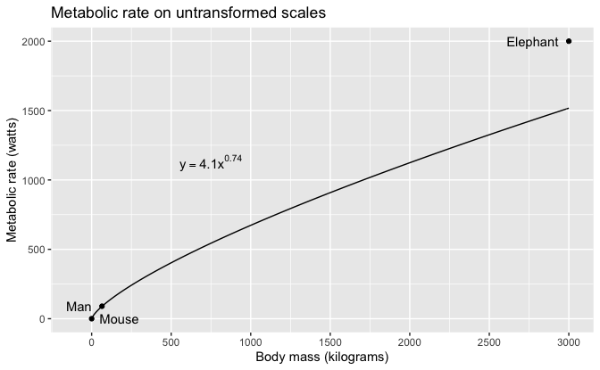
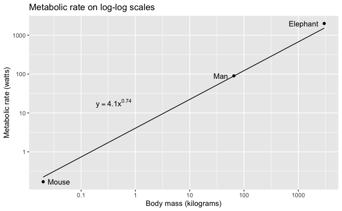

Regression and Other Stories: Metabolic
================
Andrew Gelman, Jennifer Hill, Aki Vehtari
2021-04-20

-   [3 Some basic methods in mathematics and
    probability](#3-some-basic-methods-in-mathematics-and-probability)
    -   [3.4 Exponential and power-law growth and decline; logarithmic
        and log-log
        relationships](#34-exponential-and-power-law-growth-and-decline-logarithmic-and-log-log-relationships)

Tidyverse version by Bill Behrman.

An example of how to interpret a power law or log-log regression. See
Chapter 3 in Regression and Other Stories.

Animals’ body mass and metabolism comes from section 3.8.2 of Gelman and
Nolan: Teaching Statistics: A Bag of Tricks, second edition. Oxford
University Press, 2017.

------------------------------------------------------------------------

``` r
# Packages
library(tidyverse)

# Parameters
  # Common code
file_common <- here::here("_common.R")

#===============================================================================

# Run common code
source(file_common)
```

# 3 Some basic methods in mathematics and probability

## 3.4 Exponential and power-law growth and decline; logarithmic and log-log relationships

Data

``` r
metabolic_rates <- 
  tribble(
    ~animal,    ~mass, ~metabolic_rate, ~hjust,
    "Mouse",     0.02,            0.17,   -0.2,
    "Man",         65,              90,    1.4,
    "Elephant",  3000,            2000,    1.2
  )

intercept <- 1.4
slope <- 0.74
```

Metabolic rate on untransformed scales.

``` r
power_law <- 
  tibble(
    mass = seq(0.02, 3000, length.out = 201),
    metabolic_rate = exp(intercept) * mass^slope
  )

eqn <- 
  str_glue(
    "y == {format(exp(intercept), digits = 1, nsmall = 1)}*",
    "x^{format(slope, digits = 2, nsmall = 2)}"
  )

metabolic_rates %>% 
  ggplot(aes(mass, metabolic_rate)) +
  geom_line(data = power_law) +
  geom_point() +
  geom_text(aes(label = animal, hjust = hjust)) +
  annotate("text", x = 750, y = 1125, label = eqn, parse = TRUE) +
  scale_x_continuous(breaks = scales::breaks_width(500)) +
  coord_cartesian(xlim = c(-100, NA)) +
  labs(
    title = "Metabolic rate on untransformed scales",
    x = "Body mass (kilograms)",
    y = "Metabolic rate (watts)"
  )
```



Metabolic rate on log-log scales.

``` r
metabolic_rates %>% 
  ggplot(aes(mass, metabolic_rate)) +
  geom_line(data = power_law) +
  geom_point() +
  geom_text(aes(label = animal, hjust = hjust)) +
  annotate("text", x = 0.4, y = 18, label = eqn, parse = TRUE) +
  scale_x_log10(
    labels = scales::label_number(big.mark = "", drop0trailing = TRUE)
  ) +
  scale_y_log10() +
  labs(
    title = "Metabolic rate on log-log scales",
    x = "Body mass (kilograms)",
    y = "Metabolic rate (watts)"
  )
```


