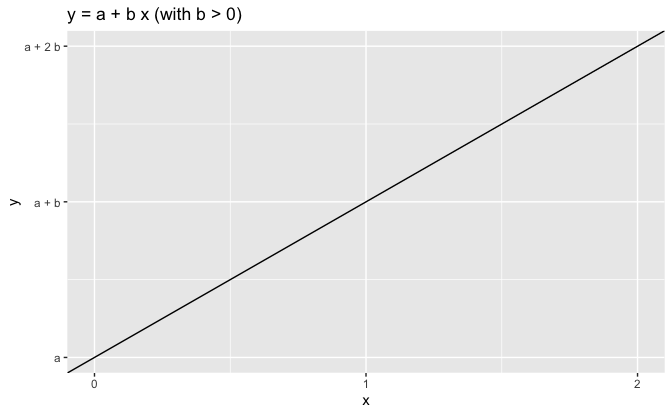
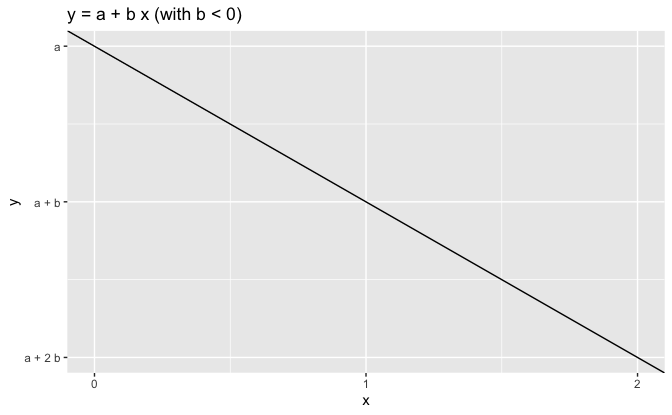
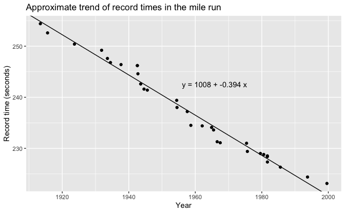
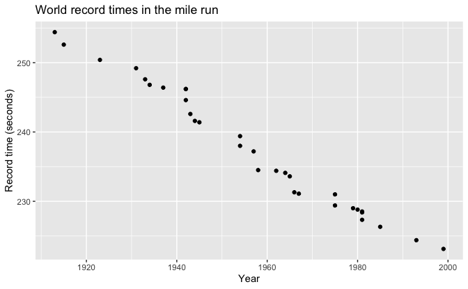
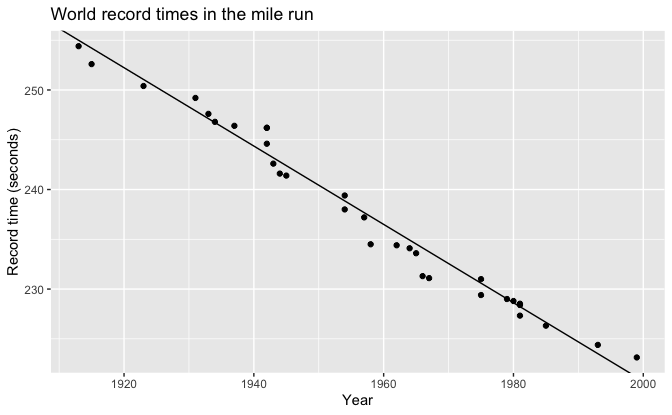

Regression and Other Stories: Mile
================
Andrew Gelman, Jennifer Hill, Aki Vehtari
2021-04-20

-   [3 Some basic methods in mathematics and
    probability](#3-some-basic-methods-in-mathematics-and-probability)
    -   [3.2 Graphing a line](#32-graphing-a-line)
-   [A Computing in R](#a-computing-in-r)
    -   [A.5 Making graphs](#a5-making-graphs)
        -   [Graphing data](#graphing-data)

Tidyverse version by Bill Behrman.

Trend of record times in the mile run. See Chapter 3 and Appendix A in
Regression and Other Stories.

------------------------------------------------------------------------

``` r
# Packages
library(tidyverse)
library(rstanarm)

# Parameters
  # Mile run world record times
file_mile <- here::here("Mile/data/mile.csv")
  # Common code
file_common <- here::here("_common.R")

#===============================================================================

# Run common code
source(file_common)
```

# 3 Some basic methods in mathematics and probability

## 3.2 Graphing a line

Data

``` r
mile <- read_csv(file_mile)

mile
```

    #> # A tibble: 32 x 6
    #>       yr month   min   sec  year seconds
    #>    <dbl> <dbl> <dbl> <dbl> <dbl>   <dbl>
    #>  1  1913     5     4  14.4 1913.    254.
    #>  2  1915     7     4  12.6 1916.    253.
    #>  3  1923     8     4  10.4 1924.    250.
    #>  4  1931    10     4   9.2 1932.    249.
    #>  5  1933     7     4   7.6 1934.    248.
    #>  6  1934     6     4   6.8 1934.    247.
    #>  7  1937     8     4   6.4 1938.    246.
    #>  8  1942     7     4   6.2 1943.    246.
    #>  9  1942     7     4   6.2 1943.    246.
    #> 10  1942     9     4   4.6 1943.    245.
    #> # … with 22 more rows

Fit linear model.

The option `refresh = 0` suppresses the default Stan sampling progress
output. This is useful for small data with fast computation. For more
complex models and bigger data, it can be useful to see the progress.

``` r
set.seed(733)

fit <- stan_glm(seconds ~ year, data = mile, refresh = 0)

print(fit, digits = 2)
```

    #> stan_glm
    #>  family:       gaussian [identity]
    #>  formula:      seconds ~ year
    #>  observations: 32
    #>  predictors:   2
    #> ------
    #>             Median  MAD_SD 
    #> (Intercept) 1007.99   21.15
    #> year          -0.39    0.01
    #> 
    #> Auxiliary parameter(s):
    #>       Median MAD_SD
    #> sigma 1.42   0.18  
    #> 
    #> ------
    #> * For help interpreting the printed output see ?print.stanreg
    #> * For info on the priors used see ?prior_summary.stanreg

Example of increasing trend.

``` r
f <- function(x) {
  intercept + slope * x
}

intercept <- 0.15
slope <- 0.4

v <- tibble(x = c(0, 2), y = f(x))

v %>% 
  ggplot(aes(x, y)) +
  geom_blank() +
  geom_abline(slope = slope, intercept = intercept) +
  scale_x_continuous(breaks = 0:2) +
  scale_y_continuous(breaks = f(0:2), labels = c("a", "a + b", "a + 2 b")) +
  labs(title = "y = a + b x (with b > 0)")
```



Example of decreasing trend.

``` r
intercept <- 0.95
slope <- -0.4

v <- tibble(x = c(0, 2), y = f(x))

v %>% 
  ggplot(aes(x, y)) +
  geom_blank() +
  geom_abline(slope = slope, intercept = intercept) +
  scale_x_continuous(breaks = 0:2) +
  scale_y_continuous(breaks = f(0:2), labels = c("a", "a + b", "a + 2 b")) +
  labs(title = "y = a + b x (with b < 0)")
```



Approximate trend of record times in the mile run.

``` r
intercept <- coef(fit)[["(Intercept)"]]
slope <- coef(fit)[["year"]]

eqn <- 
  str_glue(
    "y = {format(intercept, digits = 0)} + ",
    "{format(slope, digits = 3, nsmall = 3)} x"
  )

mile %>% 
  ggplot(aes(year, seconds)) +
  geom_point() +
  geom_abline(slope = slope, intercept = intercept) +
  annotate("text", x = 1956, y = 242.5, label = eqn, hjust = 0) +
  scale_x_continuous(breaks = scales::breaks_width(20)) +
  labs(
    title = "Approximate trend of record times in the mile run",
    x = "Year",
    y = "Record time (seconds)"
  )
```



# A Computing in R

## A.5 Making graphs

### Graphing data

#### Scatterplots

World record times in the mile run.

``` r
plot <- 
  mile %>% 
  ggplot(aes(yr, seconds)) +
  geom_point() +
  scale_x_continuous(breaks = scales::breaks_width(20)) +
  labs(
    title = "World record times in the mile run",
    x = "Year",
    y = "Record time (seconds)"
  )

plot
```



#### Fitting a line to the data

We can fit a linear trend of world record times as follows:

``` r
set.seed(733)

fit <- stan_glm(seconds ~ year, data = mile, refresh = 0)
```

Here is the result:

``` r
fit
```

    #> stan_glm
    #>  family:       gaussian [identity]
    #>  formula:      seconds ~ year
    #>  observations: 32
    #>  predictors:   2
    #> ------
    #>             Median MAD_SD
    #> (Intercept) 1008.0   21.1
    #> year          -0.4    0.0
    #> 
    #> Auxiliary parameter(s):
    #>       Median MAD_SD
    #> sigma 1.4    0.2   
    #> 
    #> ------
    #> * For help interpreting the printed output see ?print.stanreg
    #> * For info on the priors used see ?prior_summary.stanreg

Here is the result with more significant digits:

``` r
print(fit, digits = 2)
```

    #> stan_glm
    #>  family:       gaussian [identity]
    #>  formula:      seconds ~ year
    #>  observations: 32
    #>  predictors:   2
    #> ------
    #>             Median  MAD_SD 
    #> (Intercept) 1007.99   21.15
    #> year          -0.39    0.01
    #> 
    #> Auxiliary parameter(s):
    #>       Median MAD_SD
    #> sigma 1.42   0.18  
    #> 
    #> ------
    #> * For help interpreting the printed output see ?print.stanreg
    #> * For info on the priors used see ?prior_summary.stanreg

We can add the linear regression line to the scatterplot:

``` r
intercept <- coef(fit)[["(Intercept)"]]
slope <- coef(fit)[["year"]]

plot +
  geom_abline(slope = slope, intercept = intercept)
```


