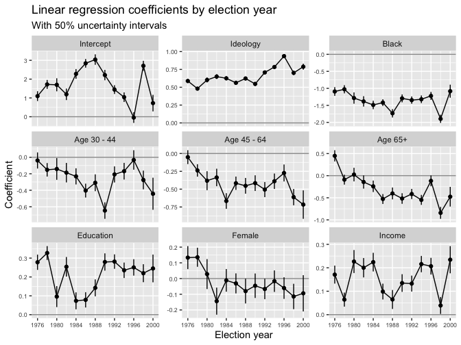

Regression and Other Stories: National election study
================
Andrew Gelman, Jennifer Hill, Aki Vehtari
2021-04-20

-   [10 Linear regression with multiple
    predictors](#10-linear-regression-with-multiple-predictors)
    -   [10.9 Fitting the same model to many
        datasets](#109-fitting-the-same-model-to-many-datasets)
        -   [Predicting party
            identification](#predicting-party-identification)

Tidyverse version by Bill Behrman.

Fitting the same regression to many datasets. See Chapter 10 in
Regression and Other Stories.

------------------------------------------------------------------------

``` r
# Packages
library(tidyverse)
library(rstanarm)

# Parameters
  # National Election Study data
file_nes <- here::here("NES/data/nes.txt")
  # Common code
file_common <- here::here("_common.R")

#===============================================================================

# Run common code
source(file_common)
```

# 10 Linear regression with multiple predictors

## 10.9 Fitting the same model to many datasets

### Predicting party identification

Data

``` r
nes <-
  file_nes %>% 
  read.table() %>% 
  as_tibble()

glimpse(nes)
```

    #> Rows: 34,908
    #> Columns: 70
    #> $ year            <int> 1952, 1952, 1952, 1952, 1952, 1952, 1952, 1952, 1952, …
    #> $ resid           <int> 1, 2, 3, 4, 5, 6, 7, 8, 10, 11, 12, 13, 14, 15, 16, 17…
    #> $ weight1         <dbl> 1, 1, 1, 1, 1, 1, 1, 1, 1, 1, 1, 1, 1, 1, 1, 1, 1, 1, …
    #> $ weight2         <dbl> 1, 1, 1, 1, 1, 1, 1, 1, 1, 1, 1, 1, 1, 1, 1, 1, 1, 1, …
    #> $ weight3         <dbl> 1, 1, 1, 1, 1, 1, 1, 1, 1, 1, 1, 1, 1, 1, 1, 1, 1, 1, …
    #> $ age             <int> 25, 33, 26, 63, 66, 48, 70, 25, 35, 33, 50, 62, 53, 61…
    #> $ gender          <int> 2, 2, 2, 1, 2, 2, 2, 1, 2, 2, 2, 2, 2, 2, 2, 2, 2, 1, …
    #> $ race            <int> 1, 1, 1, 1, 1, 1, 1, 2, 1, 1, 1, 1, 1, 1, 1, 1, 1, 1, …
    #> $ educ1           <int> 2, 1, 2, 2, 2, 2, 1, 2, 1, 2, 4, 2, 1, 2, 2, 1, 1, 2, …
    #> $ urban           <int> 2, 2, 2, 2, 2, 2, 3, 1, 1, 1, 1, 1, 3, 1, 1, 1, 3, 2, …
    #> $ region          <int> 1, 1, 1, 1, 2, 2, 4, 2, 2, 2, 2, 2, 2, 1, 2, 1, 2, 1, …
    #> $ income          <int> 4, 4, 3, 3, 1, 4, 1, 2, 4, 3, 4, 4, 1, 1, 3, 4, 1, 2, …
    #> $ occup1          <int> 2, 6, 6, 3, 6, 6, 6, 4, 6, 6, 6, 6, 6, 3, 2, 6, 6, 2, …
    #> $ union           <int> 1, 1, 2, 1, 2, 1, NA, 2, 1, 1, 2, 1, 2, 2, 2, 1, 2, 1,…
    #> $ religion        <int> 1, 1, 2, 1, 1, 1, 1, 1, 1, 1, 1, 1, 1, 1, 1, 2, 1, 2, …
    #> $ educ2           <int> 3, 1, 3, 2, 4, 2, 1, 4, 1, 3, 6, 2, 1, 2, 4, 1, 1, 2, …
    #> $ educ3           <int> 3, 1, 3, 2, 4, 2, 1, 4, 1, 3, 6, 2, 1, 2, 4, 1, 1, 2, …
    #> $ martial_status  <int> 1, 1, 1, 1, 1, 1, NA, 1, 1, 1, 1, 1, 1, NA, NA, 1, 1, …
    #> $ occup2          <int> 2, 6, 6, 3, 6, 6, 6, 4, 6, 6, 6, 6, 6, 3, 2, 6, 6, 2, …
    #> $ icpsr_cty       <int> NA, NA, NA, NA, NA, NA, NA, NA, NA, NA, NA, NA, NA, NA…
    #> $ fips_cty        <int> NA, NA, NA, NA, NA, NA, NA, NA, NA, NA, NA, NA, NA, NA…
    #> $ partyid7        <int> 6, 5, 4, 7, 7, 3, 4, 2, 6, 2, 7, 3, 2, 7, 2, 1, 1, 7, …
    #> $ partyid3        <int> 3, 3, 2, 3, 3, 1, 2, 1, 3, 1, 3, 1, 1, 3, 1, 1, 1, 3, …
    #> $ partyid3_b      <int> 3, 3, 2, 3, 3, 1, 2, 1, 3, 1, 3, 1, 1, 3, 1, 1, 1, 3, …
    #> $ str_partyid     <int> 3, 2, 1, 4, 4, 2, 1, 3, 3, 3, 4, 2, 3, 4, 3, 4, 4, 4, …
    #> $ father_party    <int> 3, 2, 1, 1, 1, 1, NA, 1, 1, 3, 3, NA, 1, 3, 3, NA, NA,…
    #> $ mother_party    <int> 3, 2, 1, NA, 1, 1, NA, 1, 3, 3, 3, NA, NA, 3, 3, NA, N…
    #> $ dlikes          <int> 0, -1, 0, -1, -2, 0, 0, 0, -1, -1, -1, 0, 0, 2, 1, 2, …
    #> $ rlikes          <int> 1, 3, 5, 3, 0, 4, 3, 0, -1, 3, 1, 0, -1, 1, -1, -3, -2…
    #> $ dem_therm       <int> NA, NA, NA, NA, NA, NA, NA, NA, NA, NA, NA, NA, NA, NA…
    #> $ rep_therm       <int> NA, NA, NA, NA, NA, NA, NA, NA, NA, NA, NA, NA, NA, NA…
    #> $ regis           <int> 2, 2, 2, 1, 2, 2, 2, 2, 2, 2, 2, 2, 2, 1, 2, 2, 2, 1, …
    #> $ vote            <int> 2, 2, 2, 2, 2, 2, 2, 2, 2, 2, 2, 2, 2, 2, 2, 2, 2, 2, …
    #> $ regisvote       <int> 3, 3, 3, 3, 3, 3, 3, 3, 3, 3, 3, 3, 3, 3, 3, 3, 3, 3, …
    #> $ presvote        <int> 2, 1, 2, 2, 2, 2, 2, 1, 2, 2, 2, 1, 2, 1, 1, 1, 1, 2, …
    #> $ presvote_2party <int> 2, 1, 2, 2, 2, 2, 2, 1, 2, 2, 2, 1, 2, 1, 1, 1, 1, 2, …
    #> $ presvote_intent <int> 2, 2, 2, 2, 2, 2, NA, 1, 3, 2, 2, 1, NA, 2, 1, 1, 1, 2…
    #> $ ideo_feel       <int> NA, NA, NA, NA, NA, NA, NA, NA, NA, NA, NA, NA, NA, NA…
    #> $ ideo7           <int> NA, NA, NA, NA, NA, NA, NA, NA, NA, NA, NA, NA, NA, NA…
    #> $ ideo            <int> NA, NA, NA, NA, NA, NA, NA, NA, NA, NA, NA, NA, NA, NA…
    #> $ cd              <int> NA, NA, NA, NA, NA, NA, NA, NA, NA, NA, NA, NA, NA, NA…
    #> $ state           <int> 13, 13, 13, 13, 24, 24, 63, 23, 24, 24, 24, 24, 35, 13…
    #> $ inter_pre       <int> 50, 50, 50, 50, 49, 49, 49, 50, 49, 49, 49, 49, 50, 49…
    #> $ inter_post      <int> NA, NA, NA, NA, NA, NA, NA, NA, NA, NA, NA, NA, NA, NA…
    #> $ black           <int> 0, 0, 0, 0, 0, 0, 0, 1, 0, 0, 0, 0, 0, 0, 0, 0, 0, 0, …
    #> $ female          <int> 1, 1, 1, 0, 1, 1, 1, 0, 1, 1, 1, 1, 1, 1, 1, 1, 1, 0, …
    #> $ age_sq          <int> 625, 1089, 676, 3969, 4356, 2304, 4900, 625, 1225, 108…
    #> $ rep_presvote    <int> 1, 0, 1, 1, 1, 1, 1, 0, 1, 1, 1, 0, 1, 0, 0, 0, 0, 1, …
    #> $ rep_pres_intent <int> 1, 1, 1, 1, 1, 1, NA, 0, NA, 1, 1, 0, NA, 1, 0, 0, 0, …
    #> $ south           <int> 0, 0, 0, 0, 0, 0, 0, 0, 0, 0, 0, 0, 0, 0, 0, 0, 0, 0, …
    #> $ real_ideo       <int> NA, NA, NA, NA, NA, NA, NA, NA, NA, NA, NA, NA, NA, NA…
    #> $ presapprov      <int> NA, NA, NA, NA, NA, NA, NA, NA, NA, NA, NA, NA, NA, NA…
    #> $ perfin1         <int> NA, NA, NA, NA, NA, NA, NA, NA, NA, NA, NA, NA, NA, NA…
    #> $ perfin2         <int> NA, NA, NA, NA, NA, NA, NA, NA, NA, NA, NA, NA, NA, NA…
    #> $ perfin          <int> NA, NA, NA, NA, NA, NA, NA, NA, NA, NA, NA, NA, NA, NA…
    #> $ presadm         <int> -1, -1, -1, -1, -1, -1, -1, -1, -1, -1, -1, -1, -1, -1…
    #> $ age_10          <dbl> 2.5, 3.3, 2.6, 6.3, 6.6, 4.8, 7.0, 2.5, 3.5, 3.3, 5.0,…
    #> $ age_sq_10       <dbl> 6.25, 10.89, 6.76, 39.69, 43.56, 23.04, 49.00, 6.25, 1…
    #> $ newfathe        <int> 1, 0, -1, -1, -1, -1, NA, -1, -1, 1, 1, NA, -1, 1, 1, …
    #> $ newmoth         <int> 1, 0, -1, NA, -1, -1, NA, -1, 1, 1, 1, NA, NA, 1, 1, N…
    #> $ parent_party    <int> 2, 0, -2, NA, -2, -2, NA, -2, 0, 2, 2, NA, NA, 2, 2, N…
    #> $ white           <int> 1, 1, 1, 1, 1, 1, 1, 0, 1, 1, 1, 1, 1, 1, 1, 1, 1, 1, …
    #> $ year_new        <int> 1, 1, 1, 1, 1, 1, 1, 1, 1, 1, 1, 1, 1, 1, 1, 1, 1, 1, …
    #> $ income_new      <int> 1, 1, 0, 0, -2, 1, -2, -1, 1, 0, 1, 1, -2, -2, 0, 1, -…
    #> $ age_new         <dbl> -2.052, -1.252, -1.952, 1.748, 2.048, 0.248, 2.448, -2…
    #> $ vote.1          <int> 1, 1, 1, 1, 1, 1, NA, 0, NA, 1, 1, 0, NA, 1, 0, 0, 0, …
    #> $ age_discrete    <int> 1, 2, 1, 3, 4, 3, 4, 1, 2, 2, 3, 3, 3, 3, 2, 4, 3, 1, …
    #> $ race_adj        <dbl> 1, 1, 1, 1, 1, 1, 1, 2, 1, 1, 1, 1, 1, 1, 1, 1, 1, 1, …
    #> $ dvote           <int> 0, 1, 0, 0, 0, 0, 0, 1, 0, 0, 0, 1, 0, 1, 1, 1, 1, 0, …
    #> $ rvote           <int> 1, 0, 1, 1, 1, 1, 1, 0, 1, 1, 1, 0, 1, 0, 0, 0, 0, 1, …

Note that the data has weight variables `weight*`. It may be appropriate
to perform a weighted linear regression. But since we have no
documentation for these variables, we will ignore them.

Our models will use the following variables for the years 1976 - 2000.

``` r
nes <- 
  nes %>% 
  filter(year >= 1976, year <= 2000) %>% 
  select(
    year,
    partyid7,
    real_ideo,
    race_adj,
    age_discrete,
    educ1,
    female,
    income
  )

summary(nes)
```

    #>       year         partyid7     real_ideo       race_adj     age_discrete 
    #>  Min.   :1976   Min.   :1.0   Min.   :1      Min.   :1.00   Min.   :1.00  
    #>  1st Qu.:1982   1st Qu.:2.0   1st Qu.:4      1st Qu.:1.00   1st Qu.:2.00  
    #>  Median :1988   Median :3.0   Median :4      Median :1.00   Median :2.00  
    #>  Mean   :1988   Mean   :3.6   Mean   :4      Mean   :1.16   Mean   :2.41  
    #>  3rd Qu.:1994   3rd Qu.:6.0   3rd Qu.:5      3rd Qu.:1.00   3rd Qu.:3.00  
    #>  Max.   :2000   Max.   :7.0   Max.   :7      Max.   :2.00   Max.   :4.00  
    #>                 NA's   :241   NA's   :5534                                
    #>      educ1          female          income    
    #>  Min.   :1.00   Min.   :0.000   Min.   :1.00  
    #>  1st Qu.:2.00   1st Qu.:0.000   1st Qu.:2.00  
    #>  Median :2.00   Median :1.000   Median :3.00  
    #>  Mean   :2.61   Mean   :0.548   Mean   :2.92  
    #>  3rd Qu.:3.00   3rd Qu.:1.000   3rd Qu.:4.00  
    #>  Max.   :4.00   Max.   :1.000   Max.   :5.00  
    #> 

The variable `real_ideo` has 27.9% `NA`s. This could be a problem, but
we will ignore it.

Finally, we’ll convert `age_discrete` into a factor.

``` r
nes <- 
  nes %>% 
  mutate(
    age =
      case_when(
        age_discrete == 1 ~ "18 - 29",
        age_discrete == 2 ~ "30 - 44",
        age_discrete == 3 ~ "45 - 64",
        age_discrete == 4 ~ "65+",
        TRUE ~ NA_character_
      ) %>% 
      factor()
  ) %>% 
  select(!age_discrete)
```

Fit the a linear regression for each election year. Return the
coefficients and their standard errors for each regression.

``` r
set.seed(178)

coefs <- 
  nes %>% 
  nest(data = !year) %>% 
  mutate(
    fit =
      map(
        data,
        ~ stan_glm(
          partyid7 ~ real_ideo + race_adj + age + educ1 + female + income,
          data = .,
          refresh = 0
        )
      ),
    coefs =
      map(
        fit,
        ~ left_join(
          enframe(coef(.), name = "var", value = "coef"),
          enframe(se(.), name = "var", value = "se"),
          by = "var"
        )
      )
  ) %>% 
  select(!c(data, fit)) %>% 
  unnest(cols = coefs)

coefs
```

    #> # A tibble: 117 x 4
    #>     year var            coef     se
    #>    <int> <chr>         <dbl>  <dbl>
    #>  1  1976 (Intercept)  1.10   0.387 
    #>  2  1976 real_ideo    0.588  0.0407
    #>  3  1976 race_adj    -1.09   0.190 
    #>  4  1976 age30 - 44  -0.0387 0.145 
    #>  5  1976 age45 - 64  -0.0514 0.144 
    #>  6  1976 age65+       0.449  0.188 
    #>  7  1976 educ1        0.278  0.0601
    #>  8  1976 female       0.133  0.109 
    #>  9  1976 income       0.171  0.0569
    #> 10  1978 (Intercept)  1.72   0.352 
    #> # … with 107 more rows

Linear regression coefficients by election year: With 50% uncertainty
intervals.

``` r
var_labels <- 
  c(
    "(Intercept)" = "Intercept",
    "real_ideo" = "Ideology",
    "race_adj" = "Black",
    "age30 - 44" = "Age 30 - 44",
    "age45 - 64" = "Age 45 - 64",
    "age65+" = "Age 65+",
    "educ1" = "Education",
    "female" = "Female",
    "income" = "Income"
  )

coefs %>% 
  mutate(
    var = fct_inorder(var),
    q_25 = qnorm(0.25, mean = coef, sd = se),
    q_75 = qnorm(0.75, mean = coef, sd = se)
  ) %>% 
  ggplot(aes(year, coef)) +
  geom_hline(yintercept = 0, color = "grey60") +
  geom_line() +
  geom_linerange(aes(ymin = q_25, ymax = q_75)) +
  geom_point() +
  facet_wrap(
    vars(var),
    ncol = 3,
    scales = "free_y",
    labeller = labeller(var = var_labels)
  ) +
  scale_x_continuous(breaks = seq(1976, 2000, 4)) +
  theme(axis.text = element_text(size = rel(0.6))) +
  labs(
    title = "Linear regression coefficients by election year",
    subtitle = "With 50% uncertainty intervals",
    x = "Election year",
    y = "Coefficient"
  )
```


