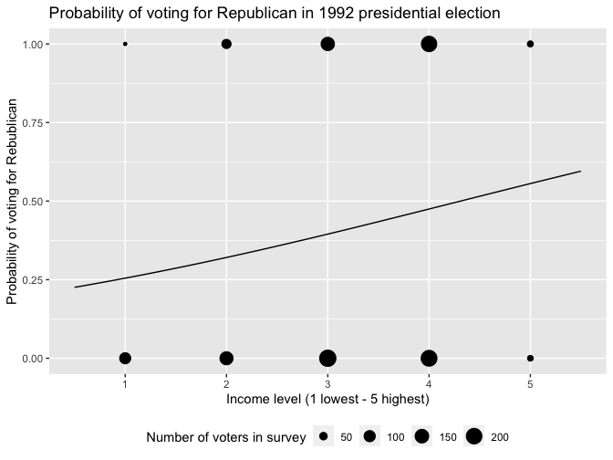
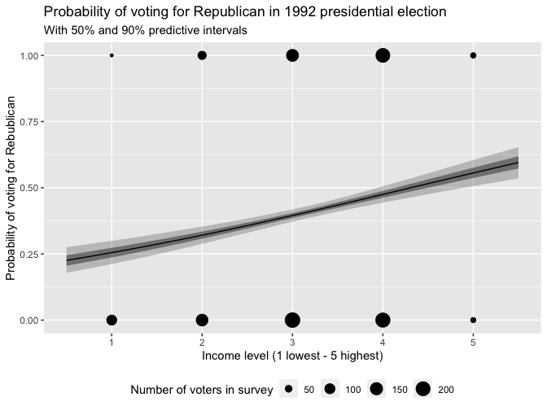
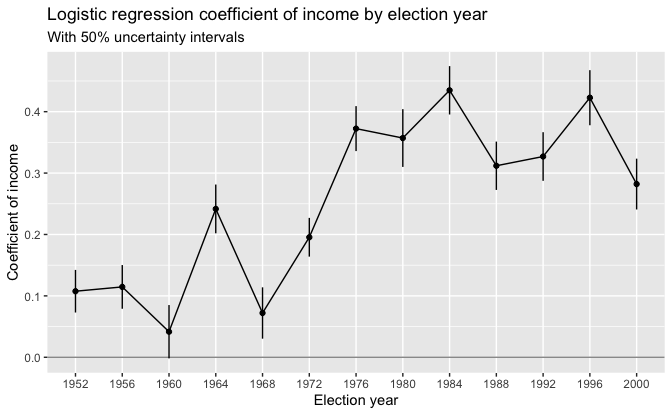
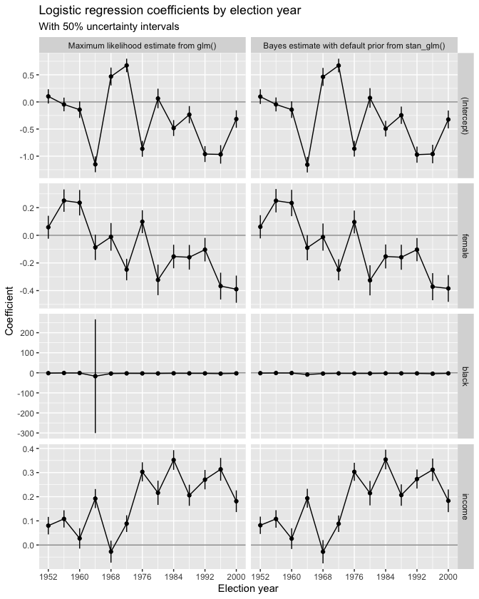
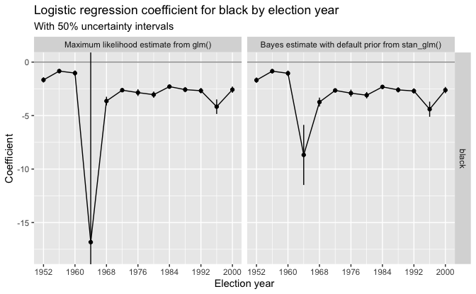

Regression and Other Stories: National election study
================
Andrew Gelman, Jennifer Hill, Aki Vehtari
2021-04-20

-   [13 Logistic regression](#13-logistic-regression)
    -   [13.1 Logistic regression with a single
        predictor](#131-logistic-regression-with-a-single-predictor)
        -   [Example: modeling political preference given
            income](#example-modeling-political-preference-given-income)
        -   [Fitting the model using `stan_glm()` and displaying
            uncertainty in the fitted
            model](#fitting-the-model-using-stan_glm-and-displaying-uncertainty-in-the-fitted-model)
    -   [13.2 Interpreting logistic regression coefficients and the
        divide-by-4
        rule](#132-interpreting-logistic-regression-coefficients-and-the-divide-by-4-rule)
        -   [Displaying the results of several logistic
            regressions](#displaying-the-results-of-several-logistic-regressions)
    -   [13.3 Predictions and
        comparisons](#133-predictions-and-comparisons)
        -   [Point prediction using
            `predict()`](#point-prediction-using-predict)
        -   [Linear predictor with uncertainty using
            `posterior_linpred()`](#linear-predictor-with-uncertainty-using-posterior_linpred)
        -   [Expected outcome with uncertainty using
            `posterior_epred()`](#expected-outcome-with-uncertainty-using-posterior_epred)
        -   [Predictive distribution for a new observation using
            `posterior_predict()`](#predictive-distribution-for-a-new-observation-using-posterior_predict)
        -   [Prediction given a range of input
            values](#prediction-given-a-range-of-input-values)
    -   [13.6 Cross validation and log score for logistic
        regression](#136-cross-validation-and-log-score-for-logistic-regression)
        -   [Log score for logistic
            regression](#log-score-for-logistic-regression)
-   [14 Working with logistic
    regression](#14-working-with-logistic-regression)
    -   [14.6 Identification and
        separation](#146-identification-and-separation)

Tidyverse version by Bill Behrman.

Logistic regression, identifiability, and separation. See Chapters 13
and 14 in Regression and Other Stories.

------------------------------------------------------------------------

``` r
# Packages
library(tidyverse)
library(rstanarm)

# Parameters
  # National Election Study data
file_nes <- here::here("NES/data/nes.txt")
  # Common code
file_common <- here::here("_common.R")

#===============================================================================

# Run common code
source(file_common)
```

# 13 Logistic regression

## 13.1 Logistic regression with a single predictor

### Example: modeling political preference given income

Data

``` r
nes <-
  file_nes %>% 
  read.table() %>% 
  as_tibble()

glimpse(nes)
```

    #> Rows: 34,908
    #> Columns: 70
    #> $ year            <int> 1952, 1952, 1952, 1952, 1952, 1952, 1952, 1952, 1952, …
    #> $ resid           <int> 1, 2, 3, 4, 5, 6, 7, 8, 10, 11, 12, 13, 14, 15, 16, 17…
    #> $ weight1         <dbl> 1, 1, 1, 1, 1, 1, 1, 1, 1, 1, 1, 1, 1, 1, 1, 1, 1, 1, …
    #> $ weight2         <dbl> 1, 1, 1, 1, 1, 1, 1, 1, 1, 1, 1, 1, 1, 1, 1, 1, 1, 1, …
    #> $ weight3         <dbl> 1, 1, 1, 1, 1, 1, 1, 1, 1, 1, 1, 1, 1, 1, 1, 1, 1, 1, …
    #> $ age             <int> 25, 33, 26, 63, 66, 48, 70, 25, 35, 33, 50, 62, 53, 61…
    #> $ gender          <int> 2, 2, 2, 1, 2, 2, 2, 1, 2, 2, 2, 2, 2, 2, 2, 2, 2, 1, …
    #> $ race            <int> 1, 1, 1, 1, 1, 1, 1, 2, 1, 1, 1, 1, 1, 1, 1, 1, 1, 1, …
    #> $ educ1           <int> 2, 1, 2, 2, 2, 2, 1, 2, 1, 2, 4, 2, 1, 2, 2, 1, 1, 2, …
    #> $ urban           <int> 2, 2, 2, 2, 2, 2, 3, 1, 1, 1, 1, 1, 3, 1, 1, 1, 3, 2, …
    #> $ region          <int> 1, 1, 1, 1, 2, 2, 4, 2, 2, 2, 2, 2, 2, 1, 2, 1, 2, 1, …
    #> $ income          <int> 4, 4, 3, 3, 1, 4, 1, 2, 4, 3, 4, 4, 1, 1, 3, 4, 1, 2, …
    #> $ occup1          <int> 2, 6, 6, 3, 6, 6, 6, 4, 6, 6, 6, 6, 6, 3, 2, 6, 6, 2, …
    #> $ union           <int> 1, 1, 2, 1, 2, 1, NA, 2, 1, 1, 2, 1, 2, 2, 2, 1, 2, 1,…
    #> $ religion        <int> 1, 1, 2, 1, 1, 1, 1, 1, 1, 1, 1, 1, 1, 1, 1, 2, 1, 2, …
    #> $ educ2           <int> 3, 1, 3, 2, 4, 2, 1, 4, 1, 3, 6, 2, 1, 2, 4, 1, 1, 2, …
    #> $ educ3           <int> 3, 1, 3, 2, 4, 2, 1, 4, 1, 3, 6, 2, 1, 2, 4, 1, 1, 2, …
    #> $ martial_status  <int> 1, 1, 1, 1, 1, 1, NA, 1, 1, 1, 1, 1, 1, NA, NA, 1, 1, …
    #> $ occup2          <int> 2, 6, 6, 3, 6, 6, 6, 4, 6, 6, 6, 6, 6, 3, 2, 6, 6, 2, …
    #> $ icpsr_cty       <int> NA, NA, NA, NA, NA, NA, NA, NA, NA, NA, NA, NA, NA, NA…
    #> $ fips_cty        <int> NA, NA, NA, NA, NA, NA, NA, NA, NA, NA, NA, NA, NA, NA…
    #> $ partyid7        <int> 6, 5, 4, 7, 7, 3, 4, 2, 6, 2, 7, 3, 2, 7, 2, 1, 1, 7, …
    #> $ partyid3        <int> 3, 3, 2, 3, 3, 1, 2, 1, 3, 1, 3, 1, 1, 3, 1, 1, 1, 3, …
    #> $ partyid3_b      <int> 3, 3, 2, 3, 3, 1, 2, 1, 3, 1, 3, 1, 1, 3, 1, 1, 1, 3, …
    #> $ str_partyid     <int> 3, 2, 1, 4, 4, 2, 1, 3, 3, 3, 4, 2, 3, 4, 3, 4, 4, 4, …
    #> $ father_party    <int> 3, 2, 1, 1, 1, 1, NA, 1, 1, 3, 3, NA, 1, 3, 3, NA, NA,…
    #> $ mother_party    <int> 3, 2, 1, NA, 1, 1, NA, 1, 3, 3, 3, NA, NA, 3, 3, NA, N…
    #> $ dlikes          <int> 0, -1, 0, -1, -2, 0, 0, 0, -1, -1, -1, 0, 0, 2, 1, 2, …
    #> $ rlikes          <int> 1, 3, 5, 3, 0, 4, 3, 0, -1, 3, 1, 0, -1, 1, -1, -3, -2…
    #> $ dem_therm       <int> NA, NA, NA, NA, NA, NA, NA, NA, NA, NA, NA, NA, NA, NA…
    #> $ rep_therm       <int> NA, NA, NA, NA, NA, NA, NA, NA, NA, NA, NA, NA, NA, NA…
    #> $ regis           <int> 2, 2, 2, 1, 2, 2, 2, 2, 2, 2, 2, 2, 2, 1, 2, 2, 2, 1, …
    #> $ vote            <int> 2, 2, 2, 2, 2, 2, 2, 2, 2, 2, 2, 2, 2, 2, 2, 2, 2, 2, …
    #> $ regisvote       <int> 3, 3, 3, 3, 3, 3, 3, 3, 3, 3, 3, 3, 3, 3, 3, 3, 3, 3, …
    #> $ presvote        <int> 2, 1, 2, 2, 2, 2, 2, 1, 2, 2, 2, 1, 2, 1, 1, 1, 1, 2, …
    #> $ presvote_2party <int> 2, 1, 2, 2, 2, 2, 2, 1, 2, 2, 2, 1, 2, 1, 1, 1, 1, 2, …
    #> $ presvote_intent <int> 2, 2, 2, 2, 2, 2, NA, 1, 3, 2, 2, 1, NA, 2, 1, 1, 1, 2…
    #> $ ideo_feel       <int> NA, NA, NA, NA, NA, NA, NA, NA, NA, NA, NA, NA, NA, NA…
    #> $ ideo7           <int> NA, NA, NA, NA, NA, NA, NA, NA, NA, NA, NA, NA, NA, NA…
    #> $ ideo            <int> NA, NA, NA, NA, NA, NA, NA, NA, NA, NA, NA, NA, NA, NA…
    #> $ cd              <int> NA, NA, NA, NA, NA, NA, NA, NA, NA, NA, NA, NA, NA, NA…
    #> $ state           <int> 13, 13, 13, 13, 24, 24, 63, 23, 24, 24, 24, 24, 35, 13…
    #> $ inter_pre       <int> 50, 50, 50, 50, 49, 49, 49, 50, 49, 49, 49, 49, 50, 49…
    #> $ inter_post      <int> NA, NA, NA, NA, NA, NA, NA, NA, NA, NA, NA, NA, NA, NA…
    #> $ black           <int> 0, 0, 0, 0, 0, 0, 0, 1, 0, 0, 0, 0, 0, 0, 0, 0, 0, 0, …
    #> $ female          <int> 1, 1, 1, 0, 1, 1, 1, 0, 1, 1, 1, 1, 1, 1, 1, 1, 1, 0, …
    #> $ age_sq          <int> 625, 1089, 676, 3969, 4356, 2304, 4900, 625, 1225, 108…
    #> $ rep_presvote    <int> 1, 0, 1, 1, 1, 1, 1, 0, 1, 1, 1, 0, 1, 0, 0, 0, 0, 1, …
    #> $ rep_pres_intent <int> 1, 1, 1, 1, 1, 1, NA, 0, NA, 1, 1, 0, NA, 1, 0, 0, 0, …
    #> $ south           <int> 0, 0, 0, 0, 0, 0, 0, 0, 0, 0, 0, 0, 0, 0, 0, 0, 0, 0, …
    #> $ real_ideo       <int> NA, NA, NA, NA, NA, NA, NA, NA, NA, NA, NA, NA, NA, NA…
    #> $ presapprov      <int> NA, NA, NA, NA, NA, NA, NA, NA, NA, NA, NA, NA, NA, NA…
    #> $ perfin1         <int> NA, NA, NA, NA, NA, NA, NA, NA, NA, NA, NA, NA, NA, NA…
    #> $ perfin2         <int> NA, NA, NA, NA, NA, NA, NA, NA, NA, NA, NA, NA, NA, NA…
    #> $ perfin          <int> NA, NA, NA, NA, NA, NA, NA, NA, NA, NA, NA, NA, NA, NA…
    #> $ presadm         <int> -1, -1, -1, -1, -1, -1, -1, -1, -1, -1, -1, -1, -1, -1…
    #> $ age_10          <dbl> 2.5, 3.3, 2.6, 6.3, 6.6, 4.8, 7.0, 2.5, 3.5, 3.3, 5.0,…
    #> $ age_sq_10       <dbl> 6.25, 10.89, 6.76, 39.69, 43.56, 23.04, 49.00, 6.25, 1…
    #> $ newfathe        <int> 1, 0, -1, -1, -1, -1, NA, -1, -1, 1, 1, NA, -1, 1, 1, …
    #> $ newmoth         <int> 1, 0, -1, NA, -1, -1, NA, -1, 1, 1, 1, NA, NA, 1, 1, N…
    #> $ parent_party    <int> 2, 0, -2, NA, -2, -2, NA, -2, 0, 2, 2, NA, NA, 2, 2, N…
    #> $ white           <int> 1, 1, 1, 1, 1, 1, 1, 0, 1, 1, 1, 1, 1, 1, 1, 1, 1, 1, …
    #> $ year_new        <int> 1, 1, 1, 1, 1, 1, 1, 1, 1, 1, 1, 1, 1, 1, 1, 1, 1, 1, …
    #> $ income_new      <int> 1, 1, 0, 0, -2, 1, -2, -1, 1, 0, 1, 1, -2, -2, 0, 1, -…
    #> $ age_new         <dbl> -2.052, -1.252, -1.952, 1.748, 2.048, 0.248, 2.448, -2…
    #> $ vote.1          <int> 1, 1, 1, 1, 1, 1, NA, 0, NA, 1, 1, 0, NA, 1, 0, 0, 0, …
    #> $ age_discrete    <int> 1, 2, 1, 3, 4, 3, 4, 1, 2, 2, 3, 3, 3, 3, 2, 4, 3, 1, …
    #> $ race_adj        <dbl> 1, 1, 1, 1, 1, 1, 1, 2, 1, 1, 1, 1, 1, 1, 1, 1, 1, 1, …
    #> $ dvote           <int> 0, 1, 0, 0, 0, 0, 0, 1, 0, 0, 0, 1, 0, 1, 1, 1, 1, 0, …
    #> $ rvote           <int> 1, 0, 1, 1, 1, 1, 1, 0, 1, 1, 1, 0, 1, 0, 0, 0, 0, 1, …

Note that the data has weight variables `weight*`. It may be appropriate
to perform a weighted logistic regression. But since we have no
documentation for these variables, we will ignore them.

We will use the following variables.

``` r
nes <- 
  nes %>% 
  select(year, income, dvote, rvote)
```

``` r
unique(nes$year) %>% 
  sort()
```

    #>  [1] 1952 1956 1958 1960 1962 1964 1966 1968 1970 1972 1974 1976 1978 1980 1982
    #> [16] 1984 1986 1988 1990 1992 1994 1996 1998 2000

``` r
nes %>% 
  count(income)
```

    #> # A tibble: 5 x 2
    #>   income     n
    #> *  <int> <int>
    #> 1      1  5501
    #> 2      2  5642
    #> 3      3 11399
    #> 4      4 10420
    #> 5      5  1946

``` r
nes %>% 
  count(dvote, rvote)
```

    #> # A tibble: 4 x 3
    #>   dvote rvote     n
    #>   <int> <int> <int>
    #> 1     0     0   274
    #> 2     0     1  7100
    #> 3     1     0  6657
    #> 4    NA    NA 20877

We are only interested in voters who voted for the Democrat (`dvote` =
1) or the Republican (`rvote` = 1).

``` r
nes <- 
  nes %>% 
  filter(xor(dvote, rvote))

nes %>% 
  count(dvote, rvote)
```

    #> # A tibble: 2 x 3
    #>   dvote rvote     n
    #>   <int> <int> <int>
    #> 1     0     1  7100
    #> 2     1     0  6657

Data for 1992 presidential election between George Bush and Bill
Clinton.

``` r
nes_1992 <- 
  nes %>% 
  filter(year == 1992)
```

Logistic regression of vote preference by income for 1992 election.

``` r
set.seed(660)

fit <-
  stan_glm(
    rvote ~ income,
    family = binomial(link = "logit"),
    data = nes_1992,
    refresh = 0
  )

fit
```

    #> stan_glm
    #>  family:       binomial [logit]
    #>  formula:      rvote ~ income
    #>  observations: 1179
    #>  predictors:   2
    #> ------
    #>             Median MAD_SD
    #> (Intercept) -1.4    0.2  
    #> income       0.3    0.1  
    #> 
    #> ------
    #> * For help interpreting the printed output see ?print.stanreg
    #> * For info on the priors used see ?prior_summary.stanreg

Probability of voting for Republican in 1992 presidential election.

``` r
v <- 
  tibble(
    income = seq_range(c(0.5, 5.5)),
    .pred = predict(fit, type = "response", newdata = tibble(income))
  )

v %>% 
  ggplot(aes(income)) +
  geom_line(aes(y = .pred)) +
  geom_count(aes(y = rvote), data = nes_1992) +
  scale_x_continuous(minor_breaks = NULL) +
  theme(legend.position = "bottom") +
  labs(
    title = 
      "Probability of voting for Republican in 1992 presidential election",
    x = "Income level (1 lowest - 5 highest)",
    y = "Probability of voting for Rebublican",
    size = "Number of voters in survey"
  )
```



### Fitting the model using `stan_glm()` and displaying uncertainty in the fitted model

Probability of voting for Republican in 1992 presidential election: With
50% and 90% predictive intervals.

``` r
new <- tibble(income = seq_range(c(0.5, 5.5)))
linpred <- posterior_linpred(fit, newdata = new)
v <- 
  new %>% 
  mutate(
    .pred = predict(fit, type = "response", newdata = new),
    `5%`  = apply(linpred, 2, quantile, probs = 0.05) %>% plogis(),
    `25%` = apply(linpred, 2, quantile, probs = 0.25) %>% plogis(),
    `75%` = apply(linpred, 2, quantile, probs = 0.75) %>% plogis(),
    `95%` = apply(linpred, 2, quantile, probs = 0.95) %>% plogis()
  )

v %>% 
  ggplot(aes(income)) +
  geom_ribbon(aes(ymin = `5%`, ymax = `95%`), alpha = 0.25) +
  geom_ribbon(aes(ymin = `25%`, ymax = `75%`), alpha = 0.5) +
  geom_line(aes(y = .pred)) +
  geom_count(aes(y = rvote), data = nes_1992) +
  scale_x_continuous(minor_breaks = NULL) +
  theme(legend.position = "bottom") +
  labs(
    title = 
      "Probability of voting for Republican in 1992 presidential election",
    subtitle = "With 50% and 90% predictive intervals",
    x = "Income level (1 lowest - 5 highest)",
    y = "Probability of voting for Rebublican",
    size = "Number of voters in survey"
  )
```



## 13.2 Interpreting logistic regression coefficients and the divide-by-4 rule

### Displaying the results of several logistic regressions

Logistic regression coefficient of income by election year: With 50%
uncertainty intervals.

``` r
set.seed(660)

coef_time_series <- function(.data, formula) {
  .data %>% 
  nest(data = !year) %>% 
  mutate(
    fit =
      map(
        data,
        ~ stan_glm(
          formula,
          family = binomial(link = "logit"),
          data = .,
          refresh = 0
        )
      ),
    coefs =
      map(
        fit,
        ~ left_join(
          enframe(coef(.), name = "var", value = "coef"),
          enframe(se(.), name = "var", value = "se"),
          by = "var"
        )
      )
  ) %>% 
  select(!c(data, fit)) %>% 
  unnest(cols = coefs)
}

coefs <- coef_time_series(nes, formula = rvote ~ income)

coefs %>% 
  filter(var == "income") %>% 
  mutate(
    q_25 = qnorm(0.25, mean = coef, sd = se),
    q_75 = qnorm(0.75, mean = coef, sd = se)
  ) %>% 
  ggplot(aes(year, coef)) +
  geom_hline(yintercept = 0, color = "grey60") +
  geom_line() +
  geom_linerange(aes(ymin = q_25, ymax = q_75)) +
  geom_point() +
  scale_x_continuous(breaks = unique(coefs$year), minor_breaks = NULL) +
  labs(
    title = "Logistic regression coefficient of income by election year",
    subtitle = "With 50% uncertainty intervals",
    x = "Election year",
    y = "Coefficient of income"
  )
```



## 13.3 Predictions and comparisons

### Point prediction using `predict()`

Extract the simulations.

``` r
sims <- as_tibble(fit)
```

Point prediction on probability scale for income level 5.

``` r
new <- tibble(income = 5)

pred <- predict(fit, type = "response", newdata = new)

pred
```

    #>     1 
    #> 0.556

Manual calculation.

``` r
pred_manual <- 
  plogis(sims$`(Intercept)` + sims$income * new$income) %>% 
  mean()

pred_manual - as.double(pred)
```

    #> [1] 0

### Linear predictor with uncertainty using `posterior_linpred()`

Simulations of linear predictor.

``` r
linpred <- posterior_linpred(fit, newdata = new)

dim(linpred)
```

    #> [1] 4000    1

``` r
head(linpred)
```

    #>           
    #> iterations     1
    #>       [1,] 0.123
    #>       [2,] 0.250
    #>       [3,] 0.281
    #>       [4,] 0.380
    #>       [5,] 0.246
    #>       [6,] 0.244

Manual calculation.

``` r
linpred_manual <- sims$`(Intercept)` + sims$income * new$income

all(near(linpred_manual, linpred))
```

    #> [1] TRUE

### Expected outcome with uncertainty using `posterior_epred()`

Simulations of prediction on probability scale.

``` r
epred <- posterior_epred(fit, newdata = new)

dim(epred)
```

    #> [1] 4000    1

``` r
head(epred)
```

    #>           
    #> iterations     1
    #>       [1,] 0.531
    #>       [2,] 0.562
    #>       [3,] 0.570
    #>       [4,] 0.594
    #>       [5,] 0.561
    #>       [6,] 0.561

Manual calculation.

``` r
epred_manual <- plogis(sims$`(Intercept)` + sims$income * new$income)

all(near(epred_manual, epred))
```

    #> [1] TRUE

The result of `posterior_epred()` is equal to the result of
`posterior_linpred()` transformed by `plogis()` to convert from the
linear predictor to the probability scale.

``` r
all(near(epred, plogis(linpred)))
```

    #> [1] TRUE

The mean of the simulations of the prediction returned by
`posterior_epred()` is equal to the prediction returned by `predict()`
with `type = "response"`.

``` r
mean(epred)
```

    #> [1] 0.556

``` r
mean(epred) - as.double(pred)
```

    #> [1] 0

The standard deviation of the simulations of the prediction can be used
as a measure of uncertainty.

``` r
sd(epred)
```

    #> [1] 0.0297

### Predictive distribution for a new observation using `posterior_predict()`

Predictive distribution for a new observation.

``` r
set.seed(673)

post_pred <- posterior_predict(fit, newdata = new)

dim(post_pred)
```

    #> [1] 4000    1

``` r
head(post_pred)
```

    #>      1
    #> [1,] 0
    #> [2,] 1
    #> [3,] 0
    #> [4,] 1
    #> [5,] 1
    #> [6,] 0

The mean and standard deviation of the predictive distribution.

``` r
mean(post_pred)
```

    #> [1] 0.567

``` r
sd(post_pred)
```

    #> [1] 0.496

Note that the standard deviation is much larger for the predictive
distribution, which has values of 0 and 1, than for the distribution of
the probabilities.

### Prediction given a range of input values

Point predictions.

``` r
new <- tibble(income = 1:5)

pred <- predict(fit, type = "response", newdata = new)

pred
```

    #>     1     2     3     4     5 
    #> 0.255 0.321 0.395 0.475 0.556

Simulations of linear predictors.

``` r
linpred <- posterior_linpred(fit, newdata = new)

head(linpred)
```

    #>           
    #> iterations     1      2      3       4     5
    #>       [1,] -1.09 -0.784 -0.482 -0.1793 0.123
    #>       [2,] -1.01 -0.698 -0.382 -0.0656 0.250
    #>       [3,] -1.13 -0.780 -0.427 -0.0727 0.281
    #>       [4,] -1.08 -0.718 -0.352  0.0144 0.380
    #>       [5,] -1.14 -0.794 -0.447 -0.1005 0.246
    #>       [6,] -1.14 -0.797 -0.450 -0.1031 0.244

Simulations of predictions on probability scale.

``` r
epred <- posterior_epred(fit, newdata = new)

head(epred)
```

    #>           
    #> iterations     1     2     3     4     5
    #>       [1,] 0.252 0.313 0.382 0.455 0.531
    #>       [2,] 0.266 0.332 0.406 0.484 0.562
    #>       [3,] 0.243 0.314 0.395 0.482 0.570
    #>       [4,] 0.253 0.328 0.413 0.504 0.594
    #>       [5,] 0.242 0.311 0.390 0.475 0.561
    #>       [6,] 0.242 0.311 0.389 0.474 0.561

Predictive distributions for new observations.

``` r
set.seed(673)

post_pred <- posterior_predict(fit, newdata = new)

head(post_pred)
```

    #>      1 2 3 4 5
    #> [1,] 1 0 1 0 1
    #> [2,] 0 1 0 0 0
    #> [3,] 0 0 1 1 0
    #> [4,] 1 0 0 1 1
    #> [5,] 0 0 0 0 1
    #> [6,] 0 0 1 0 0

``` r
apply(post_pred, 2, mean)
```

    #>     1     2     3     4     5 
    #> 0.265 0.305 0.396 0.463 0.543

The posterior probability, according to the fitted model, that Bush was
more popular among people with income level 5 than among people with
income level 4.

``` r
mean(epred[, 5] > epred[, 4])
```

    #> [1] 1

In all cases, those in the higher income level were more likely to vote
for Bush.

Posterior distribution for the difference in support for Bush, comparing
people in the richest to the second-richest category.

``` r
v <- quantile(epred[, 5] - epred[, 4], c(0.05, 0.25, 0.5, 0.75, 0.95))

v
```

    #>     5%    25%    50%    75%    95% 
    #> 0.0572 0.0715 0.0809 0.0905 0.1045

The median increase in the probability of voting for Bush in the richest
category was 0.081 with a 90% uncertainty interval of (0.057, 0.105).

## 13.6 Cross validation and log score for logistic regression

### Log score for logistic regression

Point predictions of model on data from 1992 presidential election.

``` r
pred <- predict(fit, type = "response")

nrow(nes_1992)
```

    #> [1] 1179

``` r
length(pred)
```

    #> [1] 1179

``` r
head(pred)
```

    #>     1     2     3     4     5     6 
    #> 0.475 0.321 0.255 0.321 0.396 0.475

Estimate the predictive performance of model using within-sample log
score.

``` r
sum(log(c(pred[nes_1992$rvote == 1], 1 - pred[nes_1992$rvote == 0])))
```

    #> [1] -778

Estimate the predictive performance of model using leave-one-out log
score (elpd\_loo).

``` r
loo(fit)
```

    #> 
    #> Computed from 4000 by 1179 log-likelihood matrix
    #> 
    #>          Estimate   SE
    #> elpd_loo   -780.5  8.6
    #> p_loo         2.0  0.1
    #> looic      1560.9 17.1
    #> ------
    #> Monte Carlo SE of elpd_loo is 0.0.
    #> 
    #> All Pareto k estimates are good (k < 0.5).
    #> See help('pareto-k-diagnostic') for details.

The LOO estimated log score (elpd\_loo) of -780 is 2 lower than the
within-sample log score of -778 computed above; this difference is about
what we would expect, given that the fitted model has 2 parameters or
degrees of freedom.

# 14 Working with logistic regression

## 14.6 Identification and separation

Data

``` r
nes <-
  file_nes %>% 
  read.table() %>% 
  as_tibble() %>% 
  select(year, income, black, female, dvote, rvote) %>% 
  filter(xor(dvote, rvote))

glimpse(nes)
```

    #> Rows: 13,757
    #> Columns: 6
    #> $ year   <int> 1952, 1952, 1952, 1952, 1952, 1952, 1952, 1952, 1952, 1952, 195…
    #> $ income <int> 4, 4, 3, 3, 1, 4, 1, 2, 4, 3, 4, 4, 1, 1, 3, 4, 1, 2, 3, 3, 4, …
    #> $ black  <int> 0, 0, 0, 0, 0, 0, 0, 1, 0, 0, 0, 0, 0, 0, 0, 0, 0, 0, 0, 0, 0, …
    #> $ female <int> 1, 1, 1, 0, 1, 1, 1, 0, 1, 1, 1, 1, 1, 1, 1, 1, 1, 0, 1, 1, 1, …
    #> $ dvote  <int> 0, 1, 0, 0, 0, 0, 0, 1, 0, 0, 0, 1, 0, 1, 1, 1, 1, 0, 1, 0, 0, …
    #> $ rvote  <int> 1, 0, 1, 1, 1, 1, 1, 0, 1, 1, 1, 0, 1, 0, 0, 0, 0, 1, 0, 1, 1, …

We examined the variables `year`, `income`, `dvote`, and `rvote` above.
Here are `black` and `female`.

``` r
nes %>% 
  count(black)
```

    #> # A tibble: 2 x 2
    #>   black     n
    #> * <int> <int>
    #> 1     0 12571
    #> 2     1  1186

``` r
nes %>% 
  count(female)
```

    #> # A tibble: 2 x 2
    #>   female     n
    #> *  <int> <int>
    #> 1      0  6312
    #> 2      1  7445

Calculate coefficients for each year with `glm()` and `stan_glm()`.

``` r
set.seed(630)

formula <- rvote ~ female + black + income

coefs <- 
  bind_rows(
    nes %>% 
      nest(data = !year) %>% 
      mutate(
        method = "glm",
        fit = 
          map(
            data,
            ~ glm(formula, family = binomial(link = "logit"), data = .)
          ),
        coefs =
          map(
            fit,
            ~ left_join(
              enframe(coef(.), name = "var", value = "coef"),
              enframe(arm::se.coef(.), name = "var", value = "se"),
              by = "var"
            )
          )
      ),
    nes %>% 
      nest(data = !year) %>% 
      mutate(
        method = "stan_glm",
        fit = 
          map(
            data,
            ~ stan_glm(
              formula,
              family = binomial(link = "logit"),
              data = .,
              refresh = 0
            )
          ),
        coefs =
          map(
            fit,
            ~ left_join(
              enframe(coef(.), name = "var", value = "coef"),
              enframe(se(.), name = "var", value = "se"),
              by = "var"
            )
          )
      )
  )
```

The `glm()` coefficients for 1960 - 1972. Note that the `black` variable
is nonidentifiable in 1964.

``` r
for (i in seq(1960, 1972, 4)) {
  cat(i, "\n")
  coefs %>% 
    filter(year == i, method == "glm") %>% 
    pull(fit) %>% 
    pluck(1) %>% 
    arm::display()
  cat("\n")
}
```

    #> 1960 
    #> glm(formula = formula, family = binomial(link = "logit"), data = .)
    #>             coef.est coef.se
    #> (Intercept) -0.14     0.23  
    #> female       0.24     0.14  
    #> black       -1.03     0.36  
    #> income       0.03     0.06  
    #> ---
    #>   n = 875, k = 4
    #>   residual deviance = 1200.7, null deviance = 1212.9 (difference = 12.3)
    #> 
    #> 1964 
    #> glm(formula = formula, family = binomial(link = "logit"), data = .)
    #>             coef.est coef.se
    #> (Intercept)  -1.15     0.22 
    #> female       -0.09     0.14 
    #> black       -16.83   420.40 
    #> income        0.19     0.06 
    #> ---
    #>   n = 1058, k = 4
    #>   residual deviance = 1250.2, null deviance = 1334.5 (difference = 84.4)
    #> 
    #> 1968 
    #> glm(formula = formula, family = binomial(link = "logit"), data = .)
    #>             coef.est coef.se
    #> (Intercept)  0.47     0.24  
    #> female      -0.01     0.15  
    #> black       -3.64     0.59  
    #> income      -0.03     0.07  
    #> ---
    #>   n = 847, k = 4
    #>   residual deviance = 1061.9, null deviance = 1168.6 (difference = 106.7)
    #> 
    #> 1972 
    #> glm(formula = formula, family = binomial(link = "logit"), data = .)
    #>             coef.est coef.se
    #> (Intercept)  0.67     0.18  
    #> female      -0.25     0.12  
    #> black       -2.63     0.27  
    #> income       0.09     0.05  
    #> ---
    #>   n = 1512, k = 4
    #>   residual deviance = 1800.3, null deviance = 1968.5 (difference = 168.2)

The coefficients for both methods and all years.

``` r
coefs <- 
  coefs %>% 
  select(!c(data, fit)) %>% 
  unnest(col = coefs)

coefs
```

    #> # A tibble: 104 x 5
    #>     year method var            coef     se
    #>    <int> <chr>  <chr>         <dbl>  <dbl>
    #>  1  1952 glm    (Intercept)  0.102  0.195 
    #>  2  1952 glm    female       0.0583 0.123 
    #>  3  1952 glm    black       -1.66   0.362 
    #>  4  1952 glm    income       0.0801 0.0538
    #>  5  1956 glm    (Intercept) -0.0468 0.187 
    #>  6  1956 glm    female       0.251  0.120 
    #>  7  1956 glm    black       -0.839  0.308 
    #>  8  1956 glm    income       0.108  0.0529
    #>  9  1960 glm    (Intercept) -0.143  0.226 
    #> 10  1960 glm    female       0.236  0.137 
    #> # … with 94 more rows

Logistic regression coefficients by election year: With 50% uncertainty
intervals.

``` r
method_labels <- 
  c(
    glm = "Maximum likelihood estimate from glm()",
    stan_glm = "Bayes estimate with default prior from stan_glm()"
  )

v <- 
  coefs %>% 
  mutate(
    var = fct_inorder(var),
    q_25 = qnorm(0.25, mean = coef, sd = se),
    q_75 = qnorm(0.75, mean = coef, sd = se)
  )

v %>% 
  ggplot(aes(year, coef)) +
  geom_hline(yintercept = 0, color = "grey60") +
  geom_line() +
  geom_linerange(aes(ymin = q_25, ymax = q_75)) +
  geom_point() +
  facet_grid(
    rows = vars(var),
    cols = vars(method), 
    scales = "free_y",
    labeller = labeller(method = method_labels)
  ) +
  scale_x_continuous(breaks = seq(1952, 2000, 8)) +
  labs(
    title = "Logistic regression coefficients by election year",
    subtitle = "With 50% uncertainty intervals",
    x = "Election year",
    y = "Coefficient"
  )
```



The estimates above look fine except for the coefficient of `black` in
1964, where there is complete separation.

``` r
nes %>% 
  filter(year == 1964) %>% 
  count(black, rvote)
```

    #> # A tibble: 3 x 3
    #>   black rvote     n
    #>   <int> <int> <int>
    #> 1     0     0   627
    #> 2     0     1   344
    #> 3     1     0    87

Of the 87 African Americans in the survey in 1964, none reported a
preference for the Republican candidate. The fit with `glm()` actually
yielded a finite estimate for the coefficient of `black` in 1964, but
that number and its standard error are essentially meaningless, being a
function of how long the iterative fitting procedure goes before giving
up. The maximum likelihood estimate for the coefficient of `black` that
year is  − ∞.

Logistic regression coefficient for `black` by election year: With 50%
uncertainty intervals.

``` r
v %>% 
  filter(var == "black") %>% 
  ggplot(aes(year, coef)) +
  geom_hline(yintercept = 0, color = "grey60") +
  geom_line() +
  geom_linerange(aes(ymin = q_25, ymax = q_75)) +
  geom_point() +
  facet_grid(
    rows = vars(var),
    cols = vars(method), 
    labeller = labeller(method = method_labels)
  ) +
  coord_cartesian(ylim = c(-18, 0)) +
  scale_x_continuous(breaks = seq(1952, 2000, 8)) +
  labs(
    title = "Logistic regression coefficient for black by election year",
    subtitle = "With 50% uncertainty intervals",
    x = "Election year",
    y = "Coefficient"
  )
```



In the coefficient estimates from `stan_glm()` with its default
settings, the estimated coefficient of `black` in 1964 has been
stabilized, with the other coefficients being essentially unchanged.
