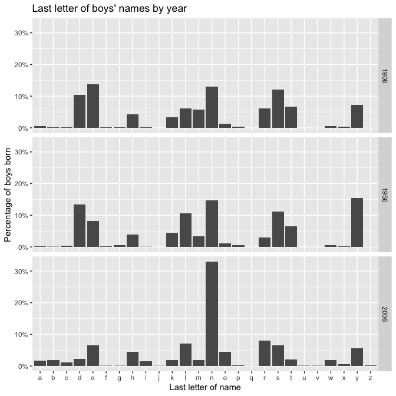
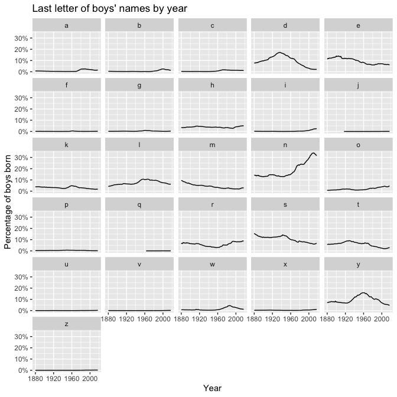
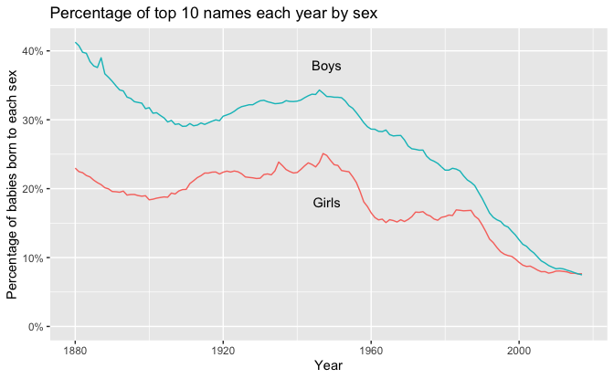

Regression and Other Stories: Last letters of names
================
Andrew Gelman, Jennifer Hill, Aki Vehtari
2021-04-20

-   [2 Data and measurement](#2-data-and-measurement)
    -   [2.3 All graphs are comparisons](#23-all-graphs-are-comparisons)
        -   [Multiple plots](#multiple-plots)

Tidyverse version by Bill Behrman.

Last letters of names - Distributions of last letters of names of
American babies. See Chapter 2 in Regression and Other Stories.

------------------------------------------------------------------------

# 2 Data and measurement

## 2.3 All graphs are comparisons

### Multiple plots

``` r
# Packages
library(tidyverse)
library(babynames)

# Parameters
  # Common code
file_common <- here::here("_common.R")
  
#===============================================================================

# Run common code
source(file_common)
```

Data

``` r
babynames
```

    #> # A tibble: 1,924,665 x 5
    #>     year sex   name          n   prop
    #>    <dbl> <chr> <chr>     <int>  <dbl>
    #>  1  1880 F     Mary       7065 0.0724
    #>  2  1880 F     Anna       2604 0.0267
    #>  3  1880 F     Emma       2003 0.0205
    #>  4  1880 F     Elizabeth  1939 0.0199
    #>  5  1880 F     Minnie     1746 0.0179
    #>  6  1880 F     Margaret   1578 0.0162
    #>  7  1880 F     Ida        1472 0.0151
    #>  8  1880 F     Alice      1414 0.0145
    #>  9  1880 F     Bertha     1320 0.0135
    #> 10  1880 F     Sarah      1288 0.0132
    #> # … with 1,924,655 more rows

Last letter of boys’ names by year.

``` r
boys_last_letter <- 
  babynames %>% 
  filter(sex == "M") %>% 
  mutate(last_letter = str_sub(name, start = -1L)) %>% 
  group_by(year, last_letter) %>%
  summarize(prop = sum(prop)) %>% 
  ungroup()

boys_last_letter
```

    #> # A tibble: 3,424 x 3
    #>     year last_letter     prop
    #>    <dbl> <chr>          <dbl>
    #>  1  1880 a           0.00655 
    #>  2  1880 b           0.00430 
    #>  3  1880 c           0.00295 
    #>  4  1880 d           0.0775  
    #>  5  1880 e           0.114   
    #>  6  1880 f           0.000912
    #>  7  1880 g           0.00124 
    #>  8  1880 h           0.0342  
    #>  9  1880 i           0.00169 
    #> 10  1880 k           0.0399  
    #> # … with 3,414 more rows

Last letter of boys’ names by year.

``` r
boys_last_letter %>% 
  filter(year %in% c(1906, 1956, 2006)) %>% 
  ggplot(aes(last_letter, prop)) +
  geom_col() +
  scale_y_continuous(labels = scales::label_percent(accuracy = 1)) +
  facet_grid(rows = vars(year)) +
  labs(
    title = "Last letter of boys' names by year",
    x = "Last letter of name",
    y = "Percentage of boys born"
  )
```



Last letter of boys’ names by year.

``` r
boys_last_letter %>% 
  ggplot(aes(year, prop)) +
  geom_line() +
  scale_y_continuous(labels = scales::label_percent(accuracy = 1)) +
  facet_wrap(facets = vars(last_letter), ncol = 5) +
  labs(
    title = "Last letter of boys' names by year",
    x = "Year",
    y = "Percentage of boys born"
  )
```



Proportion of top 10 names each year by sex.

``` r
prop_top_10 <- 
  babynames %>% 
  group_by(year, sex) %>% 
  slice_max(order_by = prop, n = 10) %>% 
  summarize(prop = sum(prop)) %>% 
  ungroup()

prop_top_10
```

    #> # A tibble: 276 x 3
    #>     year sex    prop
    #>    <dbl> <chr> <dbl>
    #>  1  1880 F     0.230
    #>  2  1880 M     0.413
    #>  3  1881 F     0.225
    #>  4  1881 M     0.407
    #>  5  1882 F     0.223
    #>  6  1882 M     0.398
    #>  7  1883 F     0.219
    #>  8  1883 M     0.397
    #>  9  1884 F     0.217
    #> 10  1884 M     0.384
    #> # … with 266 more rows

Percentage of top 10 names each year by sex.

``` r
labels <- 
  tribble(
    ~year, ~prop, ~label,
    1948, 0.38, "Boys",
    1948, 0.18, "Girls"
  )

prop_top_10 %>% 
  ggplot(aes(year, prop)) +
  geom_line(aes(color = sex)) +
  geom_text(aes(label = label), data = labels) +
  scale_y_continuous(labels = scales::label_percent(accuracy = 1)) +
  coord_cartesian(ylim = c(0, NA)) +
  theme(legend.position = "none") +
  labs(
    title = "Percentage of top 10 names each year by sex",
    x = "Year",
    y = "Percentage of babies born to each sex"
  )
```



In 2017, the last year in the data, the two lines crossed, with 7.7% for
girls and 7.5% for boys.
