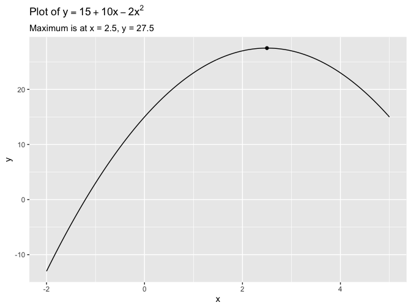

Regression and Other Stories: Parabola
================
Andrew Gelman, Jennifer Hill, Aki Vehtari
2021-04-20

-   [A Computing in R](#a-computing-in-r)
    -   [A.7 Some R programming](#a7-some-r-programming)
        -   [Opimization](#opimization)

Tidyverse version by Bill Behrman.

Demonstration of using Stan for optimization. See Appendix A in
Regression and Other Stories.

------------------------------------------------------------------------

``` r
# Packages
library(tidyverse)
library(rstan)

# Parameters
  # Common code
file_common <- here::here("_common.R")

#===============================================================================

# Run common code
source(file_common)
```

# A Computing in R

## A.7 Some R programming

### Opimization

#### Finding the peak of a parabola

Plot of *y* = 15 + 10*x* − 2*x*<sup>2</sup>.

``` r
v <- 
  tibble(
    x = seq_range(c(-2, 5)),
    y = 15 + 10 * x - 2 * x^2
  )

v %>% 
  ggplot(aes(x, y)) +
  geom_line() +
  geom_point(data = tibble(x = 2.5, y = 27.5)) +
  labs(
    title = expression(paste("Plot of ", y == 15 + 10 * x - 2 * x^2)),
    subtitle = "Maximum is at x = 2.5, y = 27.5"
  )
```



Stan model for function 15 + 10*x* − 2*x*<sup>2</sup>.

``` r
model_code =
"
parameters {
  real x;
}
model {
  target += 15 + 10 * x - 2 * x^2;
}
"
```

Compile the Stan function and optimize it.

``` r
set.seed(245)

fit <- 
  stan_model(model_code = model_code) %>% 
  optimizing()
```

``` r
fit
```

    #> $par
    #>   x 
    #> 2.5 
    #> 
    #> $value
    #> [1] 27.5
    #> 
    #> $return_code
    #> [1] 0
    #> 
    #> $theta_tilde
    #>        x
    #> [1,] 2.5

The output labeled `par` is the value of `x` at which the function is
optimized, and the output labeled `value` is the target function at the
optimum. A `return_code` of 0 corresponds to the optimizer running with
no problem, and you can ignore `theta_tilde`.
