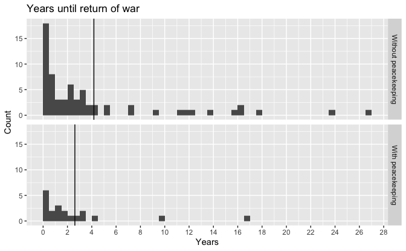
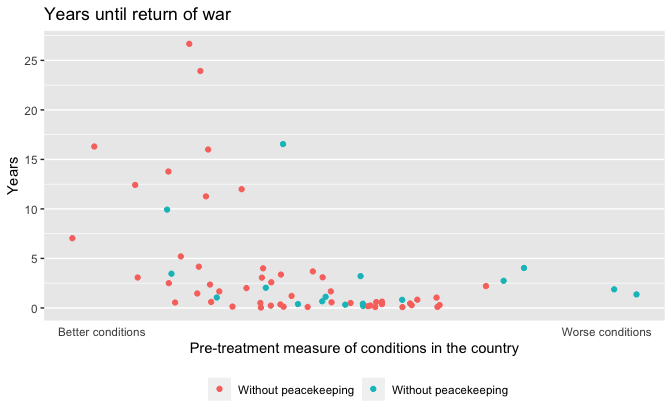

Regression and Other Stories: Peacekeeping
================
Andrew Gelman, Jennifer Hill, Aki Vehtari
2021-04-20

-   [1 Overview](#1-overview)
    -   [1.3 Some examples of
        regression](#13-some-examples-of-regression)
        -   [Estimating the effects of United Nations peacekeeping,
            using pre-treatment variables to adjust for differences
            between treatment and control
            groups](#estimating-the-effects-of-united-nations-peacekeeping-using-pre-treatment-variables-to-adjust-for-differences-between-treatment-and-control-groups)

Tidyverse version by Bill Behrman.

Outcomes after civil war in countries with and without United Nations
peacekeeping. See Chapter 1 in Regression and Other Stories.

------------------------------------------------------------------------

``` r
# Packages
library(tidyverse)
library(haven)
library(lubridate)

# Parameters
  # Outcomes after civil wars with and without U.N. peacekeeping
file_peace <- here::here("Peacekeeping/data/pk&pkept_old.dta")
  # Common code
file_common <- here::here("_common.R")

#===============================================================================

# Run common code
source(file_common)
```

# 1 Overview

## 1.3 Some examples of regression

### Estimating the effects of United Nations peacekeeping, using pre-treatment variables to adjust for differences between treatment and control groups

Data

``` r
peace <- 
  file_peace %>% 
  read_dta() %>% 
  select(id:pkop, pcw, morewar, hazard1) %>% 
  mutate(across(where(is.labelled), as_factor))

glimpse(peace)
```

    #> Rows: 206
    #> Columns: 14
    #> $ id       <dbl> 10, 15, 20, 30, 40, 45, 60, 70, 70, 70, 75, 90, 95, 100, 100,…
    #> $ ccode    <dbl> 700, 700, 700, 615, 615, 615, 540, 540, 540, 540, 540, 160, 3…
    #> $ cname    <chr> "Afghanistan-Mujahideen", "Afghanistan-Taliban", "Afghanistan…
    #> $ cfdate   <date> 1992-04-25, 1993-03-07, NA, 1963-01-15, 1997-10-15, NA, 1991…
    #> $ faildate <date> 1992-08-10, 1993-04-15, NA, NA, NA, NA, 1992-10-11, 1998-12-…
    #> $ firstob  <dbl> 1, 1, 1, 1, 1, 1, 1, 1, NA, NA, 1, 1, 1, 1, NA, 1, NA, 1, 1, …
    #> $ t0       <date> 1992-04-25, 1993-03-07, NA, 1963-01-15, 1997-10-15, NA, 1991…
    #> $ t1       <date> 1992-08-10, 1993-04-15, NA, 2004-12-31, 2004-12-31, NA, 1992…
    #> $ outcome  <fct> Victory-Rebels, Settlement, NA, Victory-Rebels, Truce, NA, Se…
    #> $ pk_dum   <dbl> 0, 0, NA, 0, 0, NA, 1, 1, 1, 1, NA, 0, 0, 0, 0, 0, 0, 0, 0, 0…
    #> $ pkop     <dbl> 0, 0, NA, 0, 0, NA, 2, 2, 4, 3, NA, 0, 0, 0, 1, 0, 0, 0, 0, 0…
    #> $ pcw      <dbl> 1, 1, 1, 0, 1, 1, 1, 1, 1, 1, 1, 0, 1, 1, 1, 1, 1, 0, 0, 0, 1…
    #> $ morewar  <dbl> 1, 1, NA, 0, 0, NA, 1, 1, 1, 1, NA, 0, 1, 0, 0, 0, 0, 0, 1, 1…
    #> $ hazard1  <dbl> 3.11e-03, 3.00e-03, NA, 1.85e-05, 2.95e-04, NA, 7.24e-02, 1.2…

Variable labels.

``` r
peace %>% 
  keep(~ "label" %in% names(attributes(.))) %>% 
  map_chr(~ attr(., "label"))
```

    #>                                  ccode                                outcome 
    #>                "COW country id number"                   "Outcome of the War" 
    #>                                 pk_dum                                   pkop 
    #>                   "peacekeeping dummy" "peacekeeping operation, mission type" 
    #>                                    pcw                                hazard1 
    #>            "post cold war termination"                     "predicted hazard"

Conflict ID.

``` r
peace %>% 
  count(id, name = "nrows") %>% 
  count(nrows)
```

    #> # A tibble: 5 x 2
    #>   nrows     n
    #> * <int> <int>
    #> 1     1   148
    #> 2     2    14
    #> 3     3     5
    #> 4     4     2
    #> 5     7     1

148 of the conflict IDs have only one row, but 22 have multiple rows.
One has seven rows. Let’s look at an ID with multiple rows.

``` r
peace %>% 
  group_by(id) %>% 
  filter(n() == 7) %>% 
  select(id, cname, cfdate, faildate, t0, t1, pk_dum, pkop)
```

    #> # A tibble: 7 x 8
    #> # Groups:   id [1]
    #>      id cname cfdate     faildate   t0         t1         pk_dum  pkop
    #>   <dbl> <chr> <date>     <date>     <date>     <date>      <dbl> <dbl>
    #> 1   590 Haiti 1994-09-18 NA         1994-09-18 1995-03-31      1     5
    #> 2   590 Haiti NA         NA         1995-04-01 1996-06-30      1     5
    #> 3   590 Haiti NA         NA         1996-07-01 1997-07-31      1     3
    #> 4   590 Haiti NA         NA         1997-08-01 2000-03-14      1     2
    #> 5   590 Haiti NA         NA         2000-03-15 2004-02-28      0     0
    #> 6   590 Haiti NA         NA         2004-02-29 2004-05-31      1     5
    #> 7   590 Haiti NA         NA         2004-06-01 2004-12-31      1     5

Haiti had a ceasefire that started on 1994-09-18. The seven rows
correspond to seven different time periods. There were peacekeepers for
six of these periods (`pk_dum`), though the peacekeeping operation and
mission (`pkop`) varied.

We’ll add a new variable `peacekeepers` to indicate whether there were
peacekeepers at any time. And we’ll now collapse the data to one row per
conflict ID, using the first row.

``` r
peace <- 
  peace %>% 
  group_by(id) %>% 
  summarize(
    peacekeepers = any(pk_dum == 1),
    across(everything(), first)
  )
```

We are only interested in conflicts where we know the peacekeeper
status.

``` r
peace %>% 
  filter(is.na(peacekeepers)) %>% 
  select(id, cname, peacekeepers, cfdate, faildate, outcome, pk_dum, pkop)
```

    #> # A tibble: 13 x 8
    #>       id cname           peacekeepers cfdate     faildate   outcome pk_dum  pkop
    #>    <dbl> <chr>           <lgl>        <date>     <date>     <fct>    <dbl> <dbl>
    #>  1    20 Afghanistan-Ta… NA           NA         NA         <NA>        NA    NA
    #>  2    45 Algeria-GIA/GS… NA           NA         NA         <NA>        NA    NA
    #>  3    75 Angola          NA           NA         NA         <NA>        NA    NA
    #>  4   200 Burundi         NA           NA         NA         <NA>        NA    NA
    #>  5   255 Chad            NA           NA         NA         <NA>        NA    NA
    #>  6   300 Colombia        NA           NA         NA         <NA>        NA    NA
    #>  7   375 CongoD.R./Zaire NA           NA         NA         <NA>        NA    NA
    #>  8   630 India-Kashmir   NA           NA         NA         <NA>        NA    NA
    #>  9   685 Indonesia-Aceh  NA           NA         NA         <NA>        NA    NA
    #> 10   855 Liberia         NA           NA         NA         <NA>        NA    NA
    #> # … with 3 more rows

There are 13 conflicts with no peacekeeper data. We’ll remove them.

``` r
peace <- 
  peace %>% 
  drop_na(peacekeepers)

peace %>% 
  count(peacekeepers)
```

    #> # A tibble: 2 x 2
    #>   peacekeepers     n
    #> * <lgl>        <int>
    #> 1 FALSE          114
    #> 2 TRUE            43

157 conflicts remain, of which 41 had peacekeepers.

We will say that a country remained at peace if the ceasefire hadn’t
failed by the end of the data collection, in other words if `faildate`
is `NA`. The `NA` status of `faildate` is also encoded in `morewar`.

``` r
peace %>% 
  count(is.na(faildate), morewar)
```

    #> # A tibble: 2 x 3
    #>   `is.na(faildate)` morewar     n
    #>   <lgl>               <dbl> <int>
    #> 1 FALSE                   1    85
    #> 2 TRUE                    0    72

The ceasefires held 72 times and failed 85 times.

Let’s see the relationship between having peacekeepers and a return to
conflict.

``` r
peace %>% 
  count(peacekeepers, peace = is.na(faildate))
```

    #> # A tibble: 4 x 3
    #>   peacekeepers peace     n
    #>   <lgl>        <lgl> <int>
    #> 1 FALSE        FALSE    65
    #> 2 FALSE        TRUE     49
    #> 3 TRUE         FALSE    20
    #> 4 TRUE         TRUE     23

``` r
peace %>% 
  group_by(peacekeepers) %>% 
  summarize(peace_prop = mean(is.na(faildate)))
```

    #> # A tibble: 2 x 2
    #>   peacekeepers peace_prop
    #> * <lgl>             <dbl>
    #> 1 FALSE             0.430
    #> 2 TRUE              0.535

In about 51% of conflicts with peacekeepers, the ceasefires held,
compared to 44% of conflicts without peacekeepers.

If conflict did return, let’s see the relationship between having
peacekeepers and the length of time for the return.

``` r
peace %>% 
  filter(!is.na(faildate)) %>% 
  mutate(return_years = interval(cfdate, faildate) / dyears(1)) %>% 
  group_by(peacekeepers) %>% 
  summarize(across(return_years, list(mean = mean, median = median)))
```

    #> # A tibble: 2 x 3
    #>   peacekeepers return_years_mean return_years_median
    #> * <lgl>                    <dbl>               <dbl>
    #> 1 FALSE                     4.17                2.00
    #> 2 TRUE                      2.61                1.25

In the conflicts where ceasefires did not hold, the ceasefires ended
sooner when there were peacekeepers.

If conflict did not return, let’s see the relationship between having
peacekeepers and the duration of peace. We’ll use the end of data
collection, 2004-12-31, as the end date.

``` r
peace %>% 
  filter(is.na(faildate)) %>% 
  mutate(peace_years = interval(cfdate, ymd("2004-12-31")) / dyears(1)) %>% 
  group_by(peacekeepers) %>% 
  summarize(across(peace_years, list(mean = mean, median = median)))
```

    #> # A tibble: 2 x 3
    #>   peacekeepers peace_years_mean peace_years_median
    #> * <lgl>                   <dbl>              <dbl>
    #> 1 FALSE                    27.6               22.3
    #> 2 TRUE                     12.4               10.5

In the conflicts where the ceasefires held, the duration of peace was
shorter when there were peacekeepers.

Years until return of war.

``` r
ceasefire_failed <- 
  peace %>% 
  filter(!is.na(faildate)) %>% 
  mutate(return_years = interval(cfdate, faildate) / dyears(1))

return_years_means <- 
  ceasefire_failed %>% 
  group_by(peacekeepers) %>% 
  summarize(return_years_mean = mean(return_years))

peacekeepers_labels <- 
  c(
    "FALSE" = "Without peacekeeping",
    "TRUE" = "With peacekeeping"
  )

ceasefire_failed %>% 
  ggplot(aes(return_years)) +
  geom_histogram(binwidth = 0.5, boundary = 0) +
  geom_vline(aes(xintercept = return_years_mean), data = return_years_means) +
  scale_x_continuous(breaks = scales::breaks_width(2)) +
  facet_grid(
    rows = vars(peacekeepers),
    labeller = labeller(peacekeepers = peacekeepers_labels)
  ) +
  labs(
    title = "Years until return of war",
    x = "Years",
    y = "Count"
  )
```



Years until return of war.

``` r
ceasefire_failed %>% 
  drop_na(hazard1) %>% 
  ggplot(aes(hazard1, return_years, color = peacekeepers)) +
  geom_point() +
  scale_x_log10(
    breaks = c(1.4e-5, 4.5e-2),
    minor_breaks = NULL,
    labels = c("Better conditions", "Worse conditions")
  ) +
  scale_y_continuous(breaks = scales::breaks_width(5)) +
  scale_color_discrete(
    breaks = c(FALSE, TRUE),
    labels = c("Without peacekeeping", "Without peacekeeping")
  ) +
  theme(
    axis.ticks.x = element_blank(),
    legend.position = "bottom",
    panel.grid.major.x = element_blank()
  ) +
  labs(
    title = "Years until return of war",
    x = "Pre-treatment measure of conditions in the country",
    y = "Years",
    color = NULL
  )
```



The plot uses `hazard1` as a measure of the conditions in the country at
the time of the ceasefire. Below a threshold of this measure, it was
possible for ceasefires to last 10 years or longer. Over this threshold,
all of the countries returned to war in 5 years or less.
