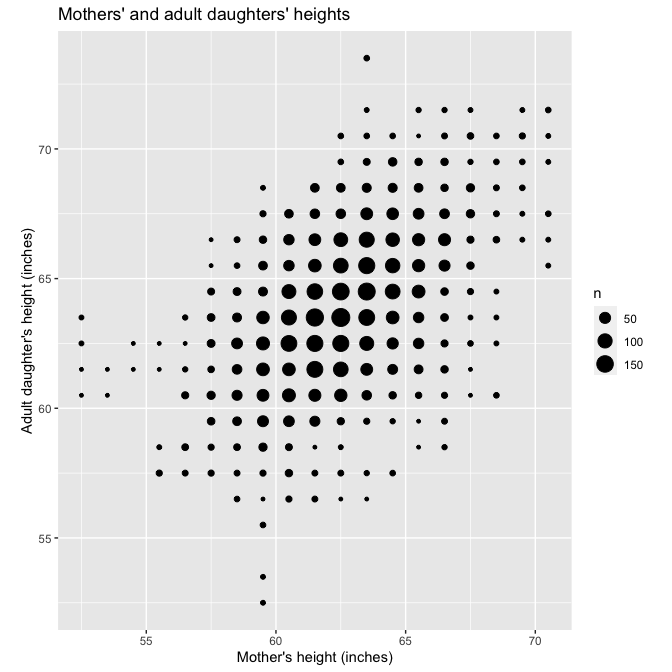
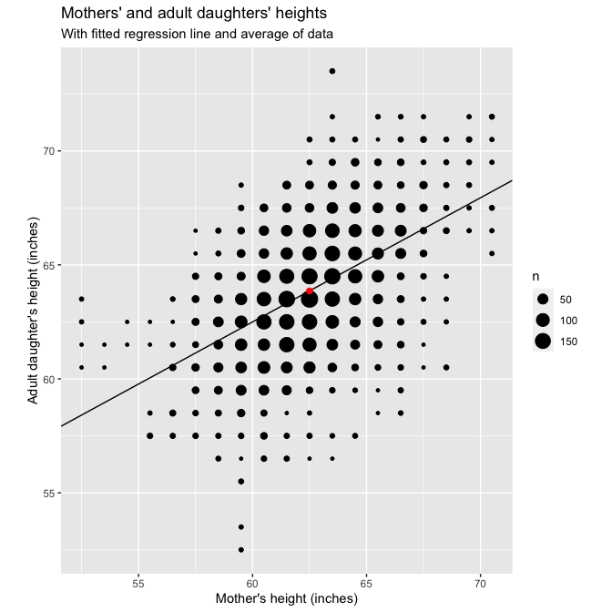
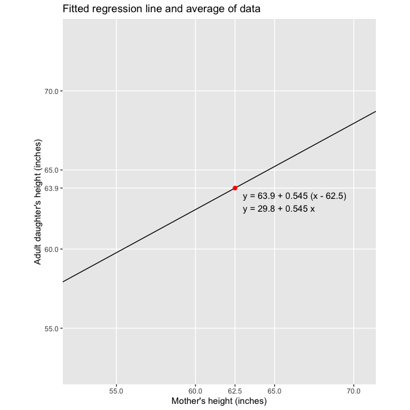
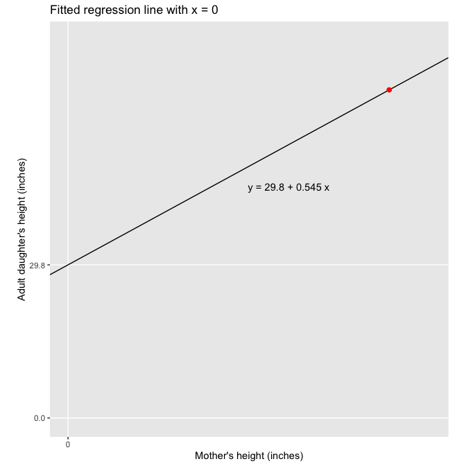
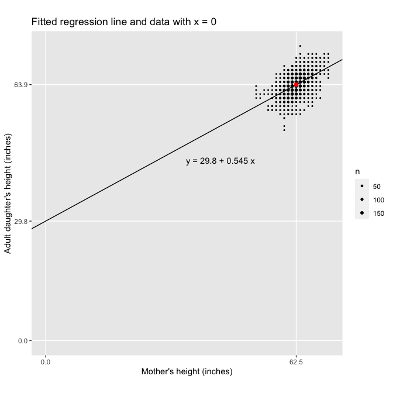

Regression and Other Stories: Pearson and Lee Heights
================
Andrew Gelman, Jennifer Hill, Aki Vehtari
2021-04-20

-   [6 Background on regression
    modeling](#6-background-on-regression-modeling)
    -   [6.4 Historical origins of
        regression](#64-historical-origins-of-regression)
        -   [Fitting the model in R](#fitting-the-model-in-r)

Tidyverse version by Bill Behrman.

The heredity of height. Published in 1903 by Karl Pearson and Alice Lee.
See Chapter 6 in Regression and Other Stories.

------------------------------------------------------------------------

``` r
# Packages
library(tidyverse)
library(rstanarm)

# Parameters
  # Heights of mothers and daughters from Pearson and Lee (1903)
file_heights <- here::here("PearsonLee/data/Heights.txt")
  # Common code
file_common <- here::here("_common.R")

#===============================================================================

# Run common code
source(file_common)
```

# 6 Background on regression modeling

## 6.4 Historical origins of regression

### Fitting the model in R

Data

``` r
heights <- 
  file_heights %>% 
  read.table(header = TRUE) %>% 
  as_tibble()

heights
```

    #> # A tibble: 5,524 x 2
    #>    daughter_height mother_height
    #>              <dbl>         <dbl>
    #>  1            52.5          59.5
    #>  2            52.5          59.5
    #>  3            53.5          59.5
    #>  4            53.5          59.5
    #>  5            55.5          59.5
    #>  6            55.5          59.5
    #>  7            55.5          59.5
    #>  8            55.5          59.5
    #>  9            56.5          58.5
    #> 10            56.5          58.5
    #> # … with 5,514 more rows

Fit linear regression.

``` r
set.seed(201)

fit <- stan_glm(daughter_height ~ mother_height, data = heights, refresh = 0)

print(fit, digits = 2)
```

    #> stan_glm
    #>  family:       gaussian [identity]
    #>  formula:      daughter_height ~ mother_height
    #>  observations: 5524
    #>  predictors:   2
    #> ------
    #>               Median MAD_SD
    #> (Intercept)   29.81   0.78 
    #> mother_height  0.54   0.01 
    #> 
    #> Auxiliary parameter(s):
    #>       Median MAD_SD
    #> sigma 2.26   0.02  
    #> 
    #> ------
    #> * For help interpreting the printed output see ?print.stanreg
    #> * For info on the priors used see ?prior_summary.stanreg

Mothers’ and adult daughters’ heights.

``` r
heights %>% 
  ggplot(aes(mother_height, daughter_height)) + 
  geom_count() +
  coord_fixed() +
  labs(
    title = "Mothers' and adult daughters' heights",
    x = "Mother's height (inches)",
    y = "Adult daughter's height (inches)"
  )
```



Mothers’ and adult daughters’ heights: With fitted regression line and
average of data.

``` r
heights_mean <- 
  heights %>% 
  summarize(across(everything(), mean))

intercept <- coef(fit)[["(Intercept)"]]
slope <- coef(fit)[["mother_height"]]

heights %>% 
  ggplot(aes(mother_height, daughter_height)) + 
  geom_count() +
  geom_abline(slope = slope, intercept = intercept) +
  geom_point(data = heights_mean, color = "red", size = 2) +
  coord_fixed() +
  labs(
    title = "Mothers' and adult daughters' heights",
    subtitle = "With fitted regression line and average of data",
    x = "Mother's height (inches)",
    y = "Adult daughter's height (inches)"
  )
```



Fitted regression line and average of data.

``` r
eqn_1 <- 
  str_glue(
    "y = {format(heights_mean$daughter_height, digits = 1, nsmall = 1)} + ",
    "{format(slope, digits = 3, nsmall = 3)} ",
    "(x - {format(heights_mean$mother_height, digits = 1, nsmall = 1)})"
  )
eqn_2 <- 
  str_glue(
    "y = {format(intercept, digits = 1, nsmall = 1)} + ",
    "{format(slope, digits = 3, nsmall = 3)} x"
  )
eqns <- str_c(eqn_1, "\n", eqn_2)

heights %>% 
  ggplot(aes(mother_height, daughter_height)) + 
  geom_blank() +
  geom_abline(slope = slope, intercept = intercept) +
  geom_point(data = heights_mean, color = "red", size = 2) +
  annotate("text", label = eqns, x = 63, y = 63, hjust = 0) +
  scale_x_continuous(
    breaks = c(55, 60, heights_mean$mother_height, 65, 70),
    minor_breaks = NULL
  ) +
  scale_y_continuous(
    breaks = c(55, 60, heights_mean$daughter_height, 65, 70),
    minor_breaks = NULL
  ) +
  coord_fixed() +
  labs(
    title = "Fitted regression line and average of data",
    x = "Mother's height (inches)",
    y = "Adult daughter's height (inches)"
  )
```



Fitted regression line with x = 0.

``` r
heights %>% 
  ggplot(aes(mother_height, daughter_height)) + 
  geom_blank() +
  geom_abline(slope = slope, intercept = intercept) +
  geom_point(data = heights_mean, color = "red", size = 2) +
  annotate("text", label = eqn_2, x = 35, y = 45, hjust = 0) +
  scale_x_continuous(breaks = 0, minor_breaks = NULL) +
  scale_y_continuous(breaks = c(0, intercept), minor_breaks = NULL) +
  coord_fixed(xlim = c(0, NA), ylim = c(0, NA)) +
  labs(
    title = "Fitted regression line with x = 0",
    x = "Mother's height (inches)",
    y = "Adult daughter's height (inches)"
  )
```



Fitted regression line and data with x = 0.

``` r
heights %>% 
  ggplot(aes(mother_height, daughter_height)) + 
  geom_count() +
  geom_abline(slope = slope, intercept = intercept) +
  geom_point(data = heights_mean, color = "red", size = 2) +
  annotate("text", label = eqn_2, x = 35, y = 45, hjust = 0) +
  scale_x_continuous(
    breaks = c(0, heights_mean$mother_height),
    minor_breaks = NULL
  ) +
  scale_y_continuous(
    breaks = c(0, intercept, heights_mean$daughter_height),
    minor_breaks = NULL
  ) +
  scale_size(range = c(1, 6) / 4) +
  coord_fixed(xlim = c(0, NA), ylim = c(0, NA)) +
  labs(
    title = "Fitted regression line and data with x = 0",
    x = "Mother's height (inches)",
    y = "Adult daughter's height (inches)"
  )
```


