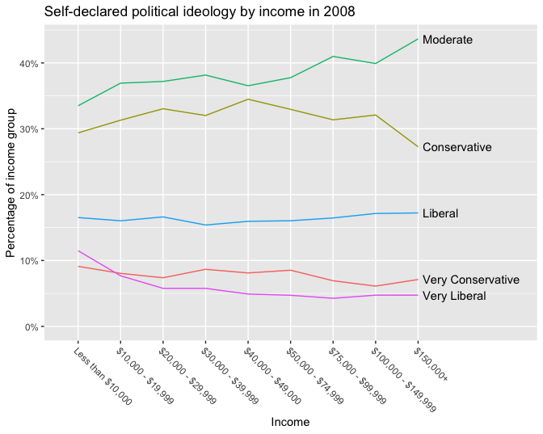
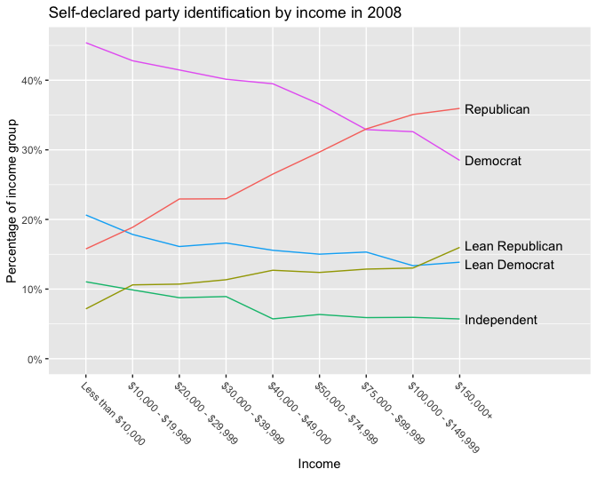

Regression and Other Stories: Pew
================
Andrew Gelman, Jennifer Hill, Aki Vehtari
2021-04-20

-   [2 Data and measurement](#2-data-and-measurement)
    -   [2.1 Examining where data come
        from](#21-examining-where-data-come-from)
        -   [Details of measurement can be
            important](#details-of-measurement-can-be-important)

Tidyverse version by Bill Behrman.

Miscellaneous analyses using raw Pew data. See Chapter 2 in Regression
and Other Stories.

------------------------------------------------------------------------

``` r
# Packages
library(tidyverse)
library(haven)

# Parameters
  # Pew data on political ideology and party identification
file_pew <- here::here("Pew/data/pew_research_center_june_elect_wknd_data.dta")
  # Common code
file_common <- here::here("_common.R")
  
#===============================================================================

# Run common code
source(file_common)
```

# 2 Data and measurement

## 2.1 Examining where data come from

### Details of measurement can be important

Data

``` r
pew <- 
  read_dta(file_pew) %>% 
  mutate(across(where(is.labelled), as_factor))

glimpse(pew)
```

    #> Rows: 31,201
    #> Columns: 70
    #> $ survey      <fct> june08voter, aug08relig, aug08relig, aug08relig, june08vot…
    #> $ rid         <dbl> 1720, 668, 50, 50533, 30091, 60, 20956, 749, 785, 1979, 18…
    #> $ date        <dbl> 62708, 80208, 73108, 80208, 62108, 72708, 62608, 80208, 62…
    #> $ sample      <fct> landline, landline, landline, cell, 18-29 oversample (land…
    #> $ phoneuse    <fct> "dual-all or almost all calls on home phone", "dual-all or…
    #> $ zipcode     <chr> "01007", "01010", "01013", "01013", "01020", "01020", "010…
    #> $ msa         <dbl> 44140, 44140, 44140, 44140, 44140, 44140, 44140, 44140, 44…
    #> $ usr         <chr> "S", "2", "2", "", "S", "S", "U", "2", "S", "S", "2", "", …
    #> $ form        <fct> form 2, form 1, form 1, form 2, form 1, form 2, form 2, fo…
    #> $ thoughtpres <fct> NA, NA, NA, NA, NA, NA, NA, NA, NA, NA, NA, NA, NA, NA, NA…
    #> $ regist      <fct> registered, registered, registered, registered, registered…
    #> $ regicert    <fct> absolutely certain, absolutely certain, absolutely certain…
    #> $ party       <fct> democrat, republican, independent, independent, democrat, …
    #> $ partyln     <fct> NA, NA, lean democrat, other/dk, NA, NA, lean democrat, NA…
    #> $ sex         <fct> male, female, male, male, female, female, male, male, male…
    #> $ age         <fct> 58, 35, 59, 32, 23, 55, 40, 59, 60, 41, 54, 27, 56, 64, 50…
    #> $ educ        <fct> post-graduate, college graduate, some college, some colleg…
    #> $ hisp        <fct> no, no, no, yes, no, no, no, no, no, no, no, no, no, yes, …
    #> $ race        <fct> white, white, white, dk/refused, asian, white, white, whit…
    #> $ marital     <fct> divorced, married, married, living with a partner, never m…
    #> $ parent      <fct> NA, NA, NA, NA, NA, NA, NA, NA, NA, NA, NA, NA, NA, NA, NA…
    #> $ relig       <fct> roman catholic, no religion/atheist, roman catholic, prote…
    #> $ relig2      <fct> roman catholic, nothing in particular, roman catholic, chr…
    #> $ born        <fct> no, NA, no, no, NA, no, no, no, no, NA, no, NA, no, yes, n…
    #> $ attend      <fct> a few times a year, never, once a week, once or twice a mo…
    #> $ income      <fct> "$50,000-$74,999", "$100,000-$149,999", "dk/refused", "$30…
    #> $ ownrent     <fct> own, NA, NA, NA, rent, own, rent, NA, rent, own, NA, NA, o…
    #> $ ideo        <fct> liberal, moderate, conservative, liberal, moderate, modera…
    #> $ employ      <fct> NA, NA, NA, NA, NA, full-time, NA, NA, NA, full-time, NA, …
    #> $ labor       <fct> NA, NA, NA, NA, NA, NA, NA, NA, NA, NA, NA, NA, NA, NA, NA…
    #> $ weight      <dbl> 1.327, 0.822, 0.493, 0.492, 2.000, 1.800, 1.385, 0.492, 1.…
    #> $ density     <fct> 2, 3, 3, 3, 3, 3, 3, 3, 2, 2, 2, 3, 3, 3, 3, 3, 3, 3, 3, 3…
    #> $ attempt     <dbl> 9, NA, NA, NA, 3, 7, 7, NA, 1, 8, NA, NA, 9, 1, 1, 5, NA, …
    #> $ fcall       <dbl> 80624, NA, NA, NA, 80621, 80723, 80621, NA, 80622, 80725, …
    #> $ thought     <fct> quite a lot, quite a lot, quite a lot, quite a lot, quite …
    #> $ heat2a      <fct> dem, dk, dem, dem, dem, rep, dem, rep, dem, dem, rep, NA, …
    #> $ heat2b      <fct> NA, dk, NA, NA, NA, NA, NA, NA, NA, NA, NA, NA, NA, NA, re…
    #> $ intsex      <fct> female, NA, NA, NA, male, female, female, NA, female, fema…
    #> $ intrace     <fct> "black, ~hisp", NA, NA, NA, "white, ~hisp", "white, ~hisp"…
    #> $ area        <dbl> 413, NA, NA, NA, 413, 413, 413, NA, 413, 413, NA, NA, 413,…
    #> $ niicamp     <fct> very closely, NA, NA, NA, very closely, NA, not at all clo…
    #> $ heat2c      <fct> strongly, NA, only moderately, strongly, strongly, only mo…
    #> $ chancer     <fct> decided not to vote for republican, dk/refused, chance mig…
    #> $ chanced     <fct> NA, dk/refused, NA, NA, NA, chance might vote for democrat…
    #> $ planto1     <fct> yes, yes, yes, yes, yes, yes, yes, yes, yes, yes, yes, NA,…
    #> $ planto2     <fct> absolutely certain, NA, NA, NA, absolutely certain, NA, ab…
    #> $ cheata      <fct> democrat, NA, NA, NA, democrat, NA, democrat, NA, democrat…
    #> $ cheatb      <fct> NA, NA, NA, NA, NA, NA, NA, NA, NA, NA, NA, NA, NA, NA, NA…
    #> $ precinct    <fct> NA, yes, yes, yes, NA, yes, NA, yes, NA, yes, yes, NA, NA,…
    #> $ oftvote     <fct> NA, nearly always, always, always, NA, always, NA, always,…
    #> $ scale10     <fct> NA, a person who definitely will vote, a person who defini…
    #> $ pvote08     <fct> NA, NA, NA, NA, NA, NA, NA, NA, NA, NA, NA, NA, NA, NA, NA…
    #> $ inthisp     <fct> NA, NA, NA, NA, NA, NA, NA, NA, NA, NA, NA, NA, NA, no, no…
    #> $ where       <fct> NA, NA, NA, NA, NA, NA, NA, NA, NA, NA, NA, NA, NA, NA, NA…
    #> $ heat4       <fct> NA, NA, NA, NA, NA, NA, NA, NA, NA, NA, NA, NA, NA, NA, NA…
    #> $ pvote04     <dbl> NA, NA, NA, NA, NA, NA, NA, NA, NA, NA, NA, NA, NA, NA, NA…
    #> $ heat4a      <fct> NA, NA, NA, NA, NA, NA, NA, NA, NA, NA, NA, NA, NA, NA, NA…
    #> $ heat4b      <fct> NA, NA, NA, NA, NA, NA, NA, NA, NA, NA, NA, NA, NA, NA, NA…
    #> $ heat4c      <fct> NA, NA, NA, NA, NA, NA, NA, NA, NA, NA, NA, NA, NA, NA, NA…
    #> $ fips        <dbl> 15, 13, 13, 13, 13, 13, 15, 13, 13, 15, 15, 15, 15, 13, 13…
    #> $ state       <fct> massachusetts, massachusetts, massachusetts, massachusetts…
    #> $ cregion     <fct> east, east, east, east, east, east, east, east, east, east…
    #> $ partysum    <fct> democrat/lean democrat, republican/lean republican, democr…
    #> $ relign      <fct> white non-hispanic catholic, secular, white non-hispanic c…
    #> $ heat2       <fct> dem/lean dem, other-dk, dem/lean dem, dem/lean dem, dem/le…
    #> $ cheat       <fct> dem/lean dem, NA, NA, NA, dem/lean dem, NA, dem/lean dem, …
    #> $ age2        <fct> 50-64, 30-49, 50-64, 30-49, 18-29, 50-64, 30-49, 50-64, 50…
    #> $ educ2       <fct> college graduate, college graduate, some college, some col…
    #> $ income2     <fct> "$50,000 to $74,999", "$75,000+", NA, "$30,000 to $49,999"…
    #> $ party4      <fct> democrat, republican, independent, independent, democrat, …

Income.

``` r
pew %>% 
  count(income, income2)
```

    #> # A tibble: 11 x 3
    #>    income            income2                  n
    #>    <fct>             <fct>                <int>
    #>  1 less than $10,000 "less than $20,000"   1570
    #>  2 $10,000-$19,999   "less than $20,000"   2307
    #>  3 $20,000-$29,999   "$20,000 to $29,999"  2840
    #>  4 $30,000-$39,999   "$30,000 to $49,999"  2878
    #>  5 $40,000-$49,000   "$30,000 to $49,999"  2756
    #>  6 $50,000-$74,999   "$50,000 to $74,999"  4708
    #>  7 $75,000-$99,999   "$75,000+"            3687
    #>  8 $100,000-$149,999 "$75,000+"            3236
    #>  9 $150,000+         "dk\\refused"         2462
    #> 10 dk/refused         <NA>                 4350
    #> # … with 1 more row

We’ll use `income`, since it provides greater resolution at high
incomes. We’ll format `income` for plotting and recode “dk/refused” as
`NA`.

``` r
income_recode <- 
  levels(pew$income) %>% 
  set_names(
    levels(pew$income) %>% 
      str_replace("less", "Less") %>% 
      str_replace("-", " - ")
  )

pew <- 
  pew %>% 
  mutate(income = na_if(income, "dk/refused") %>% fct_recode(!!! income_recode))
```

Party identification.

``` r
pew %>% 
  count(party, partyln, sort = TRUE)
```

    #> # A tibble: 16 x 3
    #>    party         partyln             n
    #>    <fct>         <fct>           <int>
    #>  1 democrat      <NA>            10647
    #>  2 republican    <NA>             8769
    #>  3 independent   lean democrat    4023
    #>  4 independent   lean republican  3465
    #>  5 independent   other/dk         2210
    #>  6 dk            other/dk          533
    #>  7 no preference other/dk          452
    #>  8 <NA>          <NA>              407
    #>  9 no preference lean democrat     246
    #> 10 no preference lean republican   175
    #> # … with 6 more rows

We’ll combine `party` and `partyln` into one variable `party_5`

``` r
pew <- 
  pew %>% 
  mutate(
    party_5 =
      case_when(
        party == "democrat" ~ "Democrat",
        party == "republican" ~ "Republican",
        partyln == "lean democrat" ~ "Lean Democrat",
        partyln == "lean republican" ~ "Lean Republican",
        party == "independent" ~ "Independent",
        TRUE ~ NA_character_
      ) %>% 
      fct_relevel(
        "Democrat",
        "Lean Democrat",
        "Independent",
        "Lean Republican",
        "Republican"
      )
  )
```

``` r
pew %>% 
  count(party, partyln, party_5, sort = TRUE)
```

    #> # A tibble: 16 x 4
    #>    party         partyln         party_5             n
    #>    <fct>         <fct>           <fct>           <int>
    #>  1 democrat      <NA>            Democrat        10647
    #>  2 republican    <NA>            Republican       8769
    #>  3 independent   lean democrat   Lean Democrat    4023
    #>  4 independent   lean republican Lean Republican  3465
    #>  5 independent   other/dk        Independent      2210
    #>  6 dk            other/dk        <NA>              533
    #>  7 no preference other/dk        <NA>              452
    #>  8 <NA>          <NA>            <NA>              407
    #>  9 no preference lean democrat   Lean Democrat     246
    #> 10 no preference lean republican Lean Republican   175
    #> # … with 6 more rows

Political ideology.

``` r
pew %>% 
  count(ideo)
```

    #> # A tibble: 7 x 2
    #>   ideo                  n
    #> * <fct>             <int>
    #> 1 very conservative  2417
    #> 2 conservative       9795
    #> 3 moderate          11197
    #> 4 liberal            4535
    #> 5 very liberal       1470
    #> 6 dk/refused         1380
    #> 7 <NA>                407

Again, we’ll format `ideo` for plotting and recode “dk/refused” as `NA`.

``` r
ideo_recode <- 
  levels(pew$ideo) %>% 
  set_names(levels(pew$ideo) %>% str_to_title())

pew <-  
  pew %>% 
  mutate(ideo = na_if(ideo, "dk/refused") %>% fct_recode(!!! ideo_recode))
```

Self-declared political ideology by income in 2008.

``` r
v <- 
  pew %>% 
  drop_na(income, ideo) %>% 
  group_by(income, ideo) %>% 
  summarize(n = sum(weight)) %>% 
  mutate(prop = n / sum(n)) %>% 
  ungroup()

v %>% 
  ggplot(aes(income, prop, group = ideo)) +
  geom_line(aes(color = ideo)) +
  ggrepel::geom_text_repel(
    aes(label = ideo),
    data = . %>% slice_max(order_by = income, n = 1),
    nudge_x = 0.2,
    direction = "y",
    hjust = 0
  ) +
  scale_x_discrete(expand = expansion(mult = c(0.1, 0.35))) +
  scale_y_continuous(labels = scales::label_percent(accuracy = 1)) +
  coord_cartesian(ylim = c(0, NA)) +
  theme(
    axis.text.x = element_text(angle = -45, hjust = 0),
    legend.position = "none"
  ) +
  labs(
    title = "Self-declared political ideology by income in 2008",
    x = "Income",
    y = "Percentage of income group"
  )
```



Self-declared party identification by income in 2008.

``` r
v <- 
  pew %>% 
  drop_na(income, party_5) %>% 
  group_by(income, party_5) %>% 
  summarize(n = sum(weight)) %>% 
  mutate(prop = n / sum(n)) %>% 
  ungroup()

v %>% 
  ggplot(aes(income, prop, group = party_5)) +
  geom_line(aes(color = party_5)) +
  ggrepel::geom_text_repel(
    aes(label = party_5),
    data = . %>% slice_max(order_by = income, n = 1),
    nudge_x = 0.2,
    direction = "y",
    hjust = 0
  ) +
  scale_x_discrete(expand = expansion(mult = c(0.1, 0.35))) +
  scale_y_continuous(labels = scales::label_percent(accuracy = 1)) +
  scale_color_discrete(direction = -1) +
  coord_cartesian(ylim = c(0, NA)) +
  theme(
    axis.text.x = element_text(angle = -45, hjust = 0),
    legend.position = "none"
  ) +
  labs(
    title = "Self-declared party identification by income in 2008",
    x = "Income",
    y = "Percentage of income group"
  )
```


