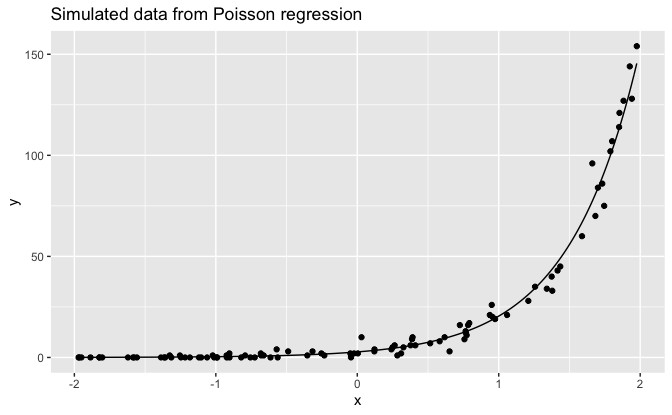
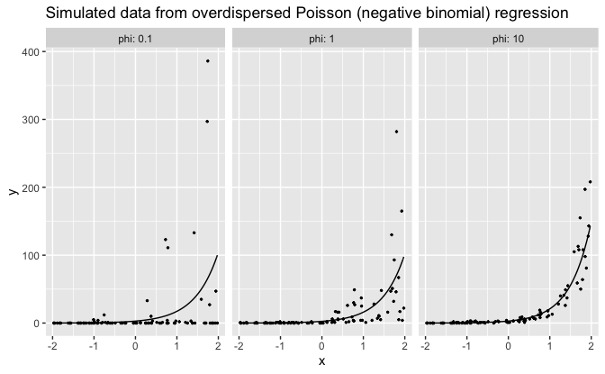

Regression and Other Stories: Poisson Example
================
Andrew Gelman, Jennifer Hill, Aki Vehtari
2021-04-20

-   [15 Other generalized linear
    models](#15-other-generalized-linear-models)
    -   [15.2 Poisson and negative binomial
        regression](#152-poisson-and-negative-binomial-regression)
        -   [Poisson model](#poisson-model)
        -   [Negative binomial model for
            overdispersion](#negative-binomial-model-for-overdispersion)

Tidyverse version by Bill Behrman.

Demonstrate Poisson regression. See Chapter 15 in Regression and Other
Stories.

------------------------------------------------------------------------

``` r
# Packages
library(tidyverse)
library(rstanarm)

# Parameters
  # Seed
SEED <- 3579
  # Common code
file_common <- here::here("_common.R")

#===============================================================================

# Run common code
source(file_common)
```

# 15 Other generalized linear models

## 15.2 Poisson and negative binomial regression

### Poisson model

Simulated data.

``` r
set.seed(SEED)

n <- 100
a <- 1
b <- 2

x <- runif(n, min = -2, max = 2)
linpred <- a + b * x

data_pois <- tibble(x, y = rpois(n, exp(linpred)))
```

Fit Poisson regression model.

``` r
fit_pois <- 
  stan_glm(
    y ~ x,
    family = poisson(link = "log"),
    data = data_pois,
    refresh = 0,
    seed = SEED
  )

fit_pois
```

    #> stan_glm
    #>  family:       poisson [log]
    #>  formula:      y ~ x
    #>  observations: 100
    #>  predictors:   2
    #> ------
    #>             Median MAD_SD
    #> (Intercept) 1.0    0.1   
    #> x           2.0    0.0   
    #> 
    #> ------
    #> * For help interpreting the printed output see ?print.stanreg
    #> * For info on the priors used see ?prior_summary.stanreg

Simulated data from Poisson regression.

``` r
fitted_curve <- 
  tibble(
    x = seq_range(x),
    y = exp(coef(fit_pois)[["(Intercept)"]] + coef(fit_pois)[["x"]] * x)
  )

data_pois %>% 
  ggplot(aes(x, y)) +
  geom_line(data = fitted_curve) +
  geom_point() +
  labs(title = "Simulated data from Poisson regression")
```



### Negative binomial model for overdispersion

Simulated data.

``` r
set.seed(SEED)

phi_grid <- c(0.1, 1, 10)

data_nbinom <- 
  tibble(
    phi = phi_grid,
    data = 
      map(phi, ~ tibble(x, y = MASS::rnegbin(n, mu = exp(linpred), theta = .)))
  )
```

Fit negative binomial regression models.

``` r
fit_nbinom <- 
  data_nbinom %>% 
  mutate(
    fit =
      map(
        data,
        ~ stan_glm(
          y ~ x,
          family = neg_binomial_2(link = "log"),
          data = .,
          refresh = 0,
          seed = SEED
        )
      )
  ) %>% 
  select(!data)

for (i in seq_len(nrow(fit_nbinom))) {
  cat("phi:", fit_nbinom$phi[i], "\n")
  print(fit_nbinom$fit[[i]])
  cat("\n")
}
```

    #> phi: 0.1 
    #> stan_glm
    #>  family:       neg_binomial_2 [log]
    #>  formula:      y ~ x
    #>  observations: 100
    #>  predictors:   2
    #> ------
    #>             Median MAD_SD
    #> (Intercept) 1.1    0.4   
    #> x           1.8    0.3   
    #> 
    #> Auxiliary parameter(s):
    #>                       Median MAD_SD
    #> reciprocal_dispersion 0.1    0.0   
    #> 
    #> ------
    #> * For help interpreting the printed output see ?print.stanreg
    #> * For info on the priors used see ?prior_summary.stanreg
    #> 
    #> phi: 1 
    #> stan_glm
    #>  family:       neg_binomial_2 [log]
    #>  formula:      y ~ x
    #>  observations: 100
    #>  predictors:   2
    #> ------
    #>             Median MAD_SD
    #> (Intercept) 0.9    0.2   
    #> x           1.8    0.1   
    #> 
    #> Auxiliary parameter(s):
    #>                       Median MAD_SD
    #> reciprocal_dispersion 0.9    0.2   
    #> 
    #> ------
    #> * For help interpreting the printed output see ?print.stanreg
    #> * For info on the priors used see ?prior_summary.stanreg
    #> 
    #> phi: 10 
    #> stan_glm
    #>  family:       neg_binomial_2 [log]
    #>  formula:      y ~ x
    #>  observations: 100
    #>  predictors:   2
    #> ------
    #>             Median MAD_SD
    #> (Intercept) 1.1    0.1   
    #> x           2.0    0.1   
    #> 
    #> Auxiliary parameter(s):
    #>                       Median MAD_SD
    #> reciprocal_dispersion 6.4    1.6   
    #> 
    #> ------
    #> * For help interpreting the printed output see ?print.stanreg
    #> * For info on the priors used see ?prior_summary.stanreg

Simulated data from overdispersed Poisson (negative binomial) regression

``` r
fitted_curves <- 
  fit_nbinom %>% 
  mutate(
    data =
      map(
        fit,
        ~ tibble(
          x = seq_range(x), 
          y = exp(coef(.)[["(Intercept)"]] + coef(.)[["x"]] * x)
        )
      )
  ) %>% 
  select(!fit) %>% 
  unnest(cols = data)

data_nbinom %>% 
  unnest(cols = data) %>% 
  ggplot(aes(x, y)) +
  geom_line(data = fitted_curves) +
  geom_point(size = 0.5) +
  facet_grid(cols = vars(phi), labeller = labeller(phi = label_both)) +
  labs(
    title = 
      "Simulated data from overdispersed Poisson (negative binomial) regression"
  )
```



The lower the parameter `phi`, the greater the vertical deviations of
the points from the line.
