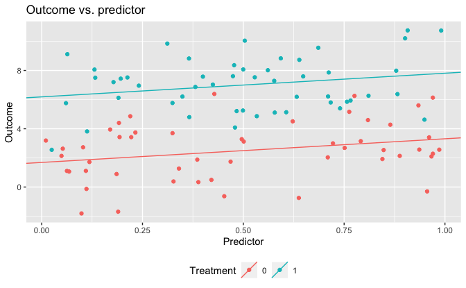
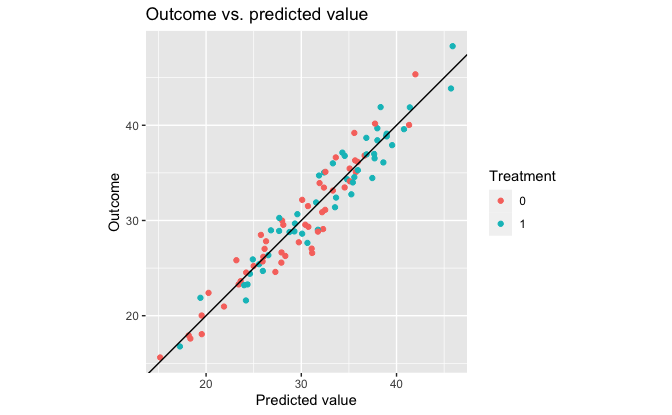
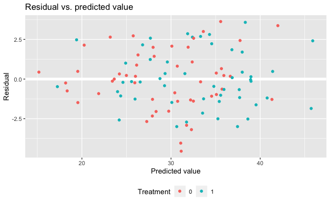

Regression and Other Stories: Residuals
================
Andrew Gelman, Jennifer Hill, Aki Vehtari
2021-04-20

-   [11 Assumptions, diagnostics, and model
    evaluation](#11-assumptions-diagnostics-and-model-evaluation)
    -   [11.2 Plotting the data and fitted
        model](#112-plotting-the-data-and-fitted-model)
        -   [Plotting the outcome vs. a continuous
            predictor](#plotting-the-outcome-vs-a-continuous-predictor)
        -   [Forming a linear predictor from a multiple
            regression](#forming-a-linear-predictor-from-a-multiple-regression)

Tidyverse version by Bill Behrman.

Plotting the data and fitted model. See Chapter 11 in Regression and
Other Stories.

------------------------------------------------------------------------

``` r
# Packages
library(tidyverse)
library(rstanarm)

# Parameters
  # Seed
SEED <- 987
  # Common code
file_common <- here::here("_common.R")

#===============================================================================

# Run common code
source(file_common)
```

# 11 Assumptions, diagnostics, and model evaluation

## 11.2 Plotting the data and fitted model

### Plotting the outcome vs. a continuous predictor

Simulated data.

``` r
set.seed(SEED)

n <- 100
a <- 1
b <- 2
theta <- 5
sigma <- 2

data_1 <- 
  tibble(
    x = runif(n, min = 0, max = 1),
    z = rep(0:1, n / 2) %>% sample(),
    y = a + b * x + theta * z + rnorm(n, mean = 0, sd = sigma)
  )
```

Fit linear regression model.

``` r
set.seed(SEED)

fit_1 <- stan_glm(y ~ x + z, data = data_1, refresh = 0)

fit_1
```

    #> stan_glm
    #>  family:       gaussian [identity]
    #>  formula:      y ~ x + z
    #>  observations: 100
    #>  predictors:   3
    #> ------
    #>             Median MAD_SD
    #> (Intercept) 1.7    0.4   
    #> x           1.6    0.6   
    #> z           4.5    0.4   
    #> 
    #> Auxiliary parameter(s):
    #>       Median MAD_SD
    #> sigma 1.8    0.1   
    #> 
    #> ------
    #> * For help interpreting the printed output see ?print.stanreg
    #> * For info on the priors used see ?prior_summary.stanreg

Outcome vs. predictor.

``` r
lines <- 
  tribble(
    ~z, ~intercept, ~slope,
    0, coef(fit_1)[["(Intercept)"]], coef(fit_1)[["x"]],
    1, coef(fit_1)[["(Intercept)"]] + coef(fit_1)[["z"]], coef(fit_1)[["x"]]
  )

data_1 %>% 
  ggplot(aes(x, y, color = factor(z))) +
  geom_point() +
  geom_abline(
    aes(slope = slope, intercept = intercept, color = factor(z)),
    data = lines
  ) +
  theme(legend.position = "bottom") +
  labs(
    title = "Outcome vs. predictor",
    x = "Predictor",
    y = "Outcome",
    color = "Treatment"
  )
```



### Forming a linear predictor from a multiple regression

Simulated data.

``` r
set.seed(SEED)

n <- 100
k <- 10
a <- 1
b <- 1:k
theta <- 5
sigma <- 2


data_2 <- 
  tibble(
    X = matrix(runif(n * k, min = 0, max = 1), nrow = n, ncol = k),
    z = rep(0:1, n / 2) %>% sample(),
    y = as.double(a + X %*% b + theta * z + rnorm(n, mean = 0, sd = sigma))
  )
```

Fit linear regression model.

``` r
set.seed(SEED)

fit_2 <- stan_glm(y ~ X + z, data = data_2, refresh = 0)

fit_2
```

    #> stan_glm
    #>  family:       gaussian [identity]
    #>  formula:      y ~ X + z
    #>  observations: 100
    #>  predictors:   12
    #> ------
    #>             Median MAD_SD
    #> (Intercept) -0.2    1.1  
    #> X1           0.6    0.7  
    #> X2           2.5    0.7  
    #> X3           3.6    0.7  
    #> X4           3.9    0.7  
    #> X5           5.2    0.8  
    #> X6           6.0    0.7  
    #> X7           8.8    0.8  
    #> X8           8.8    0.8  
    #> X9           8.7    0.7  
    #> X10         10.4    0.8  
    #> z            4.5    0.4  
    #> 
    #> Auxiliary parameter(s):
    #>       Median MAD_SD
    #> sigma 2.0    0.1   
    #> 
    #> ------
    #> * For help interpreting the printed output see ?print.stanreg
    #> * For info on the priors used see ?prior_summary.stanreg

Outcome vs. predicted value.

``` r
data_2 %>%
  mutate(pred = predict(fit_2)) %>% 
  ggplot(aes(pred, y, color = factor(z))) +
  geom_point() +
  geom_abline(slope = 1, intercept = 0) +
  coord_fixed() +
  scale_y_continuous(breaks = scales::breaks_width(10)) +
  labs(
    title = "Outcome vs. predicted value",
    x = "Predicted value",
    y = "Outcome",
    color = "Treatment"
  )
```



Residual vs. predicted value.

``` r
data_2 %>%
  mutate(
    pred = predict(fit_2),
    resid = residuals(fit_2)
  ) %>% 
  ggplot(aes(pred, resid, color = factor(z))) +
  geom_hline(yintercept = 0, color = "white", size = 2) +
  geom_point() +
  theme(legend.position = "bottom") +
  labs(
    title = "Residual vs. predicted value",
    x = "Predicted value",
    y = "Residual",
    color = "Treatment"
  )
```


