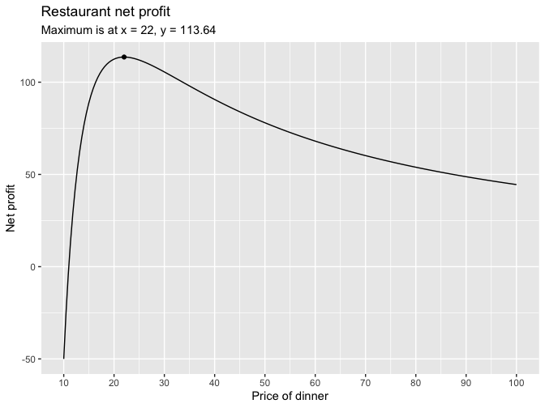

Regression and Other Stories: Restaurant
================
Andrew Gelman, Jennifer Hill, Aki Vehtari
2021-04-20

-   [A Computing in R](#a-computing-in-r)
    -   [A.7 Some R programming](#a7-some-r-programming)
        -   [Opimization](#opimization)

Tidyverse version by Bill Behrman.

Demonstration of using Stan for optimization. See Appendix A in
Regression and Other Stories.

------------------------------------------------------------------------

``` r
# Packages
library(tidyverse)
library(rstan)

# Parameters
  # Common code
file_common <- here::here("_common.R")

#===============================================================================

# Run common code
source(file_common)
```

# A Computing in R

## A.7 Some R programming

### Opimization

#### Restaurant pricing

Net profit for restaurant.

``` r
net_profit <- function(x) {
  (5000 / x^2) * (x - 11)
}
```

Restaurant net profit.

``` r
v <- 
  tibble(
    x = seq_range(c(10, 100)),
    y = net_profit(x)
  )

v %>% 
  ggplot(aes(x, y)) +
  geom_line() +
  geom_point(data = tibble(x = 22, y = net_profit(x))) +
  scale_x_continuous(breaks = scales::breaks_width(10)) +
  labs(
    title = "Restaurant net profit",
    subtitle = 
      str_glue("Maximum is at x = 22, y = {format(net_profit(22), digits = 2, nsmall = 2)}"),
    x = "Price of dinner",
    y = "Net profit"
  )
```



Stan model for net profit.

``` r
model_code =
"
parameters {
  real <lower = 0, upper = 100> x;
}
model {
  target += (5000 / x^2) * (x - 11);
}
"
```

Compile the Stan function and optimize it.

``` r
set.seed(327)

fit <- 
  stan_model(model_code = model_code) %>% 
  optimizing()
```

``` r
fit
```

    #> $par
    #>  x 
    #> 22 
    #> 
    #> $value
    #> [1] 114
    #> 
    #> $return_code
    #> [1] 0
    #> 
    #> $theta_tilde
    #>       x
    #> [1,] 22

``` r
fit$par - 22
```

    #>         x 
    #> -3.06e-07

``` r
fit$value - net_profit(22)
```

    #> [1] -1.42e-14

The optimization returns values close to the true values. If the return
code had not been zero, that would have indicated a problem with the
optimization.
