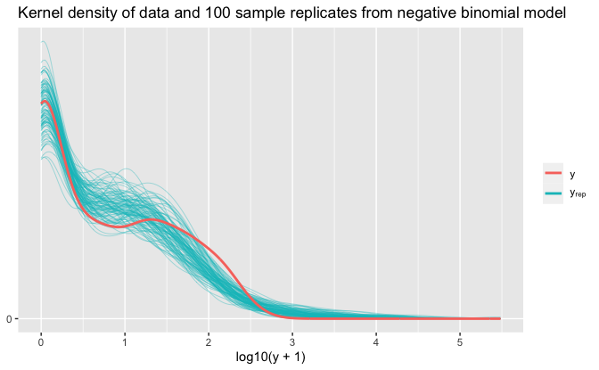
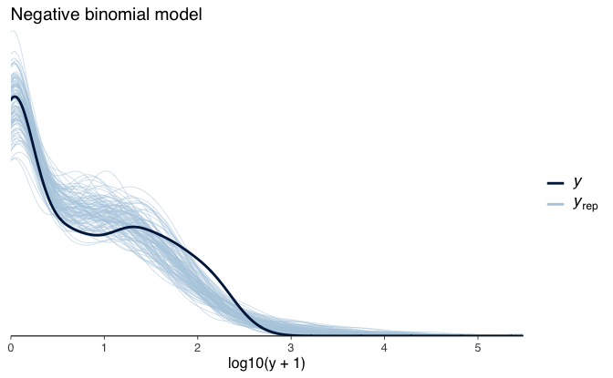
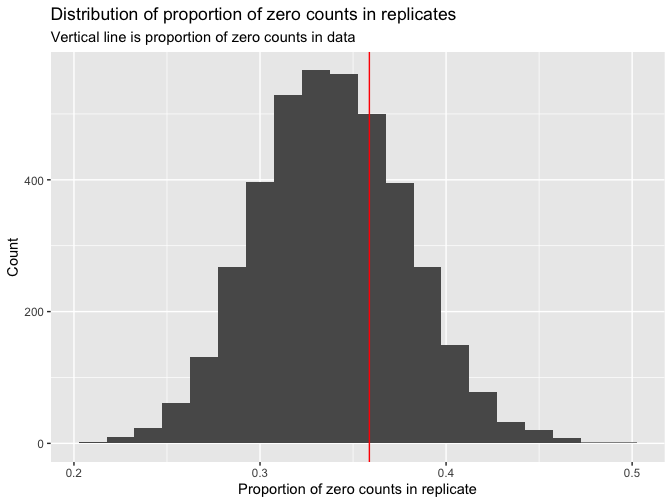
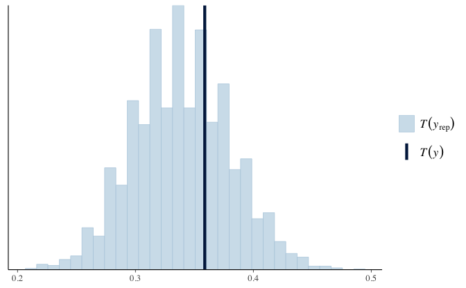
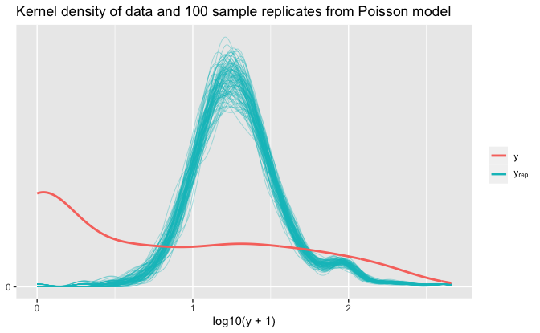
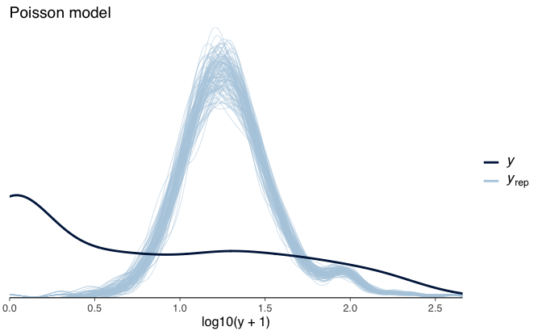
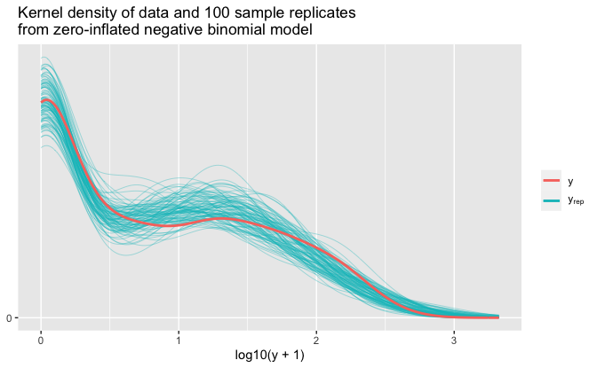
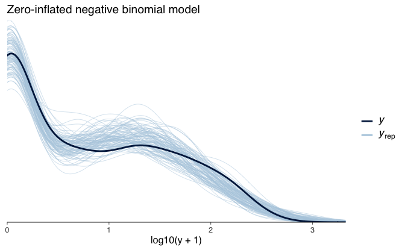
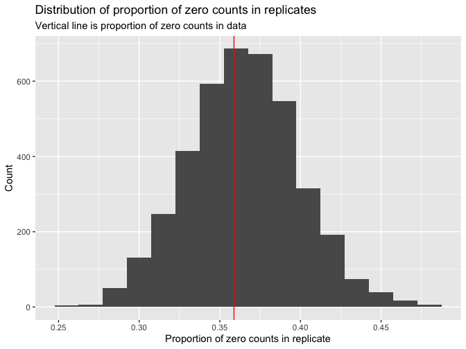
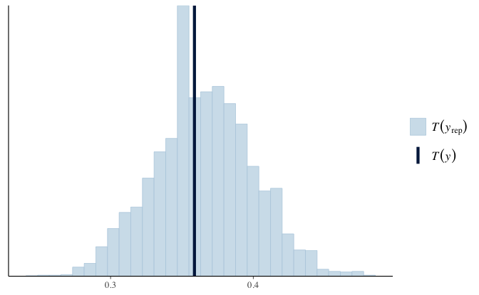

Regression and Other Stories: Roaches
================
Andrew Gelman, Jennifer Hill, Aki Vehtari
2021-04-20

-   [15 Other generalized linear
    models](#15-other-generalized-linear-models)
    -   [15.2 Poisson and negative binomial
        regression](#152-poisson-and-negative-binomial-regression)
        -   [Example: zeros in count data](#example-zeros-in-count-data)
    -   [15.8 Going beyond generalized linear
        models](#158-going-beyond-generalized-linear-models)
        -   [Cockroaches and the zero-inflated negative binomial
            model](#cockroaches-and-the-zero-inflated-negative-binomial-model)

Tidyverse version by Bill Behrman.

Analyze the effect of integrated pest management on reducing cockroach
levels in urban apartments. See Chapter 15 in Regression and Other
Stories.

------------------------------------------------------------------------

``` r
# Packages
library(tidyverse)
library(bayesplot)
library(brms)
library(rstanarm)

# Parameters
  # Seed
SEED <- 3579
  # Common code
file_common <- here::here("_common.R")

# Functions
  # Plot kernel density of data and sample replicates
plot_density_overlay <- function(y, y_rep) {
  ggplot(mapping = aes(y)) +
    stat_density(
      aes(group = rep, color = "y_rep"),
      data = 
        seq_len(nrow(y_rep)) %>% map_dfr(~ tibble(rep = ., y = y_rep[., ])),
      geom = "line",
      position = "identity",
      alpha = 0.5,
      size = 0.25
    ) +
    stat_density(aes(color = "y"), data = tibble(y), geom = "line", size = 1) +
    scale_y_continuous(breaks = 0) +
    scale_color_discrete(
      breaks = c("y", "y_rep"),
      labels = c("y", expression(y[rep]))
    ) +
    theme(legend.text.align = 0) +
    labs(
      x = NULL,
      y = NULL,
      color = NULL
    )
}

#===============================================================================

# Run common code
source(file_common)
```

# 15 Other generalized linear models

## 15.2 Poisson and negative binomial regression

### Example: zeros in count data

Data

``` r
# data(roaches)
roaches <-
  roaches %>%
  as_tibble() %>% 
  mutate(roach100 = roach1 / 100) %>%
  relocate(roach100, .after = roach1)

roaches
```

    #> # A tibble: 262 x 6
    #>        y roach1 roach100 treatment senior exposure2
    #>    <int>  <dbl>    <dbl>     <int>  <int>     <dbl>
    #>  1   153 308      3.08           1      0      0.8 
    #>  2   127 331.     3.31           1      0      0.6 
    #>  3     7   1.67   0.0167         1      0      1   
    #>  4     7   3      0.03           1      0      1   
    #>  5     0   2      0.02           1      0      1.14
    #>  6     0   0      0              1      0      1   
    #>  7    73  70      0.7            1      0      0.8 
    #>  8    24  64.6    0.646          1      0      1.14
    #>  9     2   1      0.01           0      0      1   
    #> 10     2  14      0.14           0      0      1.14
    #> # … with 252 more rows

Fit negative binomial model.

``` r
fit_nbinom <-
  stan_glm(
    y ~ roach100 + treatment + senior,
    family = neg_binomial_2(link = "log"),
    data = roaches,
    offset = log(exposure2),
    refresh = 0,
    seed = SEED
  )

print(fit_nbinom, digits = 2)
```

    #> stan_glm
    #>  family:       neg_binomial_2 [log]
    #>  formula:      y ~ roach100 + treatment + senior
    #>  observations: 262
    #>  predictors:   4
    #> ------
    #>             Median MAD_SD
    #> (Intercept)  2.84   0.23 
    #> roach100     1.31   0.25 
    #> treatment   -0.79   0.24 
    #> senior      -0.34   0.27 
    #> 
    #> Auxiliary parameter(s):
    #>                       Median MAD_SD
    #> reciprocal_dispersion 0.27   0.03  
    #> 
    #> ------
    #> * For help interpreting the printed output see ?print.stanreg
    #> * For info on the priors used see ?prior_summary.stanreg

The estimated overdispersion is 1 / `reciprocal_dispersion` = 1 / 0.27 =
3.7. The model is overdispersed compared to Poisson.

LOO log score

``` r
loo_nbinom <- loo(fit_nbinom)
```

    #> Warning: Found 1 observation(s) with a pareto_k > 0.7. We recommend calling 'loo' again with argument 'k_threshold = 0.7' in order to calculate the ELPD without the assumption that these observations are negligible. This will refit the model 1 times to compute the ELPDs for the problematic observations directly.

Because of the warning message, we will call `loo()` again with the
recommended argument.

``` r
loo_nbinom <- loo(fit_nbinom, k_threshold = 0.7)

loo_nbinom
```

    #> 
    #> Computed from 4000 by 262 log-likelihood matrix
    #> 
    #>          Estimate   SE
    #> elpd_loo   -895.7 37.8
    #> p_loo         6.8  2.7
    #> looic      1791.5 75.6
    #> ------
    #> Monte Carlo SE of elpd_loo is 0.1.
    #> 
    #> Pareto k diagnostic values:
    #>                          Count Pct.    Min. n_eff
    #> (-Inf, 0.5]   (good)     260   99.6%   2770      
    #>  (0.5, 0.7]   (ok)         1    0.4%   621       
    #>    (0.7, 1]   (bad)        0    0.0%   <NA>      
    #>    (1, Inf)   (very bad)   0    0.0%   <NA>      
    #> 
    #> All Pareto k estimates are ok (k < 0.7).
    #> See help('pareto-k-diagnostic') for details.

#### Checking model fit by comparing the data, `y`, to the replicated datasets, *y*<sup>*r**e**p*</sup>

Simulate data for negative binomial model.

``` r
set.seed(SEED)

y_rep_nbinom <- posterior_predict(fit_nbinom)

n_sims <- nrow(y_rep_nbinom)
n_rep <- 100
sims_sample <- sample(n_sims, n_rep)
```

Kernel density of data and 100 sample replicates from negative binomial
model.

``` r
plot_density_overlay(
  y = log10(roaches$y + 1),
  y_rep = log10(y_rep_nbinom[sims_sample, ] + 1)
) +
  scale_x_continuous(breaks = scales::breaks_width(1)) +
  labs(
    title = 
      str_glue(
        "Kernel density of data and {n_rep} sample replicates from negative binomial model"
      ),
    x = "log10(y + 1)"
  )
```



Kernel density of data and 100 sample replicates from negative binomial
model using bayesplot.

``` r
ppc_dens_overlay(
  y = log10(roaches$y + 1),
  yrep = log10(y_rep_nbinom[sims_sample, ] + 1)
) +
  theme(
    axis.line.y = element_blank(),
    text = element_text(family = "sans")
  ) +
  labs(
    title = "Negative binomial model",
    x = "log10(y + 1)"
  )
```



##### Predictive checking with test statistic

###### Proportion of zero counts

Test statistic for proportion of zero counts.

``` r
prop_0 <- function(x) {
  mean(x == 0)
}
```

``` r
y_prop_0 <- prop_0(roaches$y)

y_prop_0
```

    #> [1] 0.359

``` r
y_rep_nbinom_prop_0 <- apply(y_rep_nbinom, 1, prop_0)

summary(y_rep_nbinom_prop_0)
```

    #>    Min. 1st Qu.  Median    Mean 3rd Qu.    Max. 
    #>   0.210   0.309   0.340   0.339   0.366   0.489

The proportion of zero counts in the replicated datasets varies from
0.21 to 0.49, with a median and mean of 0.34, close to the observed
proportion in the data of 0.36.

Distribution of proportion of zero counts in replicates.

``` r
tibble(y_prop_0 = y_rep_nbinom_prop_0) %>% 
  ggplot(aes(y_prop_0)) +
  geom_histogram(binwidth = 0.015) +
  geom_vline(xintercept = y_prop_0, color = "red") +
  labs(
    title = "Distribution of proportion of zero counts in replicates",
    subtitle = "Vertical line is proportion of zero counts in data",
    x = "Proportion of zero counts in replicate",
    y = "Count"
  )
```



Distribution of proportion of zero counts in replicates using bayesplot.

``` r
ppc_stat(y = roaches$y, yrep = y_rep_nbinom, stat = function(x) mean(x == 0))
```



###### Maximum counts

``` r
y_max <- max(roaches$y)

y_max
```

    #> [1] 357

``` r
y_rep_nbinom_max <- apply(y_rep_nbinom, 1, max)

summary(y_rep_nbinom_max)
```

    #>    Min. 1st Qu.  Median    Mean 3rd Qu.    Max. 
    #>     150    1592    3558   14018    9550 8951176

The maximum roach count in the data is 357, but the maximum count in the
negative binomial model is close to nine million, which would make sense
only in a horror movie. We will introduce another improvement below with
the zero-inflated negative binomial model.

#### What if we had used Poisson regression?

Fit Poisson model.

``` r
fit_pois <-
  stan_glm(
    y ~ roach100 + treatment + senior,
    family = poisson(link = "log"),
    data = roaches,
    offset = log(exposure2),
    refresh = 0,
    seed = SEED
  )

print(fit_pois, digits = 2)
```

    #> stan_glm
    #>  family:       poisson [log]
    #>  formula:      y ~ roach100 + treatment + senior
    #>  observations: 262
    #>  predictors:   4
    #> ------
    #>             Median MAD_SD
    #> (Intercept)  3.09   0.02 
    #> roach100     0.70   0.01 
    #> treatment   -0.52   0.02 
    #> senior      -0.38   0.03 
    #> 
    #> ------
    #> * For help interpreting the printed output see ?print.stanreg
    #> * For info on the priors used see ?prior_summary.stanreg

LOO log score

``` r
loo_pois <- loo(fit_pois)
```

    #> Warning: Found 14 observations with a pareto_k > 0.7. With this many problematic observations we recommend calling 'kfold' with argument 'K=10' to perform 10-fold cross-validation rather than LOO.

Because of the warning message, we will follow the recommendation and
use `kfold()` instead of `loo()`.

K-fold log score

``` r
kfold_pois <- kfold(fit_pois, k = 10)

kfold_pois
```

    #> 
    #> Based on 10-fold cross-validation
    #> 
    #>            Estimate     SE
    #> elpd_kfold  -6302.6  742.9
    #> p_kfold          NA     NA
    #> kfoldic     12605.2 1485.9

Compare log scores.

``` r
kfold_nbinom <- kfold(fit_nbinom, k = 10)

loo_compare(kfold_nbinom, kfold_pois)
```

    #>            elpd_diff se_diff
    #> fit_nbinom     0.0       0.0
    #> fit_pois   -5406.2     724.2

The negative binomial model has a substantially better log score than
the Poisson model.

Simulate data for Poisson model.

``` r
set.seed(SEED)

y_rep_pois <- posterior_predict(fit_pois)
```

Kernel density of data and 100 sample replicates from Poisson model.

``` r
plot_density_overlay(
  y = log10(roaches$y + 1),
  y_rep = log10(y_rep_pois[sims_sample, ] + 1)
) +
  labs(
    title = 
      str_glue(
        "Kernel density of data and {n_rep} sample replicates from Poisson model"
      ),
    x = "log10(y + 1)"
  )
```



Kernel density of data and 100 sample replicates from Poisson model
using bayesplot.

``` r
ppc_dens_overlay(
  y = log10(roaches$y + 1),
  yrep = log10(y_rep_pois[sims_sample, ] + 1)
) +
  theme(
    axis.line.y = element_blank(),
    text = element_text(family = "sans")
  ) +
  labs(
    title = "Poisson model",
    x = "log10(y + 1)"
  )
```



#### Checking the fit of the non-overdispersed Poisson regression

Test statistic for proportion of zero counts.

``` r
y_rep_pois_prop_0 <- apply(y_rep_pois, 1, prop_0)

summary(y_rep_pois_prop_0)
```

    #>    Min. 1st Qu.  Median    Mean 3rd Qu.    Max. 
    #> 0.00000 0.00000 0.00000 0.00070 0.00000 0.00763

A majority of the replicated datasets have no zero counts, the maximum
proportion in all 4000 replicates is 0.0076, and the mean proportion is
0.00070, far below the observed proportion in the data of 0.36. This
suggests a potential problem with the model: in reality, many apartments
have zero roaches, but this would not be happening if the model were
true.

## 15.8 Going beyond generalized linear models

### Cockroaches and the zero-inflated negative binomial model

A zero-inflated negative binomial model is a mixture of two models, a
logistic regression to model the proportion of extra zero counts and a
negative binomial model to model the non-zero counts. This two-stage
model can be modeled directly in Stan or with `brms::brm()` using the
`zero_inflated_negbinomial()` family. We’ll use the latter here.

Create log-transformed variables.

``` r
roaches <- 
  roaches %>% 
  mutate(
    roach1_logp1 = log(roach1 + 1),
    exposure2_log = log(exposure2)
  )
```

Fit zero-inflated negative binomial model.

``` r
fit_zinbinom <- 
  brm(
    formula = 
      bf(
        y  ~ roach1_logp1 + treatment + senior + offset(exposure2_log),
        zi ~ roach1_logp1 + treatment + senior + offset(exposure2_log)
      ),
    data = roaches,
    family = zero_inflated_negbinomial(),
    prior = set_prior("normal(0, 1)"),
    save_all_pars = TRUE,
    seed = SEED,
    refresh = 0
  )
```

``` r
fit_zinbinom
```

    #>  Family: zero_inflated_negbinomial 
    #>   Links: mu = log; shape = identity; zi = logit 
    #> Formula: y ~ roach1_logp1 + treatment + senior + offset(exposure2_log) 
    #>          zi ~ roach1_logp1 + treatment + senior + offset(exposure2_log)
    #>    Data: roaches (Number of observations: 262) 
    #> Samples: 4 chains, each with iter = 2000; warmup = 1000; thin = 1;
    #>          total post-warmup samples = 4000
    #> 
    #> Population-Level Effects: 
    #>                 Estimate Est.Error l-95% CI u-95% CI Rhat Bulk_ESS Tail_ESS
    #> Intercept           2.11      0.25     1.62     2.61 1.00     3578     2932
    #> zi_Intercept       -1.12      0.79    -2.92     0.16 1.00     2638     2129
    #> roach1_logp1        0.52      0.06     0.40     0.65 1.00     3267     2841
    #> treatment          -0.80      0.23    -1.24    -0.35 1.00     4265     3140
    #> senior              0.19      0.26    -0.31     0.73 1.00     3708     2728
    #> zi_roach1_logp1    -1.28      0.32    -2.03    -0.78 1.00     2511     1936
    #> zi_treatment        1.69      0.73     0.43     3.37 1.00     2937     1844
    #> zi_senior           1.38      0.65     0.20     2.75 1.00     2939     2292
    #> 
    #> Family Specific Parameters: 
    #>       Estimate Est.Error l-95% CI u-95% CI Rhat Bulk_ESS Tail_ESS
    #> shape     0.50      0.06     0.38     0.64 1.00     3076     2776
    #> 
    #> Samples were drawn using sampling(NUTS). For each parameter, Bulk_ESS
    #> and Tail_ESS are effective sample size measures, and Rhat is the potential
    #> scale reduction factor on split chains (at convergence, Rhat = 1).

LOO log score

``` r
loo_zinbinom <- loo(fit_zinbinom)
```

    #> Warning: Found 1 observations with a pareto_k > 0.7 in model 'fit_zinbinom'. It
    #> is recommended to set 'moment_match = TRUE' in order to perform moment matching
    #> for problematic observations.

Because of the warning message, we will call `loo()` again with the
recommended argument.

``` r
loo_zinbinom <- loo(fit_zinbinom, moment_match = TRUE)

loo_zinbinom
```

    #> 
    #> Computed from 4000 by 262 log-likelihood matrix
    #> 
    #>          Estimate   SE
    #> elpd_loo   -859.1 38.7
    #> p_loo        12.9  4.2
    #> looic      1718.1 77.3
    #> ------
    #> Monte Carlo SE of elpd_loo is 0.1.
    #> 
    #> All Pareto k estimates are good (k < 0.5).
    #> See help('pareto-k-diagnostic') for details.

Compare log scores.

``` r
loo_compare(loo_nbinom, loo_zinbinom)
```

    #>              elpd_diff se_diff
    #> fit_zinbinom   0.0       0.0  
    #> fit_nbinom   -36.7      11.9

The LOO log score comparison supports better predictive performance for
the zero-inflated negative binomial model.

Simulate data for zero-inflated negative binomial model.

``` r
set.seed(SEED)

y_rep_zinbinom <- posterior_predict(fit_zinbinom)
```

Kernel density of data and 100 sample replicates from zero-inflated
negative binomial model.

``` r
plot_density_overlay(
  y = log10(roaches$y + 1),
  y_rep = log10(y_rep_zinbinom[sims_sample, ] + 1)
) +
  labs(
    title = 
      str_glue(
        "Kernel density of data and {n_rep} sample replicates\nfrom zero-inflated negative binomial model"
      ),
    x = "log10(y + 1)"
  )
```



The zero-inflated negative binomial model predictions are visually
better than with the negative binomial model.

Kernel density of data and 100 sample replicates from zero-inflated
negative binomial model using bayesplot.

``` r
ppc_dens_overlay(
  y = log10(roaches$y + 1),
  yrep = log10(y_rep_zinbinom[sims_sample, ] + 1)
) +
  theme(
    axis.line.y = element_blank(),
    text = element_text(family = "sans")
  ) +
  labs(
    title = "Zero-inflated negative binomial model",
    x = "log10(y + 1)"
  )
```



##### Predictive checking with test statistic

###### Proportion of zero counts

Test statistic for proportion of zero counts.

``` r
y_rep_zinbinom_prop_0 <- apply(y_rep_zinbinom, 1, prop_0)

summary(y_rep_zinbinom_prop_0)
```

    #>    Min. 1st Qu.  Median    Mean 3rd Qu.    Max. 
    #>   0.248   0.344   0.366   0.365   0.389   0.485

The proportion of zero counts in the replicated datasets have a median
and mean of closer to the observed proportion in the data of 0.36.

Distribution of proportion of zero counts in replicates.

``` r
tibble(y_prop_0 = y_rep_zinbinom_prop_0) %>% 
  ggplot(aes(y_prop_0)) +
  geom_histogram(binwidth = 0.015) +
  geom_vline(xintercept = y_prop_0, color = "red") +
  labs(
    title = "Distribution of proportion of zero counts in replicates",
    subtitle = "Vertical line is proportion of zero counts in data",
    x = "Proportion of zero counts in replicate",
    y = "Count"
  )
```



Distribution of proportion of zero counts in replicates using bayesplot.

``` r
ppc_stat(y = roaches$y, yrep = y_rep_zinbinom, stat = function(x) mean(x == 0))
```



###### Maximum counts

``` r
y_rep_zinbinom_max <- apply(y_rep_zinbinom, 1, max)

summary(y_rep_zinbinom_max)
```

    #>    Min. 1st Qu.  Median    Mean 3rd Qu.    Max. 
    #>     171     447     601     697     833    4316

The maximum count in the data is 357. The maximum count in the
replicates for the zero-inflated negative binomial model is much closer
to this value than the value of nearly nine million for the negative
binomial model.
