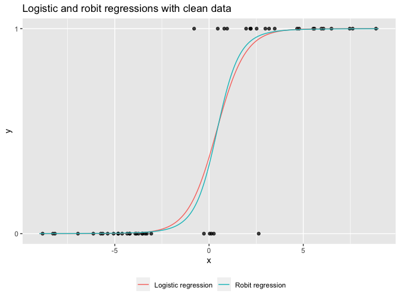

Regression and Other Stories: Robit
================
Andrew Gelman, Jennifer Hill, Aki Vehtari
2021-04-20

-   [15 Other generalized linear
    models](#15-other-generalized-linear-models)
    -   [15.6 Robust regression using the t
        model](#156-robust-regression-using-the-t-model)
        -   [Robit instead of logit or
            probit](#robit-instead-of-logit-or-probit)

Tidyverse version by Bill Behrman.

Comparison of robit and logit models for binary data. See Chapter 15 in
Regression and Other Stories.

------------------------------------------------------------------------

``` r
# Packages
library(tidyverse)
library(cmdstanr)

# Parameters
  # Stan logistic model
file_logit <- here::here("Robit/logit_tv.stan")
  # Stan robit model
file_robit <- here::here("Robit/robit_tv.stan")
  # Common code
file_common <- here::here("_common.R")

#===============================================================================

# Run common code
source(file_common)
```

# 15 Other generalized linear models

## 15.6 Robust regression using the t model

### Robit instead of logit or probit

Simulate clean data.

``` r
set.seed(1234)

N <- 50
df <- 4

x_min <- -9
x_max <- 9
a <- 0
b <- 0.8

data_clean <- 
  tibble(
    x = runif(N, min = x_min, max = x_max),
    y = rbinom(N, 1, prob = plogis(a + b * x))
  )

data_1 <- c(list(N = N, df = df), as.list(data_clean))
```

Stan logistic model.

``` r
file_logit %>% 
  read_lines() %>% 
  writeLines()
```

    data {
      int N;
      vector [N] x;
      int y[N];
    }
    parameters {
      real a;
      real b;
    }
    model {
      y ~ bernoulli_logit(a + b * x);
    }

Stan robit model.

``` r
file_robit %>% 
  read_lines() %>% 
  writeLines()
```

    data {
      int N;
      real df;
      vector [N] x;
      int y[N];
    }
    parameters {
      real a;
      real b;
    }
    model {
      vector[N] p;
      for (n in 1:N) {
        p[n] = student_t_cdf(a + b * x[n], df, 0, sqrt((df - 2) / df));
      } 
      y ~ bernoulli(p);
    }

Compile models.

``` r
model_logit <- cmdstan_model(file_logit)
model_robit <- cmdstan_model(file_robit)
```

Sample from logistic model with clean data.

``` r
set.seed(693)

fit_1_logit <- 
  model_logit$sample(data = data_1, refresh = 0, adapt_delta = 0.95)
```

    #> Running MCMC with 4 sequential chains...
    #> 
    #> Chain 1 finished in 0.1 seconds.
    #> Chain 2 finished in 0.1 seconds.
    #> Chain 3 finished in 0.1 seconds.
    #> Chain 4 finished in 0.1 seconds.
    #> 
    #> All 4 chains finished successfully.
    #> Mean chain execution time: 0.1 seconds.
    #> Total execution time: 1.3 seconds.

``` r
fit_1_logit
```

    #>  variable  mean median   sd  mad     q5   q95 rhat ess_bulk ess_tail
    #>      lp__ -9.77  -9.47 1.04 0.77 -11.77 -8.76 1.00     1498     1759
    #>      a    -0.56  -0.52 0.71 0.70  -1.76  0.49 1.00     1408     1876
    #>      b     1.40   1.31 0.49 0.45   0.75  2.31 1.00     1450     1478

Logistic regression coefficients.

``` r
a_1_logit <- median(fit_1_logit$draws("a"))
b_1_logit <- median(fit_1_logit$draws("b"))
```

Sample from robit model with clean data.

``` r
set.seed(693)

fit_1_robit <- 
  model_robit$sample(data = data_1, refresh = 0, adapt_delta = 0.95)
```

    #> Running MCMC with 4 sequential chains...
    #> 
    #> Chain 1 finished in 0.7 seconds.
    #> Chain 2 finished in 0.6 seconds.
    #> Chain 3 finished in 0.7 seconds.
    #> Chain 4 finished in 0.6 seconds.
    #> 
    #> All 4 chains finished successfully.
    #> Mean chain execution time: 0.6 seconds.
    #> Total execution time: 3.8 seconds.

``` r
fit_1_robit
```

    #>  variable   mean median   sd  mad     q5   q95 rhat ess_bulk ess_tail
    #>      lp__ -10.09  -9.69 1.32 0.89 -12.69 -8.87 1.01      877      797
    #>      a     -0.36  -0.33 0.42 0.39  -1.08  0.27 1.00     1154     1169
    #>      b      0.88   0.78 0.46 0.31   0.41  1.70 1.01      837      637

Robit regression coefficients.

``` r
a_1_robit <- median(fit_1_robit$draws("a"))
b_1_robit <- median(fit_1_robit$draws("b"))
```

Logistic and robit regressions with clean data.

``` r
lines <- function(a_logit, b_logit, a_robit, b_robit) {
   tibble(
    x = seq_range(c(x_min, x_max)),
    y_logit = plogis(a_logit + b_logit * x),
    y_robit = pt((a_robit + b_robit * x) / sqrt((df - 2) / df), df = df)
  ) %>% 
    pivot_longer(
      cols = !x,
      names_to = "model",
      names_prefix = "y_",
      values_to = "y"
    )
}

lines_clean <- lines(a_1_logit, b_1_logit, a_1_robit, b_1_robit)

plot <- function(data, lines) {
  ggplot(mapping = aes(x, y)) +
    geom_point(data = data, alpha = 0.75) +
    geom_line(aes(color = model), data = lines) +
    scale_y_continuous(breaks = 0:1, minor_breaks = NULL) +
    scale_color_discrete(
      breaks = c("logit", "robit"),
      labels = c("Logistic regression", "Robit regression")
    ) +
    theme(legend.position = "bottom") +
    labs(color = NULL)
}

plot(data_clean, lines_clean) +
  labs(title = "Logistic and robit regressions with clean data")
```



Add an outlier by flipping the class of one observation.

``` r
data_contaminated <- 
  data_clean %>% 
  arrange(x) %>% 
  mutate(y = if_else(row_number() == 4, 1L, y))

data_2 <- c(list(N = N, df = df), as.list(data_contaminated))
```

Sample from logistic model with contaminated data.

``` r
set.seed(693)

fit_2_logit <- 
  model_logit$sample(data = data_2, refresh = 0, adapt_delta = 0.95)
```

    #> Running MCMC with 4 sequential chains...
    #> 
    #> Chain 1 finished in 0.1 seconds.
    #> Chain 2 finished in 0.1 seconds.
    #> Chain 3 finished in 0.1 seconds.
    #> Chain 4 finished in 0.1 seconds.
    #> 
    #> All 4 chains finished successfully.
    #> Mean chain execution time: 0.1 seconds.
    #> Total execution time: 0.5 seconds.

``` r
fit_2_logit
```

    #>  variable   mean median   sd  mad     q5    q95 rhat ess_bulk ess_tail
    #>      lp__ -15.58 -15.28 1.02 0.75 -17.70 -14.59 1.00     1660     1755
    #>      a      0.04   0.04 0.51 0.50  -0.80   0.87 1.00     2224     2153
    #>      b      0.74   0.71 0.19 0.19   0.46   1.07 1.00     2074     1872

Logistic regression coefficients.

``` r
a_2_logit <- median(fit_2_logit$draws("a"))
b_2_logit <- median(fit_2_logit$draws("b"))
```

Sample from robit model with contaminated data.

``` r
set.seed(693)

fit_2_robit <- 
  model_robit$sample(data = data_2, refresh = 0, adapt_delta = 0.95)
```

    #> Running MCMC with 4 sequential chains...
    #> 
    #> Chain 1 finished in 0.6 seconds.
    #> Chain 2 finished in 0.6 seconds.
    #> Chain 3 finished in 0.5 seconds.
    #> Chain 4 finished in 0.5 seconds.
    #> 
    #> All 4 chains finished successfully.
    #> Mean chain execution time: 0.6 seconds.
    #> Total execution time: 2.5 seconds.

``` r
fit_2_robit
```

    #>  variable   mean median   sd  mad     q5    q95 rhat ess_bulk ess_tail
    #>      lp__ -15.31 -14.95 1.18 0.86 -17.64 -14.18 1.00     1087     1218
    #>      a     -0.05  -0.05 0.30 0.29  -0.55   0.43 1.00     1885     1475
    #>      b      0.47   0.44 0.18 0.15   0.25   0.80 1.00     1506     1120

Robit regression coefficients.

``` r
a_2_robit <- median(fit_2_robit$draws("a"))
b_2_robit <- median(fit_2_robit$draws("b"))
```

Logistic and robit regressions with contaminated data.

``` r
lines_contaminated <- lines(a_2_logit, b_2_logit, a_2_robit, b_2_robit)

plot(data_contaminated, lines_contaminated) +
  labs(title = "Logistic and robit regressions with contaminated data")
```


