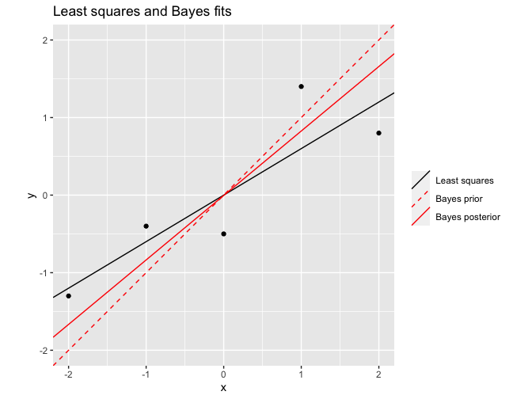
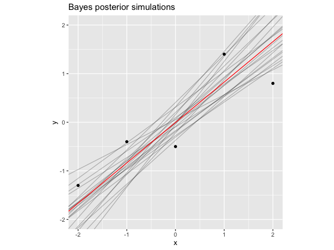
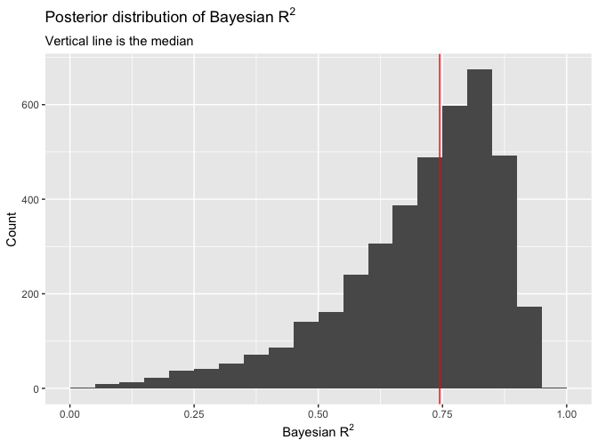
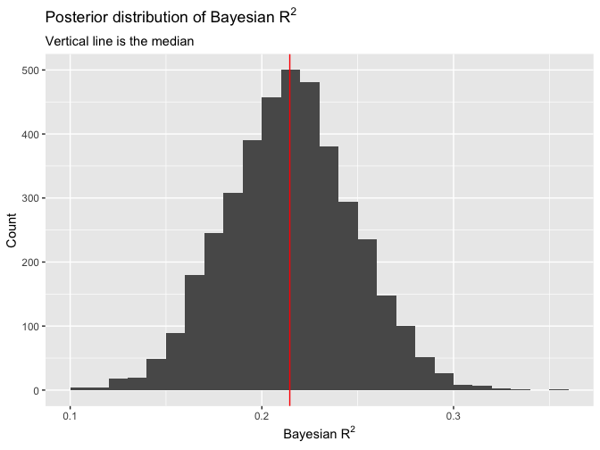

Regression and Other Stories: Bayesian *R*<sup>2</sup>
================
Andrew Gelman, Jennifer Hill, Aki Vehtari
2021-04-20

-   [11 Assumptions, diagnostics, and model
    evaluation](#11-assumptions-diagnostics-and-model-evaluation)
    -   [11.6 Residual standard deviation σ and explained variance
        *R*<sup>2</sup>](#116-residual-standard-deviation-σ-and-explained-variance-r2)
        -   [Bayesian *R*<sup>2</sup>](#bayesian-r2)

Tidyverse version by Bill Behrman.

Bayesian *R*<sup>2</sup>. See Chapter 11 in Regression and Other
Stories.

See also - Andrew Gelman, Ben Goodrich, Jonah Gabry, and Aki Vehtari
(2018). R-squared for Bayesian regression models. The American
Statistician, 73:307-209
[doi:10.1080/00031305.2018.1549100](https://doi.org/10.1080/00031305.2018.1549100).

------------------------------------------------------------------------

``` r
# Packages
library(tidyverse)
library(rstanarm)

# Parameters
  # Seed
SEED <- 1800
  # Kid test score data
file_kids <- here::here("KidIQ/data/kidiq.csv")
  # Common code
file_common <- here::here("_common.R")

#===============================================================================

# Run common code
source(file_common)
```

# 11 Assumptions, diagnostics, and model evaluation

## 11.6 Residual standard deviation σ and explained variance *R*<sup>2</sup>

### Bayesian *R*<sup>2</sup>

#### Small dataset

Data

``` r
data <- tibble(x = -2:2, y = c(-1.3, -0.4, -0.5, 1.4, 0.8))

data
```

    #> # A tibble: 5 x 2
    #>       x     y
    #>   <int> <dbl>
    #> 1    -2  -1.3
    #> 2    -1  -0.4
    #> 3     0  -0.5
    #> 4     1   1.4
    #> 5     2   0.8

Least-squares fit.

``` r
fit_lm <- lm(y ~ x, data = data)

broom::tidy(fit_lm)
```

    #> # A tibble: 2 x 5
    #>   term         estimate std.error statistic p.value
    #>   <chr>           <dbl>     <dbl>     <dbl>   <dbl>
    #> 1 (Intercept) -9.93e-17     0.271 -3.67e-16  1.00  
    #> 2 x            6.00e- 1     0.191  3.13e+ 0  0.0519

``` r
broom::glance(fit_lm)$r.squared
```

    #> [1] 0.766

The least-square fit has an intercept of essentially 0 and a slope of
0.6. It’s *R*<sup>2</sup> is 0.766.

Bayes fit with a strong prior. The intercept prior has a mean of 0, and
the slope prior has a mean of 1.

``` r
fit_bayes <- 
  stan_glm(
    y ~ x,
    data = data,
    refresh = 0,
    seed = SEED,
    prior = normal(location = 1, scale = 0.2, autoscale = FALSE),
    prior_intercept = normal(location = 0, scale = 0.2, autoscale = FALSE),
    prior_aux = NULL
  )

fit_bayes
```

    #> stan_glm
    #>  family:       gaussian [identity]
    #>  formula:      y ~ x
    #>  observations: 5
    #>  predictors:   2
    #> ------
    #>             Median MAD_SD
    #> (Intercept) 0.0    0.2   
    #> x           0.8    0.2   
    #> 
    #> Auxiliary parameter(s):
    #>       Median MAD_SD
    #> sigma 0.8    0.3   
    #> 
    #> ------
    #> * For help interpreting the printed output see ?print.stanreg
    #> * For info on the priors used see ?prior_summary.stanreg

The Bayes fit has an intercept of -0.005 and a slope of 0.831. The slope
is between the least-square slope and the prior slope.

Bayesian *R*<sup>2</sup>.

``` r
bayes_r2 <- bayes_R2(fit_bayes)
median(bayes_r2)
```

    #> [1] 0.744

Least squares and Bayes fits.

``` r
intercept_lm <- coef(fit_lm)[["(Intercept)"]]
slope_lm <- coef(fit_lm)[["x"]]
intercept_bayes <- coef(fit_bayes)[["(Intercept)"]]
slope_bayes <- coef(fit_bayes)[["x"]]

lines <-
  tribble(
    ~intercept, ~slope, ~label,
    intercept_lm, slope_lm, "Least squares",
    0, 1, "Bayes prior", 
    intercept_bayes, slope_bayes, "Bayes posterior",
  )

data %>%
  ggplot(aes(x, y)) +
  geom_abline(
    aes(slope = slope, intercept = intercept, color = label, linetype = label),
    data = lines
  ) +
  geom_point() +
  coord_fixed(ylim = c(-2, 2)) +
  scale_color_manual(
    breaks = c("Least squares", "Bayes prior", "Bayes posterior"),
    values = c("black", "red", "red")
  ) +
  scale_linetype_manual(
    breaks = c("Least squares", "Bayes prior", "Bayes posterior"),
    values = c("solid", "dashed", "solid")
  ) +
  labs(
    title = "Least squares and Bayes fits",
    color = NULL,
    linetype = NULL
  )
```



Bayes posterior simulations.

``` r
set.seed(374)

n_lines <- 20

data %>%
  ggplot(aes(x, y)) +
  geom_abline(
    aes(slope = x, intercept = `(Intercept)`),
    data = as_tibble(fit_bayes) %>% slice_sample(n = n_lines),
    alpha = 0.25
  ) +
  geom_abline(slope = slope_bayes, intercept = intercept_bayes, color = "red") +
  geom_point() +
  coord_fixed(ylim = c(-2, 2)) +
  labs(title = "Bayes posterior simulations")
```



Posterior distribution of Bayesian *R*<sup>2</sup>.

``` r
tibble(bayes_r2) %>% 
  ggplot(aes(bayes_r2)) +
  geom_histogram(binwidth = 0.05, boundary = 0) +
  geom_vline(xintercept = median(bayes_r2), color = "red") +
  labs(
    title = expression(paste("Posterior distribution of Bayesian ", R^2)),
    subtitle = "Vertical line is the median",
    x = expression(paste("Bayesian ", R^2)),
    y = "Count"
  )
```



#### Child test scores

Data

``` r
kids <- read_csv(file_kids)

kids
```

    #> # A tibble: 434 x 5
    #>    kid_score mom_hs mom_iq mom_work mom_age
    #>        <dbl>  <dbl>  <dbl>    <dbl>   <dbl>
    #>  1        65      1  121.         4      27
    #>  2        98      1   89.4        4      25
    #>  3        85      1  115.         4      27
    #>  4        83      1   99.4        3      25
    #>  5       115      1   92.7        4      27
    #>  6        98      0  108.         1      18
    #>  7        69      1  139.         4      20
    #>  8       106      1  125.         3      23
    #>  9       102      1   81.6        1      24
    #> 10        95      1   95.1        1      19
    #> # … with 424 more rows

Bayes fit of child test score vs. mother high school completion and IQ.

``` r
set.seed(765)

fit <- stan_glm(kid_score ~ mom_hs + mom_iq, data = kids, refresh = 0)

fit
```

    #> stan_glm
    #>  family:       gaussian [identity]
    #>  formula:      kid_score ~ mom_hs + mom_iq
    #>  observations: 434
    #>  predictors:   3
    #> ------
    #>             Median MAD_SD
    #> (Intercept) 25.6    5.9  
    #> mom_hs       6.0    2.2  
    #> mom_iq       0.6    0.1  
    #> 
    #> Auxiliary parameter(s):
    #>       Median MAD_SD
    #> sigma 18.1    0.6  
    #> 
    #> ------
    #> * For help interpreting the printed output see ?print.stanreg
    #> * For info on the priors used see ?prior_summary.stanreg

Bayesian *R*<sup>2</sup>.

``` r
bayes_r2 <- bayes_R2(fit)
median(bayes_r2)
```

    #> [1] 0.215

Posterior distribution of Bayesian *R*<sup>2</sup>.

``` r
tibble(bayes_r2) %>% 
  ggplot(aes(bayes_r2)) +
  geom_histogram(binwidth = 0.01, boundary = 0) +
  geom_vline(xintercept = median(bayes_r2), color = "red") +
  labs(
    title = expression(paste("Posterior distribution of Bayesian ", R^2)),
    subtitle = "Vertical line is the median",
    x = expression(paste("Bayesian ", R^2)),
    y = "Count"
  )
```


