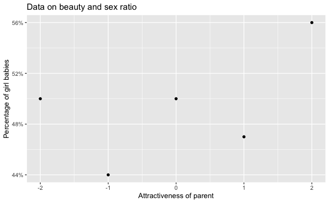
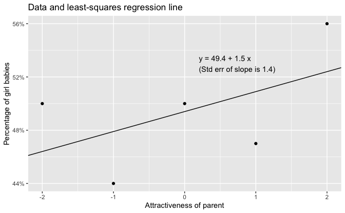
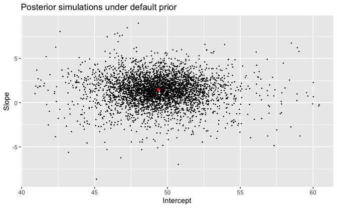
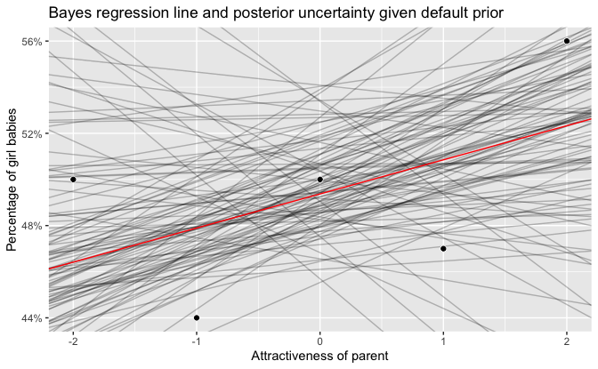
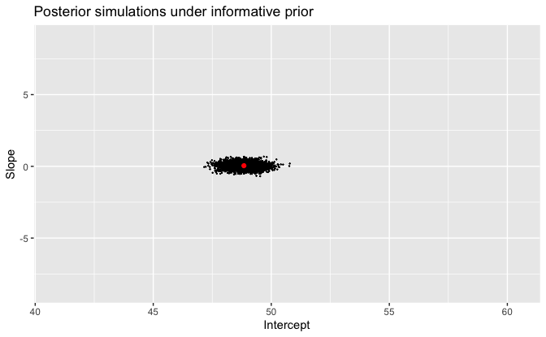
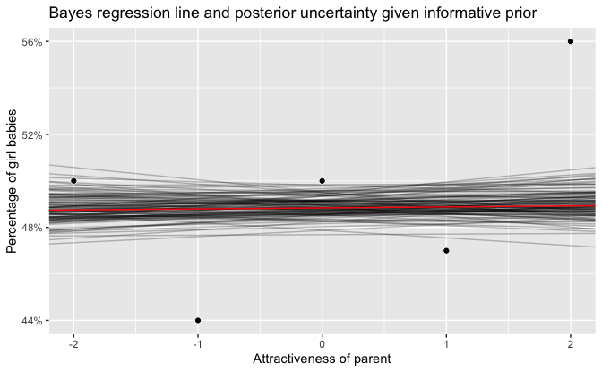

Regression and Other Stories: Beauty and sex ratio
================
Andrew Gelman, Jennifer Hill, Aki Vehtari
2021-04-20

-   [9 Prediction and Bayesian
    inference](#9-prediction-and-bayesian-inference)
    -   [9.4 Example of Bayesian inference: beauty and sex
        ratio](#94-example-of-bayesian-inference-beauty-and-sex-ratio)
    -   [9.5 Uniform, weakly informative, and informative priors
        in](#95-uniform-weakly-informative-and-informative-priors-in)
        -   [Example where an informative prior makes a difference:
            Beauty and sex
            ratio](#example-where-an-informative-prior-makes-a-difference-beauty-and-sex-ratio)

Tidyverse version by Bill Behrman.

Example where an informative prior makes a difference. See Chapter 9 in
Regression and Other Stories.

------------------------------------------------------------------------

``` r
# Packages
library(tidyverse)
library(rstanarm)

# Parameters
  # Common code
file_common <- here::here("_common.R")

#===============================================================================

# Run common code
source(file_common)
```

# 9 Prediction and Bayesian inference

## 9.4 Example of Bayesian inference: beauty and sex ratio

## 9.5 Uniform, weakly informative, and informative priors in

### Example where an informative prior makes a difference: Beauty and sex ratio

Data

``` r
sex_ratio <- 
  tribble(
    ~x, ~y,
    -2, 50,
    -1, 44,
     0, 50,
     1, 47,
     2, 56
  )
```

Least-squares regression.

``` r
fit_lm <- lm(y ~ x, data = sex_ratio)

arm::display(fit_lm)
```

    #> lm(formula = y ~ x, data = sex_ratio)
    #>             coef.est coef.se
    #> (Intercept) 49.40     1.94  
    #> x            1.50     1.37  
    #> ---
    #> n = 5, k = 2
    #> residual sd = 4.35, R-Squared = 0.28

Data on beauty and sex ratio.

``` r
sex_ratio %>% 
  ggplot(aes(x, y)) +
  geom_point() +
  scale_y_continuous(labels = scales::label_percent(accuracy = 1, scale = 1)) +
  labs(
    title = "Data on beauty and sex ratio",
    x = "Attractiveness of parent",
    y = "Percentage of girl babies"
  )
```



Data and least-squares regression line.

``` r
intercept <- coef(fit_lm)[["(Intercept)"]]
slope <- coef(fit_lm)[["x"]]
slope.se <- arm::se.coef(fit_lm)[["x"]]

eqn <- 
  str_glue(
    "y = {format(intercept, digits = 1, nsmall = 1)} + ",
    "{format(slope, digits = 1, nsmall = 1)} x\n",
    "(Std err of slope is {format(slope.se, digits = 1, nsmall = 1)})"
  )

sex_ratio %>% 
  ggplot(aes(x, y)) +
  geom_point() +
  geom_abline(slope = slope, intercept = intercept) +
  annotate("text", x = 0.2, y = 53, label = eqn, hjust = 0) +
  scale_y_continuous(labels = scales::label_percent(accuracy = 1, scale = 1)) +
  labs(
    title = "Data and least-squares regression line",
    x = "Attractiveness of parent",
    y = "Percentage of girl babies"
  )
```



#### Bayes regression with weakly informative prior

Fit linear regression with default weakly informative prior.

``` r
set.seed(264)

fit_bayes_default <- stan_glm(y ~ x, data = sex_ratio, refresh = 0)

fit_bayes_default
```

    #> stan_glm
    #>  family:       gaussian [identity]
    #>  formula:      y ~ x
    #>  observations: 5
    #>  predictors:   2
    #> ------
    #>             Median MAD_SD
    #> (Intercept) 49.4    2.0  
    #> x            1.5    1.4  
    #> 
    #> Auxiliary parameter(s):
    #>       Median MAD_SD
    #> sigma 4.6    1.7   
    #> 
    #> ------
    #> * For help interpreting the printed output see ?print.stanreg
    #> * For info on the priors used see ?prior_summary.stanreg

Fit prior summary.

``` r
prior_summary(fit_bayes_default)
```

    #> Priors for model 'fit_bayes_default' 
    #> ------
    #> Intercept (after predictors centered)
    #>   Specified prior:
    #>     ~ normal(location = 49, scale = 2.5)
    #>   Adjusted prior:
    #>     ~ normal(location = 49, scale = 11)
    #> 
    #> Coefficients
    #>   Specified prior:
    #>     ~ normal(location = 0, scale = 2.5)
    #>   Adjusted prior:
    #>     ~ normal(location = 0, scale = 7)
    #> 
    #> Auxiliary (sigma)
    #>   Specified prior:
    #>     ~ exponential(rate = 1)
    #>   Adjusted prior:
    #>     ~ exponential(rate = 0.22)
    #> ------
    #> See help('prior_summary.stanreg') for more details

Posterior simulations under default prior.

``` r
sims_default <- as_tibble(fit_bayes_default)

coefs_default <- 
  tibble(
    `(Intercept)` = coef(fit_bayes_default)[["(Intercept)"]],
    x = coef(fit_bayes_default)[["x"]]
  )

sims_default %>% 
  ggplot(aes(`(Intercept)`, x)) +
  geom_point(size = 0.1) +
  geom_point(data = coefs_default, color = "red", size = 1.5) +
  labs(
    title = "Posterior simulations under default prior",
    x = "Intercept",
    y = "Slope"
  )
```



Bayes regression line and posterior uncertainty given default prior.

``` r
set.seed(264)

n_lines <- 100

sex_ratio %>% 
  ggplot(aes(x, y)) +
  geom_abline(
    aes(slope = x, intercept = `(Intercept)`),
    data = sims_default %>% slice_sample(n = n_lines),
    alpha = 0.25
  ) +
  geom_abline(
    aes(slope = x, intercept = `(Intercept)`),
    data = coefs_default,
    color = "red"
  ) +
  geom_point(color = "white", size = 2) +
  geom_point() +
  scale_y_continuous(labels = scales::label_percent(accuracy = 1, scale = 1)) +
  labs(
    title =
      "Bayes regression line and posterior uncertainty given default prior",
    x = "Attractiveness of parent",
    y = "Percentage of girl babies"
  )
```



#### Bayes regression with informative prior

Fit linear regression with informative prior.

``` r
set.seed(264)

fit_bayes_inform <- 
  stan_glm(
    y ~ x,
    data = sex_ratio,
    refresh = 0,
    prior = normal(location = 0, scale = 0.2),
    prior_intercept = normal(location = 48.8, scale = 0.5)
  )

fit_bayes_inform
```

    #> stan_glm
    #>  family:       gaussian [identity]
    #>  formula:      y ~ x
    #>  observations: 5
    #>  predictors:   2
    #> ------
    #>             Median MAD_SD
    #> (Intercept) 48.8    0.5  
    #> x            0.0    0.2  
    #> 
    #> Auxiliary parameter(s):
    #>       Median MAD_SD
    #> sigma 4.3    1.3   
    #> 
    #> ------
    #> * For help interpreting the printed output see ?print.stanreg
    #> * For info on the priors used see ?prior_summary.stanreg

Fit prior summary.

``` r
prior_summary(fit_bayes_inform)
```

    #> Priors for model 'fit_bayes_inform' 
    #> ------
    #> Intercept (after predictors centered)
    #>  ~ normal(location = 49, scale = 0.5)
    #> 
    #> Coefficients
    #>  ~ normal(location = 0, scale = 0.2)
    #> 
    #> Auxiliary (sigma)
    #>   Specified prior:
    #>     ~ exponential(rate = 1)
    #>   Adjusted prior:
    #>     ~ exponential(rate = 0.22)
    #> ------
    #> See help('prior_summary.stanreg') for more details

Posterior simulations under informative prior.

``` r
sims_inform <- as_tibble(fit_bayes_inform)

coefs_inform <- 
  tibble(
    `(Intercept)` = coef(fit_bayes_inform)[["(Intercept)"]],
    x = coef(fit_bayes_inform)[["x"]]
  )

sims_inform %>% 
  ggplot(aes(`(Intercept)`, x)) +
  geom_blank(data = sims_default) +
  geom_point(size = 0.1) +
  geom_point(data = coefs_inform, color = "red", size = 1.5) +
  labs(
    title = "Posterior simulations under informative prior",
    x = "Intercept",
    y = "Slope"
  )
```



Bayes regression line and posterior uncertainty given informative prior.

``` r
set.seed(264)

n_lines <- 100

sex_ratio %>% 
  ggplot(aes(x, y)) +
  geom_abline(
    aes(slope = x, intercept = `(Intercept)`),
    data = sims_inform %>% slice_sample(n = n_lines),
    alpha = 0.25
  ) +
  geom_abline(
    aes(slope = x, intercept = `(Intercept)`),
    data = coefs_inform,
    color = "red"
  ) +
  geom_point(color = "white", size = 2) +
  geom_point() +
  scale_y_continuous(labels = scales::label_percent(accuracy = 1, scale = 1)) +
  labs(
    title =
      "Bayes regression line and posterior uncertainty given informative prior",
    x = "Attractiveness of parent",
    y = "Percentage of girl babies"
  )
```


