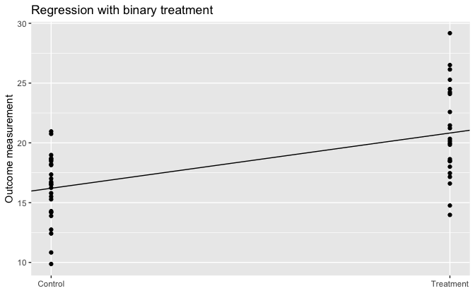
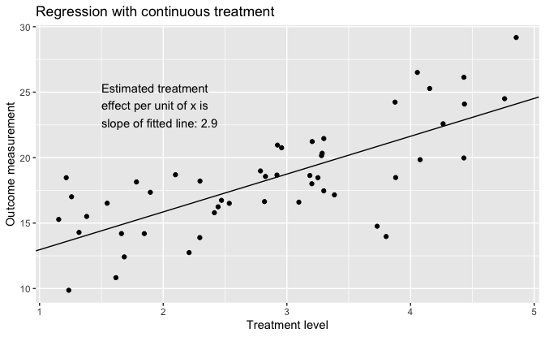
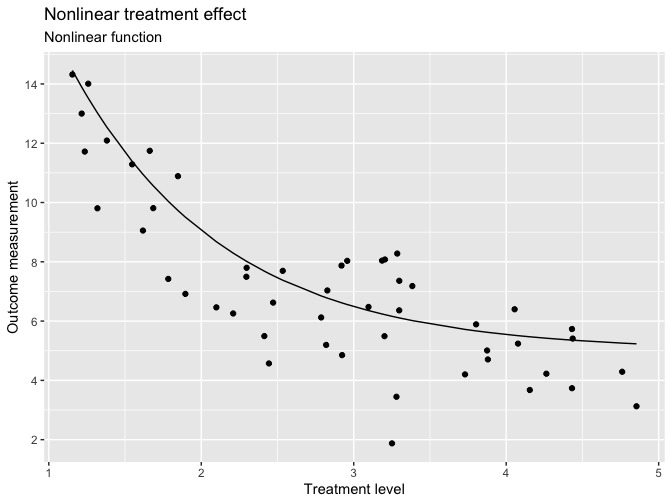
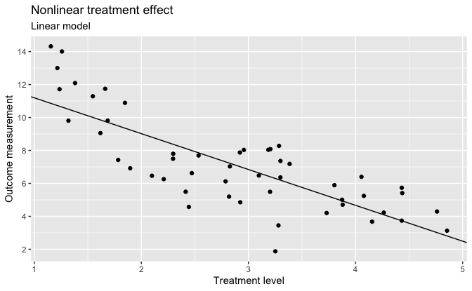
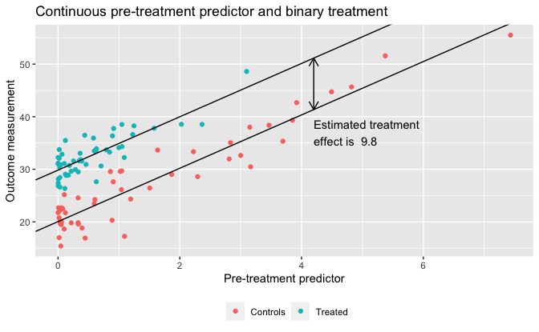

Regression and Other Stories: SimpleCausal
================
Andrew Gelman, Jennifer Hill, Aki Vehtari
2021-04-20

-   [1 Overview](#1-overview)
    -   [1.4 Challenges in building, understanding, and interpreting
        regressions](#14-challenges-in-building-understanding-and-interpreting-regressions)
        -   [Regression to estimate a relationship of
            interest](#regression-to-estimate-a-relationship-of-interest)
        -   [Regression to adjust for differences between treatment and
            control
            groups](#regression-to-adjust-for-differences-between-treatment-and-control-groups)

Tidyverse version by Bill Behrman.

Simple graphs illustrating regression for causal inference. See Chapter
1 in Regression and Other Stories.

The simulated data depends on the random seed, and thus the plots and
numbers here and in the book may differ. You can experiment with the
simulation variation by changing the seed.

------------------------------------------------------------------------

``` r
# Packages
library(tidyverse)

# Parameters
  # Seed for random numbers
SEED <- 1151
  # Common code
file_common <- here::here("_common.R")

#===============================================================================

# Run common code
source(file_common)
```

# 1 Overview

## 1.4 Challenges in building, understanding, and interpreting regressions

### Regression to estimate a relationship of interest

Simulate data from linear model.

``` r
set.seed(SEED)

n <- 50

df_1 <- 
  tibble(
    x = runif(n, min = 1, max = 5),
    x_binary = if_else(x < 3, 0, 1),
    y = rnorm(n, mean = 10 + 3 * x, sd = 3)
  )
```

Regression with binary predictor.

``` r
lm_1a <- lm(y ~ x_binary, data = df_1)

arm::display(lm_1a)
```

    #> lm(formula = y ~ x_binary, data = df_1)
    #>             coef.est coef.se
    #> (Intercept) 16.20     0.65  
    #> x_binary     4.63     0.95  
    #> ---
    #> n = 50, k = 2
    #> residual sd = 3.36, R-Squared = 0.33

Regression with binary treatment.

``` r
slope <- coef(lm_1a)[["x_binary"]]
intercept <- coef(lm_1a)[["(Intercept)"]]

df_1 %>% 
  ggplot(aes(x_binary, y)) +
  geom_point() +
  geom_abline(slope = slope, intercept = intercept) +
  scale_x_continuous(
    breaks = 0:1,
    minor_breaks = NULL,
    labels = c("Control", "Treatment")
  ) +
  labs(
    title = "Regression with binary treatment",
    x = NULL,
    y = "Outcome measurement"
  )
```



Regression with continuous predictor.

``` r
lm_1b <- lm(y ~ x, data = df_1)

arm::display(lm_1b)
```

    #> lm(formula = y ~ x, data = df_1)
    #>             coef.est coef.se
    #> (Intercept) 10.08     1.13  
    #> x            2.89     0.37  
    #> ---
    #> n = 50, k = 2
    #> residual sd = 2.73, R-Squared = 0.56

Regression with continuous treatment.

``` r
slope <- coef(lm_1b)[["x"]]
intercept <- coef(lm_1b)[["(Intercept)"]]

label = 
  str_glue(
    "Estimated treatment\n",
    "effect per unit of x is\n",
    "slope of fitted line: {format(coef(lm_1b)[['x']], digits = 1, nsmall = 1)}"
  )

df_1 %>% 
  ggplot(aes(x, y)) +
  geom_point() +
  geom_abline(slope = slope, intercept = intercept) +
  annotate("text", x = 1.5, y = 24, label = label, hjust = 0) +
  labs(
    title = "Regression with continuous treatment",
    x = "Treatment level",
    y = "Outcome measurement"
  )
```



Simulate data from nonlinear model.

``` r
set.seed(SEED)

n <- 50

df_2 <- 
  tibble(
    x = df_1$x,
    y_mean = 5 + 30 * exp(-x),
    y = rnorm(n, mean = y_mean, sd = 2)
  )
```

Regression with continuous predictor.

``` r
lm_2 <- lm(y ~ x, data = df_2)

arm::display(lm_2)
```

    #> lm(formula = y ~ x, data = df_2)
    #>             coef.est coef.se
    #> (Intercept) 13.37     0.74  
    #> x           -2.18     0.24  
    #> ---
    #> n = 50, k = 2
    #> residual sd = 1.78, R-Squared = 0.63

Nonlinear treatment effect: Nonlinear function.

``` r
df_2 %>% 
  ggplot(aes(x)) +
  geom_point(aes(y = y)) +
  geom_line(aes(y = y_mean)) +
  scale_y_continuous(breaks = scales::breaks_width(2)) +
  labs(
    title = "Nonlinear treatment effect",
    subtitle = "Nonlinear function",
    x = "Treatment level",
    y = "Outcome measurement"
  )
```



Nonlinear treatment effect: Linear model.

``` r
slope <- coef(lm_2)[["x"]]
intercept <- coef(lm_2)[["(Intercept)"]]

df_2 %>% 
  ggplot(aes(x)) +
  geom_point(aes(y = y)) +
  geom_abline(slope = slope, intercept = intercept) +
  scale_y_continuous(breaks = scales::breaks_width(2)) +
  labs(
    title = "Nonlinear treatment effect",
    subtitle = "Linear model",
    x = "Treatment level",
    y = "Outcome measurement"
  )
```



### Regression to adjust for differences between treatment and control groups

Simulate data from two groups.

``` r
set.seed(SEED)

n <- 100

not_used <- rnorm(n)  # To match example in book

df_3 <- 
  tibble(
    x_2 = rep(0:1, n / 2),
    x_1 = 
      if_else(
        x_2 == 0,
        rnorm(n, mean = 0, sd = 1.2)^2,
        rnorm(n, mean = 0, sd = 0.8)^2
      ),
    y = rnorm(n, mean = 20 + 5 * x_1 + 10 * x_2, sd = 3)
  )
```

Regression with two groups.

``` r
lm_3 <- lm(y ~ x_1 + x_2, data = df_3)

arm::display(lm_3)
```

    #> lm(formula = y ~ x_1 + x_2, data = df_3)
    #>             coef.est coef.se
    #> (Intercept) 20.05     0.49  
    #> x_1          5.07     0.21  
    #> x_2          9.79     0.58  
    #> ---
    #> n = 100, k = 3
    #> residual sd = 2.71, R-Squared = 0.87

Continuous pre-treatment predictor and binary treatment.

``` r
slope <- coef(lm_3)[["x_1"]]
intercept_0 <- coef(lm_3)[["(Intercept)"]]
intercept_1 <- coef(lm_3)[["(Intercept)"]] + coef(lm_3)[["x_2"]]

lines <- 
  tribble(
    ~slope,  ~intercept,
     slope, intercept_0,
     slope, intercept_1
  )

label <- 
  str_glue(
    "Estimated treatment\n",
    "effect is {format(coef(lm_3)[['x_2']], digits = 1, nsmall = 1)}"
  )

ggplot() +
  geom_point(aes(x_1, y, color = as.factor(x_2)), data = df_3) +
  geom_abline(aes(slope = slope, intercept = intercept), data = lines) +
  annotate(
    "segment",
    x = 4.2,
    xend = 4.2,
    y = intercept_0 + slope * 4.2,
    yend = intercept_1 + slope * 4.2,
    arrow = arrow(length = unit(0.04, units = "npc"), ends = "both")
  ) +
  annotate("text", x = 4.2, y = 37, label = label, hjust = 0) +
  scale_color_discrete(breaks = 0:1, labels = c("Controls", "Treated")) +
  theme(legend.position = "bottom") +
  labs(
    title = "Continuous pre-treatment predictor and binary treatment",
    x = "Pre-treatment predictor",
    y = "Outcome measurement",
    color = NULL
  )
```


