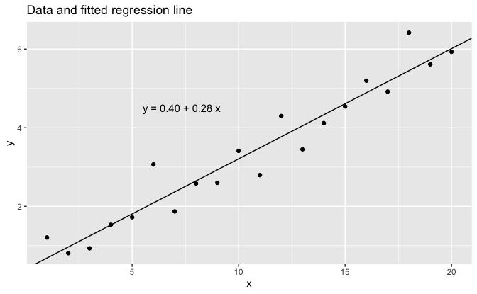

Regression and Other Stories: Simple regression
================
Andrew Gelman, Jennifer Hill, Aki Vehtari
2021-04-20

-   [6 Background on regression
    modeling](#6-background-on-regression-modeling)
    -   [6.2 Fitting a simple regression to fake
        data](#62-fitting-a-simple-regression-to-fake-data)
        -   [Fitting a regression and displaying the
            results](#fitting-a-regression-and-displaying-the-results)
-   [7 Linear regression with a single
    predictor](#7-linear-regression-with-a-single-predictor)
    -   [7.3 Formulating comparisons as regression
        models](#73-formulating-comparisons-as-regression-models)
        -   [Estimating the mean is the same as regressing on a constant
            term](#estimating-the-mean-is-the-same-as-regressing-on-a-constant-term)
        -   [Estimating a difference is the same as regressing on an
            indicator
            variable](#estimating-a-difference-is-the-same-as-regressing-on-an-indicator-variable)

Tidyverse version by Bill Behrman.

Linear regression with a single predictor. See Chapters 6 and 7 in
Regression and Other Stories.

------------------------------------------------------------------------

``` r
# Packages
library(tidyverse)
library(rstanarm)

# Parameters
  # Seed
SEED <- 2141
  # Common code
file_common <- here::here("_common.R")

#===============================================================================

# Run common code
source(file_common)
```

# 6 Background on regression modeling

## 6.2 Fitting a simple regression to fake data

Data

``` r
set.seed(SEED)

a <- 0.2
b <- 0.3
sigma <- 0.5

data_1 <- 
  tibble(
    x = 1:20,
    y = a + b * x + rnorm(length(x), mean = 0, sd = sigma)
  )
```

### Fitting a regression and displaying the results

Fit linear regression.

The option `refresh = 0` suppresses the default Stan sampling progress
output. This is useful for small data with fast computation. For more
complex models and bigger data, it can be useful to see the progress.

``` r
fit_1 <- stan_glm(y ~ x, data = data_1, refresh = 0, seed = SEED)

print(fit_1, digits = 2)
```

    #> stan_glm
    #>  family:       gaussian [identity]
    #>  formula:      y ~ x
    #>  observations: 20
    #>  predictors:   2
    #> ------
    #>             Median MAD_SD
    #> (Intercept) 0.40   0.23  
    #> x           0.28   0.02  
    #> 
    #> Auxiliary parameter(s):
    #>       Median MAD_SD
    #> sigma 0.49   0.08  
    #> 
    #> ------
    #> * For help interpreting the printed output see ?print.stanreg
    #> * For info on the priors used see ?prior_summary.stanreg

Data and fitted regression line.

``` r
intercept <- coef(fit_1)[["(Intercept)"]]
slope <- coef(fit_1)[["x"]]

eqn <- 
  str_glue(
    "y = {format(intercept, digits = 2, nsmall = 2)} + ",
    "{format(slope, digits = 2, nsmall = 2)} x"
  )

data_1 %>% 
  ggplot(aes(x, y)) +
  geom_abline(slope = slope, intercept = intercept) +
  geom_point() +
  annotate("text", x = 5.5, y = 4.5, label = eqn, hjust = 0) +
  labs(title = "Data and fitted regression line")
```



# 7 Linear regression with a single predictor

## 7.3 Formulating comparisons as regression models

### Estimating the mean is the same as regressing on a constant term

Simulated data.

``` r
set.seed(SEED)

n_0 <- 200
y_0 <- rnorm(n_0, mean = 2, sd = 5)
```

We can directly calculate the mean of the population and the standard
error:

``` r
y_0_mean <- mean(y_0)
y_0_mean
```

    #> [1] 2.43

``` r
y_0_mean_se <- sd(y_0) / sqrt(n_0)
y_0_mean_se
```

    #> [1] 0.36

We get the identical result using least squares regression on a constant
term:

``` r
data_2 <- tibble(y = y_0)

fit_2 <- 
  stan_glm(
    y ~ 1,
    data = data_2,
    refresh = 0,
    seed = SEED,
    prior = NULL,
    prior_intercept = NULL,
    prior_aux = NULL
  )

print(fit_2, digits = 2)
```

    #> stan_glm
    #>  family:       gaussian [identity]
    #>  formula:      y ~ 1
    #>  observations: 200
    #>  predictors:   1
    #> ------
    #>             Median MAD_SD
    #> (Intercept) 2.43   0.37  
    #> 
    #> Auxiliary parameter(s):
    #>       Median MAD_SD
    #> sigma 5.12   0.27  
    #> 
    #> ------
    #> * For help interpreting the printed output see ?print.stanreg
    #> * For info on the priors used see ?prior_summary.stanreg

### Estimating a difference is the same as regressing on an indicator variable

Simulated data.

``` r
set.seed(SEED)

n_1 <- 300
y_1 <- rnorm(n_1, mean = 8, sd = 5)
```

We can directly compare the averages in each group and compute the
corresponding standard error:

``` r
y_1_mean <- mean(y_1)
y_1_mean_se <- sd(y_1) / sqrt(n_1)

diff <- y_1_mean - y_0_mean
diff
```

    #> [1] 6.08

``` r
diff_se <- sqrt(y_0_mean_se^2 + y_1_mean_se^2)
diff_se
```

    #> [1] 0.46

Alternately, we can frame the problem as a regression by combining the
data into a single dataset, with an *indicator variable* `x` to indicate
the two groups:

``` r
data_3 <- 
  bind_rows(
    tibble(x = 0, y = y_0),
    tibble(x = 1, y = y_1)
  )

fit_3 <- 
  stan_glm(
    y ~ x,
    data = data_3,
    refresh = 0,
    seed = SEED,
    prior = NULL,
    prior_intercept = NULL,
    prior_aux = NULL
  )

print(fit_3, digits = 2)
```

    #> stan_glm
    #>  family:       gaussian [identity]
    #>  formula:      y ~ x
    #>  observations: 500
    #>  predictors:   2
    #> ------
    #>             Median MAD_SD
    #> (Intercept) 2.43   0.37  
    #> x           6.09   0.48  
    #> 
    #> Auxiliary parameter(s):
    #>       Median MAD_SD
    #> sigma 5.03   0.15  
    #> 
    #> ------
    #> * For help interpreting the printed output see ?print.stanreg
    #> * For info on the priors used see ?prior_summary.stanreg

Regression on an indicator is the same as computing a difference in
means.

``` r
label_y_0_mean <- 
  str_glue("bar(y)[0] == {format(y_0_mean, digits = 2, nsmall = 2)}")
label_y_1_mean <- 
  str_glue("bar(y)[1] == {format(y_1_mean, digits = 2, nsmall = 2)}")

intercept <- coef(fit_3)[["(Intercept)"]]
slope <- coef(fit_3)[["x"]]

eqn <- 
  str_glue(
    "y = {format(intercept, digits = 2, nsmall = 2)} + ",
    "{format(slope, digits = 2, nsmall = 2)} x"
  )

offset <- 1.5

data_3 %>% 
  ggplot(aes(x, y)) +
  geom_hline(yintercept = c(y_0_mean, y_1_mean), color = "grey60") +
  geom_abline(slope = slope, intercept = intercept) +
  geom_point(alpha = 0.25) +
  annotate(
    "text",
    x = c(0.04, 0.96),
    y = c(y_0_mean - offset, y_1_mean + offset),
    hjust = c(0, 1),
    label = c(label_y_0_mean, label_y_1_mean),
    parse = TRUE
  ) +
  annotate(
    "text",
    x = 0.5,
    y = intercept + slope * 0.5 - offset,
    hjust = 0,
    label = eqn
  ) +
  scale_x_continuous(breaks = 0:1, minor_breaks = NULL) +
  labs(
    title =
      "Regression on an indicator is the same as computing a difference in means",
    x = "x (Indicator)"
  )
```


