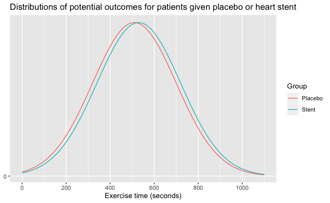

Regression and Other Stories: Stents
================
Andrew Gelman, Jennifer Hill, Aki Vehtari
2021-04-20

-   [3 Some basic methods in mathematics and
    probability](#3-some-basic-methods-in-mathematics-and-probability)
    -   [3.5 Probability distributions](#35-probability-distributions)
        -   [Comparing distributions](#comparing-distributions)

Tidyverse version by Bill Behrman.

Stents - comparing distributions. See Chapter 3 in Regression and Other
Stories.

------------------------------------------------------------------------

``` r
# Packages
library(tidyverse)

# Parameters
  # Common code
file_common <- here::here("_common.R")

#===============================================================================

# Run common code
source(file_common)
```

# 3 Some basic methods in mathematics and probability

## 3.5 Probability distributions

### Comparing distributions

Data

``` r
# Mean times for each group
time_placebo <- 510
time_stent <- 530

# Standard deviations for each group
sd_placebo <- 190
sd_stent <- 190
```

``` r
v <- pnorm(time_stent, mean = time_placebo, sd = sd_placebo)

v
```

    #> [1] 0.542

The mean time for the treatment group would have been in the 54th
percentile for the control group.

Distributions of potential outcomes for patients given placebo or heart
stent.

``` r
x <- 
  seq(
    max(
      0,
      min(time_placebo - 3 * sd_placebo, time_stent - 3 * sd_stent)
    ),
    max(time_placebo + 3 * sd_placebo, time_stent + 3 * sd_stent),
    length.out = 201
  )

v <- 
  tribble(
    ~group,    ~data,
    "Placebo", tibble(x, y = dnorm(x, mean = time_placebo, sd = sd_placebo)),
    "Stent",   tibble(x, y = dnorm(x, mean = time_stent, sd = sd_stent))
  ) %>% 
  unnest(data)

v %>% 
  ggplot(aes(x, y, color = group)) +
  geom_line() +
  scale_x_continuous(breaks = scales::breaks_width(200)) +
  scale_y_continuous(breaks = 0) +
  labs(
    title =
      "Distributions of potential outcomes for patients given placebo or heart stent",
    x = "Exercise time (seconds)",
    y = NULL,
    color = "Group"
  )
```


