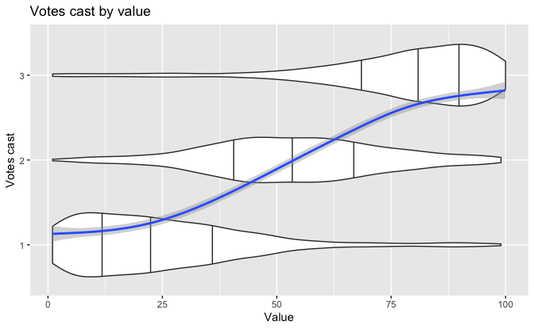
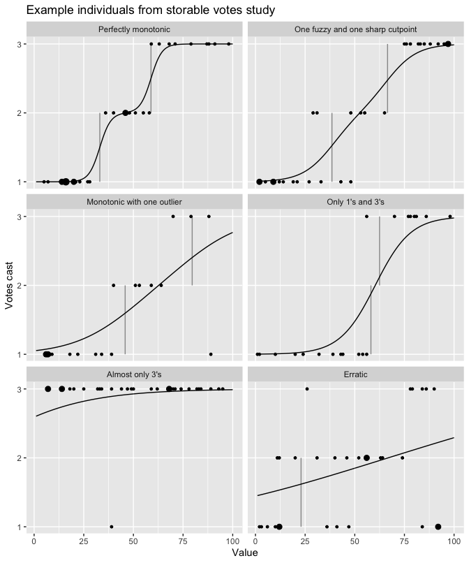

Regression and Other Stories: Storable
================
Andrew Gelman, Jennifer Hill, Aki Vehtari
2021-04-20

-   [15 Other generalized linear
    models](#15-other-generalized-linear-models)
    -   [15.5 Ordered and unordered categorical
        regression](#155-ordered-and-unordered-categorical-regression)
        -   [Example of ordered categorical
            regression](#example-of-ordered-categorical-regression)

Tidyverse version by Bill Behrman.

Ordered categorical data analysis with a study from experimental
economics, on the topic of “storable votes”. See Chapter 15 in
Regression and Other Stories.

------------------------------------------------------------------------

``` r
# Packages
library(tidyverse)
library(rstanarm)

# Parameters
  # Data directory
dir_data <- here::here("Storable/data")
  # People to model
people <- 
  tribble(
    ~person, ~behavior,
        101, "Perfectly monotonic",
        303, "One fuzzy and one sharp cutpoint",
        409, "Monotonic with one outlier",
        405, "Only 1's and 3's",
        504, "Almost only 3's",
        112, "Erratic"
  )
  # Common code
file_common <- here::here("_common.R")

#===============================================================================

# Run common code
source(file_common)
```

# 15 Other generalized linear models

## 15.5 Ordered and unordered categorical regression

### Example of ordered categorical regression

Data

``` r
data <- 
  dir_data %>% 
  fs::dir_ls(regexp = "/\\dplayergames.csv") %>% 
  map_dfr(read_csv) %>% 
  select(person, value, vote) %>% 
  mutate(vote_ord = ordered(vote))

summary(data)
```

    #>      person        value            vote      vote_ord
    #>  Min.   :101   Min.   :  1.0   Min.   :1.00   1:940   
    #>  1st Qu.:309   1st Qu.: 25.0   1st Qu.:1.00   2:810   
    #>  Median :514   Median : 49.0   Median :2.00   3:759   
    #>  Mean   :479   Mean   : 50.1   Mean   :1.93           
    #>  3rd Qu.:614   3rd Qu.: 76.0   3rd Qu.:3.00           
    #>  Max.   :716   Max.   :100.0   Max.   :3.00

EDA

``` r
data %>% 
  count(person, name = "n_rows") %>% 
  count(n_rows)
```

    #> # A tibble: 3 x 2
    #>   n_rows     n
    #> *  <int> <int>
    #> 1     20    10
    #> 2     29     1
    #> 3     30    76

There are 87 people in the data, 76 have 30 observations each, 1 has 29,
and 10 have 20.

Votes cast by value.

``` r
data %>% 
  ggplot(aes(value)) +
  stat_ydensity(
    aes(y = vote_ord),
    draw_quantiles = c(0.25, 0.5, 0.75),
    scale = "count"
  ) +
  geom_smooth(aes(y = vote)) +
  labs(
    title = "Votes cast by value",
    x = "Value",
    y = "Votes cast"
  )
```



Low values are associated with one vote, middle values are associated
with two votes, and high values are associated with three votes.

#### Fitting the model in R

Fit model for person 401.

``` r
set.seed(768)

fit_401 <- 
  stan_polr(
    vote_ord ~ value,
    data = data %>% filter(person == 401),
    refresh = 0,
    prior = R2(location = 0.3, what = "mean")
  )

print(fit_401, digits = 2)
```

    #> stan_polr
    #>  family:       ordered [logistic]
    #>  formula:      vote_ord ~ value
    #>  observations: 20
    #> ------
    #>       Median MAD_SD
    #> value 0.09   0.03  
    #> 
    #> Cutpoints:
    #>     Median MAD_SD
    #> 1|2 2.74   1.42  
    #> 2|3 5.86   2.23  
    #> 
    #> ------
    #> * For help interpreting the printed output see ?print.stanreg
    #> * For info on the priors used see ?prior_summary.stanreg

Fit model to people in `people`.

``` r
set.seed(768)

fit_people <- 
  data %>% 
  filter(person %in% people$person) %>% 
  nest(data = !person) %>% 
  mutate(
    fit =
      map(
        data,
        ~ stan_polr(
          vote_ord ~ value,
          data = .,
          refresh = 0,
          prior = R2(location = 0.3, what = "mean"),
          adapt_delta = 0.9999
        )
      )
  )
```

#### Display the fitted model

Calculate cutpoints and sigma for each person.

``` r
data_people <- 
  fit_people %>% 
  mutate(
    sims = map(fit, as_tibble),
    c_1.5 = map_dbl(sims, ~ median(.$`1|2` / .$value)),
    c_2.5 = map_dbl(sims, ~ median(.$`2|3` / .$value)),
    sigma = map_dbl(sims, ~ median(1 / .$value))
  ) %>% 
  select(!c(fit, sims)) %>% 
  mutate(person = factor(person, levels = people$person))
```

Calculate expected response curves.

``` r
expected <- function(x, c_1.5, c_2.5, sigma) {
  p_1.5 <- plogis((x - c_1.5) / sigma)
  p_2.5 <- plogis((x - c_2.5) / sigma)
  1 * (1 - p_1.5) + 2 * (p_1.5 - p_2.5) + 3 * p_2.5
}

curves <- 
  data_people %>% 
  select(!data) %>% 
  mutate(
    x = list(seq_range(range(data$value))),
    y = pmap(list(x, c_1.5, c_2.5, sigma), expected)
  ) %>% 
  select(person, x, y) %>% 
  unnest(cols = c(x, y))
```

Cutpoint segments.

``` r
segments <- 
  data_people %>% 
  select(person, c_1.5, c_2.5) %>% 
  pivot_longer(cols = !person, names_to = "cutpoint", values_to = "x") %>% 
  mutate(
    y = str_extract(cutpoint, pattern = "[12]") %>% as.double(),
    yend = y + 1
  ) %>% 
  filter(x >= 1, x <= 100)
```

Example individuals from storable votes study.

``` r
person_label <- function(x) {
  people %>% 
    filter(person == x) %>% 
    pull(behavior)
}

data_people %>% 
  unnest(data) %>% 
  ggplot() +
  geom_segment(
    aes(x = x, xend = x, y = y, yend = yend),
    data = segments,
    color = "grey60"
  ) +
  geom_line(aes(x, y), data = curves) +
  geom_count(aes(value, vote)) +
  facet_wrap(
    facets = vars(person),
    ncol = 2,
    labeller = labeller(person = person_label)
  ) +
  scale_y_continuous(breaks = 1:3, minor_breaks = NULL) +
  scale_size(range = c(1, 3), guide = "none") +
  labs(
    title = "Example individuals from storable votes study",
    x = "Value",
    y = "Votes cast"
  )
```


