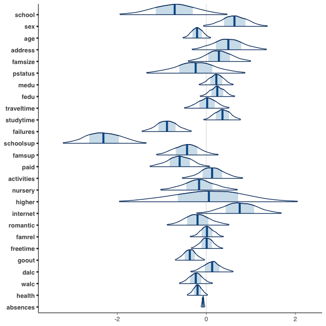
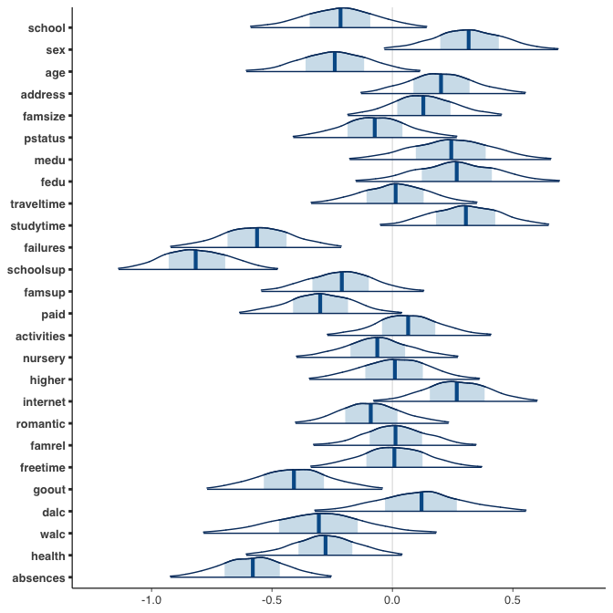
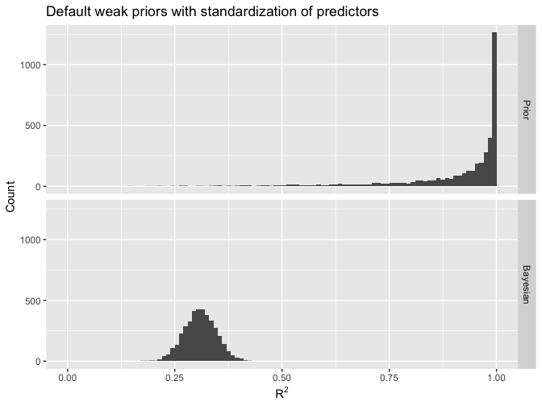
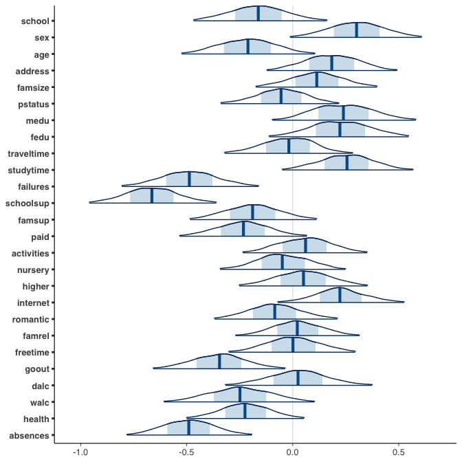
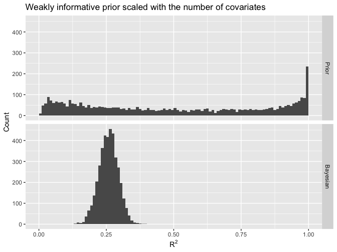
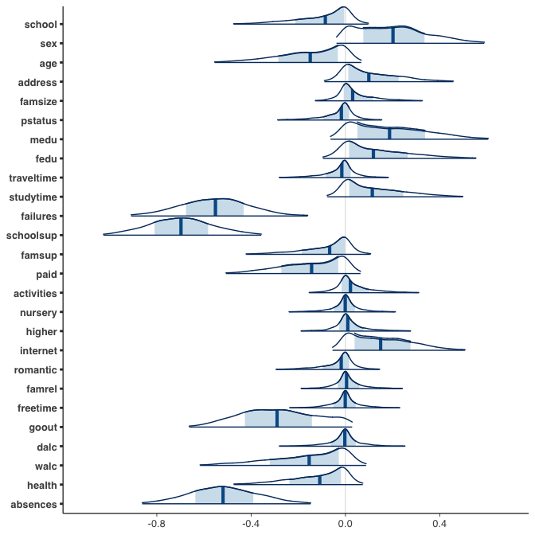
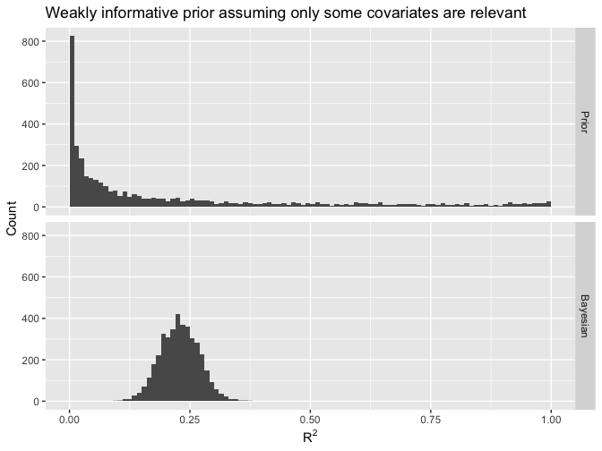
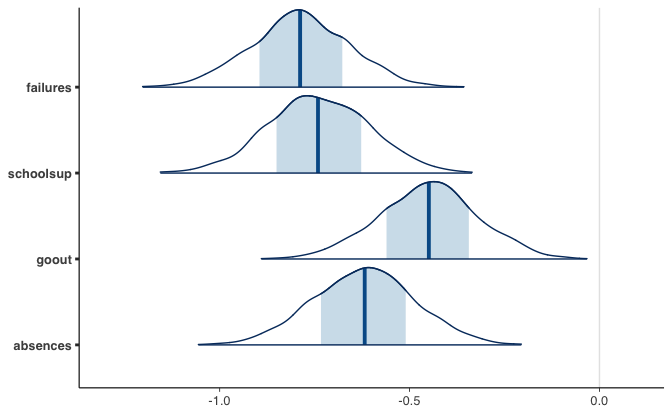

Regression and Other Stories: Student
================
Andrew Gelman, Jennifer Hill, Aki Vehtari
2021-04-20

-   [12 Transformations and
    regression](#12-transformations-and-regression)
    -   [12.7 Models for regression
        coefficients](#127-models-for-regression-coefficients)

Tidyverse version by Bill Behrman.

Models for regression coefficients. See Chapter 12 in Regression and
Other Stories.

------------------------------------------------------------------------

``` r
# Packages
library(tidyverse)
library(bayesplot)
library(rstanarm)

# Parameters
  # Seed
SEED <- 2132
  # Merged on Portuguese students
file_students <- here::here("Student/data/student-merged.csv")
  # Common code
file_common <- here::here("_common.R")

# Functions
  # LOO R^2
loo_r2 <- function(fit, digits = 2) {
  round(median(loo_R2(fit)), digits = digits)
}
  # Bayesian R^2
bayes_r2 <- function(fit, digits = 2) {
  round(median(bayes_R2(fit)), digits = digits)
}
  # Plot posterior marginals of coefficients using bayesplot
plot_coef <- function(fit, prob_outer = 1, xlim = NULL) {
  mcmc_areas(
    as.matrix(fit),
    pars = vars(!c(`(Intercept)`, sigma)),
    area_method = "scaled height",
    prob_outer = prob_outer
  ) +
    coord_cartesian(xlim = xlim) +
    scale_y_discrete(limits = rev, expand = expansion(add = c(0.5, 0))) +
    theme(text = element_text(family = "sans"))
}
  # Plot implied prior and Bayesian R^2 distributions
plot_r2 <- function(.data) {
  .data %>% 
    pivot_longer(cols = everything()) %>% 
    ggplot(aes(value)) +
    geom_histogram(binwidth = 0.01, boundary = 0) +
    coord_cartesian(xlim = 0:1) +
    facet_grid(rows = vars(name), as.table = FALSE) +
    labs(
      x = expression(R^2),
      y = "Count"
    )
}

#===============================================================================

# Run common code
source(file_common)
```

# 12 Transformations and regression

## 12.7 Models for regression coefficients

Here we consider regression with more than handful of predictors. We
demonstrate the usefulness of standardization of predictors and models
for regression coefficients.

#### Data

``` r
students <- 
  file_students %>% 
  read_csv() %>% 
  rename_with(str_to_lower) %>% 
  select(!c(g1mat, g2mat, g1por, g2por, g3por)) %>% 
  filter(g3mat > 0)

glimpse(students)
```

    #> Rows: 343
    #> Columns: 27
    #> $ g3mat      <dbl> 10, 5, 13, 8, 10, 11, 8, 16, 11, 15, 10, 11, 11, 15, 12, 8,…
    #> $ school     <dbl> 0, 0, 0, 0, 0, 0, 0, 0, 0, 0, 0, 0, 0, 0, 0, 0, 0, 0, 0, 0,…
    #> $ sex        <dbl> 0, 0, 0, 0, 0, 0, 0, 0, 0, 0, 0, 0, 0, 0, 0, 0, 0, 0, 0, 0,…
    #> $ age        <dbl> 15, 15, 15, 15, 15, 15, 15, 15, 15, 15, 15, 15, 15, 15, 15,…
    #> $ address    <dbl> 0, 0, 0, 0, 0, 0, 0, 0, 1, 1, 1, 1, 1, 1, 1, 1, 1, 1, 1, 1,…
    #> $ famsize    <dbl> 0, 0, 0, 0, 0, 0, 1, 1, 0, 0, 0, 0, 0, 0, 0, 0, 0, 0, 0, 0,…
    #> $ pstatus    <dbl> 1, 1, 1, 1, 1, 1, 1, 1, 0, 0, 1, 1, 1, 1, 1, 1, 1, 1, 1, 1,…
    #> $ medu       <dbl> 1, 1, 2, 2, 3, 3, 2, 3, 3, 4, 1, 1, 1, 1, 2, 2, 2, 3, 4, 4,…
    #> $ fedu       <dbl> 1, 1, 2, 4, 3, 4, 2, 1, 3, 3, 1, 1, 2, 2, 1, 2, 3, 2, 2, 2,…
    #> $ traveltime <dbl> 2, 1, 1, 1, 2, 1, 2, 2, 1, 1, 1, 1, 1, 1, 3, 1, 2, 2, 1, 1,…
    #> $ studytime  <dbl> 4, 2, 1, 3, 3, 3, 2, 4, 4, 2, 2, 2, 2, 2, 3, 4, 1, 2, 3, 3,…
    #> $ failures   <dbl> 1, 2, 0, 0, 2, 0, 0, 0, 0, 0, 0, 0, 0, 0, 0, 0, 0, 0, 0, 0,…
    #> $ schoolsup  <dbl> 1, 1, 1, 1, 0, 1, 1, 0, 1, 0, 0, 0, 0, 0, 0, 1, 0, 1, 0, 0,…
    #> $ famsup     <dbl> 1, 1, 1, 1, 1, 1, 1, 1, 0, 1, 1, 1, 1, 0, 1, 1, 1, 1, 1, 1,…
    #> $ paid       <dbl> 1, 0, 1, 1, 1, 1, 1, 0, 0, 1, 0, 1, 1, 0, 0, 1, 0, 1, 1, 0,…
    #> $ activities <dbl> 1, 0, 1, 1, 1, 1, 0, 0, 0, 1, 1, 0, 0, 0, 1, 0, 1, 0, 1, 1,…
    #> $ nursery    <dbl> 1, 0, 1, 1, 1, 1, 1, 0, 1, 1, 0, 1, 0, 0, 1, 1, 1, 1, 1, 1,…
    #> $ higher     <dbl> 1, 1, 1, 1, 1, 1, 1, 1, 1, 1, 1, 1, 1, 1, 1, 1, 1, 1, 1, 1,…
    #> $ internet   <dbl> 1, 1, 0, 1, 1, 1, 1, 1, 0, 1, 1, 1, 1, 1, 1, 1, 0, 1, 1, 1,…
    #> $ romantic   <dbl> 0, 1, 0, 0, 1, 0, 0, 0, 0, 0, 0, 0, 0, 0, 0, 0, 0, 0, 1, 0,…
    #> $ famrel     <dbl> 3, 3, 4, 4, 4, 4, 4, 4, 4, 4, 4, 4, 4, 3, 5, 5, 3, 4, 3, 5,…
    #> $ freetime   <dbl> 1, 3, 3, 3, 2, 3, 1, 4, 3, 3, 3, 4, 3, 2, 2, 1, 5, 3, 2, 3,…
    #> $ goout      <dbl> 2, 4, 1, 2, 1, 2, 3, 2, 3, 2, 2, 2, 2, 3, 2, 2, 1, 5, 2, 3,…
    #> $ dalc       <dbl> 1, 2, 1, 1, 2, 1, 1, 2, 1, 1, 2, 1, 1, 1, 1, 1, 1, 1, 1, 1,…
    #> $ walc       <dbl> 1, 4, 1, 1, 3, 1, 3, 3, 1, 1, 3, 2, 1, 2, 1, 1, 1, 1, 1, 3,…
    #> $ health     <dbl> 1, 5, 2, 5, 3, 5, 4, 3, 4, 1, 4, 5, 5, 1, 4, 3, 5, 2, 5, 1,…
    #> $ absences   <dbl> 2, 2, 8, 2, 8, 2, 2, 12, 10, 0, 2, 0, 2, 2, 4, 8, 0, 26, 2,…

We demonstrate with data from Portuguese students and their final period
math grade. We predict the third period math grade, `g3mat`, with these
variables:

-   `school`: Student’s school
-   `sex`: Student’s sex
-   `age`: Student’s age
-   `address`: Student’s home address type
-   `famsize`: Family size
-   `pstatus`: Parent’s cohabitation status
-   `medu`: Mother’s education
-   `fedu`: Father’s education
-   `traveltime`: Home to school travel time
-   `studytime`: Weekly study time
-   `failures`: Number of past class failures
-   `schoolsup`: Extra educational support
-   `famsup`: Family educational support
-   `paid`: Extra paid classes within the course subject
-   `activities`: Extra-curricular activities
-   `nursery`: Attended nursery school
-   `higher`: Wants to take higher education
-   `internet`: Internet access at home
-   `romantic`: With a romantic relationship
-   `famrel`: Quality of family relationships
-   `freetime`: Free time after school
-   `goout`: Going out with friends
-   `dalc`: Workday alcohol consumption
-   `walc`: Weekend alcohol consumption
-   `health`: Current health status
-   `absences`: Number of school absences

#### Default weak priors without standardization of predictors

Fit a regression model to original data with default weak priors.

In the formula below, the dot `.` represents all columns other than what
is already on the left of `~`.

``` r
fit_0 <- stan_glm(g3mat ~ ., data = students, refresh = 0, seed = SEED)
```

Plot posterior marginals of coefficients using bayesplot.

``` r
plot_coef(fit_0, prob_outer = 0.95)
```



The above figure shows that without standardization of predictors, it
looks like there is a different amount of uncertainty on the relevance
of the predictors. For example, it looks like `absences` has really
small relevance and high certainty.

#### Default weak priors with standardization of predictors

Standardize all predictors for easier comparison of relevances as
discussed in Section 12.1.

``` r
students_std <- 
  students %>% 
  mutate(across(!g3mat, scale))
```

Fit a regression model to standardized data with default weak priors.

``` r
fit_1 <- stan_glm(g3mat ~ ., data = students_std, refresh = 0, seed = SEED)
```

LOO log score

``` r
loo_1 <- loo(fit_1)

loo_1
```

    #> 
    #> Computed from 4000 by 343 log-likelihood matrix
    #> 
    #>          Estimate   SE
    #> elpd_loo   -864.7 12.6
    #> p_loo        26.5  2.0
    #> looic      1729.4 25.1
    #> ------
    #> Monte Carlo SE of elpd_loo is 0.1.
    #> 
    #> All Pareto k estimates are good (k < 0.5).
    #> See help('pareto-k-diagnostic') for details.

This model has 26 predictors, and the estimated effective number of
parameters, `p_loo`, is approximately 26, indicating that the model is
fitting to all predictors.

LOO *R*<sup>2</sup>

``` r
loo_r2(fit_1)
```

    #> [1] 0.16

Bayesian *R*<sup>2</sup>

``` r
bayes_r2(fit_1)
```

    #> [1] 0.31

The LOO *R*<sup>2</sup> is much lower than the Bayesian *R*<sup>2</sup>,
indicating overfitting.

Plot posterior marginals of coefficients using bayesplot.

``` r
plot_coef(fit_1, prob_outer = 0.95)
```



After all predictors have been standardized to have equal standard
deviation, the uncertainties on the relevances are similar. For example,
it is now easier to see that `absences` has relatively high relevance
compared to other predictors in the model.

If the predictors have been standardized to have standard deviation 1
and we give the regression coefficients independent normal priors with
mean 0 and standard deviation 2.5, this implies that the prior standard
deviation of the modeled predictive means is 2.5 \* sqrt(26) = 12.7. The
default prior for *σ* is an exponential distribution, scaled to have
mean equal to data standard deviation, which in this case is
approximately 3.3, which is much less than 12.7. We can simulate from
these prior distributions and examine what is the corresponding prior
distribution for explained variance *R*<sup>2</sup>.

Implied prior distribution for *R*<sup>2</sup>

``` r
set.seed(201)

n_sims <- length(bayes_R2(fit_1))

y_sd <- sd(students_std$g3mat)
vars <- 
  students_std %>% 
  select(!g3mat) %>% 
  as.matrix()
n_vars <- ncol(vars)

sigma <- rexp(n_sims, rate = 0.3)
r <- 
  rnorm(n_vars * n_sims, mean = 0, sd = 2.5) %>% 
  matrix(nrow = n_vars, ncol = n_sims)
mu_var <- apply(vars %*% r, 2, var)
prior_r2 <- mu_var / (mu_var + sigma^2)
```

Plot implied prior and Bayesian *R*<sup>2</sup> distributions.

``` r
tibble(Prior = prior_r2, Bayesian = bayes_R2(fit_1)) %>% 
  plot_r2() + 
  labs(title = "Default weak priors with standardization of predictors")
```



The above figure shows that with the default prior on regression
coefficients and *σ*, the implied prior distribution for *R*<sup>2</sup>
is strongly favoring larger values and thus is favoring overfitted
models. The priors often considered as weakly informative for regression
coefficients turn out to be in multiple predictor case highly
informative for the explained variance.

#### Weakly informative prior scaled with the number of covariates

Fit regression model.

``` r
fit_2 <- 
  stan_glm(
    g3mat ~ .,
    data = students_std,
    refresh = 0,
    seed = SEED,
    prior = normal(location = 0, scale = sqrt(0.3 / 26) * y_sd)
  )
```

LOO log score

``` r
loo_2 <- loo(fit_2)

loo_2
```

    #> 
    #> Computed from 4000 by 343 log-likelihood matrix
    #> 
    #>          Estimate   SE
    #> elpd_loo   -860.0 12.3
    #> p_loo        21.3  1.6
    #> looic      1720.1 24.7
    #> ------
    #> Monte Carlo SE of elpd_loo is 0.1.
    #> 
    #> All Pareto k estimates are good (k < 0.5).
    #> See help('pareto-k-diagnostic') for details.

Compare log scores.

``` r
loo_compare(loo_1, loo_2)
```

    #>       elpd_diff se_diff
    #> fit_2  0.0       0.0   
    #> fit_1 -4.7       1.8

Model 2 has a better log score than model 1.

LOO *R*<sup>2</sup>

``` r
loo_r2(fit_2)
```

    #> [1] 0.19

Bayesian *R*<sup>2</sup>

``` r
bayes_r2(fit_2)
```

    #> [1] 0.26

The LOO *R*<sup>2</sup> and the Bayesian *R*<sup>2</sup> for model 2 are
closer, indicating less overfitting than with model 1.

Plot posterior marginals of coefficients using bayesplot.

``` r
plot_coef(fit_2, prob_outer = 0.95)
```



The above figure shows the posterior distributions of coefficients,
which are slightly more concentrated than for the previous model.

Implied prior distribution for *R*<sup>2</sup>

``` r
set.seed(201)

sigma <- rexp(n_sims, rate = 1 / (sqrt(0.7) * y_sd))
r <- 
  rnorm(n_vars * n_sims, mean = 0, sd = sqrt(0.3 / 26) * y_sd) %>% 
  matrix(nrow = n_vars, ncol = n_sims)
mu_var <- apply(vars %*% r, 2, var)
prior_r2 <- mu_var / (mu_var + sigma^2)
```

Plot implied prior and Bayesian *R*<sup>2</sup> distributions.

``` r
tibble(Prior = prior_r2, Bayesian = bayes_R2(fit_2)) %>% 
  plot_r2() + 
  labs(title = "Weakly informative prior scaled with the number of covariates")
```



#### Weakly informative prior assuming only some covariates are relevant

We now assume that the expected number of relevant predictors is near
*p*<sub>0</sub> = 6 and the prior scale for the relevant predictors is
chosen as in the previous model but using *p*<sub>0</sub> for scaling.

Fit regression model with regularized horseshoe prior.

``` r
n_students <- nrow(students_std)

p_0 <- 6
global_scale <- (p_0 / (n_vars - p_0)) / sqrt(n_students)
slab_scale <- sqrt(0.3 / p_0) * y_sd

fit_3 <- 
  stan_glm(
    g3mat ~ .,
    data = students_std,
    refresh = 0,
    seed = SEED,
    prior = hs(global_scale = global_scale, slab_scale = slab_scale)
  )
```

LOO log score

``` r
loo_3 <- loo(fit_3)

loo_3
```

    #> 
    #> Computed from 4000 by 343 log-likelihood matrix
    #> 
    #>          Estimate   SE
    #> elpd_loo   -860.3 12.3
    #> p_loo        19.0  1.4
    #> looic      1720.6 24.6
    #> ------
    #> Monte Carlo SE of elpd_loo is 0.1.
    #> 
    #> All Pareto k estimates are good (k < 0.5).
    #> See help('pareto-k-diagnostic') for details.

Compare log scores.

``` r
loo_compare(loo_1, loo_3)
```

    #>       elpd_diff se_diff
    #> fit_3  0.0       0.0   
    #> fit_1 -4.4       3.0

``` r
loo_compare(loo_2, loo_3)
```

    #>       elpd_diff se_diff
    #> fit_2  0.0       0.0   
    #> fit_3 -0.3       1.7

When we compare models using LOO log score, model 3 is better than model
1, but there is no difference compared the model 2. It is common that
the data do not have strong information about how many predictors are
relevant and then different types of priors can produce similar
predictive accuracies.

LOO *R*<sup>2</sup>

``` r
loo_r2(fit_3)
```

    #> [1] 0.19

Bayesian *R*<sup>2</sup>

``` r
bayes_r2(fit_3)
```

    #> [1] 0.23

The LOO *R*<sup>2</sup> and the Bayesian *R*<sup>2</sup> for model 3 are
slightly closer than for model 2, indicating even less overfitting, but
the difference is small.

Plot posterior marginals of coefficients using bayesplot.

``` r
plot_coef(fit_3, prob_outer = 0.95)
```



The above figure shows that the regularized horseshoe prior has the
benefit of shrinking the posterior for many regression coefficients more
tightly towards 0, making it easier to see the most relevant predictors.
Failures, school support, going out, and the number of absences appear
to be the most relevant predictors.

Implied prior distribution for *R*<sup>2</sup>

``` r
set.seed(201)

r2 <- function() {
  sigma <- rexp(1, rate = 1 / (sqrt(0.7) * y_sd))
  global_scale <- (p_0 / (n_vars - p_0)) * sigma / sqrt(n_students)
  c <- slab_scale / sqrt(rgamma(1, shape = 0.5, rate = 0.5))
  tau <- rcauchy(1, scale = global_scale)
  lambda <- rcauchy(n_vars)
  lambda_tilde <- sqrt(c^2 * lambda^2 / (c^2 + tau^2 * lambda^2))
  beta <- tau * lambda_tilde * rnorm(n_vars)
  mu_var <- var(vars %*% beta)
  mu_var / (mu_var + sigma^2)
}
prior_r2 <- map_dbl(seq_len(n_sims), ~ r2())
```

Plot implied prior and Bayesian *R*<sup>2</sup> distributions.

``` r
tibble(Prior = prior_r2, Bayesian = bayes_R2(fit_3)) %>% 
  plot_r2() + 
  labs(
    title = 
      "Weakly informative prior assuming only some covariates are relevant"
  )
```



The above figure shows that the regularized horseshoe prior with
sensible parameters implies a more cautious prior on explained variance
*R*<sup>2</sup> than is implicitly assumed by the default wide prior.
The horseshoe prior favors simpler models, but is quite flat around most
*R*<sup>2</sup> values.

#### Subset of covariates

We can now test to see how good predictions we can get if we only use
failures, school support, going out, and the number of absences as the
predictors.

Fit a regression model with subset of covariates and default weak prior
on coefficients.

``` r
fit_4 <- 
  stan_glm(
    g3mat ~ failures + schoolsup + goout + absences,
    data = students_std,
    refresh = 0,
    seed = SEED
  )

fit_4
```

    #> stan_glm
    #>  family:       gaussian [identity]
    #>  formula:      g3mat ~ failures + schoolsup + goout + absences
    #>  observations: 343
    #>  predictors:   5
    #> ------
    #>             Median MAD_SD
    #> (Intercept) 11.6    0.2  
    #> failures    -0.8    0.2  
    #> schoolsup   -0.7    0.2  
    #> goout       -0.4    0.2  
    #> absences    -0.6    0.2  
    #> 
    #> Auxiliary parameter(s):
    #>       Median MAD_SD
    #> sigma 3.0    0.1   
    #> 
    #> ------
    #> * For help interpreting the printed output see ?print.stanreg
    #> * For info on the priors used see ?prior_summary.stanreg

LOO log score

``` r
loo_4 <- loo(fit_4)

loo_4
```

    #> 
    #> Computed from 4000 by 343 log-likelihood matrix
    #> 
    #>          Estimate   SE
    #> elpd_loo   -863.1 12.4
    #> p_loo         5.2  0.6
    #> looic      1726.2 24.9
    #> ------
    #> Monte Carlo SE of elpd_loo is 0.0.
    #> 
    #> All Pareto k estimates are good (k < 0.5).
    #> See help('pareto-k-diagnostic') for details.

Compare log scores.

``` r
loo_compare(loo_1, loo_4)
```

    #>       elpd_diff se_diff
    #> fit_4  0.0       0.0   
    #> fit_1 -1.6       6.3

``` r
loo_compare(loo_2, loo_4)
```

    #>       elpd_diff se_diff
    #> fit_2  0.0       0.0   
    #> fit_4 -3.1       5.6

``` r
loo_compare(loo_3, loo_4)
```

    #>       elpd_diff se_diff
    #> fit_3  0.0       0.0   
    #> fit_4 -2.8       4.2

The prediction performance can not be improved much by adding more
predictors. Note that by observing more students it might be possible to
learn regression coefficients for other predictors with sufficient small
uncertainty so that predictions for new students could be improved.

LOO *R*<sup>2</sup>

``` r
loo_r2(fit_4)
```

    #> [1] 0.17

Bayesian *R*<sup>2</sup>

``` r
bayes_r2(fit_4)
```

    #> [1] 0.2

When we compare Bayesian *R*<sup>2</sup> and LOO *R*<sup>2</sup>, we see
the difference is small and there is less overfit than when using all
predictors with wide prior. LOO *R*<sup>2</sup> is just slightly smaller
than for models with all predictors and better priors.

Plot posterior marginals of coefficients using bayesplot.

``` r
plot_coef(fit_4, prob_outer = 0.99, xlim = c(-1.3, 0.1))
```


