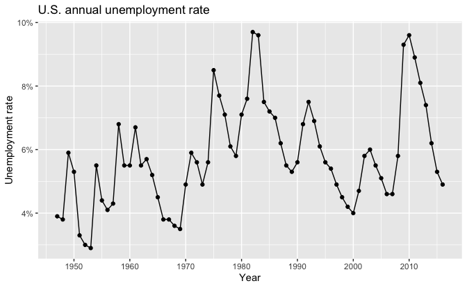
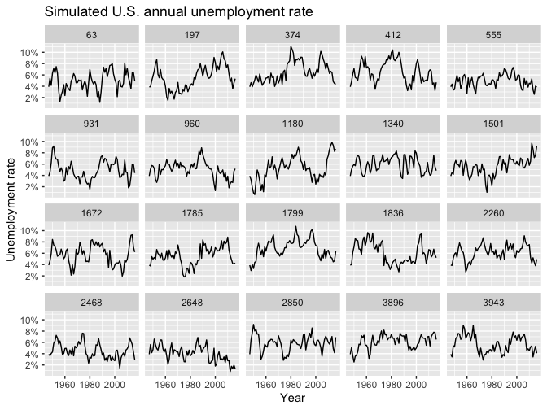
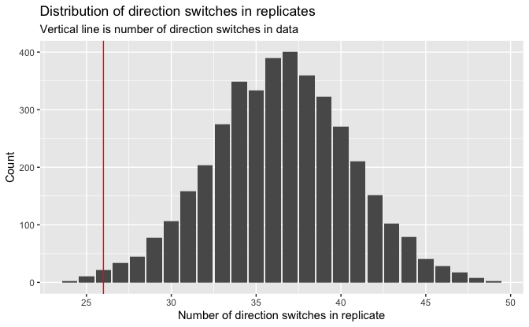
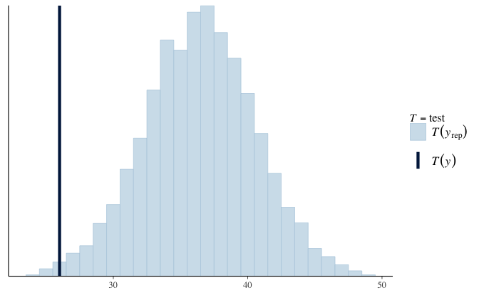

Regression and Other Stories: Unemployment
================
Andrew Gelman, Jennifer Hill, Aki Vehtari
2021-04-20

-   [11 Assumptions, diagnostics, and model
    evaluation](#11-assumptions-diagnostics-and-model-evaluation)
    -   [11.5 Example: predictive simulation to check the fit of a
        time-series
        model](#115-example-predictive-simulation-to-check-the-fit-of-a-time-series-model)
        -   [Fitting a first-order autoregression to the unemployment
            series](#fitting-a-first-order-autoregression-to-the-unemployment-series)
        -   [Simulating replicated
            datasets](#simulating-replicated-datasets)
        -   [Visual and numerical comparisons of replicated to actual
            data](#visual-and-numerical-comparisons-of-replicated-to-actual-data)

Tidyverse version by Bill Behrman.

Time series fit and posterior predictive model checking for unemployment
series. See Chapter 11 in Regression and Other Stories.

------------------------------------------------------------------------

``` r
# Packages
library(tidyverse)
library(bayesplot)
library(rstanarm)

# Parameters
  # U.S. unemployment data
file_unemployment <- here::here("Unemployment/data/unemp.txt")
  # Common code
file_common <- here::here("_common.R")

#===============================================================================

# Run common code
source(file_common)
```

# 11 Assumptions, diagnostics, and model evaluation

## 11.5 Example: predictive simulation to check the fit of a time-series model

Data

``` r
unemployment <- 
  file_unemployment %>% 
  read_table2() %>% 
  mutate(y_lag = lag(y))

unemployment
```

    #> # A tibble: 70 x 3
    #>     year     y y_lag
    #>    <dbl> <dbl> <dbl>
    #>  1  1947   3.9  NA  
    #>  2  1948   3.8   3.9
    #>  3  1949   5.9   3.8
    #>  4  1950   5.3   5.9
    #>  5  1951   3.3   5.3
    #>  6  1952   3     3.3
    #>  7  1953   2.9   3  
    #>  8  1954   5.5   2.9
    #>  9  1955   4.4   5.5
    #> 10  1956   4.1   4.4
    #> # … with 60 more rows

``` r
summary(unemployment)
```

    #>       year            y            y_lag     
    #>  Min.   :1947   Min.   :2.90   Min.   :2.90  
    #>  1st Qu.:1964   1st Qu.:4.62   1st Qu.:4.60  
    #>  Median :1982   Median :5.55   Median :5.60  
    #>  Mean   :1982   Mean   :5.78   Mean   :5.79  
    #>  3rd Qu.:1999   3rd Qu.:6.80   3rd Qu.:6.80  
    #>  Max.   :2016   Max.   :9.70   Max.   :9.70  
    #>                                NA's   :1

### Fitting a first-order autoregression to the unemployment series

U.S. annual unemployment rate.

``` r
unemployment %>% 
  ggplot(aes(year, y)) +
  geom_line() +
  geom_point() +
  scale_x_continuous(breaks = scales::breaks_width(10)) +
  scale_y_continuous(labels = scales::label_percent(accuracy = 1, scale = 1)) +
  labs(
    title = "U.S. annual unemployment rate",
    x = "Year",
    y = "Unemployment rate"
  )
```



Fit first-order autoregression to the unemployment series.

``` r
set.seed(264)

fit <- stan_glm(y ~ y_lag, data = unemployment, refresh = 0)

print(fit, digits = 2)
```

    #> stan_glm
    #>  family:       gaussian [identity]
    #>  formula:      y ~ y_lag
    #>  observations: 69
    #>  predictors:   2
    #> ------
    #>             Median MAD_SD
    #> (Intercept) 1.37   0.46  
    #> y_lag       0.77   0.08  
    #> 
    #> Auxiliary parameter(s):
    #>       Median MAD_SD
    #> sigma 1.03   0.09  
    #> 
    #> ------
    #> * For help interpreting the printed output see ?print.stanreg
    #> * For info on the priors used see ?prior_summary.stanreg

### Simulating replicated datasets

``` r
set.seed(457)

sims <- as_tibble(fit)

years <- seq(min(unemployment$year), max(unemployment$year))
y_1 <- unemployment$y[unemployment$year == years[1]]

n_sims <- nrow(sims)
n_years <- length(years)

unemployment_sim <- function(intercept, slope, sigma) {
  y <- double(length = n_years)
  y[1] <- y_1
  for (i in seq_len(n_years - 1)) {
    y[i + 1] = intercept + slope * y[i] + rnorm(1, mean = 0, sd = sigma)
  }
  tibble(year = years, y = y)
}

y_rep <- 
  sims %>% 
  pmap_dfr(
    ~ unemployment_sim(intercept = ..1, slope = ..2, sigma = ..3),
    .id = "rep"
  ) %>% 
  mutate(rep = as.integer(rep))

y_rep
```

    #> # A tibble: 280,000 x 3
    #>      rep  year     y
    #>    <int> <int> <dbl>
    #>  1     1  1947  3.9 
    #>  2     1  1948  3.11
    #>  3     1  1949  1.76
    #>  4     1  1950  4.73
    #>  5     1  1951  4.46
    #>  6     1  1952  3.49
    #>  7     1  1953  5.45
    #>  8     1  1954  7.82
    #>  9     1  1955  5.86
    #> 10     1  1956  8.12
    #> # … with 279,990 more rows

`y_rep` is a tidy tibble with 4000 \* 70 rows.

### Visual and numerical comparisons of replicated to actual data

Plot 20 simulated unemployment rate time series.

``` r
set.seed(926)

y_rep %>% 
  filter(rep %in% sample(n_sims, 20)) %>% 
  ggplot(aes(year, y)) + 
  geom_line() +
  facet_wrap(vars(rep), ncol = 5) +
  scale_y_continuous(
    breaks = scales::breaks_width(2),
    labels = scales::label_percent(accuracy = 1, scale = 1)
  ) +
  labs(
    title = "Simulated U.S. annual unemployment rate",
    x = "Year",
    y = "Unemployment rate"
  )
```



Numerical posterior predictive check.

Calculate the number of years in which the direction of unemployment
switches, that is, when an increase in unemployment is followed by a
decrease, or vice versa.

``` r
test <- function(y) {
  sum(sign(y - lag(y)) != sign(lag(y) - lag(y, n = 2L)), na.rm = TRUE)
}
```

Compare this statistic for the actual data to that for the replicates.

``` r
test_y <- test(unemployment$y)

test_y
```

    #> [1] 26

``` r
test_y_rep <- 
  y_rep %>% 
  group_by(rep) %>% 
  summarize(test = test(y))

summary(test_y_rep$test)
```

    #>    Min. 1st Qu.  Median    Mean 3rd Qu.    Max. 
    #>    24.0    34.0    36.0    36.4    39.0    49.0

``` r
v <- mean(test_y_rep$test > test_y)
v
```

    #> [1] 0.992

99.2% of the replicates have more direction switches than the actual
data.

Plot test statistic for data and replicates.

``` r
test_y_rep %>% 
  ggplot(aes(test)) +
  geom_bar() +
  geom_vline(xintercept = test_y, color = "red") +
  scale_x_continuous(breaks = scales::breaks_width(5)) +
  labs(
    title = "Distribution of direction switches in replicates",
    subtitle = "Vertical line is number of direction switches in data",
    x = "Number of direction switches in replicate",
    y = "Count"
  )
```



Plot test statistic for data and replicates using bayesplot.

``` r
v <- matrix(y_rep$y, nrow = n_sims, ncol = n_years, byrow = TRUE)

ppc_stat(y = unemployment$y, yrep = v, stat = test, binwidth = 1)
```


